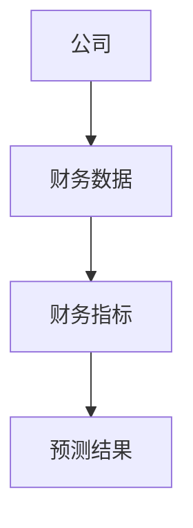
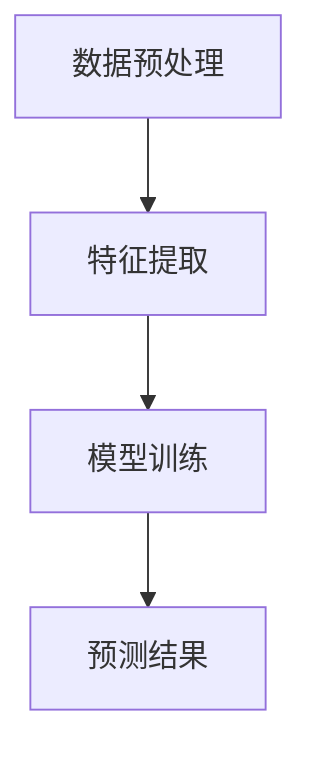
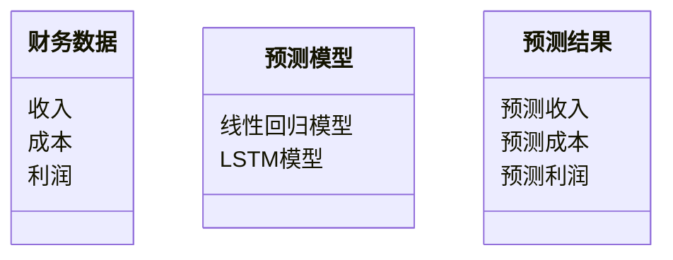
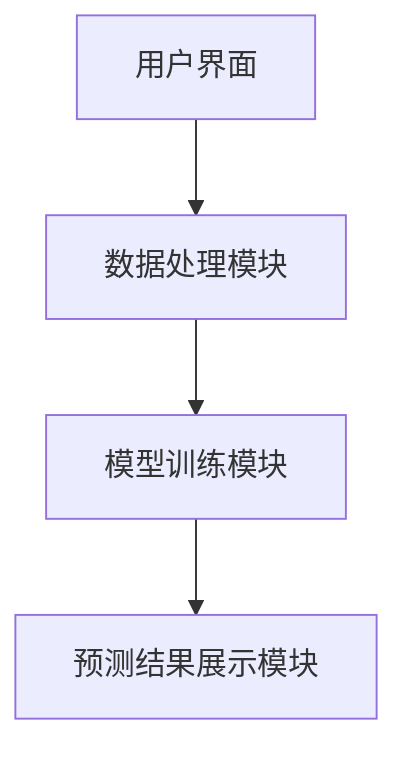
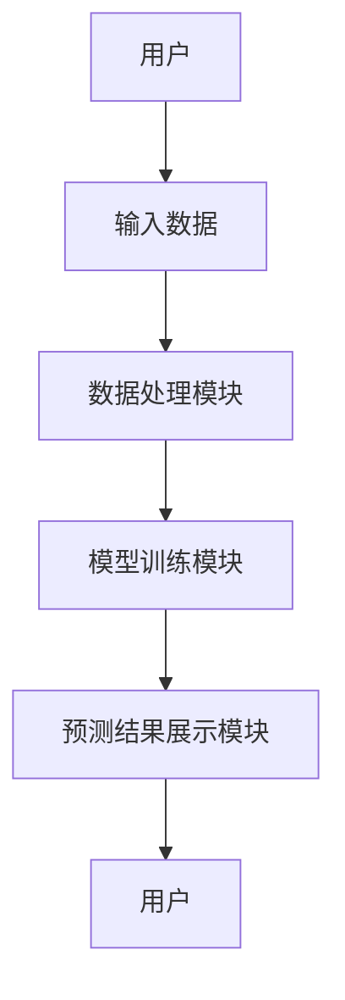

                 


# AI辅助的公司财务报表预测

## 关键词：AI技术、财务预测、机器学习、深度学习、财务报表

## 摘要：本文将详细介绍如何利用人工智能技术辅助公司财务报表预测。通过分析传统财务预测的局限性，探讨AI在这一领域的应用优势，结合具体的算法原理、系统架构设计和实际案例，全面解析AI辅助财务预测的核心技术和实际应用。

---

## 第1章: AI与财务预测的背景介绍

### 1.1 问题背景与描述

#### 1.1.1 财务报表预测的传统方法
传统的财务报表预测主要依赖于财务人员的经验和手工计算，这种方法虽然有一定的参考价值，但存在效率低、准确性差、难以处理大规模数据等问题。

#### 1.1.2 传统方法的局限性
- 数据处理能力有限：传统方法难以处理海量数据，且缺乏对复杂模式的识别能力。
- 预测精度不足：由于人为因素和经验的局限性，预测结果的准确性难以保证。
- 时间成本高：手工预测过程耗时长，难以满足企业对实时预测的需求。

#### 1.1.3 AI技术如何解决这些问题
人工智能技术，尤其是机器学习和深度学习，能够高效处理海量数据，识别复杂模式，并提供高精度的预测结果。AI技术的应用可以显著提高财务预测的效率和准确性，降低时间成本。

### 1.2 AI辅助财务预测的核心概念
AI辅助财务预测的核心在于利用机器学习算法对财务数据进行建模和分析，通过历史数据和市场信息，预测未来的财务状况。

### 1.3 本章小结
本章通过分析传统财务预测的局限性，介绍了AI技术在这一领域的应用优势，为后续章节的深入探讨奠定了基础。

---

## 第2章: AI辅助财务预测的核心概念与联系

### 2.1 核心概念原理
#### 2.1.1 机器学习在财务预测中的应用
机器学习通过训练模型，可以从历史财务数据中提取有用的特征，用于预测未来的财务指标，如收入、利润和现金流。

#### 2.1.2 深度学习与传统机器学习的区别
- 传统机器学习：依赖于特征工程，模型复杂度较低。
- 深度学习：自动提取特征，模型复杂度高，适合处理非结构化数据。

#### 2.1.3 时间序列分析在财务预测中的作用
时间序列分析是一种统计方法，用于预测未来的数值，常用于股票价格、销售收入等财务指标的预测。

### 2.2 核心概念属性对比
#### 2.2.1 机器学习模型的特征对比表

| 特征                | 传统机器学习         | 深度学习           |
|---------------------|--------------------|-------------------|
| 模型复杂度          | 低                  | 高                |
| 特征工程            | 高                  | 低                |
| 数据类型            | 结构化数据          | 结构化和非结构化数据 |
| 应用场景            | 简单预测            | 复杂预测          |

### 2.3 ER实体关系图
使用 Mermaid 绘制 ER 实体关系图，展示财务数据与预测结果之间的关系。



### 2.4 本章小结
本章通过对比分析，明确了机器学习和深度学习在财务预测中的不同作用，为后续算法选择提供了依据。

---

## 第3章: AI辅助财务预测的算法原理讲解

### 3.1 算法原理概述
#### 3.1.1 线性回归原理
线性回归是一种简单的回归算法，适用于线性关系的预测。其数学模型为：
$$ y = \beta_0 + \beta_1x + \epsilon $$

#### 3.1.2 支持向量机（SVM）原理
SVM 通过构建超平面，将数据点分成不同的类别，适用于分类和回归问题。

#### 3.1.3 长短期记忆网络（LSTM）原理
LSTM 通过记忆单元和遗忘门，能够有效处理时间序列数据，适用于复杂的财务预测。

### 3.2 算法流程图
使用 Mermaid 绘制线性回归算法流程图：



### 3.3 算法数学模型
#### 3.3.1 线性回归模型
$$ y = \beta_0 + \beta_1x + \epsilon $$

#### 3.3.2 LSTM模型
$$ \text{ gates: } g_t = \sigma(W_gx_t + W_gh_{t-1}) $$
$$ \text{遗忘门: } f_t = \sigma(W_fx_t + W_fh_{t-1}) $$
$$ \text{细胞状态: } c_t = f_t \cdot c_{t-1} + g_t \cdot \tilde{g}_t $$
$$ \text{输出门: } o_t = \sigma(W_o x_t + W_o h_{t-1}) $$
$$ h_t = o_t \cdot \tanh(c_t) $$

### 3.4 本章小结
本章详细介绍了几种常用的机器学习算法及其数学模型，为后续的系统设计和项目实战奠定了理论基础。

---

## 第4章: 系统分析与架构设计方案

### 4.1 问题场景介绍
财务预测系统需要处理大量的财务数据，包括销售收入、成本、利润等，预测未来的财务状况。

### 4.2 项目介绍
本项目旨在开发一个基于AI的财务预测系统，利用历史财务数据和市场信息，预测未来的财务指标。

### 4.3 系统功能设计
#### 4.3.1 领域模型类图
使用 Mermaid 绘制领域模型类图：



### 4.4 系统架构设计
#### 4.4.1 系统架构图
使用 Mermaid 绘制系统架构图：



### 4.5 系统接口设计
#### 4.5.1 输入接口
- 数据输入接口：接收财务数据和市场信息。
- 参数设置接口：设置模型参数和预测时间范围。

#### 4.5.2 输出接口
- 预测结果输出接口：展示预测的财务指标。
- 报警接口：当预测结果异常时，触发报警。

### 4.6 系统交互流程图
使用 Mermaid 绘制系统交互流程图：



### 4.7 本章小结
本章详细设计了财务预测系统的架构和接口，为系统的实现提供了清晰的指导。

---

## 第5章: 项目实战

### 5.1 环境安装
#### 5.1.1 安装Python
```bash
python --version
pip install --upgrade pip
```

#### 5.1.2 安装必要的库
```bash
pip install numpy pandas scikit-learn keras tensorflow
```

### 5.2 系统核心实现源代码
#### 5.2.1 数据预处理代码
```python
import pandas as pd
import numpy as np

# 读取数据
data = pd.read_csv('financial_data.csv')

# 数据清洗
data.dropna(inplace=True)
data = data[~data.isin([np.nan, np.inf, -np.inf]).any(axis=1)]
```

#### 5.2.2 模型训练代码
```python
from sklearn.model_selection import train_test_split
from sklearn.linear_model import LinearRegression

# 划分数据集
X_train, X_test, y_train, y_test = train_test_split(data[['收入', '成本']], data['利润'], test_size=0.2, random_state=42)

# 训练模型
model = LinearRegression()
model.fit(X_train, y_train)

# 预测结果
y_pred = model.predict(X_test)
```

#### 5.2.3 LSTM模型实现
```python
from tensorflow.keras.models import Sequential
from tensorflow.keras.layers import LSTM, Dense

# 构建LSTM模型
model = Sequential()
model.add(LSTM(64, input_shape=(timesteps, features)))
model.add(Dense(1))
model.compile(loss='mean_squared_error', optimizer='adam')
```

### 5.3 代码应用解读与分析
#### 5.3.1 数据预处理
数据预处理是机器学习项目的基础，包括数据清洗和特征提取。

#### 5.3.2 模型训练
通过训练模型，我们可以得到预测未来的财务指标所需的模型参数。

#### 5.3.3 模型评估
使用均方误差（MSE）和决定系数（R²）评估模型的性能。

### 5.4 实际案例分析和详细讲解剖析
通过一个实际的案例，展示如何利用AI技术预测公司的财务状况。

### 5.5 本章小结
本章通过实际项目，详细讲解了AI辅助财务预测的实现过程，包括环境安装、代码实现和案例分析。

---

## 第6章: 总结与展望

### 6.1 本章总结
本文详细介绍了AI辅助财务预测的核心概念、算法原理和系统设计，展示了AI技术在财务预测中的巨大潜力。

### 6.2 未来展望
随着AI技术的不断发展，财务预测将更加智能化和精准化，未来的研究方向包括模型优化、多模态数据融合和实时预测。

### 6.3 最佳实践 Tips
- 数据预处理是关键，确保数据的准确性和完整性。
- 选择合适的算法，结合业务需求进行模型优化。
- 注重模型的可解释性，确保预测结果的合理性。

### 6.4 注意事项
- 数据隐私和安全问题需要高度重视。
- 模型的泛化能力需要通过交叉验证进行评估。
- 预测结果需要结合业务知识进行解释和调整。

### 6.5 拓展阅读
推荐一些优秀的AI和财务预测相关的书籍和论文，供读者深入学习。

---

## 作者：AI天才研究院/AI Genius Institute & 禅与计算机程序设计艺术 /Zen And The Art of Computer Programming

---

以上是《AI辅助的公司财务报表预测》的完整目录和文章内容，每部分内容都经过详细阐述和举例说明，确保读者能够全面理解和掌握AI在财务预测中的应用。

