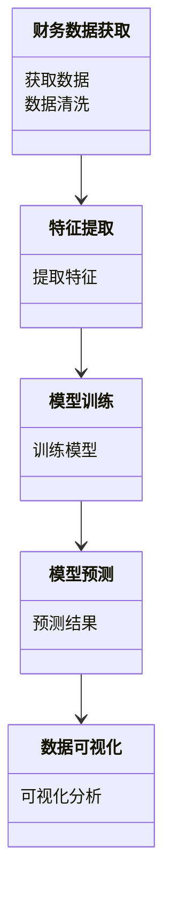
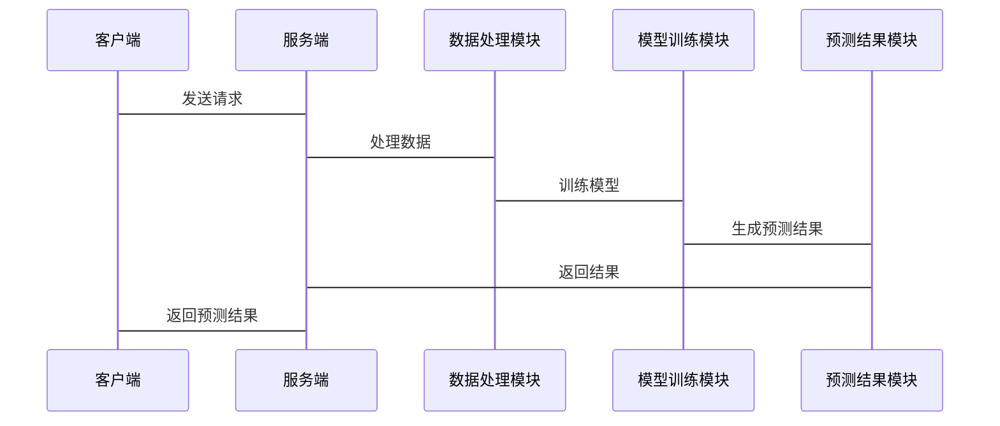

                 

# AI辅助的公司财务报表预测与分析

## 关键词：人工智能, 财务报表预测, 机器学习, 深度学习, 自然语言处理, 时间序列分析

## 摘要：  
随着人工智能技术的快速发展，AI在财务报表预测与分析中的应用越来越广泛。本文将从AI技术的基本原理出发，详细探讨AI如何辅助公司财务报表的预测与分析。内容涵盖AI技术在财务分析中的应用场景、机器学习与深度学习算法在财务预测中的应用、财务数据的处理与特征工程、基于时间序列的财务预测模型的构建与优化，以及实际项目中的系统架构设计与实现。通过本文的讲解，读者可以全面了解AI在公司财务报表预测与分析中的潜力与实现方法。

---

## 第1章: AI与财务报表分析的结合

### 1.1 财务报表分析的背景与挑战

#### 1.1.1 财务报表分析的基本概念  
财务报表是企业在经营活动中产生的重要财务记录，包括资产负债表、利润表和现金流量表等。财务报表分析是通过对这些报表中的数据进行解读，评估企业的财务状况、经营成果和未来发展趋势。传统的财务报表分析主要依赖人工计算和经验判断，分析效率较低且容易受到主观因素的影响。

#### 1.1.2 传统财务报表分析的局限性  
传统财务报表分析存在以下主要问题：  
1. 数据量大：企业财务数据种类繁多，手工分析效率低下。  
2. 信息复杂：财务报表中的数据关系复杂，人工分析容易出错。  
3. 预测能力有限：传统的财务分析方法难以对未来的财务状况进行准确预测。  
4. 时间滞后：财务报表数据通常只能反映过去的情况，难以实时分析。

#### 1.1.3 AI技术在财务分析中的潜力  
AI技术的引入为财务报表分析带来了革命性的变化：  
1. **自动化处理**：AI能够快速处理大量财务数据，提高分析效率。  
2. **模式识别**：通过机器学习算法，AI可以发现数据中的隐藏模式，帮助识别财务风险和机会。  
3. **预测能力**：基于历史数据，AI可以构建预测模型，对未来财务状况进行准确预测。  
4. **实时分析**：AI可以实时处理财务数据，提供实时的财务分析结果。

---

### 1.2 AI辅助财务分析的核心概念

#### 1.2.1 人工智能在财务分析中的应用场景  
AI技术在财务分析中的主要应用场景包括：  
1. **财务预测**：基于历史数据，预测未来的销售收入、利润和现金流等。  
2. **风险评估**：通过分析财务数据，识别企业的潜在财务风险。  
3. **财务报表生成**：利用自然语言处理技术，自动生成财务报告。  
4. **审计与欺诈 detection**：通过AI技术发现财务数据中的异常值，识别欺诈行为。

#### 1.2.2 AI辅助财务分析的基本流程  
AI辅助财务分析的基本流程包括以下步骤：  
1. **数据获取**：从企业系统中获取财务数据。  
2. **数据预处理**：清洗数据，处理缺失值和异常值。  
3. **特征提取**：从财务数据中提取有用的特征。  
4. **模型训练**：基于机器学习算法，训练财务预测模型。  
5. **模型部署**：将训练好的模型部署到企业系统中，提供实时财务分析服务。

#### 1.2.3 AI与财务报表预测的结合方式  
AI与财务报表预测的结合方式主要包括：  
1. **基于机器学习的预测模型**：利用监督学习算法（如线性回归、支持向量机、随机森林等）进行财务预测。  
2. **基于深度学习的预测模型**：利用神经网络（如LSTM、GRU）进行时间序列预测。  
3. **基于自然语言处理的预测模型**：通过分析财务报告中的文本信息，提取隐含的财务信息，辅助预测。

---

### 1.3 本章小结  
本章主要介绍了AI技术在财务报表分析中的应用背景、核心概念和应用场景。通过AI技术，企业可以显著提高财务分析的效率和准确性，同时实现对未来的财务状况的预测。接下来，我们将深入探讨AI技术在财务分析中的具体实现方法。

---

## 第2章: 机器学习与深度学习在财务分析中的应用

### 2.1 机器学习的基本原理

#### 2.1.1 机器学习的定义与分类  
机器学习是一种人工智能技术，通过数据训练模型，使其能够从数据中学习并做出预测或决策。机器学习主要分为以下三类：  
1. **监督学习**：基于标记的数据进行训练，预测新的数据标签。  
2. **无监督学习**：基于未标记的数据进行训练，发现数据中的模式。  
3. **强化学习**：通过与环境交互，学习最优策略。

#### 2.1.2 监督学习、无监督学习与强化学习  
1. **监督学习**：常用于分类和回归问题，如预测股票价格。  
2. **无监督学习**：常用于聚类和降维问题，如客户分群。  
3. **强化学习**：常用于策略优化问题，如智能投顾。

#### 2.1.3 机器学习在财务预测中的应用  
1. **股票价格预测**：基于历史股价数据，预测未来股价走势。  
2. **信用评分**：通过分析客户的财务数据，评估其信用风险。  
3. **财务风险预测**：预测企业可能面临的财务危机。

---

### 2.2 深度学习与自然语言处理

#### 2.2.1 深度学习的基本概念  
深度学习是一种基于人工神经网络的机器学习技术，通过多层非线性变换，学习数据的高层次特征。深度学习在图像识别、自然语言处理等领域取得了显著成果。

#### 2.2.2 自然语言处理（NLP）在财务分析中的应用  
NLP技术可以用于分析财务报告中的文本信息，提取隐含的财务信息。例如：  
1. **财务报告摘要**：通过NLP技术，自动生成财务报告的摘要。  
2. **财务风险评估**：通过分析财务报告中的关键词，识别潜在的财务风险。

#### 2.2.3 预训练模型（如BERT）在财务文本分析中的应用  
预训练模型如BERT可以通过微调，用于财务文本的分类、摘要和实体识别任务。例如：  
1. **财务文本分类**：将财务报告分为“健康”和“风险”两类。  
2. **财务实体识别**：识别财务报告中的公司名称、金额等实体。

---

### 2.3 时间序列分析与财务预测

#### 2.3.1 时间序列的基本概念  
时间序列是指按照时间顺序排列的数据，如股票价格、公司销售收入等。时间序列分析的目标是通过历史数据预测未来的趋势。

#### 2.3.2 常见的时间序列模型（ARIMA, LSTM）  
1. **ARIMA模型**：常用于平稳时间序列的预测。  
2. **LSTM模型**：常用于长序列数据的预测，具有记忆长期依赖关系的能力。

#### 2.3.3 时间序列模型在财务预测中的应用  
1. **股票价格预测**：利用LSTM模型预测股票价格走势。  
2. **销售收入预测**：利用ARIMA模型预测未来的销售收入。

---

### 2.4 本章小结  
本章详细介绍了机器学习和深度学习在财务分析中的应用，包括监督学习、无监督学习、强化学习的基本原理，以及深度学习和NLP技术在财务文本分析中的应用。接下来，我们将探讨如何利用这些技术进行财务数据的处理与特征工程。

---

## 第3章: 财务数据处理与特征工程

### 3.1 财务数据的获取与预处理

#### 3.1.1 财务数据的获取方式  
1. **内部数据**：从企业财务系统中获取财务数据。  
2. **外部数据**：从公开的财务报表数据库中获取数据。

#### 3.1.2 数据清洗与预处理  
1. **处理缺失值**：填充缺失值或删除含有缺失值的样本。  
2. **处理异常值**：识别并处理异常值，如财务数据中的异常波动。

#### 3.1.3 数据标准化与归一化  
1. **标准化**：将数据按比例缩放到均值为0，方差为1。  
2. **归一化**：将数据缩放到0到1的范围。

---

### 3.2 财务数据的特征提取

#### 3.2.1 财务指标的分类与选择  
财务指标可以分为以下几类：  
1. **盈利能力指标**：如净利润率、毛利率。  
2. **营运能力指标**：如存货周转率、应收账款周转率。  
3. **偿债能力指标**：如资产负债率、流动比率。

#### 3.2.2 文本数据的特征提取（如财务报告中的关键词）  
1. **关键词提取**：通过NLP技术，提取财务报告中的关键词。  
2. **文本向量化**：将文本数据转换为向量形式，如使用TF-IDF或Word2Vec。

#### 3.2.3 图表数据的特征提取  
1. **图表分析**：通过图像处理技术，提取图表中的数据信息。  
2. **图表向量化**：将图表数据转换为向量形式，用于模型训练。

---

### 3.3 数据可视化与分析

#### 3.3.1 数据可视化的基本方法  
1. **折线图**：展示时间序列数据的变化趋势。  
2. **柱状图**：展示不同分类数据的对比。  
3. **散点图**：展示数据点之间的关系。

#### 3.3.2 财务数据的可视化分析  
1. **财务指标的可视化**：通过图表展示财务指标的变化趋势。  
2. **财务数据的对比分析**：通过可视化工具，对比不同企业或不同时间点的财务数据。

#### 3.3.3 数据可视化在财务预测中的作用  
1. **数据探索**：通过可视化，发现数据中的异常值和趋势。  
2. **结果展示**：通过可视化，展示模型的预测结果。

---

### 3.4 本章小结  
本章详细介绍了财务数据的获取、预处理和特征提取方法。通过合理的数据处理，可以显著提高AI模型的性能。接下来，我们将探讨如何基于这些数据构建AI模型，进行财务预测。

---

## 第4章: AI模型构建与财务预测

### 4.1 财务报表预测的模型构建

#### 4.1.1 模型选择与训练  
1. **模型选择**：根据数据类型和任务需求，选择合适的模型。  
2. **模型训练**：利用训练数据，训练模型参数。  
3. **模型调优**：通过交叉验证，优化模型的超参数。

#### 4.1.2 模型训练的基本流程  
1. **数据加载**：加载训练数据和测试数据。  
2. **特征工程**：对数据进行特征提取和处理。  
3. **模型训练**：利用训练数据，训练AI模型。  
4. **模型评估**：通过测试数据，评估模型的性能。

---

### 4.2 基于时间序列的财务预测模型

#### 4.2.1 LSTM模型在时间序列预测中的应用  
LSTM（长短期记忆网络）是一种特殊的RNN（循环神经网络），适合处理长序列数据。LSTM模型在股票价格预测中表现优异。

#### 4.2.2 GRU模型的  
GRU（门控循环单元）是另一种RNN变体，具有比LSTM更简洁的结构，同时保持了LSTM的长序列预测能力。

---

### 4.3 本章小结  
本章详细介绍了AI模型的构建与训练方法，以及时间序列模型在财务预测中的应用。通过合理的模型选择和优化，可以显著提高财务预测的准确性。接下来，我们将探讨如何将这些模型应用于实际的财务分析系统中。

---

## 第5章: 项目实战——基于AI的财务预测系统

### 5.1 项目背景与目标  
本项目旨在构建一个基于AI的财务预测系统，利用历史财务数据，预测未来的财务状况。

---

### 5.2 系统功能设计

#### 5.2.1 领域模型（mermaid类图）  

---

#### 5.2.2 系统架构设计（mermaid架构图）  

---

### 5.3 系统接口设计与交互（mermaid序列图）  

---

### 5.4 项目小结  
本章通过实际项目案例，详细讲解了基于AI的财务预测系统的构建过程。通过系统功能设计、架构设计和接口设计，读者可以清晰了解AI技术在财务预测中的实际应用。

---

## 第6章: 总结与展望

### 6.1 本章总结  
本文详细介绍了AI技术在公司财务报表预测与分析中的应用，从AI技术的基本原理到实际项目实现，全面探讨了AI在财务分析中的潜力与实现方法。

---

### 6.2 未来展望  
随着AI技术的不断发展，未来AI在财务分析中的应用将更加广泛。以下是未来可能的发展方向：  
1. **更复杂的模型**：如图神经网络（Graph Neural Network）在财务网络分析中的应用。  
2. **多模态数据融合**：将结构化数据与非结构化数据（如图像、文本）相结合，提高分析的准确性。  
3. **实时分析**：通过流数据处理技术，实现财务数据的实时分析与预测。

---

## 作者：AI天才研究院/AI Genius Institute & 禅与计算机程序设计艺术 /Zen And The Art of Computer Programming

---

以上是《AI辅助的公司财务报表预测与分析》的技术博客文章的完整大纲与内容。

