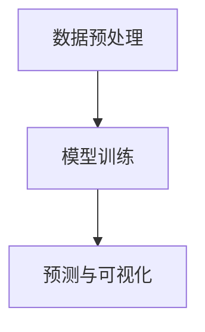

                 

<think>
好，现在我要帮用户设计一本关于《AI辅助的公司财务报表预测模型》的详细目录大纲。首先，我需要理解这本书的核心主题是什么。AI在财务预测中的应用，特别是构建一个基于AI的财务报表预测模型。用户希望目录大纲覆盖从基础到高级的各个方面，结构清晰，逻辑严谨。

首先，我应该从背景介绍开始，这部分需要涵盖为什么需要AI辅助的财务预测模型，以及AI在财务领域中的应用现状。接下来，我需要介绍机器学习和深度学习的基本概念，因为这些都是构建预测模型的核心技术。

然后，详细讲解时间序列分析和预测算法，如ARIMA、LSTM等，这些都是常用的算法。同时，我需要包括这些算法的数学公式，可能需要用LaTeX来表达，确保准确性。此外，自然语言处理（NLP）在财务文本分析中的应用也是不可忽视的部分，特别是在处理财务报告和新闻时。

系统架构设计也是重点，我需要描述如何设计一个完整的系统，包括数据预处理、模型训练、预测和可视化模块。这部分可以使用Mermaid流程图来展示系统的组成部分和交互流程。项目实战部分，我需要指导读者如何安装环境，编写代码，并通过实际案例进行分析，最后给出小结。

最后，总结全书的内容，强调最佳实践和未来的发展方向。这样整个目录大纲就能全面覆盖用户的需求，结构清晰，内容详实。

在设计过程中，我需要确保每个章节内容丰富，包含必要的术语解释、算法原理、数学公式、系统架构图和项目实战代码。同时，语言要专业且易于理解，适合技术读者阅读。这将帮助读者从基础到高级逐步掌握AI辅助财务预测模型的知识和应用。
</think>

# AI辅助的公司财务报表预测模型

> 关键词：AI辅助、公司财务报表、预测模型、机器学习、深度学习、时间序列分析

> 摘要：本文深入探讨了如何利用人工智能技术构建公司财务报表预测模型。通过分析财务数据的时间序列特性，结合机器学习和深度学习算法，提出了一种高效的预测方法，并详细讲解了模型的实现过程和实际应用案例。

---

# 第一部分: AI辅助的公司财务报表预测模型概述

# 第1章: AI在财务预测中的应用背景

## 1.1 财务预测的定义与重要性
### 1.1.1 财务预测的基本概念
财务预测是通过对公司过去和当前的财务数据进行分析，预测未来财务状况的过程。它帮助企业做出更明智的财务决策，优化资源配置，降低风险。

### 1.1.2 财务预测在企业中的作用
- **优化资源配置**：通过预测未来的收入和支出，企业可以更好地规划资金使用。
- **降低财务风险**：提前识别潜在的财务问题，采取预防措施。
- **支持战略决策**：为企业的长期战略规划提供数据支持。

### 1.1.3 传统财务预测的局限性
- 数据依赖性高，难以捕捉非线性关系。
- 人工分析耗时且易受主观因素影响。
- 传统模型对市场波动的适应性较弱。

## 1.2 AI技术在财务预测中的应用现状
### 1.2.1 AI技术的基本概念
人工智能（AI）是指计算机系统模拟人类智能的能力，包括学习、推理和自适应等能力。AI技术在财务领域的应用日益广泛。

### 1.2.2 AI在财务领域的应用案例
- **股票价格预测**：利用AI分析市场数据，预测股票走势。
- **风险评估**：通过AI识别潜在的财务风险。
- **财务报表预测**：基于历史数据，预测未来的收入、利润和现金流。

### 1.2.3 AI辅助财务预测的优势
- **高效性**：AI能够快速处理大量数据，提高预测效率。
- **准确性**：通过复杂的算法，AI能够捕捉到更多潜在的规律。
- **适应性**：AI模型能够动态调整，适应市场变化。

## 1.3 本章小结
本章介绍了财务预测的基本概念及其在企业中的重要性，分析了传统财务预测的局限性，并探讨了AI技术在财务预测中的应用现状及优势。

---

# 第二部分: AI辅助财务预测的核心概念与技术

# 第2章: 机器学习与深度学习基础

## 2.1 机器学习的基本原理
### 2.1.1 机器学习的定义与分类
机器学习是一种通过数据训练模型，使其能够从数据中学习并做出预测的技术。主要分为监督学习、无监督学习和强化学习。

### 2.1.2 监督学习、无监督学习和强化学习的对比
- **监督学习**：基于标记数据进行训练，适用于分类和回归任务。
- **无监督学习**：基于未标记数据进行训练，适用于聚类任务。
- **强化学习**：通过与环境交互，学习最优策略。

### 2.1.3 机器学习在财务预测中的应用
- **分类任务**：如财务健康状况的分类。
- **回归任务**：如预测未来的收入和利润。

## 2.2 深度学习的基本原理
### 2.2.1 深度学习的定义与特点
深度学习是一种基于人工神经网络的机器学习方法，具有强大的特征提取能力。

### 2.2.2 卷积神经网络（CNN）与循环神经网络（RNN）
- **CNN**：适用于图像处理，但在时间序列数据上的应用有限。
- **RNN**：适用于序列数据，如时间序列预测。

### 2.2.3 长短期记忆网络（LSTM）在时间序列预测中的应用
LSTM是一种特殊的RNN，能够有效捕捉时间序列中的长期依赖关系，适合用于财务预测。

## 2.3 自然语言处理（NLP）在财务文本分析中的应用
### 2.3.1 NLP的基本概念
自然语言处理是一种让计算机理解和生成人类语言的技术，广泛应用于文本分类、信息提取等领域。

### 2.3.2 财务文本分析的挑战与解决方案
- **挑战**：财务文本包含大量专业术语和复杂结构，需要高度的领域知识。
- **解决方案**：结合预训练语言模型（如BERT）进行微调，提取有用的财务信息。

### 2.3.3 基于NLP的财务信息提取方法
- **信息抽取**：从财务报告中提取关键指标。
- **情感分析**：分析市场对公司的看法，辅助预测。

## 2.4 本章小结
本章介绍了机器学习和深度学习的基本原理，重点探讨了深度学习在时间序列预测中的应用，并分析了自然语言处理技术在财务文本分析中的潜力。

---

# 第三部分: AI辅助财务预测的算法原理

# 第3章: 时间序列分析与预测算法

## 3.1 时间序列的基本概念
### 3.1.1 时间序列的定义与特征
时间序列是一组按时间顺序排列的数据点，常用于分析随时间变化的动态系统。

### 3.1.2 时间序列分析的常见方法
- **平稳时间序列**：假设数据具有平稳性，适用于ARIMA模型。
- **非平稳时间序列**：数据具有趋势或周期性，适用于ARIMA和Prophet模型。

## 3.2 常见的时间序列预测算法
### 3.2.1 ARIMA模型的原理与实现
ARIMA（自回归积分滑动平均）是一种经典的统计模型，适用于线性时间序列预测。

### 3.2.2 LSTM模型的原理与实现
LSTM是一种基于深度学习的时间序列预测模型，能够捕捉复杂的非线性关系。

### 3.2.3 Prophet模型的原理与实现
Prophet是由Facebook开源的时间序列预测模型，适用于业务预测。

## 3.3 基于机器学习的时间序列预测
### 3.3.1 ARIMA模型的数学公式
$$ ARIMA(p, d, q) $$
其中，p为自回归阶数，d为差分阶数，q为滑动平均阶数。

### 3.3.2 LSTM模型的数学公式
LSTM通过门控机制控制信息流动，公式如下：
$$
f_t = \sigma(W_f \cdot [h_{t-1}, x_t] + b_f)
$$
$$
i_t = \sigma(W_i \cdot [h_{t-1}, x_t] + b_i)
$$
$$
o_t = \sigma(W_o \cdot [h_{t-1}, x_t] + b_o)
$$
$$
h_t = f_t \cdot c_t + i_t \cdot \tilde{c}_t
$$
$$
c_t = c_{t-1} + \Delta c
$$

### 3.3.3 模型性能的对比与优化
通过对比不同模型的预测精度和计算效率，选择最适合实际场景的模型。

## 3.4 本章小结
本章详细介绍了时间序列预测的常见算法，包括ARIMA、LSTM和Prophet模型，并通过数学公式解释了它们的工作原理。

---

# 第四部分: AI辅助财务预测的系统架构与设计

# 第4章: 系统架构设计

## 4.1 系统功能模块划分
### 4.1.1 数据预处理模块
- 数据清洗：处理缺失值、异常值。
- 数据标准化：归一化处理，适用于机器学习模型。

### 4.1.2 模型训练模块
- 模型选择：根据数据特点选择合适的预测模型。
- 模型训练：使用训练数据优化模型参数。

### 4.1.3 预测与可视化模块
- 预测结果输出：生成预测报告。
- 可视化展示：通过图表直观展示预测结果。

## 4.2 系统架构的Mermaid图


## 4.3 系统接口设计
### 4.3.1 数据接口
- 数据输入接口：接收原始财务数据。
- 数据输出接口：输出预测结果。

### 4.3.2 模型接口
- 模型训练接口：训练预测模型。
- 模型预测接口：基于训练好的模型进行预测。

## 4.4 本章小结
本章设计了一个完整的AI辅助财务预测系统架构，包括数据预处理、模型训练和预测与可视化三个模块，并通过Mermaid图展示了系统的交互流程。

---

# 第五部分: AI辅助财务预测的项目实战

# 第5章: 项目实战

## 5.1 环境安装与配置
### 5.1.1 安装Python环境
- 安装Anaconda或Miniconda，选择合适的Python版本。

### 5.1.2 安装依赖库
- 使用pip安装numpy、pandas、tensorflow、keras、prophet等库。

## 5.2 核心代码实现
### 5.2.1 数据预处理代码
```python
import pandas as pd
import numpy as np

# 读取数据
data = pd.read_csv('financial_data.csv')

# 处理缺失值
data = data.dropna()

# 标准化处理
from sklearn.preprocessing import MinMaxScaler
scaler = MinMaxScaler()
scaled_data = scaler.fit_transform(data)
```

### 5.2.2 模型训练代码
```python
from keras.models import Sequential
from keras.layers import LSTM, Dense

# 定义LSTM模型
model = Sequential()
model.add(LSTM(64, input_shape=(timesteps, features)))
model.add(Dense(1))
model.compile(optimizer='adam', loss='mean_squared_error')

# 训练模型
model.fit(X_train, y_train, epochs=100, batch_size=32)
```

### 5.2.3 预测与可视化代码
```python
# 进行预测
y_pred = model.predict(X_test)

# 可视化
import matplotlib.pyplot as plt
plt.plot(y_test, label='True')
plt.plot(y_pred, label='Predicted')
plt.legend()
plt.show()
```

## 5.3 案例分析与结果解读
### 5.3.1 数据来源与预处理
- 数据来源：公司财务报表数据，包括收入、利润、现金流等。
- 预处理步骤：清洗数据、标准化处理。

### 5.3.2 模型训练与优化
- 选择LSTM模型进行训练，调整超参数（如 epochs、batch_size）优化模型性能。

### 5.3.3 预测结果与分析
- 预测未来的收入和利润，与实际数据对比，评估模型的准确性。

## 5.4 本章小结
本章通过实际项目展示了AI辅助财务预测模型的实现过程，从数据预处理到模型训练，再到预测与可视化，详细讲解了每一步的操作。

---

# 第六部分: 总结与展望

# 第6章: 总结与展望

## 6.1 全文总结
- 本文系统地介绍了AI辅助财务预测模型的构建过程，包括数据预处理、模型选择和实现。
- 强调了机器学习和深度学习在时间序列预测中的应用价值。

## 6.2 未来展望
- **模型优化**：结合多种算法，提高预测精度。
- **多模态数据融合**：将文本数据与数值数据结合，提升预测能力。
- **实时预测**：开发实时预测系统，快速响应市场变化。

## 6.3 最佳实践 tips
- **数据质量**：确保数据的完整性和准确性。
- **模型选择**：根据数据特点选择合适的模型。
- **持续优化**：定期更新模型，适应市场变化。

## 6.4 本章小结
本文总结了AI辅助财务预测模型的核心内容，并展望了未来的发展方向，为读者提供了实践中的注意事项和优化建议。

---

# 作者：AI天才研究院 & 禅与计算机程序设计艺术

通过本文的系统介绍，读者可以全面了解AI辅助财务预测模型的构建过程，并能够在实际工作中应用这些方法，提高财务预测的效率和准确性。

