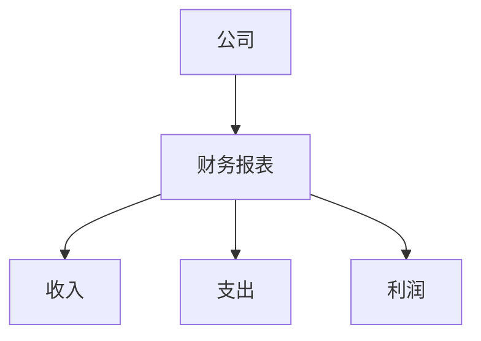
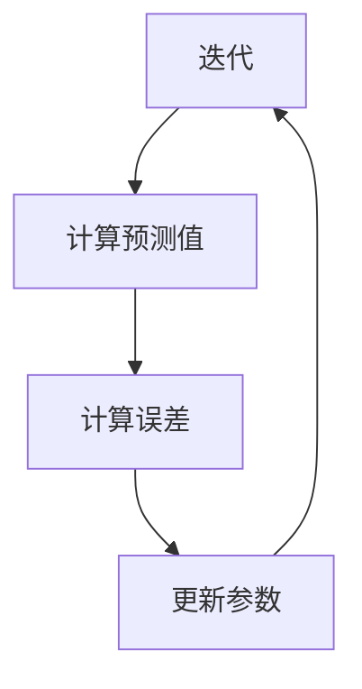
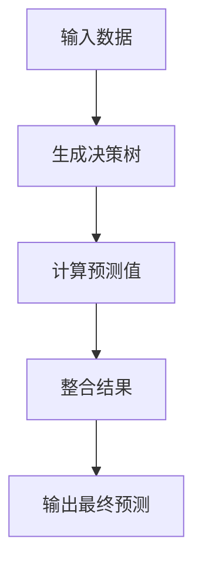
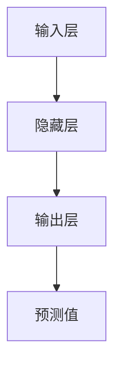
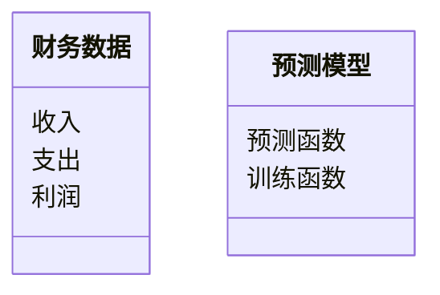
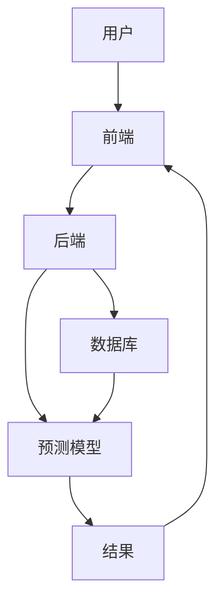
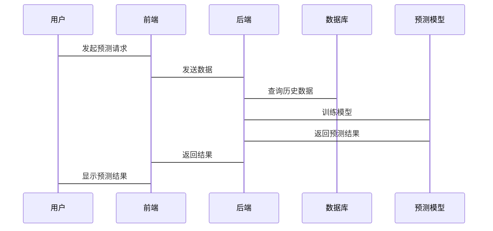

                 


# AI辅助的公司财务报表预测模型

**关键词：** AI, 财务预测, 机器学习, 深度学习, 财务报表分析

**摘要：** 本文详细探讨了如何利用人工智能技术构建公司财务报表预测模型，涵盖了从数据预处理到模型构建的全过程，分析了各种机器学习算法的特点及其在财务预测中的应用，最后通过实际案例展示了模型的实现与优化。

---

## 第1章: 背景介绍

### 1.1 问题背景
#### 1.1.1 财务预测的重要性
财务预测是企业制定战略决策的重要依据，能够帮助企业提前识别潜在风险，优化资源配置。传统的财务预测方法依赖人工经验，存在效率低、准确性差的问题。

#### 1.1.2 AI技术在财务预测中的应用价值
人工智能技术能够处理海量数据，发现隐藏的模式，提高预测的准确性。AI在财务预测中的应用可以帮助企业做出更精准的财务决策。

#### 1.1.3 当前财务预测的主要挑战
数据质量参差不齐、模型泛化能力不足、实时性要求高等问题制约了传统财务预测的效率和效果。

### 1.2 问题描述
#### 1.2.1 财务报表预测的核心目标
通过分析历史财务数据，预测未来的财务状况，为企业决策提供数据支持。

#### 1.2.2 数据驱动的财务预测方法
利用机器学习算法，从历史数据中提取特征，构建预测模型。

#### 1.2.3 AI辅助预测的边界与外延
AI预测模型仅能提供参考，不能完全替代人类的判断，其外延包括数据收集、特征提取、模型训练等环节。

### 1.3 问题解决
#### 1.3.1 AI技术如何提升财务预测的准确性
通过深度学习算法捕捉数据中的非线性关系，提高预测的准确率。

#### 1.3.2 数据预处理与特征工程的重要性
数据清洗、特征提取等步骤直接影响模型性能，是构建高效预测模型的基础。

#### 1.3.3 模型选择与优化的策略
根据数据特点选择合适的算法，通过交叉验证优化模型参数，提升预测精度。

### 1.4 本章小结

---

## 第2章: 核心概念与联系

### 2.1 财务报表预测的核心要素
#### 2.1.1 财务报表的主要组成部分
包括收入、支出、利润等关键指标，这些指标构成了企业财务健康状况的核心数据。

#### 2.1.2 数据特征的分类与选择
根据特征的重要性进行分类，选择最具影响力的特征变量。

#### 2.1.3 模型性能的评估指标
准确率、召回率、F1值等指标用于衡量模型的预测效果。

### 2.2 AI模型的基本原理
#### 2.2.1 机器学习的基本概念
监督学习、无监督学习和半监督学习的区别与联系。

#### 2.2.2 监督学习与无监督学习的区别
监督学习基于标记数据，无监督学习处理无标记数据。

#### 2.2.3 深度学习的核心思想
通过多层神经网络提取数据的高层次特征，提升模型的表达能力。

### 2.3 数据与模型的关联
#### 2.3.1 数据质量对模型性能的影响
高质量数据是模型准确预测的基础，数据清洗和特征工程至关重要。

#### 2.3.2 特征工程在模型训练中的作用
通过选择和创建特征，提高模型的预测能力。

#### 2.3.3 模型选择与数据分布的关系
模型选择需考虑数据分布，避免过拟合和欠拟合。

### 2.4 核心概念属性特征对比表格
| 模型类型 | 监督学习 | 无监督学习 | 半监督学习 |
|----------|----------|----------|----------|
| 数据类型 | 标记数据 | 无标记数据 | 部分标记数据 |
| 代表算法 | 支持向量机 | K-means | 线性回归 |

### 2.5 ER实体关系图


### 2.6 本章小结

---

## 第3章: 算法原理讲解

### 3.1 线性回归算法
#### 3.1.1 算法原理
线性回归通过最小化均方误差，找到最佳拟合直线。

#### 3.1.2 算法流程图


#### 3.1.3 数学公式
$$ y = \theta_0 + \theta_1 x + \epsilon $$

### 3.2 随机森林算法
#### 3.2.1 算法原理
随机森林通过构建多棵决策树，取其预测结果的平均值。

#### 3.2.2 算法流程图


#### 3.2.3 数学公式
$$ y = \frac{1}{n} \sum_{i=1}^{n} y_i $$

### 3.3 神经网络算法
#### 3.3.1 算法原理
神经网络通过多层感知机模拟人脑神经网络，学习数据的非线性关系。

#### 3.3.2 算法流程图


#### 3.3.3 数学公式
$$ a^{(l)} = \sigma(z^{(l)}) $$

### 3.4 算法对比分析
| 模型类型 | 线性回归 | 随机森林 | 神经网络 |
|----------|----------|----------|----------|
| 优势 | 简单高效 | 抗过拟合 | 高表达能力 |
| 劣势 | 适合线性问题 | 计算复杂 | 易过拟合 |

### 3.5 本章小结

---

## 第4章: 系统架构设计

### 4.1 问题场景介绍
构建一个实时财务预测系统，为用户提供准确的财务预测结果。

### 4.2 项目介绍
本项目旨在利用AI技术，构建一个高效、准确的财务报表预测模型。

### 4.3 系统功能设计
#### 4.3.1 领域模型类图


#### 4.3.2 系统架构图


#### 4.3.3 系统接口设计
- API接口：RESTful API，支持POST请求。
- 数据接口：连接数据库，读取财务数据。

#### 4.3.4 系统交互序列图


### 4.4 本章小结

---

## 第5章: 项目实战

### 5.1 环境安装
安装Python、TensorFlow、Scikit-learn等工具。

### 5.2 系统核心实现源代码
```python
import pandas as pd
from sklearn.model_selection import train_test_split
from sklearn.linear_model import LinearRegression
from sklearn.metrics import mean_squared_error

# 加载数据
data = pd.read_csv('financial_data.csv')
X = data[['收入', '支出']]
y = data['利润']

# 数据分割
X_train, X_test, y_train, y_test = train_test_split(X, y, test_size=0.2)

# 模型训练
model = LinearRegression()
model.fit(X_train, y_train)

# 预测与评估
y_pred = model.predict(X_test)
print(mean_squared_error(y_test, y_pred))
```

### 5.3 代码应用解读与分析
- 数据加载：从CSV文件读取数据。
- 数据分割：将数据分为训练集和测试集。
- 模型训练：使用线性回归算法训练模型。
- 预测与评估：计算预测值与真实值的均方误差。

### 5.4 实际案例分析
以某公司为例，预测其未来一年的利润情况。

### 5.5 项目小结

---

## 第6章: 最佳实践

### 6.1 总结
AI技术在财务预测中的应用前景广阔，能够显著提升预测的准确性和效率。

### 6.2 经验与教训
- 数据预处理是关键。
- 模型选择需结合业务需求。
- 模型部署要考虑实时性和可扩展性。

### 6.3 下一步建议
探索更先进的算法，如GPT-4，优化模型性能。

### 6.4 参考文献
1. 《机器学习实战》
2. 《深度学习》

### 6.5 工具资源
推荐使用Jupyter Notebook进行开发，TensorFlow和Keras框架。

### 6.6 本章小结

---

作者：AI天才研究院

