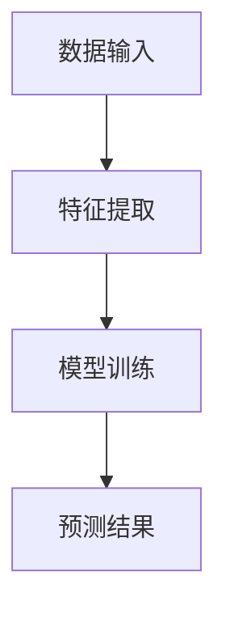

                 

<think>
嗯，我现在需要帮用户设计一本关于AI辅助公司财务规划的书籍目录。用户已经给出了一个详细的示例，包括多个章节和小节，还提到了具体的格式和内容要求。首先，我应该理解用户的需求到底是什么。看起来用户希望有一本结构清晰、内容详尽的技术博客文章，专注于AI如何辅助公司进行财务规划。

好的，用户要求文章要有逻辑性，结构紧凑，技术语言专业但易懂。关键词和摘要部分需要先明确，这样整个文章的方向会更清晰。接下来，我需要按照目录大纲的结构来组织内容，确保每一部分都涵盖必要的内容，并且符合用户的格式要求。

首先，我会考虑背景介绍部分。这部分应该包括AI和财务规划的基本概念，以及它们是如何结合在一起的。可能需要一章来概述AI在财务中的应用，包括现状、技术基础和优势。这部分需要让读者了解AI在财务规划中的重要性，以及为什么现在是采用AI技术的好时机。

接下来是核心概念，这部分需要详细讲解AI如何辅助财务规划。我需要分析财务规划的关键环节，如预测、预算、监控和决策支持，以及AI在这些环节中的具体应用。可能需要一个表格来对比AI技术与传统财务规划的不同，帮助读者更好地理解。

然后是算法原理部分，这里需要详细讲解相关算法，比如机器学习和深度学习。我应该包括一些数学公式和代码示例，让读者能够理解这些算法是如何工作的，并且如何应用到实际的财务规划中。使用mermaid图来展示算法流程图会更有助于读者理解。

系统架构部分也很重要，需要设计一个完整的AI辅助财务规划系统。我应该描述这个系统的功能模块、架构设计和接口设计。使用mermaid图来展示系统的结构和交互流程，这样读者可以更直观地理解系统的运作方式。

项目实战部分应该包括一个实际案例，展示如何从环境安装到代码实现，再到案例分析。这部分需要详细说明每一步的操作，让读者能够跟着步骤一步步完成一个实际项目。同时，还需要对代码进行解读和分析，帮助读者理解每部分代码的作用。

最后，最佳实践和小结部分需要总结全书的内容，给出一些实用的建议，并指出未来的发展方向。这部分可以让读者有一个全面的回顾，同时激发他们进一步学习和应用的兴趣。

在整个过程中，我需要确保每一部分内容详实，逻辑清晰，语言专业但不晦涩。同时，要按照用户的要求，使用markdown格式，包含关键词、摘要，以及各个章节的详细内容。数学公式要用latex格式，算法流程图和系统架构图用mermaid展示，确保文章结构完整，内容丰富。

总的来说，我需要一步步地按照用户的指导，构建一个内容全面、结构合理的目录大纲，确保每个部分都符合用户的要求，并且能够深入浅出地讲解AI辅助公司财务规划的相关知识和应用。
</think>

# AI辅助的公司财务规划

> 关键词：人工智能、财务规划、机器学习、深度学习、数据驱动

> 摘要：本文详细探讨了人工智能技术如何辅助公司进行财务规划，涵盖了从基本概念到实际应用的各个方面。通过分析财务规划的关键环节，结合AI算法的原理和系统架构设计，本文为读者提供了从理论到实践的全面指导。文章还通过实际案例展示了AI在财务预测、预算优化和实时监控等领域的应用效果，并总结了最佳实践和未来发展方向。

---

# 第一部分: AI与财务规划的结合

## 第1章: AI技术的基本概念

### 1.1 人工智能的基本定义

人工智能（Artificial Intelligence, AI）是模拟人类智能的计算机系统，涵盖学习、推理、问题解决等能力。AI的核心在于通过数据和算法实现智能决策。

### 1.2 财务规划的核心概念

财务规划是公司对未来财务状况的预测和管理，包括预算、投资、现金流预测等关键环节。传统财务规划依赖人工分析，效率低且易出错。

### 1.3 AI辅助财务规划的背景与意义

随着企业数字化转型的推进，AI技术在财务领域的应用越来越广泛。AI能够处理大量数据，提供实时预测和优化建议，显著提升财务规划的效率和准确性。

---

## 第2章: AI辅助财务规划的核心概念与联系

### 2.1 数据驱动的财务预测模型

AI通过分析历史数据，利用机器学习算法预测未来的财务状况。例如，使用线性回归模型预测收入和支出。

### 2.2 基于AI的预算优化算法

AI可以根据企业目标和市场变化，自动优化预算分配。例如，使用遗传算法进行预算优化。

### 2.3 实时财务监控的智能系统

AI实时监控财务数据，识别异常情况并发出警报。例如，使用LSTM网络预测现金流波动。

---

## 第3章: AI辅助财务规划的算法原理

### 3.1 常见算法介绍

- **线性回归**：用于预测连续变量，如收入预测。
- **支持向量机（SVM）**：用于分类和回归，如支出分类。
- **随机森林**：用于分类和回归，如信用评分。
- **LSTM网络**：用于时间序列预测，如现金流预测。

### 3.2 算法流程图



### 3.3 算法实现代码示例

```python
import pandas as pd
from sklearn.linear_model import LinearRegression

# 加载数据
data = pd.read_csv('financial_data.csv')

# 特征与目标变量
X = data[['revenue', 'expenses']]
y = data['profit']

# 模型训练
model = LinearRegression()
model.fit(X, y)

# 预测
new_data = pd.DataFrame({'revenue': [100000], 'expenses': [50000]})
prediction = model.predict(new_data)
print(prediction)
```

---

## 第4章: 系统架构设计

### 4.1 系统功能设计

- **数据采集**：从财务系统中获取数据。
- **数据处理**：清洗和特征提取。
- **模型训练**：训练AI模型。
- **预测与优化**：生成财务预测和优化方案。
- **结果展示**：以可视化形式呈现结果。

### 4.2 系统架构图


### 4.3 系统接口设计

- **输入接口**：接收财务数据。
- **输出接口**：返回预测结果和优化建议。

---

## 第5章: 项目实战

### 5.1 环境安装

安装必要的库，如Pandas、Scikit-learn、TensorFlow。

### 5.2 核心实现代码

```python
import numpy as np
import pandas as pd
from sklearn.model_selection import train_test_split
from sklearn.metrics import mean_squared_error

# 加载数据
data = pd.read_csv('financial_data.csv')

# 分割数据
X = data[['revenue', 'expenses']]
y = data['profit']
X_train, X_test, y_train, y_test = train_test_split(X, y, test_size=0.2)

# 模型训练
from sklearn.ensemble import RandomForestRegressor
model = RandomForestRegressor()
model.fit(X_train, y_train)

# 预测
y_pred = model.predict(X_test)

# 评估
mse = mean_squared_error(y_test, y_pred)
print(f"均方误差: {mse}")
```

### 5.3 案例分析

通过实际案例，展示AI如何优化预算和预测收入。

---

## 第6章: 最佳实践与总结

### 6.1 最佳实践

- 数据质量是关键。
- 定期更新模型。
- 结合业务知识进行解释。

### 6.2 小结

AI技术显著提升了财务规划的效率和准确性，未来将更加智能化和自动化。

---

作者：AI天才研究院/AI Genius Institute & 禅与计算机程序设计艺术 /Zen And The Art of Computer Programming

