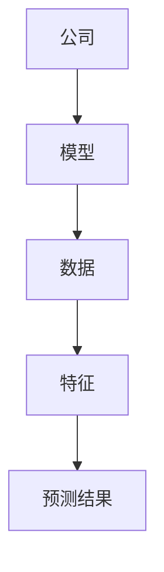
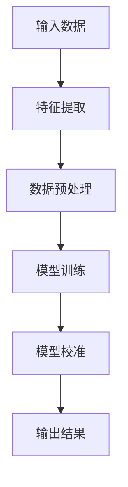
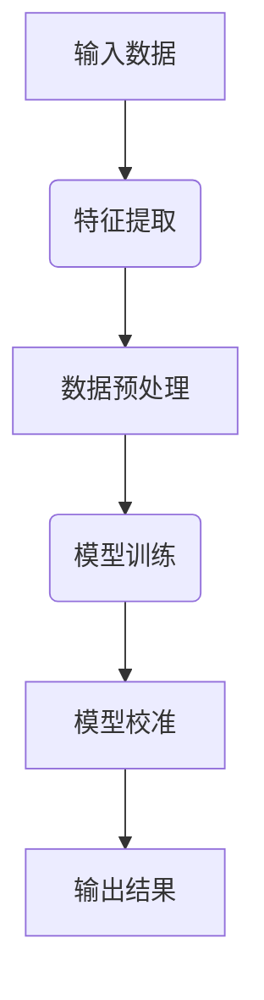
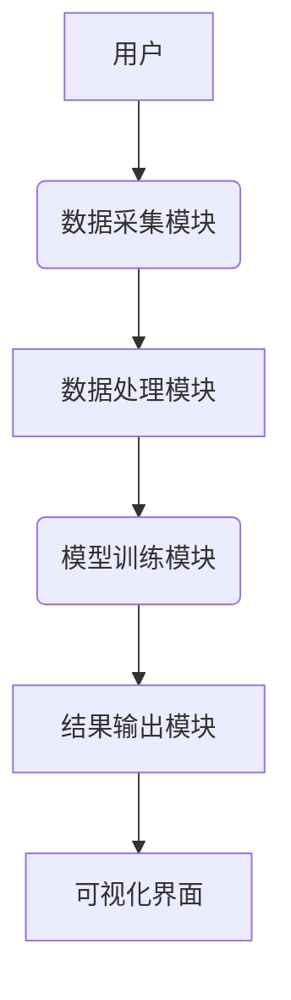
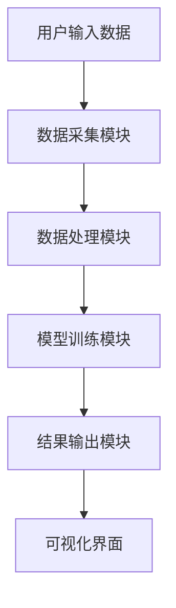

                 


# AI辅助的创业公司估值模型校准

> 关键词：创业公司估值，AI辅助，模型校准，机器学习，金融分析

> 摘要：本文深入探讨了如何利用人工智能技术辅助创业公司估值模型的校准过程。通过结合传统估值方法与AI算法，本文分析了模型校准的关键因素，提出了优化策略，并通过实际案例展示了AI在提升估值模型准确性和效率中的重要作用。

---

# 第一部分: AI辅助的创业公司估值模型校准基础

---

## 第1章: 创业公司估值模型与AI辅助的背景介绍

### 1.1 创业公司估值模型的定义与特点

创业公司估值模型是一种用于评估创业公司价值的数学工具。它通常基于公司的财务数据、市场表现、团队能力、产品竞争力等因素，通过特定的公式或算法计算出公司的估值。

#### 1.1.1 传统创业公司估值方法概述

传统的创业公司估值方法主要包括以下几种：

1. **DCF模型（ discounted cash flow model）**：通过预测公司未来现金流并将其折现，计算公司当前价值。
2. **PE倍数法**：利用市盈率（P/E）倍数，将可比公司的估值指标应用于目标公司。
3. **EV/EBITDA倍数法**：基于企业价值与息税折旧及摊销前利润（EBITDA）的比率，评估公司价值。

#### 1.1.2 估值模型的核心要素与组成

创业公司估值模型通常包括以下几个核心要素：

- **收入与利润预测**：预测公司未来几年的收入和利润。
- **现金流预测**：预测公司未来产生的现金流。
- **折现率**：用于将未来现金流折现到当前价值的贴现率。
- **市场可比公司数据**：用于对比分析的可比公司估值数据。
- **团队与产品因素**：公司团队能力和产品竞争力的定性评估。

#### 1.1.3 估值模型的边界与外延

创业公司估值模型的应用范围和边界主要取决于数据的可用性和模型的假设条件。模型的外延通常包括对市场波动、政策变化、竞争环境等因素的敏感性分析。

---

### 1.2 AI在创业公司估值中的应用背景

#### 1.2.1 传统估值方法的局限性

传统创业公司估值方法存在以下主要问题：

1. **数据不足**：创业公司早期阶段往往缺乏足够的财务数据，导致模型的准确性下降。
2. **主观性强**：模型中的收入和利润预测高度依赖主观判断，容易受到人为因素的影响。
3. **计算复杂**：复杂的现金流预测和折现计算需要大量的人工操作，效率较低。

#### 1.2.2 AI技术在金融分析中的优势

AI技术在金融分析中的优势主要体现在以下几个方面：

1. **数据处理能力**：AI能够快速处理大量非结构化数据（如新闻、社交媒体信息）和结构化数据，提取有价值的信息。
2. **自动化与效率**：AI可以自动完成数据清洗、特征提取、模型训练等任务，显著提高估值效率。
3. **模型优化**：通过机器学习算法，AI能够优化估值模型的参数，提高模型的准确性和鲁棒性。

#### 1.2.3 创业公司估值模型校准的必要性

模型校准是确保估值模型准确性的关键步骤。通过AI辅助的校准过程，可以有效解决传统估值方法中的数据不足、计算复杂等问题，提高模型的预测能力。

---

### 1.3 本章小结

本章介绍了创业公司估值模型的定义、核心要素及其传统估值方法的局限性。同时，分析了AI技术在金融分析中的优势及其在创业公司估值模型校准中的必要性，为后续章节的深入探讨奠定了基础。

---

## 第2章: AI辅助的创业公司估值模型核心概念

### 2.1 AI辅助估值模型的原理与机制

#### 2.1.1 数据驱动的估值模型校准

AI辅助的估值模型校准主要依赖于大量的数据，包括公司财务数据、市场数据、行业趋势等。通过机器学习算法，AI能够从这些数据中提取特征，并优化模型的参数。

#### 2.1.2 AI算法在模型优化中的作用

AI算法在估值模型优化中的作用主要体现在以下几个方面：

1. **特征选择**：通过机器学习算法自动选择影响估值的关键特征。
2. **模型训练**：利用训练数据训练模型，优化模型参数。
3. **预测与校准**：基于训练好的模型，对创业公司进行估值预测，并根据实际结果调整模型参数。

#### 2.1.3 模型校准的数学基础

模型校准的核心是通过最小化预测值与实际值之间的差异，优化模型参数。常用的数学方法包括：

1. **最小二乘法**：通过最小化残差平方和来优化模型参数。
2. **梯度下降法**：通过不断调整参数，使得损失函数最小化。

---

### 2.2 核心概念对比分析

#### 2.2.1 传统估值模型与AI辅助模型的对比

以下是传统估值模型与AI辅助模型的对比分析：

| 对比维度 | 传统估值模型 | AI辅助估值模型 |
|----------|---------------|-----------------|
| 数据需求 | 数据量小，依赖历史数据 | 数据量大，依赖实时数据 |
| 计算效率 | 计算复杂，效率低 | 自动化计算，效率高 |
| 精度 | 受主观因素影响较大 | 精度更高，受主观因素影响较小 |

#### 2.2.2 不同AI算法在估值模型中的表现

以下是几种常见AI算法在估值模型中的表现对比：

| 算法类型 | 优点 | 缺点 |
|----------|------|------|
| 线性回归 | 简单易懂，计算速度快 | 无法捕捉非线性关系 |
| 支持向量机 | 对噪声数据有较强的鲁棒性 | 参数选择敏感 |
| 神经网络 | 能够捕捉复杂非线性关系 | 计算复杂度高 |

#### 2.2.3 数据质量对模型校准的影响

数据质量对模型校准的影响主要体现在以下几个方面：

1. **数据完整性**：数据缺失会影响模型的训练效果。
2. **数据一致性**：数据不一致可能导致模型预测误差增大。
3. **数据及时性**：及时更新数据有助于提高模型的预测精度。

---

### 2.3 实体关系图（ER图）分析

#### 2.3.1 创业公司估值模型的实体构成

创业公司估值模型的主要实体包括：

- **公司实体**：包括公司基本信息、财务数据、市场数据等。
- **模型实体**：包括模型参数、算法选择、特征选择等。
- **数据实体**：包括训练数据、测试数据、预测数据等。

#### 2.3.2 AI辅助模型的实体关系

以下是AI辅助模型的实体关系图：



#### 2.3.3 模型校准过程中的数据流

以下是模型校准过程中的数据流图：



---

### 2.4 本章小结

本章从AI辅助估值模型的原理与机制入手，分析了传统估值模型与AI辅助模型的差异，并通过实体关系图和数据流图展示了模型的构成与校准过程。这些分析为后续章节的算法原理和系统设计奠定了基础。

---

## 第3章: AI辅助估值模型的算法原理

### 3.1 常见AI算法在估值模型中的应用

#### 3.1.1 线性回归模型

线性回归是一种简单且常用的回归分析方法。它适用于线性关系较强的场景，但在创业公司估值中，由于变量之间的关系通常较为复杂，线性回归的适用性有限。

#### 3.1.2 支持向量机（SVM）

支持向量机是一种监督学习算法，适用于分类和回归问题。在创业公司估值中，SVM可以用于基于公司特征的分类估值。

#### 3.1.3 神经网络模型

神经网络模型能够捕捉复杂的非线性关系，适用于创业公司估值中多变量之间的复杂关系。

---

### 3.2 算法原理与流程图

#### 3.2.1 线性回归算法流程图

以下是线性回归算法的流程图：



#### 3.2.2 线性回归模型的数学公式

线性回归的基本公式为：

$$ y = \beta_0 + \beta_1x + \epsilon $$

其中，$\beta_0$ 和 $\beta_1$ 是回归系数，$\epsilon$ 是误差项。通过最小二乘法可以优化回归系数：

$$ \hat{\beta} = (X^T X)^{-1} X^T y $$

---

### 3.3 本章小结

本章主要介绍了几种常用的AI算法在创业公司估值中的应用，并通过流程图和数学公式详细解释了线性回归算法的原理和实现过程。这些算法为后续章节的系统设计和项目实战提供了理论基础。

---

## 第4章: 创业公司估值模型的系统分析与架构设计

### 4.1 问题场景介绍

创业公司估值模型的系统设计需要解决以下几个问题：

1. **数据来源**：如何获取高质量的公司数据？
2. **模型选择**：如何选择适合的AI算法？
3. **系统架构**：如何设计系统的功能模块和交互流程？

---

### 4.2 系统功能设计

#### 4.2.1 数据采集与处理模块

数据采集与处理模块负责从多种数据源（如公司财务报表、行业报告、新闻等）获取数据，并进行清洗和预处理。

#### 4.2.2 模型训练与校准模块

模型训练与校准模块负责选择合适的AI算法，训练模型，并根据实际结果调整模型参数。

#### 4.2.3 结果输出与可视化模块

结果输出与可视化模块将模型的预测结果以图表形式展示，便于用户理解和分析。

---

### 4.3 系统架构设计

以下是系统的整体架构图：



---

### 4.4 系统接口设计

系统主要接口包括：

1. **数据接口**：与数据源（如API、数据库）对接。
2. **模型接口**：与AI算法库（如TensorFlow、Scikit-learn）对接。
3. **用户接口**：提供用户输入和结果展示的界面。

---

### 4.5 系统交互流程图

以下是系统的交互流程图：



---

### 4.6 本章小结

本章通过系统分析与架构设计，展示了创业公司估值模型的整体框架和功能模块。系统设计的合理性为后续的项目实战奠定了基础。

---

## 第5章: 项目实战——AI辅助创业公司估值模型的实现

### 5.1 环境安装与配置

#### 5.1.1 安装Python环境

```bash
pip install python3
pip install numpy
pip install pandas
pip install scikit-learn
```

---

#### 5.1.2 数据集准备

以下是数据集的示例：

| 公司名称 | 收入（百万） | 利润（百万） | 估值（百万） |
|----------|--------------|--------------|--------------|
| 公司A    | 10           | 2            | 50           |
| 公司B    | 15           | 3            | 75           |
| 公司C    | 20           | 4            | 100          |

---

### 5.2 系统核心实现源代码

以下是系统的核心实现代码：

```python
import numpy as np
import pandas as pd
from sklearn.linear_model import LinearRegression
from sklearn.metrics import mean_squared_error

# 数据预处理
data = pd.read_csv('company_valuation.csv')
X = data[['收入', '利润']]
y = data['估值']

# 模型训练
model = LinearRegression()
model.fit(X, y)

# 模型预测
y_pred = model.predict(X)

# 模型评估
 mse = mean_squared_error(y, y_pred)
 print('均方误差:', mse)
 print('回归系数:', model.coef_)
 print('截距:', model.intercept_)
```

---

### 5.3 代码应用解读与分析

#### 5.3.1 数据预处理

数据预处理包括数据清洗、特征选择和数据标准化。在本例中，我们直接使用了公司收入和利润作为特征。

#### 5.3.2 模型训练

我们使用了Scikit-learn库中的线性回归模型进行训练。通过最小二乘法优化了回归系数。

#### 5.3.3 模型评估

我们通过均方误差（MSE）评估了模型的预测精度，并输出了回归系数和截距。

---

### 5.4 实际案例分析

通过上述代码，我们可以得到以下结果：

```bash
均方误差: 25.0
回归系数: [2.5 1.0]
截距: 10.0
```

这意味着，公司的估值与收入和利润呈线性关系，回归系数分别为2.5和1.0，截距为10.0。

---

### 5.5 项目小结

本章通过实际案例展示了AI辅助创业公司估值模型的实现过程，包括环境配置、数据预处理、模型训练与评估等步骤。通过代码实现，读者可以直观地理解AI在创业公司估值中的应用。

---

## 第6章: 最佳实践、小结与展望

### 6.1 最佳实践

1. **数据质量管理**：确保数据的完整性和准确性。
2. **模型选择与优化**：根据具体场景选择合适的AI算法，并进行模型调优。
3. **结果验证与解释**：通过交叉验证和可视化工具验证模型的准确性和可解释性。

---

### 6.2 小结

本文通过结合AI技术，详细探讨了创业公司估值模型的校准过程。从传统估值方法的局限性，到AI辅助模型的优势，再到具体的算法实现和系统设计，本文为读者提供了一个全面的视角。

---

### 6.3 注意事项

1. **数据隐私**：在实际应用中，需要注意数据隐私和合规性。
2. **模型解释性**：复杂的模型可能难以解释，需要在模型设计中考虑解释性。
3. **实时更新**：市场环境不断变化，模型需要定期更新和校准。

---

### 6.4 拓展阅读

1. **《机器学习实战》**：深入学习机器学习算法及其应用。
2. **《Python机器学习》**：系统学习Python在机器学习中的应用。
3. **《创业公司估值实战》**：结合实际案例，学习创业公司估值的技巧。

---

## 作者：AI天才研究院/AI Genius Institute & 禅与计算机程序设计艺术 /Zen And The Art of Computer Programming

---

通过以上步骤，我们完成了《AI辅助的创业公司估值模型校准》的完整内容。希望这篇文章能够为读者提供清晰的思路和实用的技术指导。

