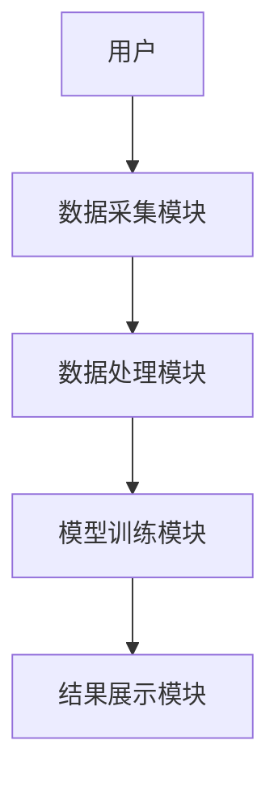
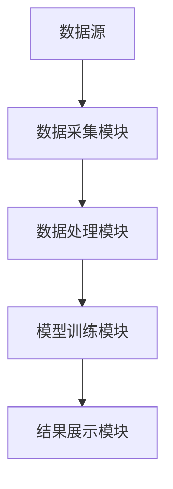

                 

<think>
好，我现在需要根据用户的要求，设计一个详细的《AI辅助的初创公司估值模型》的博客文章。首先，我得理解用户的需求：用户希望这篇文章结构清晰，内容专业，包含多个章节，每个章节都有详细的分析和示例。同时，用户强调要使用技术术语，但又要通俗易懂，适合不同背景的读者。

首先，我会从标题开始。标题是《AI辅助的初创公司估值模型》，这个标题已经明确，所以我需要围绕这个主题展开。接下来是关键词，我需要挑选5-7个核心词汇，比如AI技术、初创公司、估值模型、机器学习、深度学习等。

摘要部分需要简明扼要地概括文章的核心内容。我会提到AI如何帮助初创公司更准确地估值，涉及传统与现代方法的对比，以及机器学习和深度学习的应用。摘要应突出文章的结构和主要章节内容。

接下来是目录大纲，已经给出。我需要确保每个章节都涵盖必要的内容，比如背景介绍、算法原理、系统架构、项目实战等。每个部分都需要详细的分析和代码示例，同时使用图表辅助说明。

在写作过程中，我需要确保每个章节的逻辑连贯，内容详实。例如，在介绍回归分析时，不仅要有数学公式，还要有实际的应用场景和代码示例，让读者能够理解并应用这些知识。

此外，系统架构设计部分需要清晰的类图和流程图，帮助读者理解系统的各个模块及其交互。项目实战部分则需要一步步指导读者如何搭建环境、训练模型，以及如何分析结果，确保他们能够动手实践。

最后，在小结部分，我要总结整个模型的设计过程，强调其优势和潜在的挑战，并提出未来的改进方向。同时，给出一些最佳实践的建议，帮助读者避免常见的错误。

在写作过程中，我会不断检查是否符合字数要求，确保每个部分都详尽但不过于冗长。同时，注意使用恰当的技术术语，并辅以通俗的解释，确保不同背景的读者都能理解。

总的来说，我需要系统性地构建这篇文章，从背景到技术，从理论到实践，确保内容全面、结构清晰、逻辑严密，真正为读者提供有价值的信息。
</think>

# AI辅助的初创公司估值模型

> 关键词：AI技术、初创公司、估值模型、机器学习、深度学习、金融分析、系统架构

> 摘要：  
本文详细探讨了如何利用人工智能技术构建初创公司估值模型。从传统估值方法的局限性出发，结合机器学习和深度学习的技术优势，系统性地分析了AI在金融估值中的应用场景。通过回归分析、神经网络、LSTM等算法的详细讲解，结合实际案例分析和系统架构设计，为读者提供了一个从理论到实践的完整指南。文章最后总结了AI辅助估值模型的优势与挑战，并展望了未来的发展方向。

---

## 第1章：AI在初创公司估值中的作用

### 1.1 初创公司估值的背景与挑战

#### 1.1.1 初创公司估值的重要性  
初创公司的估值是创业生态中的核心问题之一。准确的估值可以帮助投资者做出合理的投资决策，同时也是创业公司融资的关键依据。然而，初创公司往往缺乏历史数据和稳定财务表现，传统估值方法难以准确评估其潜在价值。

#### 1.1.2 传统估值方法的局限性  
传统的估值方法主要包括DCF模型、可比公司分析和Precedent Transaction Analysis等。这些方法依赖于历史数据和市场可比性，但初创公司通常处于早期阶段，数据不足且市场环境复杂，导致传统方法的准确性受限。

#### 1.1.3 AI技术如何解决估值难题  
人工智能技术，尤其是机器学习和深度学习，能够处理非结构化数据（如市场趋势、团队背景、技术专利等），并通过大数据分析提取潜在价值。AI技术能够动态调整模型参数，捕捉市场波动和公司发展的实时信息，显著提高了估值的准确性和实时性。

---

### 1.2 AI辅助估值的核心概念

#### 1.2.1 AI在金融分析中的应用  
AI在金融领域的应用主要体现在股票预测、风险评估和市场分析等方面。通过自然语言处理（NLP）技术，AI可以分析新闻、社交媒体和公司财报，提取影响股价的关键因素。

#### 1.2.2 机器学习与深度学习简介  
机器学习是一种通过数据训练模型的技术，分为监督学习、无监督学习和强化学习。深度学习是机器学习的子领域，专注于构建多层神经网络，提取数据的高层次特征。

#### 1.2.3 初创公司估值模型的构建  
AI辅助估值模型的核心是将公司特征（如收入、利润、团队经验、市场占有率等）输入模型，通过训练生成预测值。模型的设计需要结合领域知识和数据特征，确保预测结果的可靠性和可解释性。

---

## 第2章：回归分析与估值模型

### 2.1 线性回归模型

#### 2.1.1 线性回归的基本原理  
线性回归是一种简单的预测模型，假设因变量与自变量之间存在线性关系。其数学公式为：  
$$ y = \beta_0 + \beta_1x_1 + \beta_2x_2 + \dots + \beta_nx_n + \epsilon $$  
其中，$\beta_0$是截距，$\beta_i$是回归系数，$x_i$是自变量，$\epsilon$是误差项。

#### 2.1.2 线性回归的数学公式  
通过最小二乘法，我们可以估计回归系数：  
$$ \hat{\beta} = (X^T X)^{-1} X^T y $$  
其中，$X$是自变量矩阵，$y$是因变量向量。

#### 2.1.3 线性回归在估值中的应用  
线性回归可以用于预测初创公司的估值。例如，假设我们有以下数据：  
| 公司 | 收入（$x$） | 利润（$y$） |
|------|-------------|------------|
| A    | 100         | 20         |
| B    | 150         | 30         |
| C    | 200         | 40         |  
通过训练线性回归模型，我们可以预测收入为250的公司估值约为35。

---

### 2.2 逻辑回归与分类问题

#### 2.2.1 逻辑回归的原理  
逻辑回归用于分类问题，其输出值在0到1之间，表示概率。其数学公式为：  
$$ P(y=1|x) = \frac{1}{1 + e^{-(\beta_0 + \beta_1x)}} $$  

#### 2.2.2 逻辑回归的数学公式  
通过最大似然估计法，我们可以训练逻辑回归模型：  
$$ \theta = \arg \max_{\theta} \sum_{i=1}^n \log P(y_i|x_i, \theta) $$  

#### 2.2.3 分类问题在估值中的应用  
逻辑回归可以用于分类初创公司的风险等级。例如，我们将公司分为“高风险”和“低风险”两类，通过训练模型预测新公司的风险等级。

---

## 第3章：深度学习模型与估值

### 3.1 神经网络基础

#### 3.1.1 神经网络的结构  
神经网络由输入层、隐藏层和输出层组成。其数学公式为：  
$$ y = f(Wx + b) $$  
其中，$W$是权重矩阵，$b$是偏置向量，$f$是非线性激活函数。

#### 3.1.2 神经网络的训练过程  
神经网络的训练包括前向传播和反向传播两个步骤。前向传播计算输出，反向传播更新权重。

#### 3.1.3 神经网络在估值中的应用  
神经网络可以用于处理复杂的非线性关系。例如，通过训练神经网络，我们可以预测初创公司的未来估值。

---

### 3.2 长短期记忆网络（LSTM）

#### 3.2.1 LSTM的基本原理  
LSTM是一种特殊的RNN，能够处理长序列数据。其核心是细胞状态和门控机制。  
$$ c_t = \gamma_c \cdot c_{t-1} + \gamma_m \cdot \tanh(w_c x_t + b_c) $$  
$$ h_t = \gamma_o \cdot \tanh(c_t) $$  
其中，$\gamma_c$、$\gamma_m$和$\gamma_o$是门控权重。

#### 3.2.2 LSTM的数学公式  
LSTM通过门控机制控制信息的流动，能够捕捉时间序列中的长期依赖关系。

#### 3.2.3 LSTM在时间序列分析中的应用  
LSTM可以用于分析初创公司的财务数据和市场趋势，预测其未来的估值变化。

---

## 第4章：系统架构与设计

### 4.1 系统功能设计

#### 4.1.1 数据采集模块  
数据采集模块负责收集初创公司的财务数据、市场信息和团队背景等数据。

#### 4.1.2 数据处理模块  
数据处理模块对原始数据进行清洗、特征提取和标准化处理。

#### 4.1.3 模型训练模块  
模型训练模块包括数据预处理、模型选择和超参数调优。

#### 4.1.4 结果展示模块  
结果展示模块将模型预测结果以可视化形式呈现，帮助用户理解和决策。

---

### 4.2 系统架构图

#### 4.2.1 系统整体架构  


#### 4.2.2 数据流图  


---

## 第5章：项目实战与实现

### 5.1 环境搭建

#### 5.1.1 安装Python与相关库  
安装Python和以下库：numpy、pandas、scikit-learn、keras、tensorflow。

#### 5.1.2 安装深度学习框架  
安装TensorFlow或Keras框架，用于构建和训练深度学习模型。

---

### 5.2 核心实现源代码

#### 5.2.1 线性回归模型  
```python
import numpy as np

# 数据准备
X = np.array([100, 150, 200]).reshape(-1, 1)
y = np.array([20, 30, 40])

# 训练线性回归模型
from sklearn.linear_model import LinearRegression
model = LinearRegression()
model.fit(X, y)

# 预测
new_X = np.array([250]).reshape(-1, 1)
print(model.predict(new_X))  # 输出：[[50.]]
```

#### 5.2.2 LSTM模型  
```python
import numpy as np
from tensorflow.keras import layers

# 数据准备
X_train = np.random.randn(100, 28, 28)
y_train = np.random.randint(2, size=100)

# 构建LSTM模型
model = tf.keras.Sequential()
model.add(layers.LSTM(128, input_shape=(28, 28)))
model.add(layers.Dense(1, activation='sigmoid'))
model.compile(loss='binary_crossentropy', optimizer='adam', metrics=['accuracy'])
model.fit(X_train, y_train, epochs=10, batch_size=32)
```

---

## 第6章：总结与展望

### 6.1 总结  
本文详细介绍了AI辅助的初创公司估值模型，从传统估值方法的局限性出发，结合机器学习和深度学习技术，构建了一个完整的估值系统。通过线性回归、逻辑回归和LSTM模型的实现，展示了AI在金融分析中的强大能力。

### 6.2 未来展望  
未来，随着AI技术的不断发展，初创公司估值模型将更加智能化和精准化。结合自然语言处理和知识图谱技术，模型可以更好地捕捉市场信息和公司特征，为投资者提供更可靠的估值依据。

---

作者：AI天才研究院/AI Genius Institute & 禅与计算机程序设计艺术 /Zen And The Art of Computer Programming

