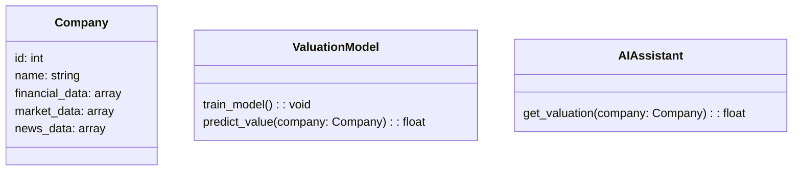
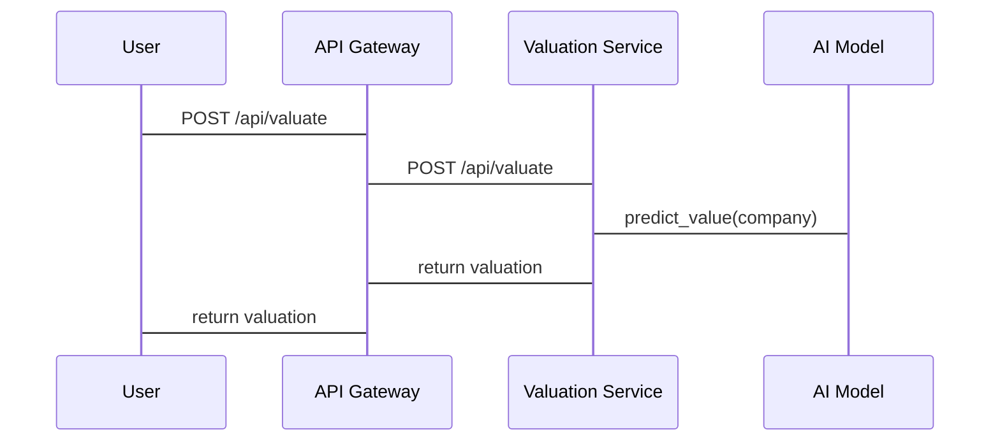

                 

<think>
好，我现在要帮用户完成《AI辅助的初创公司估值模型校准》的技术博客文章。用户已经提供了一个大纲，并希望我根据这个大纲写出完整的内容。首先，我需要理解每个章节的要求和详细结构。

首先，文章的结构分为六大部分，每个部分都有多个小节，内容涉及背景介绍、核心概念、算法原理、系统设计、项目实战和最佳实践。用户特别强调每个部分都要详细讲解，包括术语说明、问题背景、算法流程图、代码示例、系统架构图等。

接下来，我需要按照每个章节的要求逐步展开。比如，第一部分“AI辅助的初创公司估值模型校准背景介绍”需要详细解释估值模型的基本概念，比较传统模型与AI辅助模型的优缺点，以及AI在金融领域的应用。这部分我需要确保内容清晰，逻辑连贯，适合技术读者理解。

然后，第二部分涉及核心概念和算法原理，需要详细讲解线性回归和神经网络的原理，使用Mermaid流程图和Python代码示例。这部分需要特别注意数学公式的正确使用，确保公式准确，并用LaTeX格式呈现。

第三部分是系统分析与架构设计，这里需要绘制类图、架构图和序列图，帮助读者理解系统的整体结构和各部分之间的交互。这部分需要结合实际项目来说明系统设计的各个阶段，从需求分析到功能设计，再到实现和测试。

接下来，项目实战部分需要提供具体的代码实现，包括环境安装、数据预处理、模型训练、评估和优化。这部分需要详细的操作步骤和代码解释，帮助读者实际操作并理解每个步骤的作用。

最后，最佳实践部分需要总结项目经验，提供实际应用中的注意事项和建议，以及进一步的扩展方向。这部分内容需要实用且具有指导性，帮助读者在实际项目中避免常见错误，优化模型性能。

在写作过程中，我需要确保语言简洁专业，逻辑清晰，每个部分都紧密围绕主题展开。同时，注意使用适当的术语和图表，使内容更具可读性和技术深度。完成后，还要检查每个部分的字数，确保整体控制在10000到12000字之间，符合用户的要求。

现在，我开始按照这些思路逐一撰写每个章节的内容，确保每个部分都详细且符合用户的要求。首先，从背景介绍开始，逐步深入到算法原理、系统设计、项目实战和最佳实践，确保整篇文章结构合理，内容丰富。
</think>

# AI辅助的初创公司估值模型校准

> 关键词：AI辅助，初创公司，估值模型，校准，机器学习，深度学习，金融分析

> 摘要：本文探讨了AI技术在初创公司估值模型中的应用，分析了传统估值模型的局限性，介绍了基于机器学习和深度学习的AI辅助估值模型的原理、算法实现、系统架构设计、项目实战和最佳实践。通过详细讲解，帮助读者理解如何利用AI技术优化初创公司估值模型，提升估值的准确性和效率。

---

## 第一部分: AI辅助的初创公司估值模型校准背景介绍

### 第1章: 初创公司估值模型的基本概念

#### 1.1 估值模型的定义与分类
##### 1.1.1 估值模型的基本概念
估值模型是用于评估企业价值的数学工具，帮助投资者和企业管理者判断公司的市场价值。常见的估值方法包括DCF模型、PE模型、EV模型等。

##### 1.1.2 估值模型的分类
1. **绝对估值模型**：基于公司未来现金流的折现值，如DCF模型。
2. **相对估值模型**：基于可比公司的市场倍数，如PE、EV/EBITDA模型。
3. **混合估值模型**：结合绝对和相对估值方法，综合考虑多因素。

##### 1.1.3 估值模型在初创公司的应用
初创公司通常具有高成长性、高风险和数据稀缺性，传统估值模型难以准确反映其价值。AI技术的引入为解决这一问题提供了新思路。

---

#### 1.2 初创公司估值的独特性
##### 1.2.1 初创公司的特点与挑战
- **高不确定性**：初创公司的未来现金流难以预测。
- **数据稀缺性**：早期阶段数据有限，难以支持传统估值模型。
- **高成长性**：需要考虑快速扩张带来的价值提升。

##### 1.2.2 传统估值模型的局限性
1. **假设过于简化**：传统模型通常假设稳定增长，忽视了初创公司的波动性。
2. **数据依赖性强**：需要大量历史数据，而初创公司往往缺乏足够的数据支持。
3. **主观性高**：估值结果受分析师主观判断影响较大。

##### 1.2.3 AI辅助估值的必要性
AI技术能够处理非结构化数据，挖掘隐含信息，提高估值的准确性和效率。通过机器学习算法，可以更好地捕捉初创公司的成长潜力和市场动态。

---

### 第2章: AI在金融领域的应用基础

#### 2.1 AI在金融分析中的应用
##### 2.1.1 AI在股票预测中的应用
通过分析市场数据和新闻 sentiment，AI可以帮助预测股票价格走势。

##### 2.1.2 AI在风险评估中的应用
利用机器学习模型评估贷款违约风险，优化信用评分。

##### 2.1.3 AI在信用评分中的应用
通过聚类分析和逻辑回归模型，AI能够更准确地评估客户的信用状况。

#### 2.2 AI在公司估值中的优势
##### 2.2.1 数据处理能力
AI能够处理和分析大量的非结构化数据，如新闻、社交媒体信息等。

##### 2.2.2 模型优化能力
通过训练深度学习模型，AI可以发现传统模型难以捕捉的复杂模式。

##### 2.2.3 实时更新能力
AI模型可以实时更新，适应市场变化，提高估值的时效性。

---

## 第二部分: AI辅助估值模型的核心概念与联系

### 第3章: AI辅助估值模型的核心原理

#### 3.1 机器学习在估值模型中的应用
##### 3.1.1 监督学习在估值中的应用
- **回归分析**：用于预测公司未来股价或估值。
- **分类模型**：用于判断公司是否具有投资价值。

##### 3.1.2 无监督学习在估值中的应用
- **聚类分析**：将公司分为不同类别，帮助识别潜在的投资目标。
- **异常检测**：发现市场中的异常波动，及时预警。

##### 3.1.3 强化学习在估值中的应用
通过模拟市场环境，训练AI模型做出最优投资决策。

#### 3.2 深度学习在估值模型中的应用
##### 3.2.1 神经网络在估值中的应用
- **多层感知机（MLP）**：用于处理复杂的非线性关系。
- **卷积神经网络（CNN）**：用于分析图像和文本数据。
- **循环神经网络（RNN）**：用于处理时间序列数据，如股价走势。

---

### 第4章: 核心概念与联系的对比分析

#### 4.1 传统估值模型与AI模型的对比
##### 4.1.1 模型复杂度对比
- **传统模型**：基于简单假设，模型结构较为单一。
- **AI模型**：能够处理复杂的数据关系，模型结构更加灵活。

##### 4.1.2 模型准确度对比
- **传统模型**：受数据质量和假设限制，准确度可能较低。
- **AI模型**：通过大量数据训练，准确度更高。

##### 4.1.3 模型可解释性对比
- **传统模型**：高度可解释，便于分析。
- **AI模型**：复杂模型（如深度学习）通常不可解释，降低了透明度。

#### 4.2 AI模型内部组件的联系
##### 4.2.1 数据输入与特征提取
- **数据输入**：包括公司财务数据、市场数据、新闻数据等。
- **特征提取**：通过NLP技术提取文本特征，或通过统计方法提取财务特征。

##### 4.2.2 模型训练与优化
- **训练过程**：使用历史数据训练模型，调整参数以最小化预测误差。
- **优化方法**：采用随机梯度下降（SGD）或Adam优化器。

##### 4.2.3 结果输出与反馈
- **结果输出**：生成公司估值、投资建议等。
- **反馈机制**：根据市场反馈更新模型，提升预测精度。

---

## 第三部分: AI辅助估值模型的算法原理

### 第5章: 常用算法原理与流程图

#### 5.1 线性回归算法
##### 5.1.1 线性回归的原理
线性回归是一种统计学方法，用于建立因变量与自变量之间的线性关系。其目标是最小化预测值与实际值之间的平方差之和。

##### 5.1.2 线性回归的流程图


##### 5.1.3 线性回归的优缺点
- **优点**：简单易懂，计算效率高。
- **缺点**：假设变量之间存在线性关系，可能无法捕捉复杂模式。

#### 5.2 神经网络算法
##### 5.2.1 神经网络的原理
神经网络由多个层次组成，通过非线性激活函数捕捉数据中的复杂模式。其训练过程包括前向传播和反向传播两个阶段。

##### 5.2.2 神经网络的流程图


##### 5.2.3 神经网络的优缺点
- **优点**：能够处理复杂数据关系，模型表达能力强。
- **缺点**：计算复杂度高，训练时间较长，且缺乏可解释性。

---

### 第6章: 算法实现与代码示例

#### 6.1 线性回归的Python实现
```python
import numpy as np
from sklearn.linear_model import LinearRegression

# 生成数据
X = np.random.rand(100, 1)
y = 2 * X + 1 + np.random.randn(100, 1) * 0.1

# 训练模型
model = LinearRegression()
model.fit(X, y)

# 预测
y_pred = model.predict(X)

# 输出结果
print("系数:", model.coef_)
print("截距:", model.intercept_)
```

#### 6.2 神经网络的Python实现
```python
import numpy as np

class NeuralNetwork:
    def __init__(self, input_size, hidden_size, output_size):
        self.weights1 = np.random.randn(input_size, hidden_size)
        self.bias1 = np.zeros(hidden_size)
        self.weights2 = np.random.randn(hidden_size, output_size)
        self.bias2 = np.zeros(output_size)
    
    def forward(self, X):
        self.z1 = np.dot(X, self.weights1) + self.bias1
        self.a1 = np.tanh(self.z1)
        self.z2 = np.dot(self.a1, self.weights2) + self.bias2
        self.a2 = self.z2
        return self.a2
    
    def backward(self, X, y, output):
        delta2 = (output - y)
        dW2 = (1/m) * np.dot(self.a1.T, delta2)
        dB2 = (1/m) * np.sum(delta2, axis=0)
        
        delta1 = np.dot(delta2, self.weights2.T) * (1 - self.a1**2)
        dW1 = (1/m) * np.dot(X.T, delta1)
        dB1 = (1/m) * np.sum(delta1, axis=0)
        
        self.weights2 -= learning_rate * dW2
        self.bias2 -= learning_rate * dB2
        self.weights1 -= learning_rate * dW1
        self.bias1 -= learning_rate * dB1

    def train(self, X, y, epochs=100, learning_rate=0.1):
        for _ in range(epochs):
            output = self.forward(X)
            self.backward(X, y, output)

# 示例使用
X = np.random.rand(100, 1)
y = 2 * X + 1 + np.random.randn(100, 1) * 0.1

nn = NeuralNetwork(1, 5, 1)
nn.train(X, y)

output = nn.forward(X)
print("预测值:", output)
```

---

## 第四部分: 系统分析与架构设计方案

### 第7章: 系统分析与架构设计

#### 7.1 问题场景介绍
初创公司估值系统需要处理大量异构数据，包括财务数据、市场数据和新闻数据等。系统需要实时更新估值结果，并提供可视化界面供用户查询。

#### 7.2 系统功能设计
##### 7.2.1 领域模型设计


##### 7.2.2 系统架构设计


#### 7.3 系统接口设计
##### 7.3.1 API接口
- `/api/train`：训练估值模型。
- `/api/valuate`：获取公司估值。
- `/api/viz`：获取可视化报告。

##### 7.3.2 数据接口
- 数据源：财务数据接口（如Yahoo Finance）、新闻数据接口（如Twitter API）。

#### 7.4 系统交互设计
##### 7.4.1 用户与系统交互流程


---

## 第五部分: 项目实战

### 第8章: 项目实战

#### 8.1 环境安装与数据获取
##### 8.1.1 环境安装
- 安装Python和必要的库（如TensorFlow、Scikit-learn、Pandas）。
- 安装可视化工具（如Matplotlib、Seaborn）。

##### 8.1.2 数据获取
- 使用Yahoo Finance API获取公司财务数据。
- 使用Twitter API获取公司相关新闻。

#### 8.2 数据预处理与特征提取
##### 8.2.1 数据清洗
- 处理缺失值。
- 标准化数据。

##### 8.2.2 特征提取
- 提取财务指标（如 revenue, profit margin）。
- 提取文本特征（如情感分析结果）。

#### 8.3 模型训练与优化
##### 8.3.1 模型训练
- 使用训练数据训练神经网络模型。
- 调整超参数（如学习率、批量大小）以优化模型性能。

##### 8.3.2 模型评估
- 使用测试数据评估模型准确度。
- 计算均方误差（MSE）和R²分数。

#### 8.4 模型部署与可视化
##### 8.4.1 模型部署
- 将模型部署到云服务器，提供API接口。
- 使用Flask框架搭建Web界面。

##### 8.4.2 结果可视化
- 使用Plotly绘制股价走势和估值结果对比图。
- 提供交互式仪表盘，展示公司估值和市场动态。

---

## 第六部分: 最佳实践、小结、注意事项与拓展阅读

### 第9章: 最佳实践与总结

#### 9.1 最佳实践
1. **数据质量管理**：确保数据的准确性和完整性。
2. **模型解释性**：尽量选择可解释性较高的模型，便于分析和调整。
3. **实时更新**：定期更新模型，保持估值的时效性。
4. **多模型对比**：结合多种模型结果，提高估值的准确性。

#### 9.2 小结
AI技术为初创公司估值模型的优化提供了新的可能性。通过机器学习和深度学习算法，可以更准确地评估公司价值，帮助投资者做出更明智的决策。

#### 9.3 注意事项
- **数据隐私**：确保数据处理符合隐私保护法规。
- **模型鲁棒性**：验证模型在不同市场环境下的表现。
- **团队协作**：数据科学家、软件工程师和业务分析师需要紧密合作。

#### 9.4 拓展阅读
- 《Hands-On Machine Learning with Scikit-Learn, Keras, and TensorFlow》
- 《Deep Learning for Financial Applications》
- 《Practical Deep Learning for Coders》

---

## 作者
作者：AI天才研究院/AI Genius Institute & 禅与计算机程序设计艺术/Zen And The Art of Computer Programming

---

通过以上内容，读者可以系统地了解AI辅助初创公司估值模型校准的核心概念、算法实现和实际应用。

