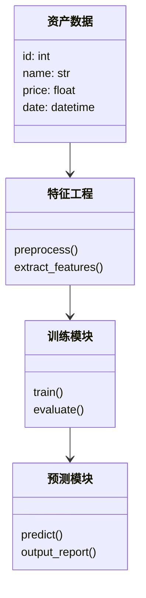

                 


# AI辅助的多资产类别收益率预测

**关键词**：AI辅助，多资产类别，收益率预测，机器学习，深度学习

**摘要**：本文探讨了如何利用AI技术进行多资产类别收益率预测，分析了传统方法的局限性，并详细介绍了机器学习和深度学习算法的应用，系统架构设计以及实际项目案例，最后提供了最佳实践建议。

---

# 第一部分：AI辅助的多资产类别收益率预测基础

## 第1章：多资产类别收益率预测的背景与挑战

### 1.1 问题背景介绍

#### 1.1.1 传统资产收益率预测的局限性
传统的资产收益率预测方法依赖于统计模型和人为分析，存在以下问题：
- 数据量有限，难以捕捉复杂市场动态
- 需要大量手动调整参数，效率低下
- 难以处理多资产类别间的相互影响

#### 1.1.2 AI技术在金融领域的应用前景
AI技术，尤其是机器学习和深度学习，在金融领域的优势：
- 能够处理海量数据，提取复杂特征
- 自动化特征工程，减少人为错误
- 实时预测，适应快速变化的市场

#### 1.1.3 多资产预测的核心问题
多资产预测需要解决的关键问题：
- 不同资产类别的相互影响
- 市场波动性和非线性关系
- 数据稀疏性和噪声干扰

### 1.2 核心概念与联系

#### 1.2.1 AI辅助的多资产预测模型
AI模型在多资产预测中的作用：
- 通过机器学习捕捉非线性关系
- 利用深度学习处理时间序列数据
- 组合不同模型提升预测精度

#### 1.2.2 多资产类别预测的复杂性
多资产预测的复杂性体现在：
- 各资产类别之间的相互影响
- 市场环境的动态变化
- 数据的多维度和高维度性

#### 1.2.3 机器学习与统计模型的结合
结合机器学习和统计模型的优势：
- 机器学习捕捉复杂模式
- 统计模型提供解释性
- 组合方法提升预测准确性

### 1.3 本章小结
本章介绍了多资产预测的背景、挑战以及AI技术的应用前景，为后续章节奠定了基础。

---

## 第2章：AI辅助的多资产预测核心概念

### 2.1 核心概念原理

#### 2.1.1 机器学习在资产预测中的应用
机器学习在资产预测中的关键应用：
- 监督学习：预测未来收益率
- 无监督学习：识别市场状态
- 回归分析：估计资产价格

#### 2.1.2 时间序列分析的核心原理
时间序列分析的关键步骤：
- 数据预处理：平滑、差分
- 模型选择：ARIMA、GARCH
- 预测与验证

#### 2.1.3 多资产预测的数学模型
数学模型在多资产预测中的作用：
- 统计套利：利用资产价格差异
- 风险管理：评估资产组合风险
- 多因子模型：考虑多个影响因素

### 2.2 核心概念对比分析

#### 2.2.1 机器学习与统计模型的对比
| 对比维度 | 机器学习 | 统计模型 |
|----------|----------|----------|
| 解释性   | 较低     | 较高     |
| 处理数据 | 大规模   | 中等规模 |
| 模型复杂性 | 高       | 中等     |

#### 2.2.2 不同资产类别的特征对比
资产类别特征对比：
- 股票：高波动性，受公司基本面影响
- 债券：受利率影响，风险较低
- 商品：受供需关系影响

#### 2.2.3 AI模型在多资产预测中的优劣势
AI模型的优势：
- 高精度预测
- 自动化特征工程
AI模型的劣势：
- 黑箱问题，解释性差
- 对异常数据敏感

### 2.3 实体关系图


### 2.4 本章小结
本章详细讲解了AI辅助预测的核心概念，对比分析了不同模型和资产类别的特征，为后续算法部分打下基础。

---

## 第3章：多资产预测的算法原理

### 3.1 机器学习算法概述

#### 3.1.1 线性回归模型
线性回归用于预测资产收益率：
$$ y = \beta_0 + \beta_1x + \epsilon $$

#### 3.1.2 支持向量机(SVM)
SVM用于分类和回归，适用于小样本数据：
$$ \text{minimize} \quad \frac{1}{2}\|w\|^2 + C\sum_{i=1}^n \xi_i $$
$$ \text{subject to} \quad y_i - w^T x_i - b \leq \xi_i $$

#### 3.1.3 随机森林与集成学习
随机森林通过集成多个决策树提升预测准确性。

### 3.2 深度学习算法原理

#### 3.2.1 LSTM网络结构
LSTM用于时间序列预测：
$$ h_t = \sigma(W_{hx}x_t + W_{hh}h_{t-1} + b_h) $$
$$ c_t = \sigma(W_{cx}x_t + W_{cc}c_{t-1} + b_c) $$
$$ o_t = \sigma(W_{ox}x_t + W_{oo}o_{t-1} + b_o) $$

#### 3.2.2 Transformer模型的应用
Transformer用于捕捉资产间的长程依赖：
$$ \text{Attention}(Q,K,V) = \text{softmax}\left(\frac{QK^T}{\sqrt{d_k}}\right)V $$

#### 3.2.3 图神经网络的潜力
图神经网络用于资产网络关系分析：
- 节点表示资产
- 边表示资产间的关联

### 3.3 算法流程图


### 3.4 本章小结
本章详细讲解了常用机器学习和深度学习算法，分析了它们在多资产预测中的应用。

---

## 第4章：系统分析与架构设计

### 4.1 问题场景介绍

#### 4.1.1 多资产预测的业务场景
- 实时监控多资产价格
- 自动化生成预测报告
- 优化投资组合

#### 4.1.2 系统目标与功能需求
- 数据采集与处理
- 模型训练与部署
- 预测结果展示

#### 4.1.3 系统边界与输入输出
- 输入：多资产历史数据、市场指标
- 输出：预测收益率、风险评估

### 4.2 系统功能设计

#### 4.2.1 领域模型


#### 4.2.2 系统架构


### 4.3 系统接口设计

#### 4.3.1 数据接口
- 输入接口：接收多资产历史数据
- 输出接口：输出预测结果

#### 4.3.2 API接口
- RESTful API：提供预测服务
- 接口文档：详细描述请求和响应格式

### 4.4 本章小结
本章设计了多资产预测系统的架构，明确了各模块的功能和交互方式。

---

## 第5章：项目实战

### 5.1 环境安装

```bash
pip install numpy pandas scikit-learn tensorflow matplotlib
```

### 5.2 核心代码实现

```python
import numpy as np
import pandas as pd
from sklearn.ensemble import RandomForestRegressor
from tensorflow.keras.models import Sequential
from tensorflow.keras.layers import LSTM, Dense

# 数据加载
data = pd.read_csv('assets_data.csv')

# 特征提取
features = data[['price', 'volume', 'market_sentiment']]
labels = data['next_day_return']

# 模型训练
model = Sequential()
model.add(LSTM(64, input_shape=(None, 3)))
model.add(Dense(1))
model.compile(optimizer='adam', loss='mse')

model.fit(features, labels, epochs=100, batch_size=32)

# 预测与评估
predictions = model.predict(features)
```

### 5.3 代码解读与分析

- 数据加载：读取多资产历史数据
- 特征提取：选择相关特征
- 模型训练：构建LSTM网络
- 预测与评估：生成预测结果并评估准确性

### 5.4 案例分析

#### 5.4.1 数据准备
加载并预处理数据，提取特征。

#### 5.4.2 模型训练
使用LSTM网络训练模型，优化参数。

#### 5.4.3 模型评估
计算预测准确率，分析误差分布。

### 5.5 本章小结
本章通过具体案例展示了AI辅助多资产预测的实现过程。

---

## 第6章：最佳实践与注意事项

### 6.1 小结

### 6.2 注意事项

- 数据质量：确保数据准确性和完整性
- 模型选择：根据需求选择合适算法
- 性能优化：优化模型和代码效率

### 6.3 拓展阅读

- 《机器学习实战》
- 《深度学习》
- 《Python金融数据分析》

### 6.4 本章小结
本章总结了项目经验，并提供了进一步学习的建议。

---

# 作者：AI天才研究院/AI Genius Institute & 禅与计算机程序设计艺术 /Zen And The Art of Computer Programming

---

以上是《AI辅助的多资产类别收益率预测》的完整目录大纲和部分章节内容。如果您对特定章节或部分有更深入的需求，欢迎随时提出，我将为您详细撰写相关内容。

