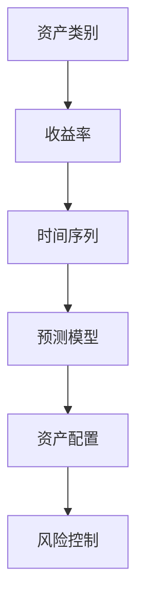
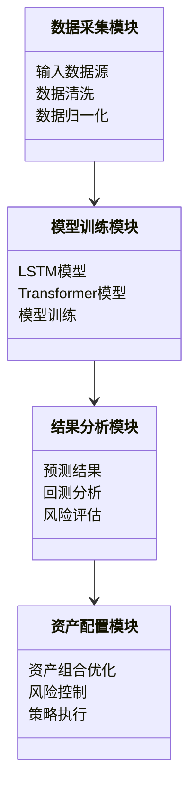
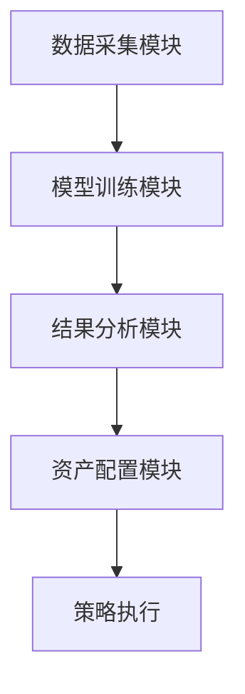
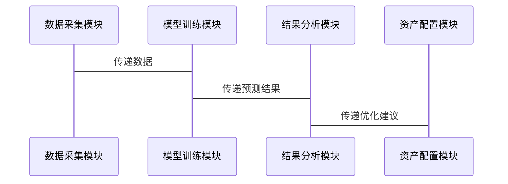

                 


# AI辅助的多资产类别收益率预测与资产配置

> 关键词：AI, 资产配置, 收益率预测, 机器学习, 时间序列分析, LSTM

> 摘要：本文将深入探讨人工智能在多资产类别收益率预测与资产配置中的应用。通过分析AI技术如何辅助金融决策者进行高效、精准的资产配置，我们将从背景与基础、算法与模型、系统架构、项目实战到总结与展望，全面解析这一领域的核心概念、算法原理与实际应用。文章结合理论与实践，旨在为读者提供一个系统化的知识框架，帮助他们在复杂多变的金融市场中做出明智的投资决策。

---

# 第一部分: AI辅助的多资产类别收益率预测与资产配置背景与基础

## 第1章: AI在金融领域的应用与多资产收益率预测的背景

### 1.1 人工智能在金融领域的应用现状

#### 1.1.1 人工智能技术在金融行业的应用领域
- **金融数据分析**: 利用AI技术对海量金融数据进行清洗、特征提取和模式识别。
- **风险管理**: 通过机器学习模型预测市场风险、信用风险和操作风险。
- **智能投顾**: 提供个性化的投资建议，帮助投资者优化资产配置。
- **高频交易**: 利用算法交易系统在极短时间内完成交易决策。
- **新闻情绪分析**: 通过自然语言处理技术分析市场情绪，辅助投资决策。

#### 1.1.2 AI在金融数据分析中的优势
- **高效性**: AI能够快速处理和分析海量数据，提供实时反馈。
- **准确性**: 通过复杂模型捕捉数据中的隐藏规律，提高预测精度。
- **可扩展性**: AI技术能够轻松扩展到不同的资产类别和市场环境。

#### 1.1.3 多资产类别收益率预测的必要性与挑战
- **必要性**: 多资产配置能够分散投资风险，提高整体收益稳定性。
- **挑战**: 不同资产类别的收益率受到多种因素影响，数据噪声大，预测难度高。

### 1.2 资产配置与收益率预测的基本概念

#### 1.2.1 资产配置的定义与分类
- **定义**: 资产配置是指将投资组合分配到不同的资产类别（如股票、债券、 commodities等）中，以实现风险和收益的最佳平衡。
- **分类**: 根据投资期限、风险偏好和市场环境进行动态调整。

#### 1.2.2 收益率预测的核心问题与目标
- **核心问题**: 如何基于历史数据和市场信息，准确预测未来资产的收益率。
- **目标**: 通过预测收益率优化资产配置，最大化投资收益。

#### 1.2.3 多资产配置的复杂性与优化方法
- **复杂性**: 不同资产类别的收益率相互关联，且受到宏观经济、政策变化等多重因素影响。
- **优化方法**: 使用数学优化模型（如均值-方差优化）进行组合优化。

### 1.3 本章小结
- **人工智能在金融领域的核心作用**: AI技术为金融数据分析和投资决策提供了强大的工具支持。
- **多资产收益率预测的背景意义**: 通过AI技术实现多资产配置的动态优化，能够显著提升投资收益并降低风险。
- **后续章节的学习目标**: 通过系统化学习，掌握AI辅助多资产配置的核心算法和实际应用。

---

## 第2章: 多资产类别收益率预测的核心概念与联系

### 2.1 多资产类别收益率预测的背景与问题描述

#### 2.1.1 多资产类别的定义与分类
- **定义**: 多资产类别指的是将投资组合分配到股票、债券、 commodities、房地产等多种资产类别中。
- **分类**: 根据资产的流动性、收益来源和风险特征进行分类。

#### 2.1.2 收益率预测的定义与目标
- **定义**: 收益率预测是指利用历史数据和市场信息，预测未来一段时间内资产的收益率。
- **目标**: 通过准确的收益率预测优化资产配置，实现投资收益最大化。

#### 2.1.3 问题的边界与外延
- **边界**: 预测模型的输入数据范围和预测时间窗口。
- **外延**: 考虑市场环境的变化和模型的可解释性。

### 2.2 核心概念与联系

#### 2.2.1 AI技术与金融数据的结合
- **数据特征**: 高维性、时间依赖性、非线性特征。
- **AI技术优势**: 神经网络模型能够捕捉复杂的非线性关系。

#### 2.2.2 时间序列分析与资产收益率预测
- **时间序列分析**: 通过历史收益率数据预测未来走势。
- **资产收益率预测**: 基于时间序列模型实现多资产的收益率预测。

#### 2.2.3 资产配置与风险控制的关系
- **资产配置**: 决定投资组合的风险和收益特征。
- **风险控制**: 通过动态调整资产配置降低整体风险。

### 2.3 核心概念的ER实体关系图



### 2.4 本章小结
- **核心概念的系统化理解**: 多资产收益率预测需要结合时间序列分析和AI技术，实现动态优化。
- **AI技术在多资产预测中的作用**: 神经网络模型能够捕捉复杂的市场规律，提高预测精度。
- **后续章节的逻辑基础**: 本章为后续算法与模型的讲解奠定基础。

---

# 第三部分: AI辅助的多资产类别收益率预测算法与模型

## 第3章: 时间序列分析与机器学习模型

### 3.1 时间序列分析的基本原理

#### 3.1.1 时间序列的特征与分解
- **趋势**: 长期方向性的变化。
- **周期性**: 定期出现的波动模式。
- **随机性**: 不可预测的噪声。

#### 3.1.2 常见的时间序列模型
- **ARIMA模型**: 自回归积分滑动模型，适用于线性时间序列预测。
- **GARCH模型**: 广义自回归条件异方差模型，用于预测金融时间序列的波动性。

#### 3.1.3 AI技术在时间序列分析中的应用
- **神经网络模型**: LSTM和Transformer模型在时间序列预测中的应用。

### 3.2 机器学习模型在收益率预测中的应用

#### 3.2.1 线性回归模型
- **简单线性回归**: $y = \beta_0 + \beta_1x + \epsilon$
- **多元线性回归**: $y = \beta_0 + \beta_1x_1 + \beta_2x_2 + \dots + \beta_nx_n + \epsilon$

#### 3.2.2 支持向量机模型
- **支持向量回归**: 通过构建支持向量回归模型，实现非线性关系的预测。

#### 3.2.3 随机森林与梯度提升树
- **随机森林**: 通过集成多个决策树模型，提高预测精度。
- **梯度提升树**: 使用梯度提升算法优化树模型的预测能力。

### 3.3 神经网络模型在时间序列预测中的应用

#### 3.3.1 循序贯模型（RNN）
- **基本结构**: 通过循环结构捕捉时间序列的依赖关系。

#### 3.3.2 长短期记忆网络（LSTM）
- **结构特点**: 通过门控机制实现长期依赖关系的捕捉。
- **公式**: 
  - 输入门: $f_t = \sigma(W_f x_t + U_f h_{t-1} + b_f)$
  - 遗忘门: $i_t = \sigma(W_i x_t + U_i h_{t-1} + b_i)$
  - 输出门: $o_t = \sigma(W_o x_t + U_o h_{t-1} + b_o)$
  - 滤液状态: $g_t = \tanh(W_g x_t + U_g h_{t-1} + b_g)$
  - 当前状态: $h_t = f_t \cdot c_{t-1} + i_t \cdot g_t$
  - 输出: $o_t \cdot h_t$

#### 3.3.3 Transformer模型
- **结构特点**: 通过自注意力机制捕捉全局依赖关系。

### 3.4 本章小结
- **时间序列分析的核心方法**: ARIMA和GARCH模型是经典的时间序列预测方法。
- **机器学习模型的优缺点**: 线性回归模型简单但预测能力有限，随机森林和梯度提升树能够捕捉复杂关系。
- **神经网络模型的前沿应用**: LSTM和Transformer模型在时间序列预测中表现优异。

---

## 第4章: 基于AI的多资产收益率预测算法实现

### 4.1 基于LSTM的时间序列预测模型

#### 4.1.1 LSTM模型的基本结构
- **输入层**: 接收历史收益率数据。
- **LSTM层**: 捕捉时间序列的长期依赖关系。
- **输出层**: 生成预测的收益率。

#### 4.1.2 LSTM模型的实现步骤
1. 数据预处理: 对历史收益率数据进行归一化处理。
2. 模型训练: 使用训练数据训练LSTM模型。
3. 模型预测: 利用训练好的模型预测未来收益率。

#### 4.1.3 LSTM模型的数学公式
- **输入**: $X = [x_1, x_2, ..., x_n]$
- **输出**: $Y = [y_1, y_2, ..., y_m]$
- **损失函数**: �均方误差（MSE）
  $$ \text{Loss} = \frac{1}{m}\sum_{i=1}^{m}(y_i - \hat{y}_i)^2 $$
- **优化方法**: 使用Adam优化器进行参数更新。

### 4.2 基于Transformer的多资产预测模型

#### 4.2.1 Transformer模型的基本结构
- **编码器**: 将输入序列转换为高维表示。
- **解码器**: 根据编码器的输出生成预测结果。

#### 4.2.2 Transformer模型的实现步骤
1. 数据预处理: 对多资产收益率数据进行分词和归一化。
2. 模型训练: 使用多资产数据训练Transformer模型。
3. 多步预测: 通过自回归方式生成多步预测结果。

#### 4.2.3 Transformer模型的数学公式
- **自注意力机制**: 
  $$ \text{Attention}(Q, K, V) = \text{softmax}\left(\frac{QK^T}{\sqrt{d_k}}\right)V $$
- **前馈网络**: 
  $$ \text{FFN}(x) = \text{ReLU}(W_1x + b_1)W_2 + b_2 $$

### 4.3 本章小结
- **LSTM模型的优势**: 能够捕捉时间序列的长期依赖关系，适合单变量时间序列预测。
- **Transformer模型的优势**: 通过自注意力机制捕捉全局依赖关系，适合多资产预测。
- **数学模型的深度解析**: LSTM和Transformer模型的数学公式详细解释了其工作原理。

---

# 第四部分: AI辅助的多资产类别收益率预测系统架构

## 第5章: 系统架构设计与实现

### 5.1 问题场景介绍
- **目标**: 构建一个基于AI的多资产收益率预测系统。
- **场景**: 从数据采集到模型训练，再到结果分析和资产配置优化。

### 5.2 系统功能设计

#### 5.2.1 领域模型（Mermaid类图）


#### 5.2.2 系统架构设计（Mermaid架构图）


#### 5.2.3 系统接口设计
- **输入接口**: 数据接口（接收历史收益率数据）。
- **输出接口**: 预测结果接口（输出预测收益率和资产配置建议）。

#### 5.2.4 系统交互设计（Mermaid序列图）


### 5.3 本章小结
- **系统架构的完整性**: 从数据采集到资产配置的完整流程设计。
- **模块之间的协作**: 数据采集模块、模型训练模块、结果分析模块和资产配置模块的协同工作。
- **系统架构的可扩展性**: 系统架构能够适应不同的资产类别和市场环境。

---

# 第五部分: 项目实战与总结

## 第6章: 项目实战

### 6.1 环境安装与配置
- **编程语言**: Python 3.8+
- **深度学习框架**: TensorFlow或Keras
- **数据处理库**: Pandas、NumPy
- **可视化库**: Matplotlib、Seaborn

### 6.2 核心实现

#### 6.2.1 数据预处理
```python
import pandas as pd
import numpy as np

# 加载数据
data = pd.read_csv('multi_asset_data.csv')

# 数据清洗
data.dropna(inplace=True)

# 数据归一化
from sklearn.preprocessing import MinMaxScaler
scaler = MinMaxScaler()
data_scaled = scaler.fit_transform(data)
```

#### 6.2.2 模型实现
```python
from tensorflow.keras.models import Sequential
from tensorflow.keras.layers import LSTM, Dense, Dropout

# LSTM模型
model = Sequential()
model.add(LSTM(64, input_shape=(timesteps, features)))
model.add(Dropout(0.2))
model.add(Dense(1))
model.compile(loss='mean_squared_error', optimizer='adam')
```

#### 6.2.3 回测与优化
```python
# 回测函数
def backtest策略():
    pass

# 优化函数
from scipy.optimize import minimize

def优化函数(params):
    pass
```

### 6.3 项目小结
- **代码实现的可扩展性**: 代码能够适应不同的资产类别和时间窗口。
- **回测与优化的重要性**: 回测能够验证模型的预测能力，优化函数能够提高资产配置的效率。
- **实际案例分析**: 通过具体案例分析，验证模型的预测能力和优化效果。

---

## 第7章: 总结与展望

### 7.1 本章总结
- **核心内容回顾**: 本文系统地介绍了AI技术在多资产类别收益率预测与资产配置中的应用。
- **主要贡献**: 提出了基于LSTM和Transformer模型的多资产预测方法，并设计了完整的系统架构。
- **实践经验总结**: 通过项目实战验证了模型的可行性和有效性。

### 7.2 未来研究方向
- **多模态数据的应用**: 结合文本、图像等多种数据源进行资产预测。
- **强化学习的应用**: 使用强化学习算法优化资产配置策略。
- **实时交易系统**: 构建实时交易系统，实现动态资产配置。

### 7.3 注意事项与最佳实践
- **数据质量**: 数据清洗和归一化是模型训练的关键步骤。
- **模型选择**: 根据具体场景选择合适的模型，避免过拟合。
- **风险控制**: 在实际投资中，风险控制是资产配置的核心考虑因素。

### 7.4 拓展阅读
- **推荐书籍**: 《Python金融数据分析》、《深度学习》
- **推荐论文**: "LSTM-based stock market prediction", "Attention-based models for financial time series forecasting"

---

# 作者：AI天才研究院/AI Genius Institute & 禅与计算机程序设计艺术/Zen And The Art of Computer Programming

---

**本文为系统性阐述AI辅助的多资产类别收益率预测与资产配置的技术博客文章，内容涵盖从背景知识到算法实现再到系统架构的完整流程。通过本文，读者可以全面了解AI技术在金融领域的应用，掌握多资产配置的核心算法与实际应用技巧。**

