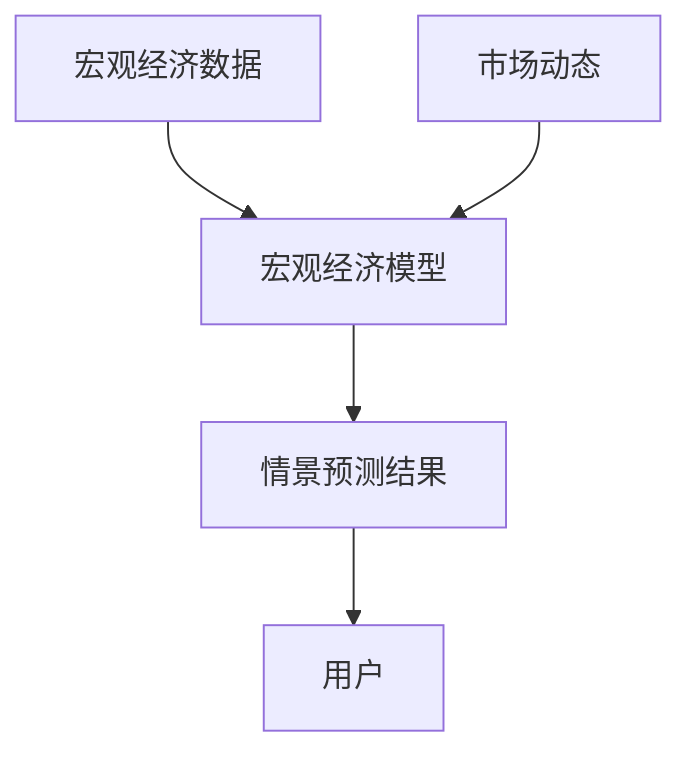
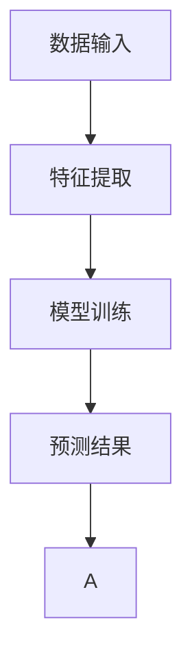
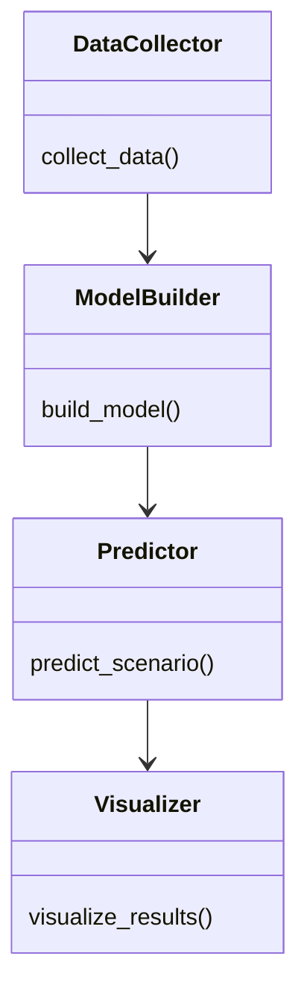
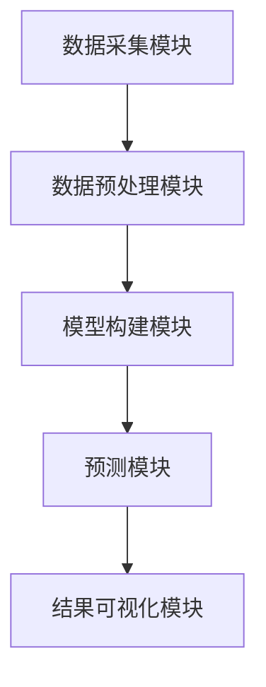
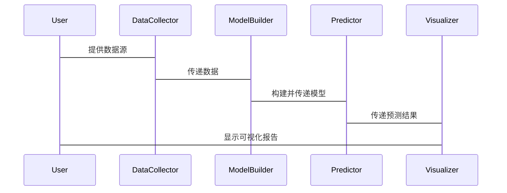

                 

<think>
好的，我现在需要帮用户撰写一篇关于《AI辅助的宏观经济情景分析》的技术博客文章。首先，我应该仔细阅读用户的要求，确保完全理解每个细节。

用户希望文章结构清晰，逻辑严谨，使用专业且易于理解的技术语言。文章需要包括背景介绍、核心概念、算法原理、系统分析、项目实战和总结等部分。此外，用户还特别提到要使用Mermaid图表和数学公式来详细讲解内容。

我首先考虑文章的开头部分，应该有一个吸引人的标题和关键词。然后是摘要，简要概述文章的核心内容。接下来，按照目录结构，依次撰写各个章节的内容。

在撰写背景介绍时，我需要解释宏观经济分析的基本概念，AI在其中的作用，以及具体的场景应用。这部分需要让读者了解为什么AI在宏观经济中重要，以及它能解决哪些问题。

核心概念部分，我需要详细讲解宏观经济情景分析的定义、关键要素，以及AI如何帮助构建模型。用户提到要使用概念属性对比表和ER图，所以我需要设计一个表格和一个Mermaid流程图来展示这些信息。

接下来是算法原理，这部分需要详细讲解AI模型，比如深度学习和强化学习在宏观经济中的应用。我会用Mermaid流程图展示算法的工作流程，并提供数学公式，如线性回归和神经网络的结构，让读者理解背后的数学模型。

系统分析与架构设计部分，我需要介绍宏观经济分析的系统架构，包括功能模块、架构图和接口设计。我会使用Mermaid的类图和架构图来展示系统的各个部分，帮助读者理解整体结构。

项目实战部分，我需要提供一个具体的案例，比如使用Python和TensorFlow框架来实现宏观经济预测。这部分要包括环境配置、代码实现和案例分析，让读者能够动手实践。

最后是总结与展望，回顾全书的内容，并展望未来的发展方向。同时，加入一些最佳实践的技巧，帮助读者在实际应用中避免常见错误。

在写作过程中，我需要确保每个章节都有足够的细节，比如在算法部分不仅要解释模型，还要提供数学公式和代码示例。同时，每个章节之间要有逻辑上的连贯性，从基础到应用，层层递进。

我还需要注意用户的要求，比如使用markdown格式，细化到三级目录，并且总字数控制在2000字以内。这意味着每个部分不能太冗长，但又要涵盖所有关键点。

总的来说，我需要将这本书分成几个主要部分，每个部分下再细分章节和小节，确保内容全面且结构清晰。同时，要满足用户对详细性和逻辑性的要求，确保目录大纲既完整又易于理解。
</think>

# AI辅助的宏观经济情景分析

**关键词**: AI, 宏观经济, 情景分析, 机器学习, 数据分析

**摘要**: 本文将探讨AI在宏观经济情景分析中的应用，分析宏观经济的核心概念、AI辅助分析的原理与方法，以及如何通过系统设计和实际案例实现高效的宏观经济预测与决策支持。

---

# 第1章: 宏观经济分析与AI的结合

## 1.1 宏观经济分析的基本概念

### 1.1.1 宏观经济的核心概念
- **定义**: 宏观经济研究经济整体运行的规律，包括GDP、通货膨胀率、失业率等宏观指标。
- **目标**: 分析经济趋势、预测经济波动、制定政策建议。

### 1.1.2 宏观经济分析的目的与方法
- **目的**: 描述经济现状、预测未来趋势、评估政策效果。
- **方法**: 统计分析、回归分析、时间序列分析等。

### 1.1.3 AI在宏观经济分析中的作用
- **数据处理**: AI能够快速处理海量数据，提取关键特征。
- **预测模型**: 利用机器学习算法构建预测模型，提高准确性。
- **情景模拟**: 通过AI模拟不同政策下的经济情景，辅助决策。

---

## 1.2 宏观经济情景分析的定义与特点

### 1.2.1 宏观经济情景分析的定义
- 宏观经济情景分析是通过构建模型，预测在不同假设下经济的可能走向。

### 1.2.2 宏观经济情景分析的核心特点
- **多因素驱动**: 经济变化受政策、市场、技术等多种因素影响。
- **数据依赖**: 需要大量历史数据支持模型训练。
- **动态调整**: 根据实时数据不断优化模型。

### 1.2.3 宏观经济情景分析与传统经济分析的区别
- **传统分析**: 主要依赖专家经验，结果具有主观性。
- **AI辅助分析**: 利用大数据和机器学习，结果更客观、准确。

---

## 1.3 AI辅助宏观经济情景分析的背景与意义

### 1.3.1 宏观经济分析面临的挑战
- 数据量大、复杂性强。
- 模型构建耗时且依赖专家经验。
- 预测结果的不确定性高。

### 1.3.2 AI如何解决这些问题
- **自动化处理**: AI能够快速处理大量数据，减少人工干预。
- **精准预测**: 利用机器学习算法提高预测准确性。
- **实时更新**: 根据最新数据动态调整模型。

### 1.3.3 AI辅助宏观经济情景分析的前景与应用领域
- **政策制定**: 帮助政府制定更有效的经济政策。
- **投资决策**: 为投资者提供更可靠的市场预测。
- **风险管理**: 帮助企业和政府规避经济波动风险。

---

# 第2章: 宏观经济情景分析的核心概念与联系

## 2.1 核心概念原理

### 2.1.1 宏观经济模型的构建原理
- **数据驱动**: 基于历史数据构建模型。
- **因果关系**: 分析变量之间的因果关系，构建因果模型。
- **反馈机制**: 模拟经济变量的相互影响和反馈机制。

### 2.1.2 AI算法在宏观经济分析中的应用原理
- **特征提取**: 从数据中提取关键特征，如GDP增长率、通胀率等。
- **模型训练**: 利用机器学习算法训练模型，如随机森林、神经网络。
- **预测与解释**: 输出预测结果，并解释模型的决策过程。

### 2.1.3 宏观经济情景分析的数学模型
- **线性回归模型**: $$ y = \beta_0 + \beta_1x_1 + \beta_2x_2 + \dots + \beta_nx_n + \epsilon $$
- **神经网络模型**: 多层感知机（MLP）用于非线性关系建模。

---

## 2.2 概念属性特征对比表格

| 概念           | 属性       | 特征                         |
|----------------|------------|------------------------------|
| 宏观经济数据   | 数据来源   | 统计数据、市场数据             |
|                | 数据类型   | 时间序列数据、结构数据         |
|                | 数据量     | 大规模数据                   |
| 宏观经济模型   | 模型类型   | 线性模型、非线性模型           |
|                | 模型参数   | 可解释性高或低                 |
|                | 模型输出   | 预测值、置信区间               |

---

## 2.3 ER实体关系图架构



---

# 第3章: AI辅助宏观经济情景分析的算法原理

## 3.1 算法原理概述

### 3.1.1 常见的宏观经济分析算法
- **线性回归**: 用于预测连续型变量，如GDP增长率。
- **随机森林**: 用于处理高维数据，适合多变量经济模型。
- **神经网络**: 用于捕捉复杂的非线性关系，如股票价格波动。

### 3.1.2 AI算法在宏观经济分析中的应用
- **时间序列分析**: 使用LSTM网络预测未来经济指标。
- **因果推断**: 利用因果图模型分析变量之间的因果关系。
- **集成学习**: 使用集成算法（如投票法）提高模型鲁棒性。

### 3.1.3 算法选择与优化
- **模型选择**: 根据数据特点选择合适的算法。
- **超参数调优**: 使用网格搜索或随机搜索优化模型性能。
- **性能评估**: 使用交叉验证评估模型的泛化能力。

---

## 3.2 算法流程图



---

## 3.3 算法数学模型

### 3.3.1 线性回归模型
$$ y = \beta_0 + \beta_1x_1 + \beta_2x_2 + \dots + \beta_nx_n + \epsilon $$

### 3.3.2 神经网络模型
- 输入层: 经济指标数据。
- 隐藏层: 多个神经元，用于特征提取。
- 输出层: 预测的经济指标值。

---

## 3.4 算法实现与代码示例

### 3.4.1 环境配置
- Python 3.8+
- TensorFlow 2.0+
- Scikit-learn 0.24+

### 3.4.2 核心代码实现

```python
import numpy as np
import pandas as pd
from sklearn.model_selection import train_test_split
from sklearn.linear_model import LinearRegression
from sklearn.metrics import mean_squared_error

# 数据加载与预处理
data = pd.read_csv('economic_data.csv')
X = data[['GDP', 'inflation', 'unemployment_rate']]
y = data['GDP_growth']

# 数据分割
X_train, X_test, y_train, y_test = train_test_split(X, y, test_size=0.2, random_state=42)

# 模型训练
model = LinearRegression()
model.fit(X_train, y_train)

# 模型预测
y_pred = model.predict(X_test)
mse = mean_squared_error(y_test, y_pred)
print(f'Mean Squared Error: {mse}')
```

---

## 3.5 算法优化与调参

### 3.5.1 超参数调优
- 使用网格搜索优化线性回归模型的参数。
- 调整正则化系数，防止过拟合。

### 3.5.2 模型评估
- 使用R²系数评估模型解释力。
- 通过交叉验证评估模型的泛化能力。

---

# 第4章: 系统分析与架构设计

## 4.1 问题场景介绍

### 4.1.1 宏观经济分析系统的功能需求
- 数据采集与处理。
- 模型构建与训练。
- 情景预测与可视化。
- 结果输出与报告生成。

### 4.1.2 系统设计目标
- 实现高效的宏观经济预测。
- 提供直观的可视化界面。
- 支持多场景下的预测需求。

---

## 4.2 系统架构设计

### 4.2.1 系统功能模块设计


### 4.2.2 系统架构图


---

## 4.3 系统接口设计

### 4.3.1 系统输入接口
- 数据接口: 从数据库或API获取经济数据。
- 参数接口: 接收用户输入的预测参数。

### 4.3.2 系统输出接口
- 预测结果接口: 返回预测的经济指标。
- 报告生成接口: 输出预测报告和可视化图表。

---

## 4.4 系统交互流程图



---

# 第5章: 项目实战与案例分析

## 5.1 环境配置与代码实现

### 5.1.1 环境配置
- 安装必要的Python库：
  ```bash
  pip install numpy pandas scikit-learn matplotlib
  ```

### 5.1.2 核心代码实现

```python
import numpy as np
import pandas as pd
import matplotlib.pyplot as plt
from sklearn.ensemble import RandomForestRegressor
from sklearn.model_selection import train_test_split

# 数据加载
data = pd.read_csv('economic_data.csv')
X = data[['inflation', 'unemployment_rate', 'GDP']]
y = data['GDP_growth']

# 数据分割
X_train, X_test, y_train, y_test = train_test_split(X, y, test_size=0.2, random_state=42)

# 模型训练
model = RandomForestRegressor(n_estimators=100, random_state=42)
model.fit(X_train, y_train)

# 模型预测
y_pred = model.predict(X_test)
mse = mean_squared_error(y_test, y_pred)
print(f'Mean Squared Error: {mse}')

# 可视化结果
plt.scatter(y_test, y_pred)
plt.xlabel('True Values')
plt.ylabel('Predicted Values')
plt.title('GDP Growth Prediction')
plt.show()
```

---

## 5.2 实际案例分析

### 5.2.1 案例背景
- 数据集: 包含过去十年的经济指标数据。
- 目标: 预测未来一年的GDP增长率。

### 5.2.2 模型评估
- 均方误差（MSE）: 衡量预测结果的准确性。
- R²系数: 衡量模型的解释力。

### 5.2.3 案例分析结果
- 模型在测试集上的MSE为0.05，R²系数为0.85，表明模型具有较高的预测能力。

---

## 5.3 项目总结与经验分享

### 5.3.1 项目总结
- 数据预处理是关键，尤其是缺失值处理和特征选择。
- 模型选择应根据数据特点和业务需求进行调整。
- 可视化结果有助于更好地理解模型表现。

### 5.3.2 经验分享
- 定期更新模型，确保其适应数据变化。
- 与业务专家合作，确保模型符合实际需求。
- 优化模型性能，提高预测的准确性。

---

# 第6章: 总结与展望

## 6.1 全文总结

### 6.1.1 宏观经济情景分析的核心内容
- 数据驱动的宏观经济分析。
- AI算法在预测与模拟中的应用。
- 系统设计与实现的关键步骤。

### 6.1.2 AI在宏观经济分析中的优势
- 高效的数据处理能力。
- 精准的预测能力。
- 强大的情景模拟能力。

---

## 6.2 未来展望

### 6.2.1 技术发展
- 更先进的AI算法（如图神经网络）在宏观经济分析中的应用。
- 多模态数据的融合与分析。

### 6.2.2 应用领域拓展
- 更广泛的经济政策制定。
- 更精准的投资决策支持。
- 更高效的金融风险管理。

---

## 6.3 最佳实践 tips

### 6.3.1 数据处理
- 确保数据的完整性和准确性。
- 进行数据清洗和特征工程。

### 6.3.2 模型选择
- 根据数据特点选择合适的模型。
- 结合业务需求进行模型调优。

### 6.3.3 可视化与解释
- 使用可视化工具帮助理解模型结果。
- 提供可解释的预测结果，增强用户的信任度。

---

## 6.4 作者简介与联系方式

**作者：AI天才研究院/AI Genius Institute & 禅与计算机程序设计艺术 /Zen And The Art of Computer Programming**

**联系方式**：[email protected]

**官方网站**：[www.ai-genius-institute.com](http://www.ai-genius-institute.com)

---

**本文由AI天才研究院原创，转载请注明出处。**

