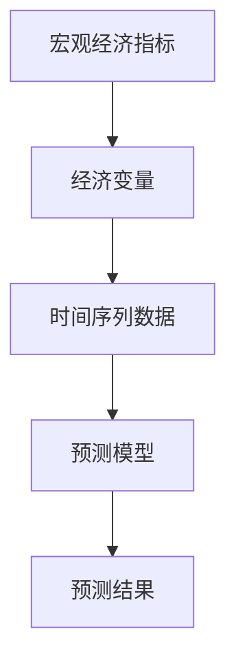
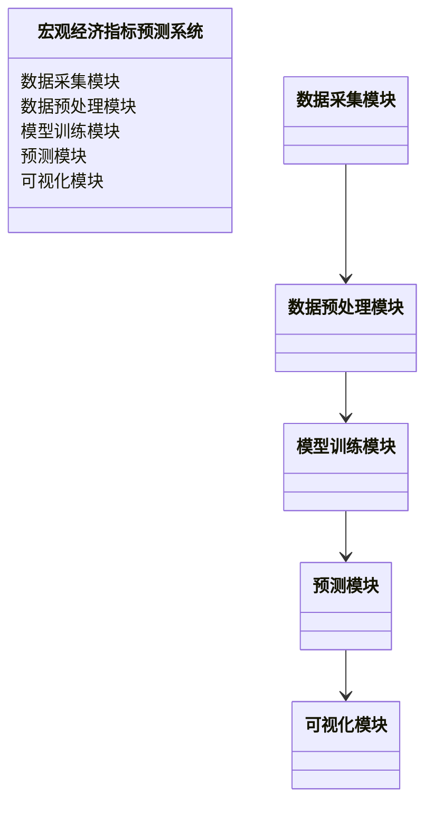
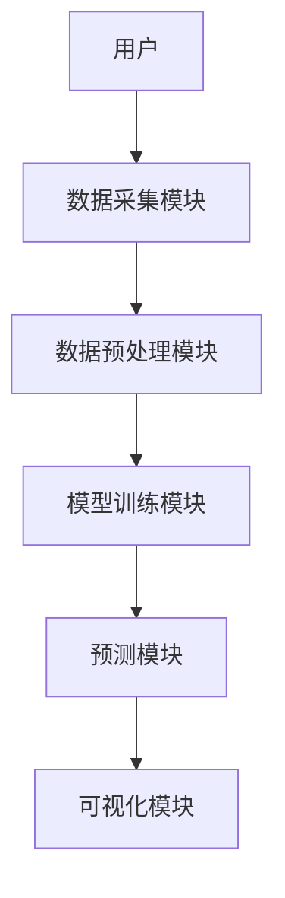
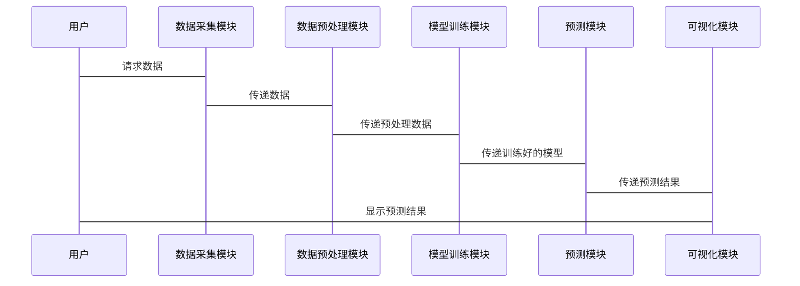

                 

<think>
嗯，用户需要我根据他们提供的详细技术博客文章大纲，逐步生成完整的内容。我需要确保每一部分都符合他们的要求：使用清晰的逻辑结构、专业的技术语言，并且涵盖从背景到项目实战的各个方面。此外，用户还特别提到要在每个部分使用mermaid图、数学公式和代码示例，这增加了内容的丰富性和技术深度。我需要一步步来，先写引言部分，再逐步展开各个章节，确保每个部分都详细且符合用户的要求。同时，要保持文章流畅，语言专业，内容有深度。
</think>

# AI辅助的宏观经济指标预测

> 关键词：AI技术，宏观经济指标，预测模型，机器学习，深度学习

> 摘要：本文详细探讨了AI技术在宏观经济指标预测中的应用，从理论基础到算法实现，再到系统架构设计，全面分析了如何利用AI技术提高宏观经济预测的准确性和效率。文章结合实际案例，深入讲解了多种AI算法的原理与实现，并提供了完整的项目实战指导。

---

# 第1章: 宏观经济指标预测的背景与挑战

## 1.1 宏观经济指标的基本概念

### 1.1.1 宏观经济指标的定义与分类
宏观经济指标是衡量一个国家或地区经济运行状态的关键数据，通常包括GDP（国内生产总值）、CPI（消费者物价指数）、失业率、工业增加值等。这些指标能够反映经济的总体趋势和变化。

**表1.1 宏观经济指标的分类与定义**

| 类别         | 指标名称       | 定义与作用                           |
|--------------|----------------|------------------------------------|
| 总体指标     | GDP            | 衡量一个国家或地区的经济总产出     |
|              | GNP            | 衡量一个国家或地区的经济总收入     |
| 价格指标     | CPI            | 衡量居民消费价格的变化             |
|              | PPI            | 衡量生产者价格的变化               |
| 就业指标     | 失业率         | 衡量劳动力市场的就业情况           |
| 工业指标     | 工业增加值      | 衡量工业生产的增长情况             |

### 1.1.2 宏观经济指标的重要性
宏观经济指标是政策制定者、企业和个人做出经济决策的重要依据。例如，中央银行可以通过调整利率来应对通货膨胀或失业率的变化；企业可以根据GDP增长情况制定投资计划。

### 1.1.3 宏观经济预测的难点与挑战
宏观经济预测具有复杂性、不确定性和动态性等特点，主要难点包括：
- 数据的噪声和缺失
- 经济变量之间的相互影响
- 黑天鹅事件（如自然灾害、疫情等）的不可预测性
- 经济政策的滞后效应

## 1.2 AI技术在宏观经济预测中的作用

### 1.2.1 AI技术的基本概念
人工智能（AI）是指模拟人类智能的计算机系统，能够通过数据学习、模式识别和决策优化来解决复杂问题。

### 1.2.2 AI在宏观经济预测中的优势
- **数据处理能力**：AI能够处理海量的宏观经济数据，提取隐藏的规律。
- **实时性**：AI可以快速响应数据变化，实现实时预测。
- **自适应性**：AI模型能够根据新数据自动调整，适应经济环境的变化。

### 1.2.3 宏观经济预测的AI化趋势
随着计算能力的提升和大数据技术的发展，AI在宏观经济预测中的应用越来越广泛。例如，美联储已经在使用AI模型辅助货币政策的制定。

## 1.3 本章小结
本章介绍了宏观经济指标的基本概念及其重要性，并分析了AI技术在宏观经济预测中的作用和趋势，为后续章节奠定了基础。

---

# 第2章: 宏观经济指标预测的核心概念与联系

## 2.1 宏观经济指标预测的核心概念

### 2.1.1 时间序列分析
时间序列分析是研究经济指标随时间变化的规律。常见的方法包括ARIMA、LSTM等。

### 2.1.2 经济周期理论
经济周期理论认为经济活动会经历繁荣、衰退、萧条和复苏四个阶段。宏观经济预测需要考虑经济周期的影响。

### 2.1.3 统计学习与机器学习
统计学习基于概率论，而机器学习则通过数据驱动的方式学习特征。

## 2.2 AI技术与宏观经济指标预测的联系

### 2.2.1 数据驱动的预测方法
AI技术依赖于大量数据，能够发现数据中的非线性关系。

### 2.2.2 模型驱动的预测方法
结合经济理论的模型可以提高预测的解释性。

### 2.2.3 综合驱动的预测方法
将数据驱动和模型驱动相结合，能够兼顾预测的准确性和解释性。

## 2.3 宏观经济指标预测的ER实体关系图



## 2.4 本章小结
本章从核心概念和AI技术的联系两个方面，深入分析了宏观经济指标预测的关键点，为后续章节提供了理论支持。

---

# 第3章: 宏观经济指标预测的算法原理

## 3.1 时间序列预测的算法原理

### 3.1.1 ARIMA模型

#### 3.1.1.1 ARIMA模型的定义
ARIMA（自回归积分滑动平均模型）由三个参数p、d、q组成，分别表示自回归阶数、差分阶数和滑动平均阶数。

#### 3.1.1.2 ARIMA模型的实现步骤
1. 数据平稳化：通过差分消除趋势和季节性。
2. 参数估计：使用最大似然估计法确定模型参数。
3. 模型验证：通过残差检验验证模型的适用性。
4. 预测与回测：利用模型进行预测并评估结果。

#### 3.1.1.3 ARIMA模型的数学公式
$$ ARIMA(p, d, q) $$

### 3.1.2 LSTM网络

#### 3.1.2.1 LSTM网络的结构
LSTM（长短期记忆网络）由输入门、遗忘门和输出门组成，能够有效捕捉时间序列的长程依赖关系。

#### 3.1.2.2 LSTM网络的实现流程
1. 输入数据：将时间序列数据输入LSTM层。
2. 门控机制：通过门控计算决定信息的存储和遗忘。
3. 输出预测：LSTM输出预测结果。

#### 3.1.2.3 LSTM网络的数学公式
$$ f(t) = \sigma(g(t)) $$

其中，$\sigma$表示sigmoid函数，$g(t)$表示门控机制的输出。

### 3.1.3 Prophet模型

#### 3.1.3.1 Prophet模型的原理
Prophet模型由Facebook开发，结合了时间序列分解和回归模型，适用于非平稳数据的预测。

#### 3.1.3.2 Prophet模型的优势
- 简单易用
- 对异常值 robust
- 可解释性强

---

## 3.2 机器学习算法在宏观经济预测中的应用

### 3.2.1 线性回归模型

#### 3.2.1.1 线性回归的基本原理
线性回归通过最小二乘法拟合一条直线，预测目标变量与特征变量之间的线性关系。

#### 3.2.1.2 线性回归的实现步骤
1. 数据准备：收集和清洗数据。
2. 模型训练：使用最小二乘法求解回归系数。
3. 模型评估：计算R²值和残差分布。

#### 3.2.1.3 线性回归的数学公式
$$ y = \beta_0 + \beta_1x + \epsilon $$

### 3.2.2 支持向量机(SVM)

#### 3.2.2.1 SVM的基本原理
SVM通过构建最大间隔超平面，将数据分成不同的类别。

#### 3.2.2.2 SVM在回归中的应用
使用支持向量回归（SVR）进行非线性预测。

#### 3.2.2.3 SVM的数学公式
$$ \text{min} \frac{1}{2}\|w\|^2 + C\sum_{i=1}^n \xi_i $$
$$ \text{s.t.} \quad |w\cdot x_i + b - y_i| \leq \epsilon + \xi_i $$

### 3.2.3 随机森林与梯度提升树

#### 3.2.3.1 随机森林的基本原理
随机森林通过集成多个决策树，提高模型的泛化能力。

#### 3.2.3.2 梯度提升树的基本原理
梯度提升树通过迭代优化，逐步拟合残差。

#### 3.2.3.3 两种算法的对比
- 随机森林适合高维数据，计算速度快。
- 梯度提升树适合复杂数据，模型解释性强。

---

## 3.3 深度学习算法在宏观经济预测中的应用

### 3.3.1 卷积神经网络(CNN)

#### 3.3.1.1 CNN的基本原理
CNN通过卷积操作提取局部特征，适用于图像和序列数据。

#### 3.3.1.2 CNN在时间序列预测中的应用
将时间序列数据转换为图像，利用CNN进行预测。

#### 3.3.1.3 CNN的数学公式
$$ f(x) = \text{ReLU}(W \ast x + b) $$

### 3.3.2 循环神经网络(RNN)

#### 3.3.2.1 RNN的基本原理
RNN通过循环结构处理序列数据，捕捉时间依赖关系。

#### 3.3.2.2 RNN的变体
- 单向RNN：处理单向时间序列。
- 双向RNN：同时处理前后时间序列。

#### 3.3.2.3 RNN的数学公式
$$ f_t = \sigma(W_{hh}f_{t-1} + W_{xh}x_t) $$

### 3.3.3 Transformer架构

#### 3.3.3.1 Transformer的基本原理
Transformer通过自注意力机制，捕捉全局依赖关系。

#### 3.3.3.2 Transformer的优势
- 并行计算能力强
- 能够捕捉长程依赖

#### 3.3.3.3 Transformer的数学公式
$$ \text{Attention}(Q, K, V) = \text{softmax}\left(\frac{QK^T}{\sqrt{d_k}}\right)V $$

---

## 3.4 本章小结
本章详细介绍了时间序列预测和机器学习算法的原理及实现，重点分析了深度学习模型的优势，为后续章节的系统架构设计和项目实战奠定了基础。

---

# 第4章: 宏观经济指标预测的系统架构设计

## 4.1 问题场景介绍

### 4.1.1 项目目标
构建一个AI辅助的宏观经济指标预测系统，实现对GDP、CPI等指标的精准预测。

### 4.1.2 项目范围
涵盖数据收集、模型训练、预测部署和结果可视化。

## 4.2 系统功能设计

### 4.2.1 领域模型



### 4.2.2 系统架构设计



### 4.2.3 系统接口设计
- 数据接口：与数据库或API对接，获取宏观经济数据。
- 模型接口：与AI框架（如TensorFlow、PyTorch）对接，训练和部署模型。
- 可视化接口：与前端框架（如D3.js、Plotly）对接，展示预测结果。

### 4.2.4 系统交互流程



## 4.3 本章小结
本章从系统架构的角度，详细设计了宏观经济指标预测系统的功能模块和交互流程，为后续章节的项目实战提供了指导。

---

# 第5章: 宏观经济指标预测的项目实战

## 5.1 环境安装与配置

### 5.1.1 安装Python环境
使用Anaconda安装Python 3.8及以上版本。

### 5.1.2 安装依赖库
安装NumPy、Pandas、Scikit-learn、TensorFlow、Keras等库。

### 5.1.3 数据源获取
从公开数据源（如美联储、世界银行）获取宏观经济指标数据。

---

## 5.2 系统核心实现

### 5.2.1 数据采集模块

#### 5.2.1.1 数据获取代码
```python
import requests
import pandas as pd

url = "https://api.example.com/economic-indicators"
response = requests.get(url)
data = pd.read_json(response.text)
```

### 5.2.2 数据预处理模块

#### 5.2.2.1 数据清洗代码
```python
data = data.dropna()
data = data.replace({np.nan: 0})
```

#### 5.2.2.2 特征工程代码
```python
from sklearn.preprocessing import MinMaxScaler

scaler = MinMaxScaler()
scaled_data = scaler.fit_transform(data)
```

### 5.2.3 模型训练模块

#### 5.2.3.1 LSTM模型实现代码
```python
from keras.models import Sequential
from keras.layers import LSTM, Dense

model = Sequential()
model.add(LSTM(50, input_shape=(timesteps, features)))
model.add(Dense(1))
model.compile(loss='mean_squared_error', optimizer='adam')
model.fit(X_train, y_train, epochs=100, batch_size=32)
```

### 5.2.4 预测模块

#### 5.2.4.1 使用训练好的模型进行预测
```python
y_pred = model.predict(X_test)
```

### 5.2.5 可视化模块

#### 5.2.5.1 可视化代码
```python
import matplotlib.pyplot as plt

plt.plot(y_test, label='Actual')
plt.plot(y_pred, label='Predicted')
plt.legend()
plt.show()
```

---

## 5.3 项目小结
本章通过实际项目，详细讲解了宏观经济指标预测系统的环境配置、数据处理和模型实现过程，展示了AI技术在宏观经济预测中的实际应用。

---

# 第6章: 宏观经济指标预测的最佳实践与注意事项

## 6.1 最佳实践 tips

### 6.1.1 数据处理
- 数据清洗：处理缺失值和异常值。
- 特征工程：提取有意义的特征，减少维度。

### 6.1.2 模型选择
- 根据数据特性选择合适的模型。
- 对比不同模型的性能，选择最优模型。

### 6.1.3 超参数调优
- 使用网格搜索或随机搜索优化模型参数。
- 通过交叉验证评估模型性能。

## 6.2 注意事项

### 6.2.1 数据依赖性
模型性能高度依赖数据质量，需确保数据的完整性和准确性。

### 6.2.2 模型解释性
复杂的模型（如深度学习模型）可能缺乏解释性，需权衡模型的准确性和可解释性。

### 6.2.3 模型更新
经济环境不断变化，需定期更新模型以保持预测的准确性。

---

## 6.3 拓展阅读

### 6.3.1 经济学经典著作
- 《经济学原理》——曼昆
- 《货币金融学》——米什金

### 6.3.2 AI与经济学交叉研究
- 《大数据与人工智能时代的经济学》
- 《机器学习在经济预测中的应用》

---

# 作者：AI天才研究院/AI Genius Institute & 禅与计算机程序设计艺术 /Zen And The Art of Computer Programming

---

# 结语

本文从理论到实践，系统地探讨了AI技术在宏观经济指标预测中的应用。通过详细讲解算法原理、系统架构设计和项目实战，读者可以全面掌握AI辅助宏观经济预测的核心技术。未来，随着AI技术的不断发展，宏观经济预测将更加精准和高效。

