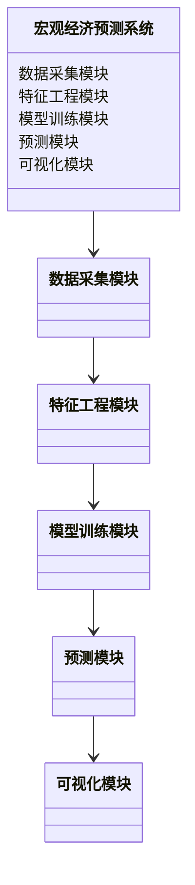
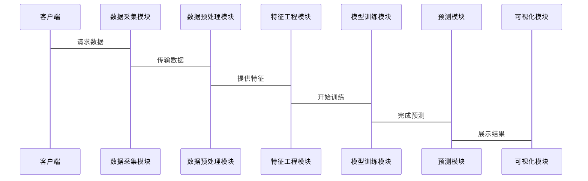

                 


# AI辅助的宏观经济指标预测与情景分析

## 关键词：宏观经济预测，人工智能，机器学习，深度学习，经济政策制定，数据科学

## 摘要：本文探讨了AI技术在宏观经济指标预测中的应用，分析了传统方法的局限性以及AI的优势，详细讲解了机器学习和深度学习算法的原理与实现，结合实际案例展示了系统架构设计与项目实战，并总结了最佳实践。

---

# 第1章: 宏观经济指标预测的背景与挑战

## 1.1 宏观经济指标的基本概念

### 1.1.1 宏观经济指标的定义
宏观经济指标是衡量一个国家或地区经济运行状况的关键数据，主要包括国内生产总值（GDP）、通货膨胀率、失业率、工业增加值等。

### 1.1.2 常见宏观经济指标的分类
- **总量指标**：如GDP、国民收入。
- **结构指标**：如产业构成比例。
- **价格指标**：如消费者价格指数（CPI）。
- **就业指标**：如失业率。

### 1.1.3 宏观经济指标在政策制定中的作用
宏观经济指标为政府制定货币政策、财政政策提供重要依据，帮助政府预测经济走势，优化资源配置。

---

## 1.2 AI技术在宏观经济分析中的应用背景

### 1.2.1 AI技术的发展与宏观经济分析的结合
AI技术，尤其是机器学习和深度学习，近年来在各个领域得到广泛应用，宏观经济分析也不例外。

### 1.2.2 宏观经济预测的传统方法与局限性
传统方法包括计量经济学模型和时间序列分析，但存在数据依赖性强、预测精度有限等问题。

### 1.2.3 AI在宏观经济预测中的优势
AI能够处理海量数据，发现复杂模式，提高预测精度和效率。

---

## 1.3 宏观经济指标预测的主要挑战

### 1.3.1 数据的复杂性与不确定性
宏观经济数据受多种因素影响，具有高度的复杂性和不确定性。

### 1.3.2 模型的可解释性问题
复杂的AI模型（如深度学习）通常缺乏可解释性，这在政策制定中是一个重要挑战。

### 1.3.3 数据隐私与伦理问题
宏观经济数据涉及国家安全和隐私保护，数据的合法使用和伦理问题需严格考虑。

---

## 1.4 本章小结
本章介绍了宏观经济指标的基本概念、AI技术的应用背景及其面临的挑战，为后续内容奠定了基础。

---

# 第2章: AI辅助宏观经济分析的核心概念

## 2.1 宏观经济指标预测的基本原理

### 2.1.1 宏观经济指标的生成机制
宏观经济指标的生成涉及多个经济活动，具有复杂的动态关系。

### 2.1.2 宏观经济预测的基本流程
包括数据收集、特征提取、模型训练、预测与评估。

### 2.1.3 宏观经济预测的评价指标
如均方误差（MSE）、平均绝对误差（MAE）、R²值等。

---

## 2.2 AI在宏观经济分析中的核心应用

### 2.2.1 机器学习在时间序列预测中的应用
常用算法包括ARIMA、LSTM等。

### 2.2.2 深度学习在宏观经济分析中的优势
深度学习能够捕捉非线性关系和长距离依赖。

### 2.2.3 自然语言处理在经济文本分析中的应用
通过NLP技术分析新闻、政策文件等文本数据，提取有用信息。

---

## 2.3 宏观经济指标预测的边界与外延

### 2.3.1 宏观经济预测的边界条件
数据的可用性、模型的适用性等。

### 2.3.2 宏观经济预测的外延领域
如金融市场的预测、区域经济分析等。

### 2.3.3 宏观经济预测与实际政策制定的关系
预测结果需结合实际情况进行调整，为政策制定提供参考。

---

## 2.4 核心概念的结构与组成

### 2.4.1 数据驱动的宏观经济预测模型
基于大数据的预测模型。

### 2.4.2 基于AI的宏观经济预测模型
结合机器学习和深度学习的模型。

### 2.4.3 综合模型的构建与优化
将不同模型的优势结合，优化预测结果。

---

## 2.5 本章小结
本章深入探讨了AI在宏观经济分析中的核心概念，分析了各种技术的应用及其优势。

---

# 第3章: 宏观经济指标预测的AI算法原理

## 3.1 机器学习算法在宏观经济预测中的应用

### 3.1.1 线性回归模型
线性回归是最简单的回归模型，用于预测连续型变量。

#### 3.1.1.1 线性回归的数学模型
$$ y = \beta_0 + \beta_1x_1 + \beta_2x_2 + \ldots + \beta_nx_n + \epsilon $$

#### 3.1.1.2 线性回归的实现步骤
1. 数据收集与预处理。
2. 模型训练与参数估计。
3. 模型评估与优化。

#### 3.1.1.3 优缺点
优点：简单易懂，计算高效；缺点：假设线性关系，可能不准确。

---

### 3.1.2 支持向量回归
支持向量回归（SVR）基于支持向量机（SVM）思想，适用于非线性关系。

#### 3.1.2.1 SVR的数学模型
$$ y = \text{sign}(w \cdot x + b) $$

#### 3.1.2.2 优缺点
优点：能处理非线性关系；缺点：计算复杂度较高。

---

### 3.1.3 随机森林回归
随机森林通过集成学习，提高了模型的泛化能力。

#### 3.1.3.1 随机森林的实现步骤
1. 生成多棵决策树。
2. 集成预测结果，取平均值。

#### 3.1.3.2 优缺点
优点：抗过拟合，稳定性高；缺点：解释性较差。

---

## 3.2 深度学习算法在宏观经济预测中的应用

### 3.2.1 循序神经网络（RNN）
RNN适用于时间序列数据的预测。

#### 3.2.1.1 RNN的工作原理
RNN通过处理序列数据，捕捉时间依赖关系。

#### 3.2.1.2 长短期记忆网络（LSTM）
LSTM通过记忆单元，解决RNN的梯度消失问题。

#### 3.2.1.3 LSTM的数学模型
$$ \text{LSTM}(t) = \text{激活}(W_{xh}x_t + W_{hh}h_{t-1} + b_h) $$

---

## 3.3 算法比较与选择

### 3.3.1 不同算法的性能对比
| 算法 | 优点 | 缺点 |
|------|------|------|
| 线性回归 | 简单高效 | 易受多重共线性影响 |
| SVR | 高精度 | 计算复杂 |
| 随机森林 | 抗过拟合 | 解释性差 |
| RNN/LSTM | 捕捉时间依赖 | 需大量数据 |

### 3.3.2 根据需求选择算法
根据数据类型、预测精度、计算资源等因素选择合适的算法。

---

## 3.4 本章小结
本章详细讲解了机器学习和深度学习算法在宏观经济预测中的应用，分析了不同算法的优缺点。

---

# 第4章: 宏观经济指标预测的系统分析与架构设计

## 4.1 问题场景介绍
宏观经济预测系统需要处理大量数据，提供实时预测和情景分析。

## 4.2 系统功能设计

### 4.2.1 领域模型（Mermaid类图）


---

## 4.3 系统架构设计（Mermaid架构图）


---

## 4.4 系统接口设计
- 数据输入接口：接收实时数据。
- 预测接口：返回预测结果。
- 可视化接口：展示预测结果。

---

## 4.5 系统交互流程（Mermaid序列图）



---

## 4.6 本章小结
本章设计了一个宏观经济预测系统的架构，并详细描述了各模块的交互流程。

---

# 第5章: 宏观经济指标预测的项目实战

## 5.1 环境配置
- 操作系统：Linux/Windows/MacOS
- Python版本：3.8+
- 依赖库：NumPy, Pandas, Scikit-learn, Keras, TensorFlow

---

## 5.2 系统核心实现源代码

### 5.2.1 数据处理代码
```python
import pandas as pd
import numpy as np

# 加载数据
data = pd.read_csv('economic_indicators.csv')

# 数据预处理
data = data.dropna()
data = (data - data.mean()) / data.std()
```

---

### 5.2.2 模型训练代码
```python
from sklearn.ensemble import RandomForestRegressor
from sklearn.metrics import mean_squared_error

# 特征工程
X = data.drop(columns=['target'])
y = data['target']

# 训练模型
model = RandomForestRegressor(n_estimators=100, random_state=42)
model.fit(X, y)

# 预测
y_pred = model.predict(X)
print(mean_squared_error(y, y_pred))
```

---

### 5.2.3 结果可视化代码
```python
import matplotlib.pyplot as plt

plt.figure(figsize=(10, 6))
plt.plot(y, label='真实值')
plt.plot(y_pred, label='预测值')
plt.legend()
plt.show()
```

---

## 5.3 项目小结
本章通过一个实际案例，详细展示了宏观经济预测系统的实现过程，包括数据处理、模型训练和结果可视化。

---

# 第6章: 最佳实践与总结

## 6.1 小结
AI技术在宏观经济预测中具有显著优势，但也面临可解释性和数据隐私等挑战。

## 6.2 注意事项
- 数据质量至关重要。
- 模型选择需结合实际需求。
- 注意数据隐私和伦理问题。

## 6.3 拓展阅读
- 《机器学习实战》
- 《深度学习》
- 《宏观经济预测的艺术》

---

# 作者：AI天才研究院 & 禅与计算机程序设计艺术

