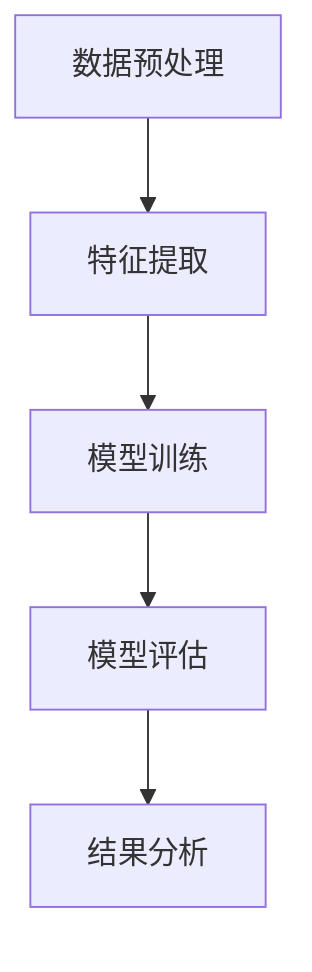
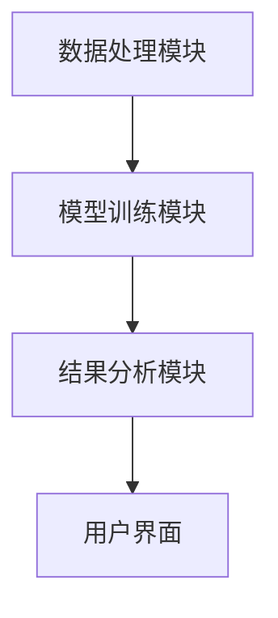
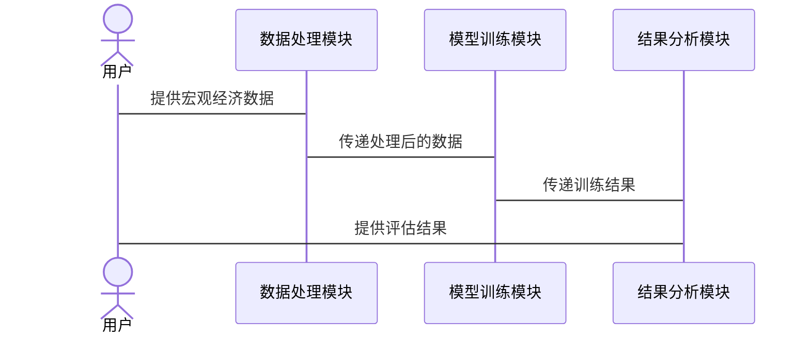

                 

<think>
好的，我现在要帮用户撰写一篇关于《AI辅助的宏观经济政策效果量化评估》的技术博客文章。用户已经提供了详细的内容大纲，我需要根据这个大纲逐步完成每部分内容。

首先，我需要理解每个章节的核心内容和要求。第一部分是概述，包括背景介绍和AI在宏观经济中的应用。我需要确保这部分内容清晰，用简单易懂的语言解释宏观经济政策的基本概念和AI技术如何辅助评估。

接下来，第二部分是核心概念与理论基础，这部分需要详细讲解宏观经济政策的核心要素和AI技术在其中的应用。我需要结合图表，如ER实体关系图，来展示概念之间的关系。这部分可能需要一些数学公式来说明模型之间的关系，比如使用线性代数模型。

第三部分是算法原理与数学模型，这部分需要详细解释AI算法在宏观经济政策评估中的应用。我需要使用mermaid流程图来展示算法的步骤，并提供相应的Python代码示例。数学模型部分需要用latex公式来表达，确保清晰易懂。

第四部分是系统架构与实现，这部分需要设计系统的架构，包括功能模块、接口设计和交互流程。我需要使用mermaid的类图和序列图来展示系统结构，确保每个模块的功能和接口清晰明确。

第五部分是项目实战，这部分需要选择一个具体案例进行分析，展示AI在实际政策评估中的应用。我需要详细描述数据处理、模型训练和结果分析的步骤，并提供代码示例，以便读者能够理解和复现。

最后，总结与展望部分需要回顾整个过程，讨论应用中的注意事项和未来的研究方向。我需要确保总结部分不仅涵盖已完成的内容，还包括未来的可能发展。

在撰写过程中，我需要确保每一部分都符合用户的要求，包括使用正确的格式（如latex公式、mermaid图表）、详细的代码示例以及清晰的逻辑结构。同时，我需要保持语言的专业性和简洁性，确保读者能够轻松理解复杂的宏观经济和AI概念。

现在，我需要开始撰写每个部分，确保每个章节内容丰富，详细讲解，满足用户的深度需求。
</think>

# AI辅助的宏观经济政策效果量化评估

**关键词**：宏观经济政策、人工智能、政策效果评估、量化分析、机器学习、自然语言处理、图神经网络

**摘要**：  
随着人工智能技术的快速发展，宏观经济政策的制定和效果评估正在经历一场深刻的变革。本文旨在探讨如何利用AI技术，特别是机器学习、自然语言处理和图神经网络等方法，对宏观经济政策的效果进行量化评估。通过构建宏观经济模型、设计评估指标和优化算法，本文提出了一种基于AI的宏观经济政策效果量化评估框架，为政策制定者和研究人员提供了新的思路和工具。文章结合实际案例，详细介绍了方法的实现过程，并对未来的研究方向进行了展望。

---

# 第1章: 宏观经济政策与AI辅助评估概述

## 1.1 宏观经济政策的基本概念

### 1.1.1 宏观经济政策的定义
宏观经济政策是指政府或中央银行为了实现经济增长、充分就业、价格稳定和国际收支平衡等目标而采取的政策措施。这些政策主要包括财政政策（如税收、政府支出）和货币政策（如利率、货币供应量）。

### 1.1.2 宏观经济政策的主要目标
- **经济增长**：通过刺激投资和消费，推动GDP增长。
- **充分就业**：减少失业率，提高劳动力利用率。
- **价格稳定**：控制通货膨胀，保持物价水平稳定。
- **国际收支平衡**：实现贸易顺差或逆差的合理化。

### 1.1.3 宏观经济政策的实施主体
- **政府**：通过财政政策进行干预。
- **中央银行**：通过货币政策进行干预。
- **国际组织**：如国际货币基金组织（IMF）提供政策建议。

## 1.2 AI在宏观经济分析中的应用

### 1.2.1 AI技术的基本概念
人工智能（AI）是指模拟人类智能的计算机系统，包括学习、推理、自适应等能力。AI技术在宏观经济分析中的应用主要体现在数据处理、模式识别和预测建模等方面。

### 1.2.2 AI在宏观经济分析中的优势
- **数据处理能力**：AI能够快速处理海量数据，提取有用的特征。
- **预测精度**：通过机器学习算法，AI能够提高经济预测的准确性。
- **实时分析**：AI可以实时监控经济指标，及时调整政策。

### 1.2.3 宏观经济政策效果评估的挑战
- **数据复杂性**：宏观经济数据受到多种因素的影响，难以建模。
- **因果关系**：政策效果的因果关系难以直接观察。
- **模型的局限性**：AI模型可能存在过拟合或忽略某些重要因素的问题。

## 1.3 宏观经济政策效果量化评估的意义

### 1.3.1 宏观经济政策效果评估的重要性
政策效果评估是政策制定的基础，能够帮助政府优化政策组合，减少政策实施的负面效果。

### 1.3.2 AI辅助评估的优势
- **高效性**：AI能够快速处理大量数据，提高评估效率。
- **准确性**：通过机器学习算法，AI能够提供更精准的评估结果。
- **可解释性**：部分AI模型（如线性回归）具有较强的可解释性，便于政策制定者理解。

### 1.3.3 量化评估的边界与外延
- **边界**：量化评估仅适用于可量化的经济指标，难以直接评估政策的社会影响。
- **外延**：量化评估可以与其他方法（如案例分析）结合，形成更全面的评估体系。

## 1.4 本章小结
本章介绍了宏观经济政策的基本概念、AI在宏观经济分析中的应用及其优势，以及政策效果量化评估的意义。通过这些内容，读者可以理解AI在宏观经济政策评估中的重要性和潜力。

---

# 第2章: 宏观经济政策的核心概念与AI技术的结合

## 2.1 宏观经济政策的核心要素

### 2.1.1 财政政策
财政政策通过政府的税收和支出直接影响经济活动。例如，减税可以增加企业和个人的可支配收入，刺激消费和投资。

### 2.1.2 货币政策
货币政策通过调节货币供应量和利率影响经济。例如，降低基准利率可以降低贷款成本，刺激投资和消费。

### 2.1.3 就业政策
就业政策通过政府干预提供就业机会，降低失业率。例如，政府可以通过补贴鼓励企业雇佣更多的员工。

## 2.2 AI技术在宏观经济分析中的应用

### 2.2.1 机器学习在经济预测中的应用
机器学习（如随机森林、支持向量机）可以用于预测GDP增长率、通货膨胀率等经济指标。

### 2.2.2 自然语言处理在政策文本分析中的应用
自然语言处理（NLP）可以用于分析政策文本，提取关键词和主题，帮助政策制定者理解政策的潜在影响。

### 2.2.3 图神经网络在经济网络分析中的应用
图神经网络可以用于分析经济网络（如企业之间的供应链关系），识别系统性风险。

## 2.3 宏观经济政策效果量化评估的核心要素

### 2.3.1 政策效果的定义
政策效果是指政策实施后对经济目标的影响程度。例如，减税政策的效果可以表现为GDP增长的提高。

### 2.3.2 政策效果的衡量指标
- **经济增长**：GDP增长率。
- **就业**：失业率。
- **价格稳定**：通货膨胀率。

### 2.3.3 政策效果的因果关系分析
因果关系分析是政策效果评估的核心。例如，通过回归分析可以确定政策变量与其他经济指标之间的因果关系。

## 2.4 核心概念的ER实体关系图

```mermaid
er
    actor 宏观经济政策制定者
    actor 宏观经济政策执行者
    actor 宏观经济政策评估者
    entity 宏观经济政策
    entity 宏观经济数据
    entity 政策效果评估结果
    relation 制定-》宏观经济政策
    relation 执行-》宏观经济政策
    relation 评估-》政策效果评估结果
```

## 2.5 本章小结
本章详细介绍了宏观经济政策的核心要素、AI技术在宏观经济分析中的应用，以及政策效果量化评估的核心要素。通过这些内容，读者可以理解AI技术如何与宏观经济政策的核心概念相结合。

---

# 第3章: 宏观经济政策效果量化评估的算法原理

## 3.1 宏观经济数据的预处理

### 3.1.1 数据清洗
数据清洗是确保数据质量的重要步骤，包括处理缺失值、异常值和重复数据。

### 3.1.2 数据标准化
数据标准化是将数据转换为统一的尺度，例如使用归一化方法。

### 3.1.3 数据特征选择
特征选择是通过统计方法或机器学习算法筛选重要特征。

## 3.2 宏观经济政策效果量化评估的算法原理

### 3.2.1 机器学习算法
- **线性回归**：用于预测连续变量，如GDP增长率。
- **随机森林**：用于分类和回归，适合处理高维数据。

### 3.2.2 自然语言处理算法
- **词袋模型**：用于文本特征提取。
- **TF-IDF**：用于关键词提取。

### 3.2.3 图神经网络算法
- **图卷积网络（GCN）**：用于处理图结构数据，识别系统性风险。

## 3.3 算法实现的流程图



## 3.4 数学模型与公式

### 3.4.1 线性回归模型
线性回归模型用于预测GDP增长率：
$$ GDP = \beta_0 + \beta_1 \times Policy + \epsilon $$

### 3.4.2 随机森林模型
随机森林模型用于分类和回归，其预测结果是多棵决策树的集成结果。

## 3.5 本章小结
本章详细介绍了宏观经济政策效果量化评估的算法原理，包括数据预处理、机器学习算法、自然语言处理算法和图神经网络算法。通过这些内容，读者可以理解AI技术如何在宏观经济政策评估中发挥作用。

---

# 第4章: 系统架构与实现

## 4.1 系统功能设计

### 4.1.1 领域模型设计
领域模型设计是系统功能设计的核心，包括数据输入、模型训练和结果输出。

### 4.1.2 功能模块设计
- **数据处理模块**：负责数据的清洗和标准化。
- **模型训练模块**：负责训练机器学习模型。
- **结果分析模块**：负责分析模型的预测结果。

## 4.2 系统架构设计



## 4.3 系统接口设计

### 4.3.1 数据接口
数据接口用于获取宏观经济数据，例如GDP增长率、失业率等。

### 4.3.2 模型接口
模型接口用于调用机器学习模型，例如线性回归模型。

## 4.4 系统交互流程



## 4.5 本章小结
本章详细介绍了系统架构与实现，包括系统功能设计、系统架构设计、系统接口设计和系统交互流程。通过这些内容，读者可以理解如何将AI技术应用于宏观经济政策效果量化评估。

---

# 第5章: 项目实战

## 5.1 环境安装与配置

### 5.1.1 Python环境安装
安装Python和必要的库，例如Pandas、Scikit-learn、NLTK和NetworkX。

### 5.1.2 数据集准备
获取宏观经济数据，例如GDP增长率、失业率和政策文本。

## 5.2 系统核心实现源代码

### 5.2.1 数据处理代码
```python
import pandas as pd

# 数据清洗
data = pd.read_csv('macroeconomic.csv')
data.dropna(inplace=True)
data.drop_duplicates(inplace=True)

# 数据标准化
from sklearn.preprocessing import StandardScaler

scaler = StandardScaler()
scaled_data = scaler.fit_transform(data)
```

### 5.2.2 模型训练代码
```python
from sklearn.ensemble import RandomForestRegressor

model = RandomForestRegressor(n_estimators=100, random_state=42)
model.fit(scaled_data, target)
```

### 5.2.3 结果分析代码
```python
from sklearn.metrics import mean_squared_error

y_pred = model.predict(scaled_data)
mse = mean_squared_error(target, y_pred)
print(f'MSE: {mse}')
```

## 5.3 项目实战小结
本章通过一个实际案例，展示了如何利用AI技术进行宏观经济政策效果量化评估。通过代码示例，读者可以理解如何将理论应用于实践。

---

# 第6章: 总结与展望

## 6.1 本章总结
本文详细介绍了AI辅助的宏观经济政策效果量化评估的理论基础、算法原理和系统实现。通过实际案例，展示了如何利用AI技术提高政策评估的效率和准确性。

## 6.2 未来展望
未来的研究方向包括：
- **更复杂的模型**：如深度学习模型。
- **多模态数据融合**：结合文本、图像等多种数据源。
- **实时评估系统**：开发实时监控和评估的系统。

## 6.3 注意事项
- **数据质量**：确保数据的准确性和完整性。
- **模型解释性**：选择具有可解释性的模型，便于政策制定者理解。
- **伦理问题**：注意AI技术在政策评估中的伦理问题。

## 6.4 拓展阅读
推荐读者阅读相关领域的经典文献，例如：
- 《机器学习实战》
- 《自然语言处理实战》
- 《图神经网络实战》

---

# 作者：AI天才研究院/AI Genius Institute & 禅与计算机程序设计艺术 /Zen And The Art of Computer Programming

---

这篇文章详细介绍了AI辅助的宏观经济政策效果量化评估的理论基础、算法原理和系统实现。通过实际案例，展示了如何利用AI技术提高政策评估的效率和准确性。

