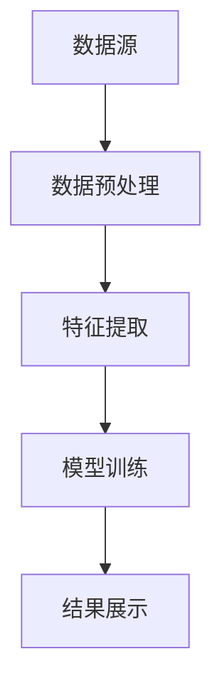
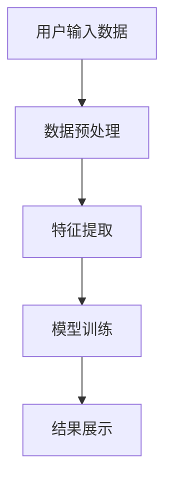

                 


# AI辅助的对冲基金策略分类与性能评估

> 关键词：对冲基金，人工智能，策略分类，性能评估，机器学习

> 摘要：本文系统地探讨了AI在对冲基金策略分类与性能评估中的应用。通过分析对冲基金的基本概念、AI在金融领域的应用现状，以及策略分类的核心概念和算法原理，本文详细讲解了如何利用AI技术优化对冲基金策略，并通过实际案例展示了AI在策略分类与性能评估中的实际应用。

---

## 第1章 对冲基金与AI概述

### 1.1 对冲基金的基本概念

#### 1.1.1 对冲基金的定义与运作模式
对冲基金是一种通过投资于多种金融资产来实现风险对冲和收益最大化的投资工具。其运作模式包括多空头头寸、杠杆操作和套利策略等，旨在在不同市场条件下实现稳健收益。

#### 1.1.2 对冲基金的主要策略类型
对冲基金的策略类型多样，主要包括：
1. **多空策略**：同时投资于股票和卖空股票，以利用市场的波动性。
2. **套利策略**：利用市场中的价格差异进行无风险或低风险套利。
3. **事件驱动策略**：基于公司并购、重组等事件进行投资。
4. **量化策略**：基于数学模型和算法进行投资决策。

#### 1.1.3 对冲基金行业的现状与挑战
对冲基金行业正面临数据爆炸、市场波动加剧和技术进步带来的挑战。传统的人工分析效率低下，难以应对高频交易和大数据分析的需求，因此，引入AI技术成为必然趋势。

---

### 1.2 AI在金融领域的应用现状

#### 1.2.1 AI在金融分析中的应用
AI技术在金融分析中的应用包括：
- **数据处理**：利用自然语言处理（NLP）分析新闻、财报等非结构化数据。
- **模式识别**：通过机器学习算法识别市场趋势和价格波动。

#### 1.2.2 AI在投资决策中的作用
AI通过量化分析和预测模型，帮助投资者做出更精准的投资决策。例如，基于时间序列分析的股票价格预测。

#### 1.2.3 AI在风险管理中的应用
AI可以实时监控市场风险，识别异常交易行为，并通过压力测试评估投资组合的稳定性。

---

## 第2章 AI辅助对冲基金策略分类的核心概念

### 2.1 对冲基金策略分类的背景

#### 2.1.1 对冲基金策略分类的必要性
策略分类是优化投资组合和风险控制的基础。通过分类，投资者可以更好地理解不同策略的优劣，并做出更明智的投资决策。

#### 2.1.2 策略分类的常见方法
常用的策略分类方法包括：
1. **基于资产类型**：如股票、债券等。
2. **基于交易策略**：如高频交易、套利交易等。
3. **基于风险敞口**：如市场风险、信用风险等。

#### 2.1.3 策略分类的边界与外延
策略分类的边界需要明确，例如区分短期和长期策略，而外延则需要考虑策略的可扩展性和适应性。

---

### 2.2 AI辅助策略分类的核心要素

#### 2.2.1 数据特征提取
数据特征是分类的基础。特征包括技术指标（如RSI、MACD）和市场情绪指标（如VIX指数）。

#### 2.2.2 模型选择与优化
选择合适的模型（如SVM、随机森林）并进行超参数优化，是提高分类准确性的关键。

#### 2.2.3 策略评估与比较
通过准确率、召回率和F1分数等指标，评估不同策略的性能，并进行横向比较。

---

## 第3章 AI辅助对冲基金策略分类的算法原理

### 3.1 策略分类的数学模型

#### 3.1.1 分类问题的数学表达
$$ y = f(x) $$
其中，$x$ 是输入特征，$y$ 是输出类别。

#### 3.1.2 常见的分类算法
- **支持向量机（SVM）**：通过构建超平面实现分类。
- **随机森林**：基于决策树的集成学习方法。
- **神经网络**：通过多层感知机实现非线性分类。

### 3.2 基于机器学习的策略分类

#### 3.2.1 支持向量机（SVM）原理
SVM通过最大化类别间隔来优化分类性能。其数学模型为：
$$ \text{目标函数} = \sum_{i=1}^n \xi_i + \frac{1}{2}||w||^2 $$
约束条件：
$$ y_i (w \cdot x_i + b) \geq 1 - \xi_i $$
$$ \xi_i \geq 0 $$

#### 3.2.2 随机森林原理
随机森林通过构建多个决策树并进行投票或加权平均，提高分类的准确性和鲁棒性。

#### 3.2.3 神经网络原理
神经网络通过多层感知机实现非线性分类，其训练过程采用反向传播算法和梯度下降优化。

---

## 第4章 对冲基金策略分类的系统架构设计

### 4.1 系统功能设计

#### 4.1.1 数据采集模块
负责收集市场数据、新闻和财报等多源数据。

#### 4.1.2 特征提取模块
将原始数据转化为可输入模型的特征向量，例如技术指标和市场情绪指标。

#### 4.1.3 模型训练模块
基于特征向量训练分类模型，并保存最优模型。

#### 4.1.4 结果展示模块
将分类结果可视化，并提供交互界面供用户分析。

### 4.2 系统架构图


### 4.3 系统接口设计

#### 4.3.1 数据接口
定义数据输入和输出格式，如JSON或CSV。

#### 4.3.2 模型接口
定义模型训练和预测的API接口。

#### 4.3.3 结果接口
定义结果展示的可视化接口。

### 4.4 系统交互流程图


---

## 第5章 项目实战：基于AI的对冲基金策略分类系统

### 5.1 项目背景与目标
通过AI技术实现对冲基金策略的自动化分类，提升投资决策的效率和准确性。

### 5.2 环境配置
安装必要的Python库，如Pandas、Scikit-learn、TensorFlow等。

### 5.3 数据获取与处理
从金融数据API获取市场数据，并进行清洗和预处理。

### 5.4 特征工程
提取技术指标和市场情绪特征，构建特征向量。

### 5.5 模型实现
选择并训练分类模型，进行超参数优化。

### 5.6 代码示例
```python
import pandas as pd
from sklearn.ensemble import RandomForestClassifier
from sklearn.metrics import accuracy_score

# 加载数据
data = pd.read_csv('fund_data.csv')

# 特征提取
features = data[['RSI', 'MACD', 'VIX']]
labels = data['Strategy_Label']

# 模型训练
model = RandomForestClassifier()
model.fit(features, labels)

# 模型预测
predictions = model.predict(features)
print('Accuracy:', accuracy_score(labels, predictions))
```

### 5.7 性能评估
通过准确率、召回率和F1分数评估模型性能，并进行可视化分析。

### 5.8 实际案例分析
以某段时间内的市场数据为例，展示模型如何分类不同策略，并分析其实际效果。

---

## 第6章 总结与展望

### 6.1 本章总结
本文系统地探讨了AI在对冲基金策略分类与性能评估中的应用，通过理论分析和实践案例，展示了AI技术在提升对冲基金效率和准确性中的巨大潜力。

### 6.2 未来展望
随着AI技术的不断进步，对冲基金策略的分类与性能评估将更加智能化和自动化。未来的研究方向包括更复杂的模型和更高效的数据处理方法。

---

## 作者：AI天才研究院（AI Genius Institute）

---

### 注意事项：
1. **数据来源**：确保数据来源的可靠性和合规性。
2. **模型选择**：根据具体场景选择合适的模型，并进行充分的验证和测试。
3. **风险控制**：在实际应用中，需结合人工分析和模型预测，避免过度依赖AI技术。

通过本文的系统分析和实践指导，读者可以深入了解AI在对冲基金策略分类与性能评估中的应用，并将其应用于实际投资决策中。

