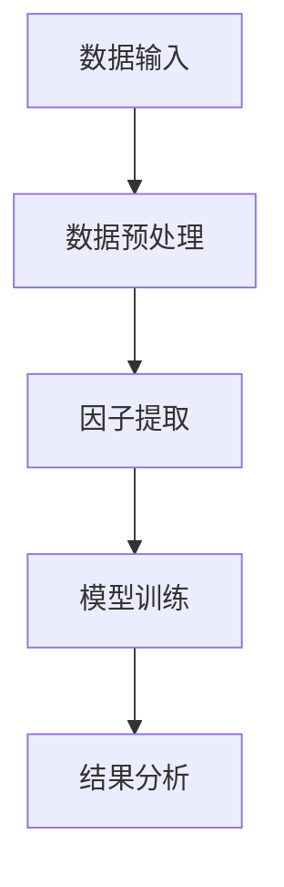
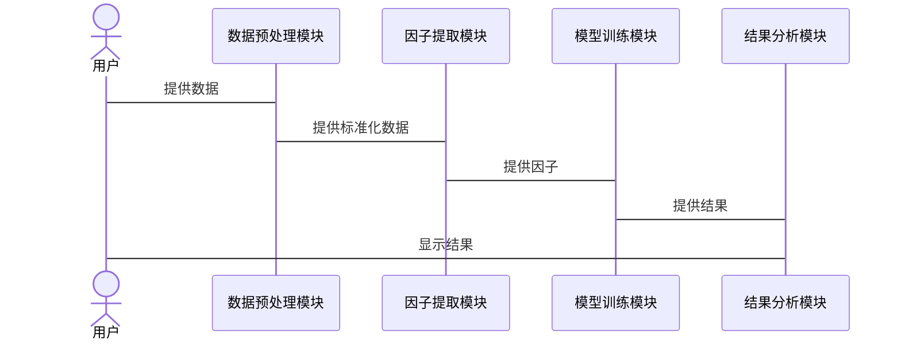

                 

<think>
好的，我现在要帮助用户完成一个技术博客文章的撰写。用户希望文章的标题是《AI辅助的对冲基金绩效归因》，并提供了详细的大纲和一些内容示例。我需要按照用户的要求，逐步思考如何组织和撰写这篇文章。

首先，我会从背景介绍开始。我需要解释什么是对冲基金，绩效归因的重要性，以及AI技术在这一领域的应用。这部分要让读者明白为什么AI在对冲基金绩效归因中是必要的，以及它带来的优势。

接下来，我会详细讲解绩效归因的理论基础，包括CAPM模型和APT模型。我需要比较这两种模型的优缺点，并引入AI技术在这些模型中的应用。这部分可能需要使用一些数学公式，比如CAPM中的β系数计算，可以用LaTeX来展示。

然后，我会进入AI技术的原理部分。首先介绍因子分解模型，使用矩阵分解的方法来分析绩效归因，这可能涉及SVD算法。接着，我会讨论机器学习模型，如随机森林和神经网络，并展示它们如何用于预测和归因。这部分需要有流程图和代码示例，帮助读者理解实现过程。

接下来，我会讨论系统架构设计。这部分需要展示系统的各个模块，如数据预处理、模型训练、结果分析和可视化。使用Mermaid图表来展示系统架构图和交互流程，让读者能够直观理解系统的工作方式。

在项目实战部分，我会提供一个具体的案例，从环境安装到代码实现，再到结果分析。这部分需要详细说明每一步的操作，并提供Python代码，帮助读者实际操作。

最后，我会总结整个内容，给出最佳实践的建议，帮助读者在实际应用中避免常见错误，并提供进一步的学习资源。

在整个过程中，我需要确保每个部分都细化到三级目录，并且内容完整。同时，要保持语言的简洁和逻辑的清晰，让读者能够轻松理解并跟随内容学习。

总结一下，我会按照用户提供的大纲，逐步填充每个部分的内容，确保涵盖背景介绍、核心概念、算法原理、系统架构、项目实战和最佳实践，每个部分都详细且结构清晰，帮助读者全面掌握AI辅助的对冲基金绩效归因的相关知识和技能。
</think>

# AI辅助的对冲基金绩效归因

## 关键词：
对冲基金、绩效归因、人工智能、机器学习、因子分解模型

## 摘要：
本文探讨了AI技术在对冲基金绩效归因中的应用，从理论基础到算法实现，再到系统架构设计，详细分析了如何利用AI技术提高绩效归因的准确性和效率。通过实际案例和代码实现，展示了AI在金融分析中的潜力和优势。

---

## 第一部分: AI辅助的对冲基金绩效归因背景介绍

## 第1章: 对冲基金与绩效归因概述

### 1.1 对冲基金的基本概念
#### 1.1.1 对冲基金的定义与特点
对冲基金是一种通过多种金融工具进行投资的基金，旨在通过套利、做空等策略实现绝对收益。其特点包括：
- 多空策略：同时做多和做空，以捕捉市场中的套利机会。
- 杠杆使用：通过杠杆放大收益或风险。
- 多样化投资：分散投资于不同资产类别和市场。
- 低相关性：与传统资产如股票和债券的相关性较低。

#### 1.1.2 对冲基金的运作模式
对冲基金通过多种策略实现收益，常见的策略包括：
- 股票多空策略：通过买入低估股票和卖出高估股票获利。
- 债券套利策略：利用债券市场的价格差异进行套利。
- 事件驱动策略：基于公司并购、重组等事件进行投资。
- 多因子策略：基于多个因子（如价值、动量、成长等）进行投资。

#### 1.1.3 对冲基金的分类与应用场景
对冲基金可以根据策略类型、管理规模、投资地域等进行分类。常见类型包括：
- 股票多空基金：主要投资于股票市场。
- 债券套利基金：专注于债券市场的套利机会。
- 量化对冲基金：基于量化模型进行投资决策。
- 国际对冲基金：投资于全球市场，分散风险。

对冲基金的应用场景包括：
- 机构投资者：通过配置对冲基金降低投资组合的波动性。
- 高净值个人：追求绝对收益。
- 保险资金：通过对冲基金实现风险对冲。

### 1.2 绩效归因的核心概念
#### 1.2.1 绩效归因的定义与意义
绩效归因是对冲基金绩效分析的重要组成部分，旨在将基金的超额收益分解为各个因子或策略的贡献。其意义在于：
- 识别优劣策略：通过分析不同策略的贡献，优化投资组合。
- 评估风险敞口：了解基金在不同市场环境下的风险暴露。
- 提供决策依据：为投资决策提供数据支持。

#### 1.2.2 绩效归因的常见方法与挑战
常见的绩效归因方法包括：
- 因子分解模型：将基金收益分解为多个因子的贡献。
- APT模型：基于多个因子进行收益分解。
- 置信区间法：通过统计方法评估因子贡献的显著性。

挑战包括：
- 数据质量：需要高质量的历史数据。
- 模型选择：选择合适的因子和模型。
- 计算复杂性：涉及复杂的矩阵运算和优化问题。

#### 1.2.3 绩效归因的边界与外延
绩效归因的边界包括：
- 时间范围：通常关注一定时间段内的收益分解。
- 因子选择：需要选择合适的因子进行分解。

外延包括：
- 风险管理：通过绩效归因优化风险控制。
- 投资决策：基于归因结果优化投资策略。
- 业绩评估：帮助评估投资经理的绩效。

### 1.3 AI技术在金融领域的应用前景
#### 1.3.1 AI在金融分析中的优势
AI技术在金融分析中的优势包括：
- 大数据分析能力：能够处理海量数据。
- 高效计算能力：快速完成复杂计算。
- 自适应学习能力：能够根据市场变化自适应调整。

#### 1.3.2 AI在对冲基金中的潜在应用
AI在对冲基金中的潜在应用包括：
- 自动化交易：基于AI算法进行高频交易。
- 风险管理：利用AI模型实时监控风险。
- 绩效归因：通过AI技术优化绩效分解。

#### 1.3.3 AI辅助绩效归因的创新点
AI辅助绩效归因的创新点包括：
- 高效计算：利用AI技术快速分解因子贡献。
- 多因子模型：基于机器学习构建复杂的因子模型。
- 实时分析：实现对实时数据的动态分解。

---

## 第2章: 绩效归因的理论基础

### 2.1 资本资产定价模型（CAPM）
CAPM是一种用于计算资产期望收益的模型，其公式为：
$$ E(R_i) = R_f + \beta_i (R_m - R_f) $$
其中：
- $E(R_i)$：资产i的期望收益。
- $R_f$：无风险利率。
- $\beta_i$：资产i的贝塔系数。
- $R_m$：市场预期收益。

CAPM的核心思想是，资产的期望收益与其系统性风险（β系数）成正比。在对冲基金绩效归因中，CAPM可以用于分解市场风险和特定风险。

### 2.2 Arbitrage Pricing Theory (APT)
APT是一种多因子定价模型，其公式为：
$$ E(R_i) = R_f + \sum_{j=1}^n \lambda_j \beta_{ij} $$
其中：
- $R_i$：资产i的预期收益。
- $\lambda_j$：因子j的风险溢价。
- $\beta_{ij}$：资产i对因子j的暴露程度。

APT允许投资者选择多个因子来解释资产收益，适用于复杂的对冲基金绩效分析。

### 2.3 因子分解模型
因子分解模型通过将资产收益分解为多个因子的线性组合，以识别不同因子对收益的贡献。常用的方法包括主成分分析（PCA）和因子分析。

#### 2.3.1 主成分分析（PCA）
PCA是一种统计方法，用于将数据降维并提取主要因子。其步骤包括：
1. 标准化数据。
2. 计算协方差矩阵。
3. 求解特征值和特征向量。
4. 选择主成分。

#### 2.3.2 因子分析
因子分析通过构建因子模型，将观测变量分解为潜在因子。其步骤包括：
1. 确定因子数量。
2. 计算因子载荷。
3. 估计因子得分。

---

## 第3章: AI技术在绩效归因中的应用

### 3.1 因子分解模型
因子分解模型通过矩阵分解技术分解资产收益矩阵，提取主要因子。常用的方法包括奇异值分解（SVD）和非负矩阵分解（NMF）。

#### 3.1.1 奇异值分解（SVD）
SVD是一种矩阵分解技术，可以将矩阵分解为三个低秩矩阵的乘积。其公式为：
$$ X = U \Sigma V^T $$
其中：
- $X$：数据矩阵。
- $U$、$V$：正交矩阵。
- $\Sigma$：对角矩阵。

SVD常用于提取数据中的主成分。

#### 3.1.2 非负矩阵分解（NMF）
NMF是一种分解矩阵为非负因子的方法，适用于处理非负数据。其目标是最小化：
$$ \min_{W,H} \|X - WH\|_F^2 \quad \text{subject to} \quad W, H \geq 0 $$

NMF常用于主题建模和图像分析。

### 3.2 机器学习模型
机器学习模型通过训练数据学习特征，实现对收益的预测和分解。

#### 3.2.1 随机森林
随机森林是一种基于树的集成方法，适用于特征重要性分析。其步骤包括：
1. 生成多个决策树。
2. 对每个样本进行投票或平均。
3. 计算特征重要性。

#### 3.2.2 神经网络
神经网络通过多层感知机模拟非线性关系，适用于复杂的因子分解。其步骤包括：
1. 构建神经网络模型。
2. 训练模型。
3. 预测因子贡献。

---

## 第4章: 系统架构设计

### 4.1 系统功能设计
系统功能包括：
1. 数据预处理：清洗和标准化数据。
2. 因子提取：使用SVD或NMF提取因子。
3. 模型训练：训练随机森林或神经网络。
4. 结果分析：计算因子贡献。

### 4.2 系统架构图


### 4.3 系统接口设计
系统接口包括：
1. 数据接口：读取和写入数据。
2. 模型接口：调用因子提取和模型训练模块。
3. 结果接口：输出因子贡献。

### 4.4 系统交互流程


---

## 第5章: 项目实战

### 5.1 环境安装
需要安装的Python包包括：
- NumPy
- Pandas
- Scikit-learn
- Keras
- Mermaid

### 5.2 代码实现
#### 5.2.1 数据预处理
```python
import numpy as np
import pandas as pd

# 读取数据
data = pd.read_csv('returns.csv')

# 标准化数据
from sklearn.preprocessing import StandardScaler
scaler = StandardScaler()
data_scaled = pd.DataFrame(scaler.fit_transform(data), columns=data.columns)
```

#### 5.2.2 因子提取
```python
# 使用SVD分解
from sklearn.decomposition import TruncatedSVD
svd = TruncatedSVD(n_components=3)
svd.fit(data_scaled)
components = svd.transform(data_scaled)
```

#### 5.2.3 模型训练
```python
# 训练随机森林
from sklearn.ensemble import RandomForestRegressor
model = RandomForestRegressor()
model.fit(components, data['returns'])
```

#### 5.2.4 结果分析
```python
# 提取因子贡献
importances = model.feature_importances_
```

### 5.3 案例分析
通过实际案例分析，展示如何使用AI技术分解因子贡献。

### 5.4 项目小结
总结项目实现过程中的经验和教训。

---

## 第6章: 最佳实践与总结

### 6.1 最佳实践
1. 数据预处理：确保数据质量。
2. 模型选择：根据数据特点选择合适的方法。
3. 结果验证：通过回测验证模型的有效性。

### 6.2 小结
AI技术在对冲基金绩效归因中的应用前景广阔，能够显著提高分析效率和准确性。

### 6.3 注意事项
- 数据隐私：注意数据的隐私保护。
- 模型鲁棒性：确保模型的鲁棒性。
- 持续优化：定期更新模型和数据。

### 6.4 拓展阅读
推荐相关书籍和论文，供读者深入学习。

---

## 作者
作者：AI天才研究院 & 禅与计算机程序设计艺术

---

以上是《AI辅助的对冲基金绩效归因》的技术博客文章的大纲和部分内容，涵盖了从背景介绍到系统实现的各个方面，结合理论与实践，详细讲解了AI技术在对冲基金绩效归因中的应用。

