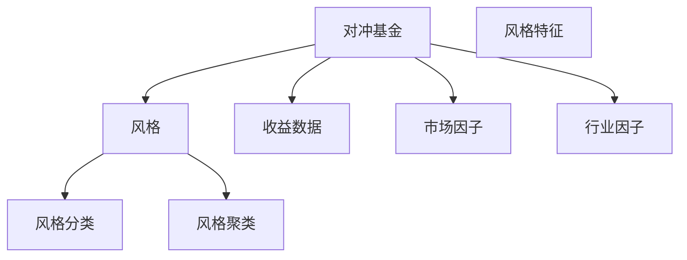
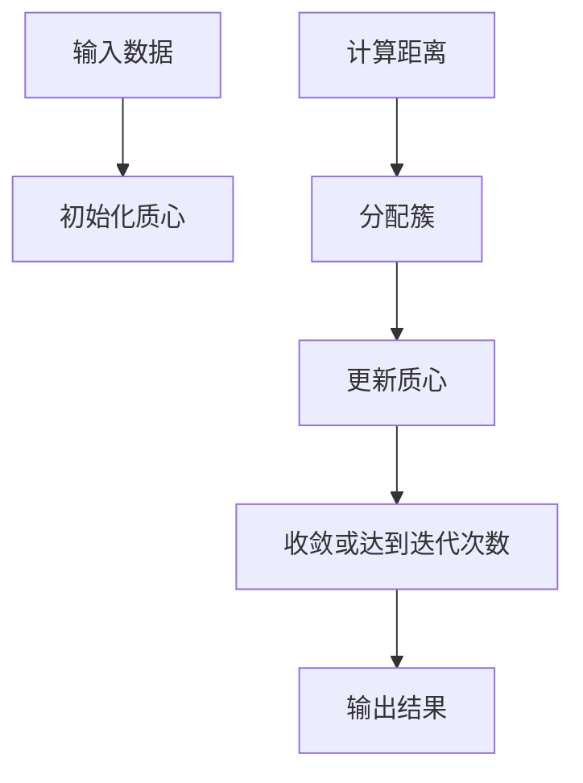
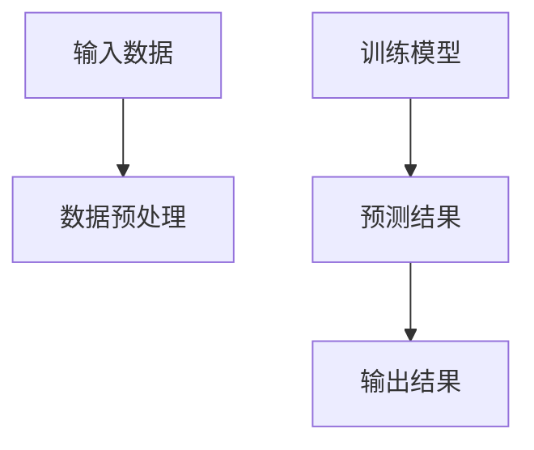
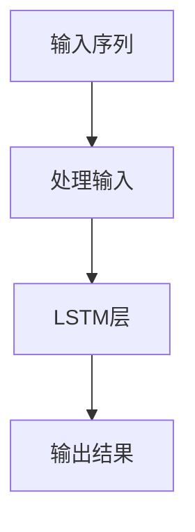
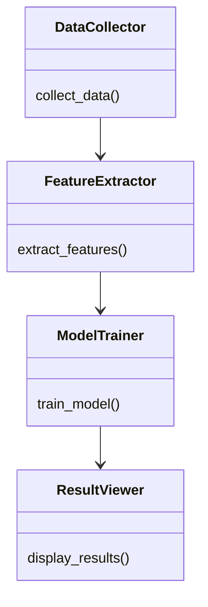
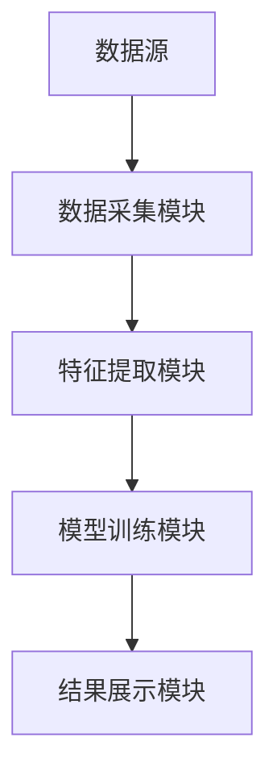
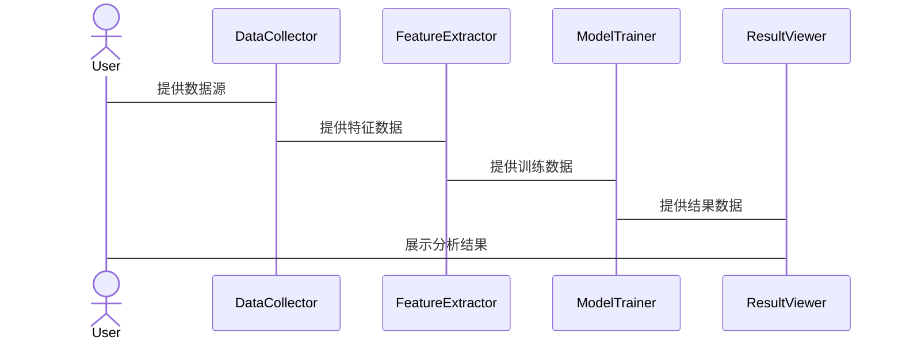

                 

<think>
好，我需要根据用户的要求，逐步完成《AI辅助的对冲基金风格分析》的技术博客文章。首先，我会先理解用户的具体需求，确保每个部分都符合他们的期望。

用户希望文章结构清晰，逻辑严密，涵盖背景介绍、核心概念、算法原理、系统架构、项目实战和最佳实践。每个部分都需要详细的讲解，尤其是要使用Mermaid图和Python代码示例来说明。

首先，我需要确定文章的标题和关键词，确保摘要准确传达文章的核心内容。接着，按照目录大纲，逐步展开每个章节的内容，确保每个小节都有足够的细节，比如背景介绍需要涵盖对冲基金的基本概念、AI在金融中的应用以及风格分析的重要性。

在核心概念部分，我需要详细解释对冲基金风格分析的原理，对比不同分析方法的优缺点，并绘制实体关系图，帮助读者理解各部分之间的联系。

算法原理部分，我会选择几种常用的算法，如聚类分析、分类算法和时间序列分析，用Mermaid流程图展示每种算法的工作流程，并提供Python代码示例，解释数学模型和公式。

系统分析与架构设计需要描述问题场景，设计系统功能模块，用Mermaid类图、架构图和序列图展示系统的结构和交互流程。

项目实战部分，我需要指导读者如何安装环境，比如Python和相关库，然后提供核心代码实现，解读代码功能，并分析实际案例，最后进行项目总结。

最后，最佳实践部分包括小结、注意事项和拓展阅读，帮助读者巩固知识，并引导他们进一步学习。

在写作过程中，我会确保语言简洁专业，同时逻辑清晰，让读者能够轻松理解。完成每个部分后，我会检查是否覆盖了所有必要的细节，是否符合用户的要求，并进行适当的调整和优化。

通过以上步骤，我相信能够完成一篇高质量的技术博客文章，满足用户的需求。
</think>

# AI辅助的对冲基金风格分析

> 关键词：对冲基金，AI技术，风格分析，机器学习，自然语言处理

> 摘要：本文探讨了AI技术在对冲基金风格分析中的应用，从背景介绍、核心概念、算法原理、系统架构到项目实战和最佳实践，详细分析了如何利用AI技术提升对冲基金的风格分析效率和准确性。

---

# 第1章: 对冲基金与AI技术概述

## 1.1 对冲基金的基本概念

### 1.1.1 对冲基金的定义与特点

对冲基金是一种通过利用市场波动进行投资的金融工具，其目标是通过套利、做空等策略实现收益。对冲基金的特点包括：

- **多样性**：涵盖多种投资策略，如股票多空、量化对冲、事件驱动等。
- **杠杆性**：通常使用杠杆放大收益，但也增加了风险。
- **风险中性**：通过多空头寸对冲市场风险，力求实现绝对收益。

### 1.1.2 对冲基金的主要策略类型

对冲基金的策略类型多样，主要包括：

1. **股票多空策略**：通过买入低估股票并卖出高估股票获利。
2. **量化对冲策略**：利用数学模型和算法进行投资决策。
3. **事件驱动策略**：基于公司并购、重组等事件进行投资。
4. **套利策略**：利用市场价差进行无风险或低风险套利。

### 1.1.3 对冲基金在金融市场的地位与作用

对冲基金在金融市场中扮演着重要角色，通过其灵活的策略和杠杆效应，为投资者提供了多样化的投资选择。同时，对冲基金也对市场流动性、价格发现和风险定价产生重要影响。

## 1.2 AI技术在金融领域的应用

### 1.2.1 AI在金融分析中的应用场景

人工智能技术在金融领域的应用广泛，包括：

- **量化交易**：利用算法进行高频交易和套利。
- **风险控制**：通过机器学习模型预测和管理投资风险。
- **市场情绪分析**：利用自然语言处理技术分析新闻、社交媒体等数据，预测市场走势。

### 1.2.2 AI技术对金融投资的影响

AI技术的应用显著提高了金融投资的效率和准确性，通过大数据分析和深度学习模型，投资者能够更好地捕捉市场机会，优化投资组合。

### 1.2.3 对冲基金与AI技术的结合趋势

随着AI技术的不断发展，越来越多的对冲基金开始采用AI辅助投资决策，从数据采集、策略开发到风险控制，AI技术的应用日益广泛。

## 1.3 对冲基金风格分析的必要性

### 1.3.1 对冲基金风格分析的定义

对冲基金风格分析是对基金的投资策略、风险特征和收益来源进行分类和分析的过程，旨在帮助投资者更好地理解和评估基金的表现。

### 1.3.2 风险管理与风格分析的关系

通过对冲基金风格分析，投资者可以识别基金的风险来源，制定更加科学的风险管理策略。

### 1.3.3 AI辅助风格分析的优势

AI技术能够处理海量数据，发现传统方法难以捕捉的模式和趋势，显著提高了风格分析的效率和准确性。

---

# 第2章: 对冲基金风格分析的核心概念

## 2.1 风格分析的基本原理

### 2.1.1 风格分析的定义与分类

风格分析通过对基金的收益来源、风险特征和投资策略进行分类，帮助投资者更好地理解和评估基金的表现。

### 2.1.2 风格分析的关键要素

- **收益来源**：基金的主要收益来自哪些资产或策略。
- **风险特征**：基金的风险暴露程度，如波动率、流动性风险等。
- **投资策略**：基金采用的具体投资策略，如多空策略、套利策略等。

### 2.1.3 风格分析的数学模型

风格分析通常涉及多元回归模型，通过分析基金收益与市场因子的关系，确定其风格特征。

$$ R_p = \beta_1 R_{market} + \beta_2 R_{small} + \beta_3 R_{value} + \epsilon $$

其中，$R_p$ 是基金的超额收益，$\beta_1, \beta_2, \beta_3$ 是对应的因子暴露度。

## 2.2 对冲基金风格分析的框架

### 2.2.1 数据采集与预处理

风格分析的第一步是收集相关数据，包括基金的收益数据、市场因子数据、行业因子数据等。数据预处理包括清洗、标准化和特征提取。

### 2.2.2 特征提取与选择

通过主成分分析（PCA）等方法，从原始数据中提取关键特征，降低维度，提高分析效率。

### 2.2.3 风格分类与聚类

利用聚类分析（如K-means）将基金按照风格特征进行分类，帮助投资者更好地理解和比较不同基金的风格。

## 2.3 AI技术在风格分析中的应用

### 2.3.1 机器学习算法在风格分析中的作用

- **监督学习**：用于风格分类，如随机森林、支持向量机（SVM）等。
- **无监督学习**：用于风格聚类，如K-means、DBSCAN等。

### 2.3.2 自然语言处理在风格分析中的应用

通过分析基金的定期报告、分析师评级等文本数据，提取隐含的风格信息。

### 2.3.3 深度学习模型在风格分析中的优势

深度学习模型（如LSTM）能够捕捉时间序列数据中的复杂模式，适用于对冲基金风格的动态分析。

---

# 第3章: 对冲基金风格分析的核心概念与联系

## 3.1 核心概念的原理

### 3.1.1 风格分析的核心算法

- **聚类分析**：将基金按照风格特征聚类，识别出不同的风格类别。
- **分类算法**：基于风格特征对基金进行分类，如逻辑回归、决策树等。

### 3.1.2 风格分析的特征工程

特征工程是风格分析的关键步骤，包括数据清洗、特征提取、特征选择和特征变换。

### 3.1.3 风格分析的模型训练

通过训练机器学习模型，实现对基金风格的自动识别和分类。

## 3.2 核心概念的属性特征对比

### 3.2.1 不同风格分析方法的对比表格

以下是对几种常见风格分析方法的对比：

| 方法          | 优点                           | 缺点                           |
|---------------|--------------------------------|--------------------------------|
| K-means聚类    | 易实现，计算效率高             | 需要预先指定聚类数           |
| DBSCAN聚类    | 自动识别聚类数                 | 计算复杂度高                   |
| K-近邻（KNN）  | 适用于小数据集                 | 不适合大数据集                 |

### 3.2.2 对比表格的详细说明

对比表格详细说明了不同方法的优缺点，帮助读者选择合适的方法。

### 3.2.3 对比表格的使用场景

对比表格适用于对冲基金风格分析方法的选择和优化，帮助投资者根据具体情况选择合适的方法。

## 3.3 实体关系图架构

以下是对冲基金风格分析的实体关系图：



---

# 第4章: 对冲基金风格分析的算法原理

## 4.1 聚类分析算法原理

### 4.1.1 K-means聚类算法

K-means算法是一种常用的聚类算法，适用于风格分析中的风格聚类。

### 4.1.2 K-means算法流程图



### 4.1.3 K-means算法的Python实现

```python
from sklearn.cluster import KMeans

# 数据预处理
X = ... # 特征矩阵

# 初始化模型
kmeans = KMeans(n_clusters=3, random_state=0)

# 训练模型
clusters = kmeans.fit_predict(X)

# 输出结果
print(clusters)
```

## 4.2 分类算法原理

### 4.2.1 支持向量机（SVM）分类算法

SVM是一种常用的监督学习算法，适用于风格分类。

### 4.2.2 SVM算法流程图



### 4.2.3 SVM算法的Python实现

```python
from sklearn import svm

# 数据预处理
X_train = ... # 训练数据
y_train = ... # 标签

# 初始化模型
svm_model = svm.SVC(kernel='rbf', gamma=0.5, C=1)

# 训练模型
svm_model.fit(X_train, y_train)

# 预测结果
y_pred = svm_model.predict(X_test)
print(y_pred)
```

## 4.3 时间序列分析算法原理

### 4.3.1 LSTM网络在时间序列分析中的应用

LSTM（长短期记忆网络）适用于时间序列数据的分析，可以捕捉长期依赖关系。

### 4.3.2 LSTM网络流程图



### 4.3.3 LSTM网络的Python实现

```python
import keras
from keras.layers import LSTM, Dense, Dropout

# 定义模型
model = keras.Sequential()
model.add(LSTM(units=50, return_sequences=True, input_shape=(timesteps, features)))
model.add(Dropout(0.2))
model.add(LSTM(units=50, return_sequences=False))
model.add(Dense(1, activation='sigmoid'))

# 编译模型
model.compile(optimizer='adam', loss='binary_crossentropy', metrics=['accuracy'])

# 训练模型
model.fit(X_train, y_train, epochs=10, batch_size=32)
```

---

# 第5章: 对冲基金风格分析的系统分析与架构设计

## 5.1 系统功能设计

### 5.1.1 数据采集模块

负责收集对冲基金的相关数据，包括收益数据、市场因子等。

### 5.1.2 特征提取模块

对原始数据进行特征提取，生成可用于分析的特征向量。

### 5.1.3 模型训练模块

利用机器学习模型对特征数据进行训练，生成风格分类结果。

### 5.1.4 结果展示模块

将分析结果以可视化形式展示，帮助用户理解和分析。

## 5.2 系统架构设计

### 5.2.1 类图设计



### 5.2.2 系统架构图



## 5.3 接口设计

系统接口包括数据输入接口、模型训练接口和结果输出接口，确保各模块之间的数据流通和交互。

## 5.4 交互流程设计



---

# 第6章: 对冲基金风格分析的项目实战

## 6.1 环境安装

安装必要的Python库，如scikit-learn、TensorFlow、Keras等。

## 6.2 核心代码实现

### 6.2.1 数据预处理

```python
import pandas as pd
import numpy as np

# 读取数据
data = pd.read_csv('hedge_fund.csv')

# 数据清洗
data = data.dropna()
data = (data - data.mean()) / data.std()  # 标准化
```

### 6.2.2 特征提取

```python
from sklearn.decomposition import PCA

# PCA降维
pca = PCA(n_components=10)
features = pca.fit_transform(data)
```

### 6.2.3 模型训练

```python
from sklearn.svm import SVC

# 训练SVM模型
model = SVC(kernel='rbf', gamma=0.5, C=1)
model.fit(features_train, labels_train)
```

### 6.2.4 结果展示

```python
from sklearn.metrics import classification_report

# 预测结果
y_pred = model.predict(features_test)
print(classification_report(labels_test, y_pred))
```

## 6.3 实际案例分析

以某对冲基金为例，分析其风格特征，包括收益来源、风险特征和投资策略。

## 6.4 项目总结

总结项目实施过程中的经验教训，提出改进建议，为未来的优化提供参考。

---

# 第7章: 对冲基金风格分析的最佳实践

## 7.1 小结

通过对冲基金风格分析，投资者可以更好地理解和评估基金的表现，优化投资决策。

## 7.2 注意事项

- 数据质量：确保数据的准确性和完整性。
- 模型选择：根据具体情况选择合适的算法和模型。
- 模型优化：通过参数调优和特征工程提高模型性能。

## 7.3 拓展阅读

建议读者进一步学习相关领域的知识，如深度学习在金融中的应用、自然语言处理在投资分析中的应用等。

---

# 作者

作者：AI天才研究院/AI Genius Institute  
禅与计算机程序设计艺术 /Zen And The Art of Computer Programming

