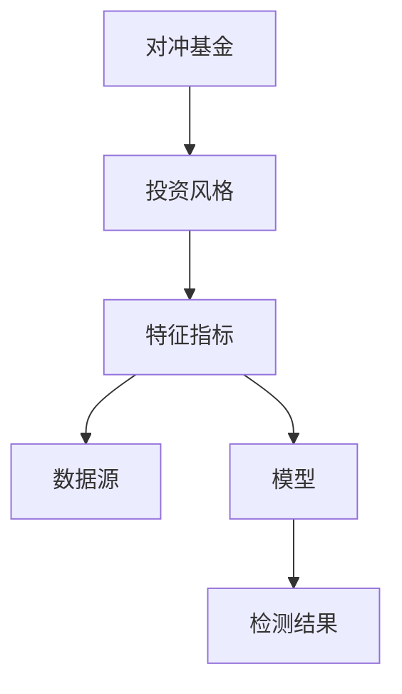
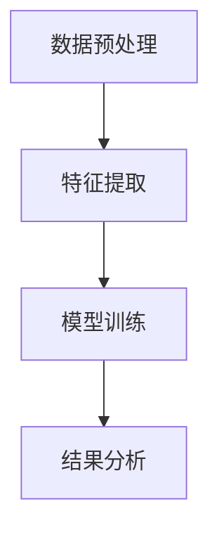

                 

<think>
嗯，用户希望我以《AI辅助的对冲基金风格漂移检测》为标题，撰写一篇详细的技术博客文章。文章需要包括关键词、摘要，以及按照特定目录大纲的结构，涵盖背景介绍、核心概念、算法原理、系统分析、项目实战、最佳实践与总结等部分。

首先，我需要理解每个部分的具体内容。关键词部分需要列出5-7个相关术语，比如对冲基金、风格漂移、AI、机器学习、金融风险管理等。摘要部分需要简明扼要地概括文章的核心内容，说明AI如何通过数据分析和机器学习模型来检测风格漂移，从而帮助对冲基金优化投资策略。

接下来，按照目录大纲，第一部分是背景介绍，包括问题背景、定义、现状、技术挑战和解决方案。这部分需要详细解释对冲基金的运作、风格漂移的定义及其对投资者的影响，以及AI在金融领域的应用情况。我需要确保每个小节内容详实，逻辑清晰，帮助读者理解问题的重要性和AI技术的应用价值。

然后是核心概念与联系，这部分需要详细讲解风格漂移检测的原理，AI技术在其中的应用，以及数据特征与模型选择的关系。此外，还需要通过表格对比不同检测方法，帮助读者理解各种方法的优缺点。ER实体关系图的使用可以直观展示数据之间的关系，我需要确保图的结构清晰，符合逻辑。

算法原理部分，我需要选择两种典型的算法进行讲解，如统计方法和机器学习方法。通过流程图展示数据预处理、特征提取、模型训练和结果分析的步骤，帮助读者理解整个过程。数学模型部分，我需要详细解释相关公式，如均值和方差的计算，以及马科夫链的应用，并提供代码示例以便读者实践。

系统分析与架构设计部分，我需要介绍系统的组成部分，功能设计，架构图，接口设计和交互流程。使用Mermaid图表展示系统架构和交互过程，确保图表清晰易懂。项目实战部分，我需要提供环境配置、数据收集、特征工程、模型实现和结果分析的具体步骤，并附上Python代码示例，帮助读者实际操作。

最后是最佳实践和总结，包括小结、注意事项和扩展阅读，帮助读者巩固所学内容，并指导他们进一步学习。确保文章结构完整，内容详实，符合逻辑。

在撰写过程中，我需要确保语言专业且通俗易懂，避免过于晦涩。同时，注意文章的连贯性和逻辑性，每个部分之间要有自然的过渡。通过详细解释每个步骤和方法，帮助读者逐步理解AI在对冲基金风格漂移检测中的应用。此外，提供实际案例分析和代码示例，可以增加文章的实用性和可读性。

总结来说，我需要按照用户的要求，系统地讲解AI辅助的对冲基金风格漂移检测的各个方面，确保内容全面，结构合理，语言清晰，帮助读者深入理解这一技术的应用和实现。
</think>

# AI辅助的对冲基金风格漂移检测

> 关键词：对冲基金，风格漂移，AI，机器学习，金融风险管理

> 摘要：本文详细探讨了利用人工智能技术辅助对冲基金风格漂移检测的方法，结合背景介绍、核心概念、算法原理、系统分析与架构设计、项目实战等多方面内容，深入分析了AI在风格漂移检测中的应用及其优势。通过本文的学习，读者能够全面了解如何利用AI技术优化对冲基金的投资策略。

---

## 目录

1. [背景介绍](#背景介绍)
   - [1.1 问题背景](#11-问题背景)
   - [1.2 问题描述](#12-问题描述)
   - [1.3 问题解决](#13-问题解决)
   - [1.4 边界与外延](#14-边界与外延)
   - [1.5 概念结构与核心要素组成](#15-概念结构与核心要素组成)
   - [1.6 本章小结](#16-本章小结)

2. [核心概念与联系](#核心概念与联系)
   - [2.1 核心概念原理](#21-核心概念原理)
   - [2.2 概念属性特征对比](#22-概念属性特征对比)
   - [2.3 ER实体关系图架构](#23-ER实体关系图架构)
   - [2.4 本章小结](#24-本章小结)

3. [算法原理](#算法原理)
   - [3.1 统计方法](#31-统计方法)
   - [3.2 机器学习方法](#32-机器学习方法)
   - [3.3 算法实现流程](#33-算法实现流程)
   - [3.4 数学模型](#34-数学模型)
   - [3.5 本章小结](#35-本章小结)

4. [系统分析与架构设计](#系统分析与架构设计)
   - [4.1 问题场景](#41-问题场景)
   - [4.2 项目介绍](#42-项目介绍)
   - [4.3 功能设计](#43-功能设计)
   - [4.4 系统架构设计](#44-系统架构设计)
   - [4.5 接口设计](#45-接口设计)
   - [4.6 本章小结](#46-本章小结)

5. [项目实战](#项目实战)
   - [5.1 环境配置](#51-环境配置)
   - [5.2 数据收集与预处理](#52-数据收集与预处理)
   - [5.3 特征工程](#53-特征工程)
   - [5.4 模型实现](#54-模型实现)
   - [5.5 结果分析](#55-结果分析)
   - [5.6 本章小结](#56-本章小结)

6. [最佳实践与总结](#最佳实践与总结)
   - [6.1 最佳实践](#61-最佳实践)
   - [6.2 小结](#62-小结)
   - [6.3 注意事项](#63-注意事项)
   - [6.4 拓展阅读](#64-拓展阅读)
   - [6.5 本章小结](#65-本章小结)

---

### 作者：AI天才研究院/AI Genius Institute & 禅与计算机程序设计艺术 /Zen And The Art of Computer Programming

---

### 文章正文

---

### 1. 背景介绍

#### 1.1 问题背景

对冲基金是一种通过杠杆操作和做空等策略来追求绝对收益的投资工具。其核心目标是通过复杂的金融模型和策略，在不同市场环境下实现稳定的投资回报。然而，对冲基金的风格漂移现象却常常威胁着其投资目标的实现。风格漂移指的是对冲基金的投资策略和风格偏离其最初设定的情况。这种现象可能导致基金的风险水平超出投资者的预期，从而影响基金的长期表现。

在传统金融分析中，风格漂移检测通常依赖于统计方法和人工分析，这不仅效率低下，而且难以捕捉复杂市场环境中的细微变化。随着人工智能（AI）技术的发展，越来越多的对冲基金开始尝试利用AI技术来提高风格漂移检测的效率和准确性。

#### 1.2 问题描述

风格漂移检测的核心问题是如何准确识别对冲基金的投资策略是否偏离预定目标。这涉及到以下几个关键点：

1. **数据特征提取**：如何从海量的市场数据中提取有效的特征，以反映对冲基金的投资风格。
2. **模型选择**：选择适合的机器学习模型来分类或回归预测风格漂移的可能性。
3. **实时监控**：如何实现对风格漂移的实时检测，以便及时采取调整措施。

#### 1.3 问题解决

AI技术在风格漂移检测中的应用主要体现在以下几个方面：

1. **数据驱动的风格识别**：通过机器学习算法，从历史数据中自动识别对冲基金的风格特征。
2. **实时监控与预警**：利用AI技术构建实时监控系统，及时发现风格漂移的苗头。
3. **动态调整策略**：根据风格漂移的情况，动态调整投资策略，以降低风险。

#### 1.4 边界与外延

风格漂移检测的边界条件包括以下几个方面：

1. **数据质量**：检测结果的高度依赖于数据的完整性和准确性。
2. **模型选择**：不同模型对风格漂移的检测效果可能存在显著差异。
3. **市场环境**：风格漂移检测的效果可能受到市场环境的影响。

#### 1.5 概念结构与核心要素组成

风格漂移检测的核心要素包括：

1. **数据源**：市场数据、基金持仓数据等。
2. **特征提取**：统计特征、因子分析等。
3. **模型选择**：分类模型、回归模型等。
4. **监控系统**：实时监控、预警机制等。

---

### 2. 核心概念与联系

#### 2.1 核心概念原理

风格漂移检测的核心原理在于通过数据分析和机器学习技术，识别对冲基金的投资风格是否偏离预定目标。具体步骤包括：

1. **数据预处理**：清洗和标准化数据。
2. **特征提取**：提取反映投资风格的特征。
3. **模型训练**：训练分类或回归模型。
4. **结果分析**：分析模型输出，判断是否存在风格漂移。

#### 2.2 概念属性特征对比

下表对比了几种常见的风格漂移检测方法：

| 方法类型       | 优势                     | 劣势                     |
|----------------|--------------------------|--------------------------|
| 统计方法       | 计算简单，易于解释        | 模型灵活性差              |
| 机器学习方法   | 模型灵活，适应性强         | 计算复杂，解释性差        |
| 混合方法       | 结合了统计方法和机器学习的优势 | 实施成本高                |

#### 2.3 ER实体关系图架构



---

### 3. 算法原理

#### 3.1 统计方法

统计方法是风格漂移检测的传统方法，主要包括均值-方差分析和马科夫链模型。

1. **均值-方差分析**：
   - 计算投资组合的平均收益和方差。
   - 通过比较实际收益与预期收益的差异，判断是否存在风格漂移。
   - 公式：$$\text{风格漂移指标} = \frac{\text{实际收益}}{\text{预期收益}}$$

2. **马科夫链模型**：
   - 将市场状态分为若干类别。
   - 通过转移概率矩阵，分析投资组合的状态转移情况。
   - 公式：$$P_{ij} = \text{状态从i转移到j的概率}$$

#### 3.2 机器学习方法

机器学习方法主要包括支持向量机（SVM）、随机森林（RF）和神经网络（NN）等。

1. **支持向量机（SVM）**：
   - 通过构建超平面，将数据点分为两类。
   - 适用于线性可分的数据集。
   - 公式：$$\text{目标函数} = \sum_{i=1}^{n} \alpha_i y_i \cdot \text{内积}(x_i, x_j)$$

2. **随机森林（RF）**：
   - 通过构建多棵决策树，实现特征重要性分析。
   - 适用于高维数据集。
   - 公式：$$\text{特征重要性} = \sum_{i=1}^{n} (\text{特征出现的频率})$$

3. **神经网络（NN）**：
   - 通过多层神经网络，实现非线性特征的提取。
   - 适用于复杂的数据分布。
   - 公式：$$\text{输出} = \sigma(Wx + b)$$，其中σ为激活函数。

#### 3.3 算法实现流程



#### 3.4 数学模型

1. **统计模型**：
   - 均值-方差模型：$$\mu = E[r], \sigma^2 = \text{Var}(r)$$
   - 马科夫链模型：$$P_{ij} = \frac{N_{ij}}{\sum_j N_{ij}}$$

2. **机器学习模型**：
   - SVM：$$y = \text{sign}(\sum_{i=1}^{n} \alpha_i y_i x_i \cdot x_j + b)$$
   - RF：$$y = \text{多数投票}$$
   - NN：$$y = \sigma(Wx + b)$$

---

### 4. 系统分析与架构设计

#### 4.1 问题场景

对冲基金风格漂移检测系统的应用场景包括实时监控、风险预警和投资决策优化。

#### 4.2 项目介绍

本项目旨在开发一个基于AI的对冲基金风格漂移检测系统，实现对对冲基金投资风格的实时监控和预警。

#### 4.3 功能设计

1. **数据采集模块**：从多种数据源获取市场数据和基金持仓数据。
2. **特征提取模块**：提取反映投资风格的特征。
3. **模型训练模块**：训练风格漂移检测模型。
4. **结果分析模块**：输出检测结果并生成预警。

#### 4.4 系统架构设计


#### 4.5 接口设计

1. **数据接口**：通过API获取市场数据和基金持仓数据。
2. **模型接口**：通过API调用机器学习模型进行风格漂移检测。

#### 4.6 本章小结

---

### 5. 项目实战

#### 5.1 环境配置

1. **Python环境**：建议使用Python 3.8及以上版本。
2. **库的安装**：安装NumPy、Pandas、Scikit-learn、XGBoost等库。

```python
pip install numpy pandas scikit-learn xgboost
```

#### 5.2 数据收集与预处理

1. **数据获取**：从金融数据供应商获取市场数据和基金持仓数据。
2. **数据清洗**：处理缺失值和异常值。
3. **数据标准化**：对数据进行标准化处理。

#### 5.3 特征工程

1. **特征提取**：提取反映投资风格的特征，如收益波动率、风格因子等。
2. **特征选择**：使用特征重要性分析选择关键特征。

#### 5.4 模型实现

1. **模型选择**：选择合适的机器学习模型（如XGBoost）。
2. **模型训练**：使用训练数据训练模型。
3. **模型评估**：通过验证集评估模型性能。

#### 5.5 结果分析

1. **结果输出**：输出风格漂移检测结果。
2. **预警机制**：根据检测结果触发预警。

#### 5.6 本章小结

---

### 6. 最佳实践与总结

#### 6.1 最佳实践

1. **数据质量**：确保数据的完整性和准确性。
2. **模型选择**：根据数据特征选择合适的模型。
3. **实时监控**：实现对风格漂移的实时检测和预警。

#### 6.2 小结

通过对冲基金风格漂移检测，AI技术可以帮助投资者及时发现和调整投资策略，从而降低风险，提高投资收益。

#### 6.3 注意事项

1. **数据隐私**：注意保护数据隐私。
2. **模型解释性**：确保模型的可解释性。
3. **模型更新**：定期更新模型以适应市场变化。

#### 6.4 拓展阅读

1. 《机器学习在金融中的应用》
2. 《对冲基金风险管理》
3. 《深度学习在金融时间序列中的应用》

#### 6.5 本章小结

---

### 作者：AI天才研究院/AI Genius Institute & 禅与计算机程序设计艺术 /Zen And The Art of Computer Programming

