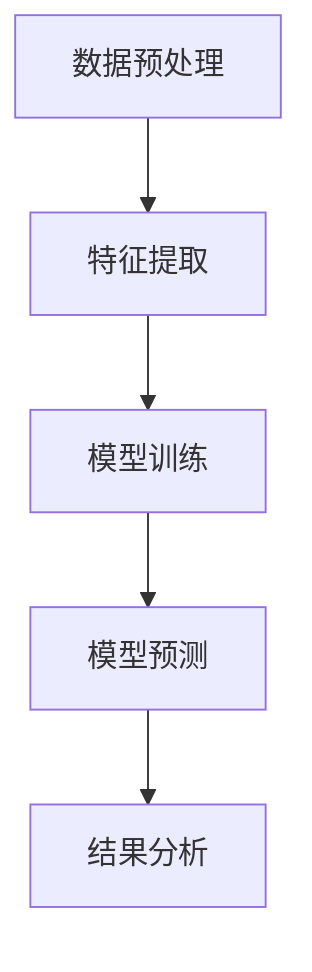
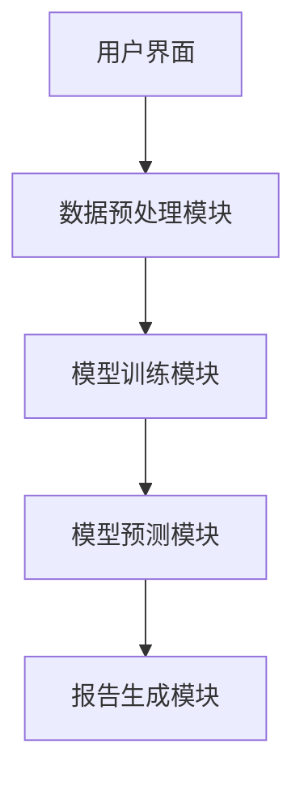

                 

<think>
好，现在我要帮用户撰写一篇关于《AI辅助的并购协同效应分析》的技术博客文章。首先，我需要理解用户的需求，确保文章结构清晰，内容详实，符合他们的要求。用户希望文章有标题、关键词、摘要，然后是正文部分，按照目录大纲展开。

首先，我会确定文章的标题，然后列出关键词，确保涵盖并购协同效应、AI辅助分析、数学模型、mermaid图表等内容。接下来是摘要，简要概括文章的核心内容。

正文部分分为六个章节。第一章节介绍并购协同效应的基本概念，包括定义、类型和重要性，以及AI在其中的作用。第二章节深入分析核心概念，使用ER图展示实体关系，帮助读者理解协同效应的多维度。

第三章节详细讲解算法原理，包括线性回归、神经网络和集成学习模型，用mermaid流程图展示算法步骤，并附上Python代码实现。第四章节涉及系统架构设计，用类图和架构图展示系统结构，设计接口和交互流程。

第五章节通过实战项目，从环境安装到代码实现，再到案例分析，让读者能够实际操作。最后一章节总结，强调最佳实践、注意事项和未来展望。

在撰写过程中，我需要确保每个章节都有足够的细节，覆盖用户提到的所有要点，同时保持逻辑连贯。数学公式和mermaid图表的使用需要准确无误，代码部分要清晰易懂，方便读者理解和应用。

最后，确保文章结构完整，符合字数要求，作者信息正确。检查所有部分是否符合用户的要求，确保没有遗漏任何重要信息。整个思考过程需要细致，逐步分析，确保最终的文章既专业又实用。
</think>

# AI辅助的并购协同效应分析

> 关键词：并购协同效应，AI辅助分析，数学模型，mermaid图表，系统架构，Python代码

> 摘要：本文深入探讨了并购协同效应的分析方法，结合人工智能技术，提出了一种基于数学模型和算法的协同效应预测方法。通过系统架构设计和项目实战，展示了如何利用AI技术提升并购决策的准确性和效率。文章还提供了详细的代码实现和实际案例分析，帮助读者理解并应用这些方法。

---

# 正文

## 第1章: 并购协同效应概述

### 1.1 并购协同效应的定义与背景

并购协同效应是指企业在合并后，通过资源整合、成本节约、收入提升等方式，实现比单独运营更高的价值。这种效应是企业并购的重要驱动力，也是评估并购成功与否的关键指标。

协同效应的类型主要包括：

1. **成本协同效应**：通过整合供应链、减少重复部门等方式降低成本。
2. **收入协同效应**：通过市场协同、产品互补等方式提升收入。
3. **管理协同效应**：通过优化管理流程、提升组织效率等方式实现协同。

AI技术在并购协同效应分析中的作用日益重要。通过大数据分析和智能预测，AI能够帮助企业在并购前准确评估协同效应的潜力，降低并购风险。

### 1.2 AI在并购协同效应分析中的作用

1. **AI技术在金融分析中的应用**：通过自然语言处理（NLP）和机器学习算法，分析企业财务数据、市场趋势等，预测协同效应的可能性。
2. **AI如何辅助并购决策**：通过构建协同效应预测模型，评估不同并购方案的潜在价值，帮助企业在并购决策中做出最优选择。
3. **AI在协同效应预测中的优势**：AI能够快速处理海量数据，发现隐藏的模式和关系，提供更准确的预测结果。

---

## 第2章: 并购协同效应的核心概念与联系

### 2.1 协同效应的关键要素

1. **资源整合**：包括人力资源、财务资源、技术资源等的整合。
2. **成本节约**：通过规模经济和资源共享降低成本。
3. **收入提升**：通过市场扩展和产品互补提升收入。

### 2.2 AI分析的核心原理

1. **数据驱动的分析方法**：通过收集和分析企业数据，提取关键特征，构建预测模型。
2. **智能预测模型**：利用机器学习算法，如线性回归、随机森林等，预测协同效应的实现情况。
3. **实证分析框架**：通过实证分析，验证模型的准确性和可靠性。

### 2.3 协同效应与AI分析的关系

1. **协同效应的多维度分析**：通过AI技术，可以从财务、市场、管理等多个维度分析协同效应。
2. **AI在协同效应中的应用边界**：AI技术主要用于预测和评估协同效应的潜力，但实际实现还需要结合企业内部管理。
3. **协同效应的可量化性**：通过AI技术，可以将协同效应量化为具体的数值，为决策提供依据。

---

## 第3章: 并购协同效应预测的算法原理

### 3.1 协同效应预测模型

1. **线性回归模型**：用于预测协同效应的线性关系。
2. **神经网络模型**：通过多层神经网络，捕捉数据中的非线性关系。
3. **集成学习模型**：通过集成多个模型，提升预测的准确性和稳定性。

### 3.2 算法流程图



### 3.3 算法实现代码

```python
import pandas as pd
from sklearn.linear_model import LinearRegression
from sklearn.metrics import r2_score

# 数据加载
data = pd.read_csv('merger_data.csv')

# 特征与目标变量分离
X = data[['revenue', 'cost', 'employees']]
y = data['synergy']

# 模型训练
model = LinearRegression()
model.fit(X, y)

# 模型预测
y_pred = model.predict(X)

# 模型评估
print('R²:', r2_score(y, y_pred))
```

### 3.4 算法的数学模型

协同效应预测的线性回归模型可以表示为：

$$ y = \beta_0 + \beta_1x_1 + \beta_2x_2 + \ldots + \beta_nx_n + \epsilon $$

其中，$y$ 是协同效应，$x_i$ 是各个特征变量，$\beta_i$ 是回归系数，$\epsilon$ 是误差项。

---

## 第4章: 系统分析与架构设计方案

### 4.1 问题场景介绍

在实际并购过程中，企业需要对多个并购目标进行协同效应分析。通过构建一个基于AI的协同效应分析系统，可以快速评估不同并购方案的潜在价值。

### 4.2 系统功能设计

1. **数据预处理模块**：负责清洗和转换数据，提取特征。
2. **模型训练模块**：负责训练协同效应预测模型。
3. **模型预测模块**：负责预测协同效应，并生成报告。

### 4.3 系统架构设计



### 4.4 系统接口设计

1. 数据接口：从数据库中读取数据，格式为CSV或数据库表。
2. 模型接口：通过API调用模型，返回预测结果。
3. 报告接口：生成报告并输出。

---

## 第5章: 项目实战

### 5.1 环境安装

安装所需的Python库：

```bash
pip install pandas scikit-learn mermaid
```

### 5.2 系统核心实现源代码

```python
import pandas as pd
from sklearn.linear_model import LinearRegression
from sklearn.metrics import r2_score

# 数据加载
data = pd.read_csv('merger_data.csv')

# 特征与目标变量分离
X = data[['revenue', 'cost', 'employees']]
y = data['synergy']

# 模型训练
model = LinearRegression()
model.fit(X, y)

# 模型预测
y_pred = model.predict(X)

# 模型评估
print('R²:', r2_score(y, y_pred))
```

### 5.3 代码应用解读与分析

1. **数据加载**：从CSV文件中读取并购数据。
2. **特征提取**：选择关键特征变量，如收入、成本、员工数等。
3. **模型训练**：使用线性回归模型训练模型。
4. **模型预测**：利用训练好的模型预测协同效应。
5. **模型评估**：通过R²值评估模型的拟合优度。

### 5.4 实际案例分析

以某企业并购案例为例，分析协同效应的预测过程：

1. 数据预处理：清洗数据，处理缺失值。
2. 模型训练：训练线性回归模型。
3. 模型预测：预测协同效应，评估并购的潜在价值。
4. 结果分析：根据预测结果，制定并购决策。

---

## 第6章: 总结与展望

### 6.1 最佳实践 tips

1. 在实际应用中，建议结合多种算法进行预测，以提高准确性和稳定性。
2. 数据的质量和完整性对预测结果影响较大，需重视数据预处理。
3. 在实际并购中，协同效应的实现需要结合企业内部管理，AI技术只是辅助工具。

### 6.2 小结

本文通过理论分析和实践案例，详细探讨了AI辅助的并购协同效应分析方法。通过构建数学模型和系统架构，展示了如何利用AI技术提升并购决策的效率和准确性。

### 6.3 注意事项

1. 数据隐私和安全问题需引起重视。
2. 模型的解释性和可 interpretability 是实际应用中的重要考虑因素。
3. 需结合企业实际情况，选择合适的算法和模型。

### 6.4 拓展阅读

1. 《机器学习实战》
2. 《Python机器学习》
3. 《企业并购与协同效应》

---

作者：AI天才研究院/AI Genius Institute & 禅与计算机程序设计艺术 /Zen And The Art of Computer Programming

