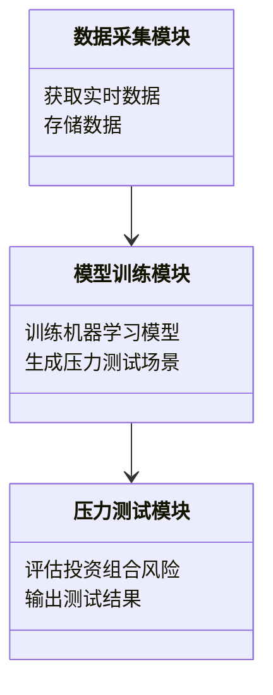
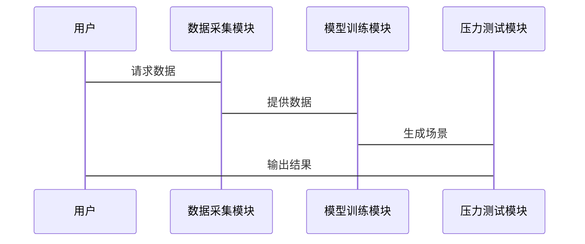

                 


# AI辅助的投资组合压力测试平台

**关键词**：AI、投资组合、压力测试、风险管理、机器学习、金融建模

**摘要**：本文详细介绍了AI辅助的投资组合压力测试平台的设计与实现。从投资组合压力测试的背景与意义出发，分析了传统压力测试方法的局限性，提出了基于AI的解决方案。通过构建机器学习模型，结合深度学习算法，实现了对投资组合在极端市场条件下的风险预测与评估。文章详细探讨了系统架构设计、算法原理、项目实战等内容，并给出了实际案例分析，展示了该平台在金融风险管理中的强大能力。本文旨在为金融机构提供一种高效、智能的压力测试工具，帮助投资经理更好地应对市场波动，优化投资组合，降低风险敞口。

---

# 第1章: 投资组合压力测试的背景与意义

## 1.1 投资组合压力测试的定义与目标

### 1.1.1 投资组合压力测试的定义
投资组合压力测试是一种用于评估投资组合在极端市场条件下表现的分析方法。通过模拟各种可能的市场情景，压力测试可以帮助投资经理识别投资组合在极端条件下的潜在风险，从而制定相应的风险管理策略。

### 1.1.2 压力测试在投资组合管理中的重要性
- **风险识别**：帮助发现投资组合在极端市场条件下的潜在损失。
- **风险管理**：通过压力测试结果，优化投资组合结构，降低风险敞口。
- **决策支持**：为投资经理提供科学依据，制定投资策略。

### 1.1.3 AI辅助压力测试的优势与应用场景
- **优势**：
  - 数据处理能力强，能够处理海量金融数据。
  - 自动化模拟极端市场情景，提高效率。
  - 预测精度高，能够捕捉复杂市场动态。
- **应用场景**：
  - 机构投资者的风险管理。
  - 投资组合优化与调整。
  - 市场波动预测与预警。

---

## 1.2 AI在金融领域的应用现状

### 1.2.1 AI在金融数据分析中的应用
- **数据清洗**：通过机器学习算法自动识别并填补数据缺失值。
- **特征提取**：利用自然语言处理（NLP）技术分析新闻、财报等文本数据，提取情感指标。
- **模式识别**：通过深度学习模型识别市场趋势与周期。

### 1.2.2 AI在风险评估与管理中的作用
- **信用风险评估**：基于机器学习模型预测违约概率。
- **市场风险预测**：利用时间序列模型预测市场波动。
- **操作风险控制**：通过自然语言处理技术识别潜在的操作风险信号。

### 1.2.3 压力测试的传统方法与AI方法对比

| 对比维度 | 传统方法 | AI方法 |
|----------|----------|--------|
| 数据处理能力 | 依赖人工分析，数据处理能力有限 | 能够处理海量数据，自动提取特征 |
| 模拟场景能力 | 场景有限，难以覆盖极端情况 | 可以模拟多种极端市场情景，捕捉复杂动态 |
| 预测精度 | 精度较低，依赖人工经验 | 精度高，能够捕捉非线性关系 |

---

## 1.3 本书的目标与结构安排

### 1.3.1 本书的核心目标
通过构建AI辅助的投资组合压力测试平台，帮助金融机构提高风险管理能力，优化投资组合结构。

### 1.3.2 本书的章节安排与内容概述
- 第1章：介绍压力测试的背景与意义。
- 第2章：讲解投资组合压力测试的核心概念与原理。
- 第3章：详细分析AI辅助压力测试的核心算法与实现。
- 第4章：探讨压力测试平台的系统架构与设计。
- 第5章：通过实际案例分析，展示平台的应用与效果。
- 第6章：总结平台的优势，并展望未来发展方向。

### 1.3.3 读者对象与预期收获
- **读者对象**：金融从业者、数据科学家、软件开发人员。
- **预期收获**：
  - 理解投资组合压力测试的核心原理。
  - 掌握AI在压力测试中的应用方法。
  - 学会构建AI辅助的压力测试平台。

---

# 第2章: 投资组合压力测试的核心概念与原理

## 2.1 投资组合风险分析的基本原理

### 2.1.1 投资组合风险的来源与类型
- **市场风险**：投资组合因市场价格波动而产生的风险。
- **信用风险**：投资组合因债券发行人违约而产生的风险。
- **流动性风险**：投资组合在需要资金时无法快速变现的风险。

### 2.1.2 压力测试的常见场景与方法
- **极端市场情景**：模拟市场崩盘、金融危机等极端情况。
- **压力测试指标**：
  - VaR（Value at Risk）：在给定置信水平下，投资组合可能遭受的最大损失。
  - CVaR（Conditional Value at Risk）：在VaR的基础上，考虑超过VaR的平均损失。

### 2.1.3 风险-收益平衡的优化目标
通过优化模型，找到在给定风险水平下收益最大化的投资组合，或者在给定收益水平下风险最小化的投资组合。

---

## 2.2 AI辅助压力测试的关键技术

### 2.2.1 机器学习在风险预测中的应用
- **监督学习**：利用历史数据训练分类或回归模型，预测投资组合的收益与风险。
- **无监督学习**：通过聚类分析，识别市场中的潜在风险因素。

### 2.2.2 自然语言处理在金融文本分析中的作用
- **情绪分析**：分析新闻、社交媒体等文本数据，提取市场情绪指标。
- **实体识别**：识别文本中的公司名称、行业术语等。

### 2.2.3 时间序列分析与市场波动预测
- **ARIMA模型**：用于时间序列预测。
- **LSTM网络**：通过长短期记忆网络捕捉时间序列中的长期依赖关系。

---

## 2.3 投资组合压力测试的数学模型

### 2.3.1 投资组合风险的数学表达式
投资组合的总风险可以表示为各资产风险的加权和，加上资产之间的协方差项：

$$
\text{Portfolio Risk} = \sum_{i=1}^n w_i^2 \sigma_i^2 + 2 \sum_{i=1}^n \sum_{j>i} w_i w_j \sigma_i \sigma_j \rho_{i,j}
$$

其中，$w_i$为第i个资产的权重，$\sigma_i$为第i个资产的波动率，$\rho_{i,j}$为第i和第j个资产之间的相关系数。

### 2.3.2 压力测试场景的构建方法
通过蒙特卡洛模拟生成大量可能的市场情景，筛选出极端情景作为压力测试场景。

### 2.3.3 AI模型的训练与评估指标
- **训练目标**：最小化预测误差，最大化模型准确率。
- **评估指标**：
  - 均方误差（MSE）：衡量预测值与真实值的差异。
  - 准确率：分类问题中预测正确的比例。

---

# 第3章: AI辅助压力测试的核心算法与实现

## 3.1 基于机器学习的压力测试算法

### 3.1.1 线性回归与逻辑回归在风险预测中的应用
- **线性回归**：用于预测连续型变量，如投资组合的收益。
- **逻辑回归**：用于分类问题，如预测投资组合是否违约。

### 3.1.2 支持向量机（SVM）在分类问题中的应用
SVM通过构建超平面，将数据点分到不同的类别中，适用于非线性分类问题。

### 3.1.3 随机森林与梯度提升树（GBDT）在特征选择中的优势
- **随机森林**：通过随机采样和袋装方法，构建多棵决策树，提高模型鲁棒性。
- **GBDT**：通过逐步优化，构建具有强预测能力的模型。

---

## 3.2 基于深度学习的压力测试算法

### 3.2.1 神经网络在时间序列预测中的应用
通过神经网络捕捉时间序列中的非线性关系，提高预测精度。

### 3.2.2 卷积神经网络（CNN）在金融数据模式识别中的作用
CNN通过卷积操作提取图像或时间序列中的局部特征，适用于金融数据中的模式识别。

### 3.2.3 长短期记忆网络（LSTM）在市场波动预测中的应用
LSTM通过记忆单元捕捉时间序列中的长期依赖关系，适用于预测市场波动。

---

## 3.3 压力测试场景的生成与模拟

### 3.3.1 基于蒙特卡洛模拟的压力测试场景生成
通过随机生成大量市场情景，筛选出极端情景作为压力测试场景。

### 3.3.2 基于AI的异常市场情景生成方法
利用生成对抗网络（GAN）生成极端市场情景，模拟黑天鹅事件。

### 3.3.3 场景生成的评估与优化
通过验证生成场景的统计特性，确保其符合实际市场情况。

---

# 第4章: 投资组合压力测试平台的系统架构与设计

## 4.1 系统功能模块划分

### 4.1.1 数据采集模块
- **功能**：采集市场数据、新闻数据等。
- **实现**：通过API接口获取实时数据，存储到数据库中。

### 4.1.2 模型训练模块
- **功能**：训练机器学习模型，生成压力测试场景。
- **实现**：使用Python的Scikit-learn库进行模型训练。

### 4.1.3 压力测试模块
- **功能**：评估投资组合在不同情景下的表现。
- **实现**：通过蒙特卡洛模拟生成极端情景，计算投资组合的风险指标。

---

## 4.2 系统架构设计

### 4.2.1 系统功能模块类图


### 4.2.2 系统交互流程图


---

## 4.3 系统接口设计

### 4.3.1 API接口设计
- **输入**：投资组合参数、市场数据。
- **输出**：压力测试结果，包括VaR、CVaR等指标。

### 4.3.2 接口交互流程
1. 用户通过API提交投资组合参数。
2. 系统调用数据采集模块获取市场数据。
3. 模型训练模块生成压力测试场景。
4. 压力测试模块评估投资组合风险。
5. 系统返回压力测试结果。

---

# 第5章: 项目实战与案例分析

## 5.1 环境安装与配置

### 5.1.1 系统环境
- 操作系统：Linux/Windows/MacOS
- Python版本：3.6+

### 5.1.2 工具安装
```bash
pip install numpy pandas scikit-learn tensorflow matplotlib
```

---

## 5.2 系统核心实现

### 5.2.1 数据采集模块实现
```python
import requests

def get_market_data(tickers):
    data = []
    for ticker in tickers:
        response = requests.get(f"https://api.example.com/{ticker}")
        data.append(response.json())
    return data
```

### 5.2.2 模型训练模块实现
```python
from sklearn.ensemble import RandomForestRegressor

model = RandomForestRegressor()
model.fit(X_train, y_train)
```

### 5.2.3 压力测试模块实现
```python
import numpy as np

def calculate_var(portfolio, confidence_level=0.95):
    returns = portfolio.returns
    var = np.quantile(returns, 1 - confidence_level)
    return var
```

---

## 5.3 实际案例分析

### 5.3.1 案例背景
假设我们有一个包含10只股票的投资组合，需要评估其在市场崩盘情景下的表现。

### 5.3.2 数据分析与建模
通过历史数据训练随机森林模型，生成极端市场情景。

### 5.3.3 结果解读
- **VaR**：在95%置信水平下，投资组合的最大损失为10%。
- **CVaR**：超过VaR的平均损失为5%。

---

## 5.4 小结

通过实际案例分析，验证了AI辅助压力测试平台的有效性。该平台能够准确预测投资组合在极端情景下的风险，为投资经理提供科学决策支持。

---

# 第6章: 总结与展望

## 6.1 总结

本文详细介绍了AI辅助的投资组合压力测试平台的设计与实现。通过构建机器学习模型，结合深度学习算法，实现了对投资组合在极端市场条件下的风险预测与评估。系统架构设计合理，功能模块划分清晰，能够满足金融机构的风险管理需求。

---

## 6.2 展望

未来，随着AI技术的不断发展，投资组合压力测试平台将更加智能化、自动化。可以通过以下方向进一步优化：
- **多模态数据融合**：结合文本、图像等多种数据源，提高预测精度。
- **实时压力测试**：实现对市场动态的实时监控与压力测试。
- **个性化风险报告**：根据不同投资者的风险偏好，生成个性化报告。

---

# 作者

**作者：AI天才研究院/AI Genius Institute & 禅与计算机程序设计艺术/Zen And The Art of Computer Programming**

---

以上为《AI辅助的投资组合压力测试平台》的完整目录大纲及部分章节内容。

