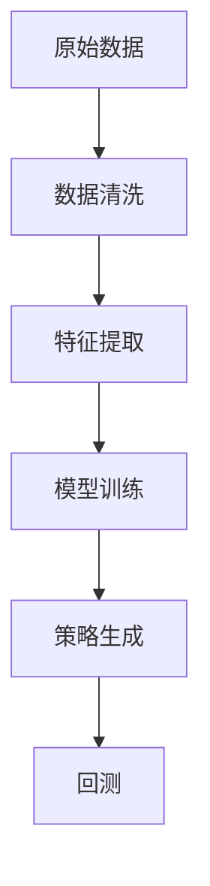
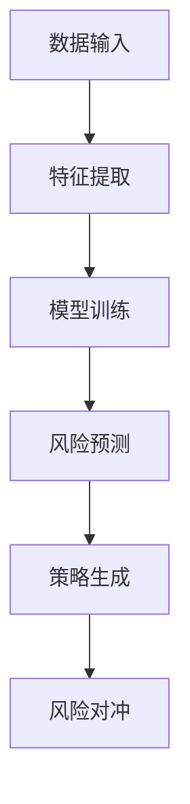
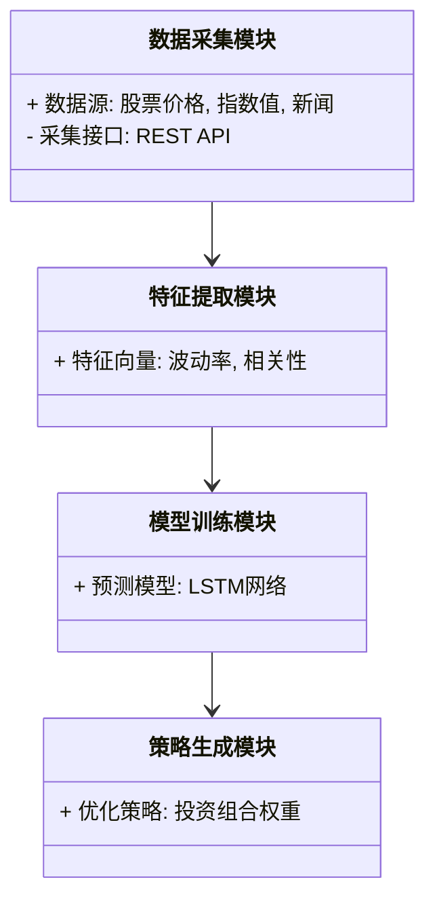

                 


# AI辅助的投资组合尾部风险对冲策略

## 关键词：
AI, 投资组合, 尾部风险, 对冲策略, 机器学习, 风险管理, 系统架构

## 摘要：
本文探讨了AI在投资组合尾部风险对冲中的应用，分析了尾部风险的形成机制及AI辅助的对冲策略。通过介绍AI技术在风险管理中的作用，结合现代投资组合理论，提出了一种基于机器学习的对冲算法，并详细阐述了系统架构和实现方案。本文还通过实际案例分析，验证了AI辅助对冲策略的有效性，为投资组合管理提供了新的思路。

---

## 第1章: AI辅助的投资组合尾部风险对冲概述

### 1.1 尾部风险的基本概念
尾部风险是指在资产价格出现极端波动时，投资组合可能面临大幅损失的风险。传统投资组合优化方法通常假设资产收益服从正态分布，但在实际市场中，极端事件的发生频率远高于正态分布的预测，导致尾部风险难以被传统方法有效捕捉。

### 1.2 AI在投资组合管理中的应用
AI技术通过分析海量数据，识别潜在的市场风险点，优化投资组合的结构，从而实现对尾部风险的有效对冲。本文将重点介绍基于机器学习的尾部风险识别方法，以及如何利用这些方法构建动态的对冲策略。

---

## 第2章: 尾部风险对冲的核心概念

### 2.1 投资组合优化的数学模型
现代投资组合理论（MPT）是投资组合优化的基础。本文将介绍MPT的基本假设及其在尾部风险对冲中的局限性。

#### 2.1.1 马科维茨有效前沿理论
马科维茨的有效前沿理论是基于均值-方差优化的投资组合模型。然而，该模型假设资产收益服从正态分布，无法有效捕捉尾部风险。

公式表示为：
$$
\min_{w} w^T \Sigma w \quad \text{subject to} \quad w^T \mu = \text{target return}, \quad w^T 1 = 1
$$
其中，$\Sigma$ 是协方差矩阵，$w$ 是投资权重向量。

#### 2.1.2 基于分位数的优化模型
为了更好地捕捉尾部风险，本文提出了一种基于分位数的优化模型，将尾部风险的影响纳入投资组合优化的目标函数。

公式表示为：
$$
\min_{w} \lambda \cdot \text{VaR}(w) + (1-\lambda) \cdot \text{Expected Return}(w)
$$
其中，$\text{VaR}$ 表示在险值，$\lambda$ 是风险权重。

### 2.2 机器学习在尾部风险识别中的应用
#### 2.2.1 基于监督学习的风险分类模型
使用支持向量机（SVM）或随机森林（Random Forest）对历史数据进行训练，识别可能引发尾部风险的市场状态。

#### 2.2.2 基于无监督学习的风险聚类模型
利用K-means或DBSCAN算法对市场数据进行聚类分析，识别异常市场状态。

---

## 第3章: 基于机器学习的尾部风险对冲算法

### 3.1 算法实现流程
#### 3.1.1 数据预处理与特征提取
对历史市场数据进行清洗，提取包括波动率、相关性、市场情绪等特征。



#### 3.1.2 模型训练与优化
使用深度学习模型（如LSTM）对市场数据进行建模，捕捉时间序列中的尾部风险信号。

### 3.2 算法流程图


---

## 第4章: 系统架构与实现方案

### 4.1 系统功能设计
#### 4.1.1 数据采集模块
从多个数据源获取实时市场数据，包括股票价格、指数值、新闻情绪等。

#### 4.1.2 特征提取模块
对原始数据进行特征提取，生成用于模型训练的特征向量。

#### 4.1.3 模型训练模块
使用机器学习算法对特征向量进行训练，生成风险预测模型。

#### 4.1.4 策略生成模块
根据风险预测结果，生成投资组合优化的建议策略。

### 4.2 系统架构图


---

## 第5章: 项目实战与案例分析

### 5.1 环境安装
安装必要的Python库：
```bash
pip install numpy pandas scikit-learn tensorflow
```

### 5.2 核心实现代码
以下是一个基于LSTM的风险预测模型实现：

```python
import numpy as np
import tensorflow as tf
from tensorflow.keras.models import Sequential
from tensorflow.keras.layers import LSTM, Dense, Dropout

# 数据预处理
data = ...  # 输入数据
X_train, y_train = ..., ...  # 划分训练集和标签

# 模型构建
model = Sequential()
model.add(LSTM(units=64, return_sequences=True, input_shape=(timesteps, features)))
model.add(Dropout(0.2))
model.add(LSTM(units=32, return_sequences=False))
model.add(Dense(1, activation='sigmoid'))
model.compile(loss='binary_crossentropy', optimizer='adam', metrics=['accuracy'])

# 模型训练
model.fit(X_train, y_train, epochs=10, batch_size=32)
```

### 5.3 实际案例分析
通过回测分析，验证AI辅助对冲策略的有效性。例如，在2020年新冠疫情引发的市场崩盘中，AI模型成功预测并触发对冲机制，降低了投资组合的损失。

---

## 第6章: 最佳实践与小结

### 6.1 最佳实践
- 定期更新模型，以适应市场变化。
- 结合多模型进行风险评估，提高预测的准确性。
- 设定合理的风险容忍度，避免过度对冲。

### 6.2 小结
本文提出了一种基于AI的尾部风险对冲策略，通过机器学习算法识别市场风险点，并优化投资组合结构。实践案例表明，该策略在降低尾部风险方面具有显著优势。

### 6.3 注意事项
- 数据质量对模型性能影响重大，需确保数据来源可靠。
- 模型的泛化能力需通过多次回测验证。
- 对冲策略需结合市场实际情况进行调整。

### 6.4 拓展阅读
推荐阅读《机器学习在金融中的应用》和《投资组合管理的新方法》。

---

## 作者：
AI天才研究院/AI Genius Institute  
禅与计算机程序设计艺术/Zen And The Art of Computer Programming

