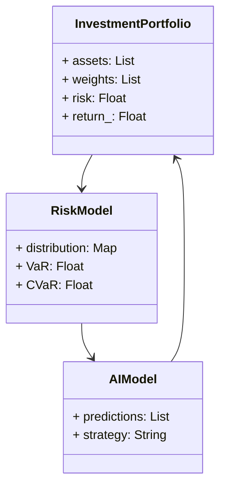
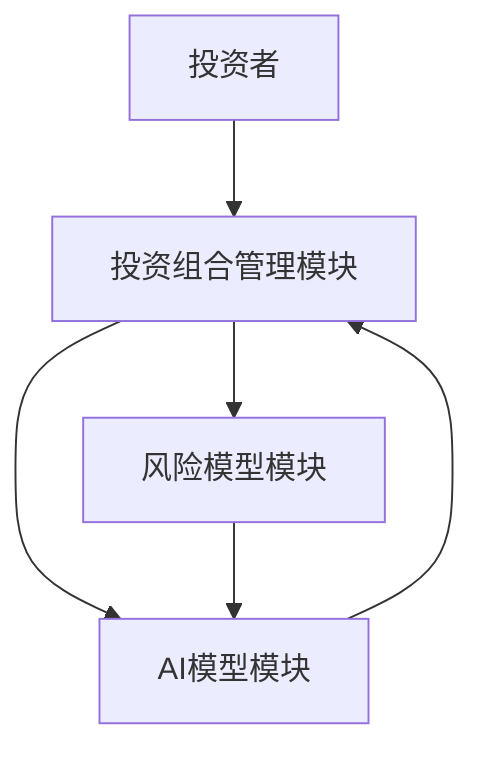
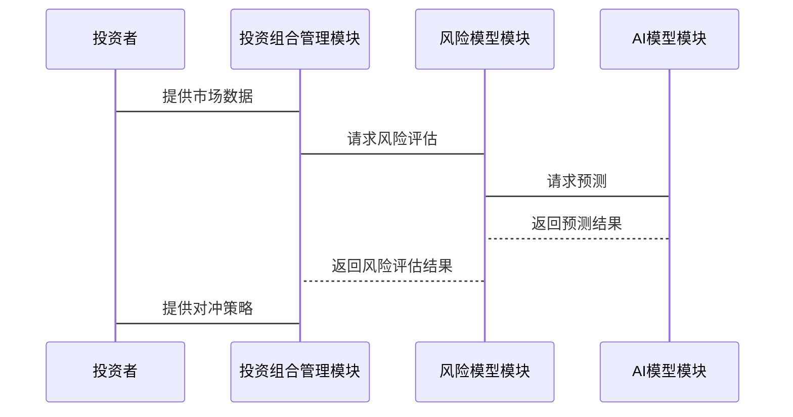

                 


# AI辅助的投资组合尾部风险对冲策略优化

## 关键词：AI, 投资组合, 尾部风险, 风险管理, 机器学习, 深度学习, 对冲策略

## 摘要：本文深入探讨了如何利用人工智能技术优化投资组合的尾部风险对冲策略。通过结合现代投资组合理论与先进的机器学习算法，我们提出了一种基于AI的尾部风险预测与对冲方法。文章首先介绍了投资组合和尾部风险的基本概念，然后分析了AI在金融风险管理中的应用，详细讲解了尾部风险预测的数学模型与算法原理，最后通过实际案例展示了如何构建一个基于AI的尾部风险对冲系统。本文旨在为金融从业者和研究人员提供一套高效、可靠的尾部风险对冲解决方案。

---

# 第1章: 投资组合与尾部风险概述

## 1.1 投资组合的基本概念

### 1.1.1 投资组合的定义与组成

一个投资组合是由多种金融资产（如股票、债券、基金等）组成的集合，旨在通过多样化配置降低投资风险。投资组合的收益和风险取决于其组成部分的权重和相关性。

- 投资组合的组成要素：资产类别、权重、相关性
- 投资组合的收益：期望收益率
- 投资组合的风险：方差、标准差

### 1.1.2 投资组合的风险与收益关系

投资组合的收益与风险之间存在密切关系。投资者通常需要在高收益和低风险之间做出权衡。通过优化投资组合的资产配置，可以在一定风险水平下获得最大收益，或在固定收益下最小化风险。

- 收益与风险的权衡：风险-收益曲线
- 现代投资组合理论（MPT）的核心思想：通过资产多样化降低风险
- 风险的量化指标：方差、标准差、VaR（值-at-风险）

### 1.1.3 尾部风险的定义与特征

尾部风险是指投资组合在极端市场条件下可能出现的损失，通常对应于分布尾部的事件。尾部风险具有低概率、高损失的特征，是投资组合风险的重要组成部分。

- 尾部风险的定义：极端市场事件导致的损失
- 尾部风险的特征：
  - 低概率性
  - 高损失性
  - 不可预测性
  - 非线性影响

## 1.2 尾部风险对冲的必要性

### 1.2.1 尾部风险对投资组合的影响

尾部风险可能导致投资组合的损失远超预期，甚至引发流动性危机或投资组合清盘。因此，对冲尾部风险是投资组合管理的重要组成部分。

- 尾部风险对投资组合的影响：
  - 资产价格大幅波动
  - 投资者信心下降
  - 资产流动性下降
  - 投资组合价值大幅缩水

### 1.2.2 对冲尾部风险的常见方法

传统的尾部风险对冲方法包括使用衍生品（如期权、期货）和分散化投资策略。然而，这些方法在复杂市场环境下往往效果有限，且需要频繁人工干预。

- 传统对冲方法：
  - 使用期权、保险策略
  - 分散化投资
  - 调整资产配置

### 1.2.3 AI技术在尾部风险对冲中的作用

人工智能技术可以通过分析海量数据，发现传统方法难以捕捉的尾部风险信号，并自动生成最优对冲策略，从而提高尾部风险对冲的效率和效果。

- AI技术的优势：
  - 大数据分析能力
  - 自动化对冲策略生成
  - 高频交易能力
  - 实时监控和预警

## 1.3 本章小结

本章介绍了投资组合的基本概念，重点阐述了尾部风险的定义、特征及其对投资组合的影响。同时，我们还探讨了传统对冲方法的局限性，并提出了利用AI技术优化尾部风险对冲策略的思路。

---

# 第2章: AI与金融风险管理

## 2.1 人工智能在金融领域的应用概述

### 2.1.1 人工智能的基本概念

人工智能（AI）是指计算机系统模拟人类智能的能力，包括学习、推理、决策等功能。在金融领域，AI主要应用于数据分析、预测、交易和风险管理等方面。

- AI的核心技术：
  - 机器学习
  - 深度学习
  - 自然语言处理
  - 强化学习

### 2.1.2 机器学习在金融中的应用领域

机器学习是一种人工智能技术，通过训练数据模型来预测和决策。在金融领域，机器学习广泛应用于信用评估、股价预测、风险管理和欺诈检测等。

- 机器学习的应用场景：
  - 信用评分
  - 股价预测
  - 风险评估
  - 欺诈检测

### 2.1.3 人工智能与金融风险管理的结合

人工智能与金融风险管理的结合，主要体现在数据驱动的风险预测、自动化风险监控和智能对冲策略生成等方面。

- AI在风险管理中的优势：
  - 大数据分析能力
  - 高效预测能力
  - 自动化决策能力

## 2.2 基于AI的尾部风险识别方法

### 2.2.1 数据驱动的尾部风险识别

数据驱动的尾部风险识别方法依赖于大量历史数据，通过机器学习模型发现尾部风险的潜在信号。

- 数据驱动方法的优势：
  - 可以发现非线性关系
  - 可以捕捉市场波动中的异常信号
  - 可以实时更新模型

### 2.2.2 基于深度学习的尾部风险预测

深度学习是一种机器学习技术，通过多层神经网络模型来捕捉数据中的复杂特征。在尾部风险预测中，深度学习可以识别市场中的隐藏模式。

- 深度学习的应用：
  - 预测市场崩盘
  - 检测市场拐点
  - 识别极端事件

### 2.2.3 基于强化学习的尾部风险对冲策略

强化学习是一种通过试错机制优化决策的技术。在尾部风险对冲中，强化学习可以生成动态的对冲策略。

- 强化学习的应用：
  - 动态调整投资组合
  - 自动化对冲决策
  - 实时风险控制

## 2.3 本章小结

本章介绍了人工智能在金融风险管理中的应用，重点探讨了基于机器学习和深度学习的尾部风险识别方法。同时，我们还讨论了强化学习在尾部风险对冲中的潜力。

---

# 第3章: 现代投资组合理论与风险管理模型

## 3.1 现代投资组合理论（MPT）概述

### 3.1.1 MPT的核心思想

现代投资组合理论（MPT）由Harry Markowitz在1952年提出，其核心思想是通过资产多样化降低投资组合的风险。

- MPT的核心假设：
  - 资产收益服从正态分布
  - 投资者是理性的
  - 市场是有效的

### 3.1.2 均值-方差优化模型

均值-方差优化模型是MPT的核心模型，用于在给定风险水平下最大化收益，或在给定收益下最小化风险。

- 模型公式：
  \[
  \min_w \sigma^2 \quad \text{subject to} \quad w^T \mu = r
  \]
  其中，\( \sigma^2 \) 是投资组合的方差，\( w \) 是资产权重向量，\( \mu \) 是资产收益均值向量，\( r \) 是目标收益。

### 3.1.3 马科维茨有效前沿的概念

马科维茨有效前沿是指在给定风险水平下能够提供最高收益的投资组合的集合。

- 有效前沿的图形表示：
  - 横轴：风险（方差）
  - 纵轴：收益
  - 曲线：有效前沿

## 3.2 风险管理模型

### 3.2.1 值-at-风险（VaR）模型

值-at-风险（VaR）是一种常用的风险度量方法，表示在给定置信水平下，投资组合的最大潜在损失。

- VaR的计算方法：
  \[
  VaR = F^{-1}(\alpha) \cdot \sigma
  \]
  其中，\( F^{-1}(\alpha) \) 是正态分布的分位数，\( \alpha \) 是置信水平，\( \sigma \) 是投资组合的波动率。

### 3.2.2 穿透风险（CVaR）模型

穿透风险（CVaR）是VaR的扩展，表示在VaR水平下的平均损失。

- CVaR的计算公式：
  \[
  CVaR = \frac{1}{1-\alpha} \int_{\alpha}^{1} F^{-1}(p) dp
  \]

### 3.2.3 尾部风险的数学表达式

尾部风险可以通过极端损失的概率密度函数（PDF）或累积分布函数（CDF）来描述。

- 尾部风险的概率密度函数：
  \[
  f(x) = P(X = x)
  \]
  其中，\( X \) 是损失变量。

## 3.3 本章小结

本章介绍了现代投资组合理论和常用的风险管理模型，重点讲解了均值-方差优化模型、VaR和CVaR模型，以及尾部风险的数学表达式。

---

# 第4章: 基于AI的尾部风险对冲算法

## 4.1 基于机器学习的尾部风险预测模型

### 4.1.1 常见机器学习算法在尾部风险预测中的应用

常见的机器学习算法包括线性回归、支持向量机（SVM）、随机森林和梯度提升树（如XGBoost、LightGBM）。

- 线性回归：
  - 适用于线性关系
  - 不适合捕捉复杂非线性关系

- 支持向量机（SVM）：
  - 适用于分类和回归
  - 具有良好的泛化能力

- 随机森林：
  - 基于决策树的集成方法
  - 具有较强的抗过拟合能力

- XGBoost/LightGBM：
  - 基于树的梯度提升方法
  - 训练速度快，效果好

### 4.1.2 基于随机森林的尾部风险预测

随机森林是一种基于决策树的集成方法，适用于尾部风险预测中的特征选择和非线性关系捕捉。

- 随机森林的实现步骤：
  1. 随机抽取样本和特征，构建决策树
  2. 对多个决策树进行集成，得到最终预测结果

### 4.1.3 基于神经网络的尾部风险预测

神经网络是一种深度学习模型，适用于捕捉市场数据中的复杂模式。

- 神经网络的实现步骤：
  1. 数据预处理
  2. 构建神经网络模型
  3. 训练模型
  4. 预测和评估

## 4.2 基于强化学习的对冲策略优化

### 4.2.1 强化学习的基本概念

强化学习是一种通过试错机制优化决策的技术，适用于动态环境下的策略优化。

- 强化学习的核心要素：
  - 状态（State）
  - 动作（Action）
  - 奖励（Reward）
  - 策略（Policy）

### 4.2.2 基于强化学习的尾部风险对冲策略

通过强化学习，我们可以自动生成动态的对冲策略，实时调整投资组合以应对尾部风险。

- 强化学习的应用步骤：
  1. 定义状态空间：市场状态、投资组合状态
  2. 定义动作空间：买入、卖出、持有
  3. 定义奖励函数：收益减去风险
  4. 训练策略网络
  5. 部署策略网络进行实时对冲

## 4.3 本章小结

本章介绍了基于机器学习和强化学习的尾部风险对冲算法，重点讲解了随机森林、神经网络和强化学习在尾部风险预测和对冲策略优化中的应用。

---

# 第5章: 系统架构设计与实现

## 5.1 项目背景与目标

### 5.1.1 项目背景

随着金融市场波动加剧，尾部风险对投资组合的影响日益显著。传统对冲方法在复杂市场环境下往往效果有限，因此，我们需要一种基于AI的尾部风险对冲系统。

### 5.1.2 项目目标

本项目旨在构建一个基于AI的尾部风险对冲系统，实现以下目标：

1. 实时监控市场风险
2. 自动预测尾部风险
3. 自动生成对冲策略
4. 动态调整投资组合

## 5.2 系统功能设计

### 5.2.1 领域模型（类图）



### 5.2.2 系统架构设计



### 5.2.3 系统接口设计

系统接口设计包括：

- 输入接口：市场数据输入
- 输出接口：风险预测结果、对冲策略
- API接口：与其他系统对接

### 5.2.4 系统交互设计



## 5.3 本章小结

本章详细设计了一个基于AI的尾部风险对冲系统的架构，包括领域模型、系统架构、接口设计和交互设计。

---

# 第6章: 项目实战与案例分析

## 6.1 项目环境安装

### 6.1.1 安装Python

```bash
python --version
pip install --upgrade pip
```

### 6.1.2 安装必要的Python库

```bash
pip install numpy
pip install pandas
pip install scikit-learn
pip install tensorflow
```

## 6.2 系统核心实现

### 6.2.1 风险模型实现

```python
import numpy as np
import pandas as pd

def calculate_VaR(returns, confidence_level=0.95):
    sorted_returns = np.sort(returns)
    percentile = (1 - confidence_level) * 100
    VaR = sorted_returns[int(percentile)]
    return VaR

def calculate_CVaR(returns, confidence_level=0.95):
    sorted_returns = np.sort(returns)
    percentile = (1 - confidence_level) * 100
    tail_returns = sorted_returns[int(percentile):]
    CVaR = np.mean(tail_returns)
    return CVaR
```

### 6.2.2 AI模型实现

```python
from sklearn.ensemble import RandomForestRegressor
import numpy as np

def train_random_forest(X, y):
    model = RandomForestRegressor(n_estimators=100, random_state=42)
    model.fit(X, y)
    return model

def predict(model, X):
    return model.predict(X)
```

### 6.2.3 对冲策略实现

```python
import numpy as np

def generate_portfolio(asset_returns, weights):
    portfolio_return = np.sum(asset_returns * weights)
    return portfolio_return
```

## 6.3 案例分析与结果解读

### 6.3.1 案例分析

假设我们有一个包含3种资产的投资组合，其历史收益率如下：

| 资产 | 收益率 |
|------|--------|
| 股票 | 0.05    |
| 债券 | 0.02    |
| 商品 | 0.03    |

权重分别为：股票50%，债券30%，商品20%。

### 6.3.2 计算 VaR 和 CVaR

```python
returns = [0.05, 0.02, 0.03]
VaR = calculate_VaR(returns)
CVaR = calculate_CVaR(returns)
print(f"VaR: {VaR}, CVaR: {CVaR}")
```

### 6.3.3 训练随机森林模型

```python
X = np.array([0.05, 0.02, 0.03]).reshape(-1, 1)
y = np.array([1 if x > VaR else 0 for x in returns])
model = train_random_forest(X, y)
predictions = predict(model, X)
print(f"预测结果: {predictions}")
```

## 6.4 本章小结

本章通过实际案例展示了如何使用Python代码实现尾部风险对冲系统的核心功能，包括风险模型、AI模型和对冲策略的实现。

---

# 第7章: 总结与展望

## 7.1 本章总结

### 7.1.1 核心内容回顾

本文详细探讨了如何利用人工智能技术优化投资组合的尾部风险对冲策略。通过结合现代投资组合理论与机器学习算法，我们提出了一种基于AI的尾部风险预测与对冲方法。

### 7.1.2 最佳实践

- 数据质量至关重要
- 模型选择要根据具体情况
- 风险管理是核心
- 系统化和自动化是关键

## 7.2 未来展望

### 7.2.1 研究方向

- 更复杂的深度学习模型
- 强化学习在动态环境中的应用
- 多资产类别的尾部风险对冲

### 7.2.2 技术发展趋势

- 高频交易与AI的结合
- 大数据在金融风险管理中的应用
- 自动化投资系统的普及

## 7.3 本章小结

本文总结了AI辅助的投资组合尾部风险对冲策略优化的核心内容，并展望了未来的研究方向和技术发展趋势。

---

# 作者：AI天才研究院/AI Genius Institute & 禅与计算机程序设计艺术 /Zen And The Art of Computer Programming

