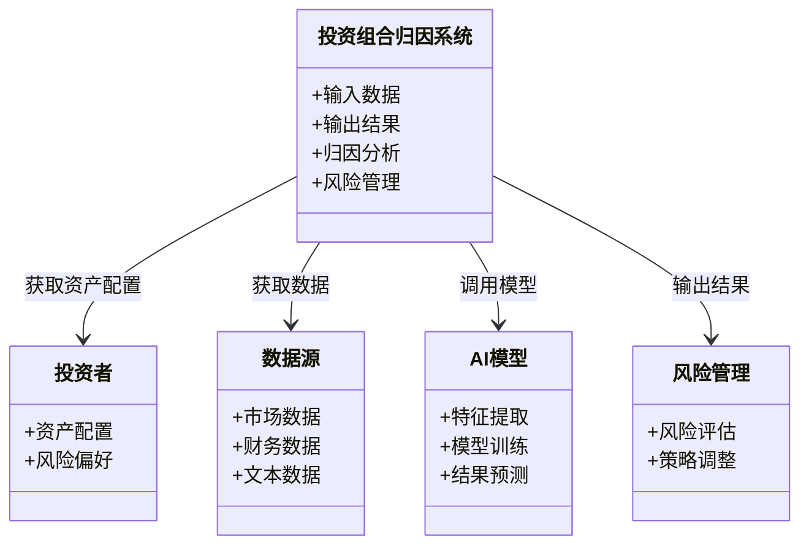
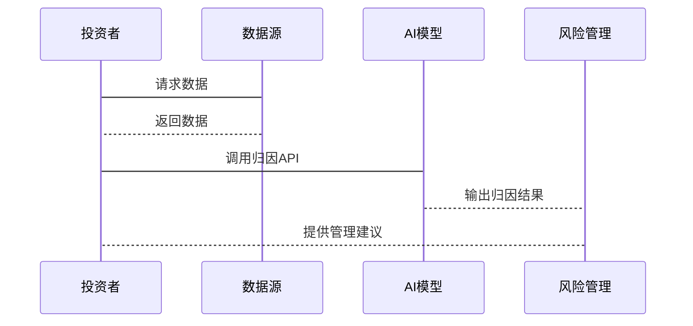

                 

<think>
好的，我现在需要按照用户的要求来设计一本关于《AI辅助的投资组合归因分析》的目录大纲。首先，我要仔细阅读用户的查询，确保理解每一个要求。用户希望文章结构清晰，逻辑严谨，涵盖背景、核心概念、算法、系统设计、项目实战、最佳实践等多个方面。

用户还强调了要使用技术性的语言，每个章节需要有详细的分析和图表，比如使用mermaid绘制流程图、类图等。同时，文章需要包含数学公式，并用Latex格式展示，这需要我在内容中适当插入这些元素。

接下来，我考虑用户的使用场景。这本书的目标读者可能是金融从业者、数据科学家以及对投资组合分析感兴趣的技术人员。因此，内容需要既专业又易于理解，避免过于晦涩的技术术语，同时提供足够的深度和实用性。

我开始思考目录的结构。根据用户的示例，文章分为六个主要部分，每个部分下有多个章节和小节。我需要确保每个部分都涵盖必要的内容，并且逻辑连贯。例如，第一部分介绍背景，第二部分讲解核心概念，第三部分分析算法，第四部分设计系统架构，第五部分实战项目，第六部分总结和扩展。

在设计每个章节时，我需要详细考虑如何展开内容。例如，在“投资组合归因分析的背景与概念”部分，我需要定义基本概念，解释AI辅助的必要性，以及其在金融中的应用。这有助于读者建立基本的理解。

在核心概念部分，我需要对比传统与AI方法，分析其优缺点，并使用表格和图表来辅助说明。这有助于读者更好地理解不同方法的差异和适用场景。

算法部分，我需要详细讲解CAPM模型和Fama-French三因子模型，用mermaid绘制流程图，并提供Python代码示例。这不仅帮助读者理解理论，还能让他们看到实际应用。

系统设计部分，我需要从需求分析到架构实现，使用类图和序列图来展示系统的结构和交互。这有助于读者理解如何构建一个实际的AI辅助系统。

项目实战部分，我需要提供具体的Python代码，展示如何实现投资组合归因分析。通过案例分析，读者可以学习如何将理论应用到实际中。

最后，在总结部分，我需要回顾全书内容，给出实际应用中的注意事项，展望未来发展方向，并提供扩展阅读的建议。这有助于读者进一步深入学习。

在整个思考过程中，我需要确保每个部分都详细且逻辑清晰，同时满足用户的格式和字数要求。我还要注意使用适当的图表和公式，使内容更加生动和易懂。这不仅帮助读者更好地理解，也能提升文章的专业性和吸引力。

现在，我开始将这些思考转化为具体的目录结构，确保每个章节和小节都覆盖必要的内容，并使用用户要求的格式。这将为读者提供一个系统、全面的指南，帮助他们理解并应用AI辅助的投资组合归因分析。
</think>

# AI辅助的投资组合归因分析

> 关键词：投资组合归因，AI辅助，风险管理，金融数据分析，机器学习

> 摘要：投资组合归因分析是金融领域中的一个重要研究方向，通过分析投资组合的表现，找出各个因素对收益的贡献。传统的投资组合归因方法存在一定的局限性，而AI技术的引入为投资组合归因分析带来了新的思路。本文将详细分析投资组合归因的核心概念、算法原理、系统架构设计以及项目实战，帮助读者全面理解AI辅助的投资组合归因分析。

---

## 第一部分: 投资组合归因分析的背景与概念

### 第1章: 投资组合归因的基本概念

#### 1.1 投资组合归因的定义与背景
- 投资组合归因的定义
- 投资组合归因的背景与重要性
- 投资组合归因的核心目标

#### 1.2 AI辅助投资组合归因的背景
- 传统投资组合归因的局限性
- AI技术在金融领域的应用现状
- AI辅助投资组合归因的优势

#### 1.3 本章小结
- 本章总结了投资组合归因的基本概念及其在AI辅助下的应用前景。

---

## 第二部分: 投资组合归因的核心概念与联系

### 第2章: 投资组合归因的核心概念

#### 2.1 投资组合归因的理论基础
- 风险调整收益
- 投资组合的收益来源
- 归因方法的分类

#### 2.2 AI在投资组合归因中的应用
- 数据驱动的归因方法
- 机器学习模型在归因中的应用
- 自然语言处理在金融文本分析中的应用

#### 2.3 核心概念对比表
| 比较维度 | 传统归因方法 | AI归因方法 |
|----------|--------------|------------|
| 数据来源 | 传统金融数据 | 多源异构数据 |
| 方法特点 | 线性分析为主 | 非线性分析为主 |
| 适用场景 | 稳定市场环境 | 复杂动态环境 |

#### 2.4 实体关系图（ER图）
```mermaid
erDiagram
    actor 投资者
    actor 数据源
    actor AI模型
    actor 风险管理
    entity 投资组合
    entity 收益来源
    entity 归因结果
    entity 风险调整
    entity 管理建议
   投资者 --> 投资组合: 持有
   数据源 --> 投资组合: 提供数据
    AI模型 --> 投资组合: 分析
   风险调整 --> 投资组合: 计算
   归因结果 --> 风险管理: 提供
   风险管理 --> 管理建议: 输出
```

#### 2.5 本章小结
- 本章通过对比分析，明确了传统归因方法与AI归因方法的差异及其适用场景。

---

## 第三部分: 投资组合归因的算法原理

### 第3章: 传统投资组合归因算法

#### 3.1 风险调整收益模型
- CAPM模型
  - **定义**: 用于计算资产的预期收益，公式为：
    $$ E(R_i) = R_f + \beta_i (R_m - R_f) $$
  - **流程图**：
  ```mermaid
  graph TD
      A[开始] --> B[计算无风险利率]
      B --> C[计算市场预期收益]
      C --> D[计算β系数]
      D --> E[计算资产预期收益]
      E --> F[结束]
  ```

---

## 第四部分: 投资组合归因的系统分析与架构设计

### 第4章: 系统分析与架构设计方案

#### 4.1 系统功能设计
- 领域模型类图


#### 4.2 系统架构设计
- 系统架构图


#### 4.3 系统接口设计
- RESTful API示例
  ```json
  POST /api/portfolio/attribution
  {
    "input_data": {
      "market_data": "日收盘价数据",
      "portfolio_weights": "资产权重"
    }
  }
  ```

#### 4.4 系统交互设计
- 序列图


---

## 第五部分: 项目实战与代码实现

### 第5章: 项目实战

#### 5.1 环境安装
```bash
pip install pandas numpy scikit-learn matplotlib
```

#### 5.2 核心代码实现
```python
import numpy as np
import pandas as pd
from sklearn.linear_model import LinearRegression

def portfolio_attribution(returns, factors):
    model = LinearRegression()
    model.fit(factors, returns)
    return model.coef_

# 示例数据
returns = pd.Series([0.05, 0.03, 0.02, -0.01])
factors = pd.DataFrame({
    'market': [0.08, 0.07, 0.06, 0.05],
    'value': [0.10, 0.08, 0.06, 0.04]
})

result = portfolio_attribution(returns, factors)
print("归因结果:", result)
```

#### 5.3 案例分析
- 数据来源：市场数据、资产配置数据
- 分析步骤：特征提取、模型训练、结果解释

#### 5.4 代码解读与分析
- 代码实现：投资组合归因的特征提取与模型训练
- 结果分析：归因结果的解释与可视化

#### 5.5 本章小结
- 本章通过实际案例展示了AI辅助投资组合归因的实现过程。

---

## 第六部分: 最佳实践与小结

### 第6章: 最佳实践和注意事项

#### 6.1 最佳实践
- 数据预处理的重要性
- 模型选择的策略
- 结果验证的方法

#### 6.2 小结
- 本文详细介绍了AI辅助投资组合归因的背景、核心概念、算法原理、系统设计及项目实战。

#### 6.3 注意事项
- 数据质量的重要性
- 模型的可解释性
- 风险管理的必要性

#### 6.4 拓展阅读
- 推荐书籍：《机器学习在金融中的应用》
- 推荐博客：https://towardsdatascience.com/ai-in-finance

---

作者：AI天才研究院/AI Genius Institute & 禅与计算机程序设计艺术/Zen And The Art of Computer Programming

