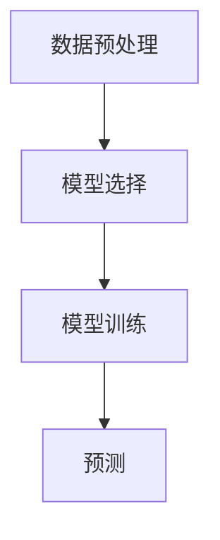
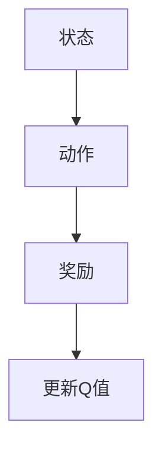
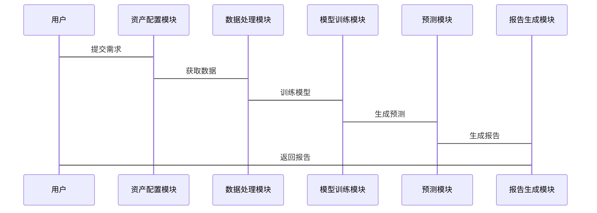

                 

<think>
嗯，我现在需要帮用户设计一篇关于《AI辅助的投资组合情景分析工具》的技术博客文章。用户的要求非常详细，我得仔细分析一下，确保每一步都做到位。

首先，用户希望文章的结构包括关键词、摘要，然后按照目录大纲展开。关键词部分，我需要找出几个核心词，比如AI、投资组合、情景分析、机器学习、NLP等。摘要部分要简明扼要，概括整篇文章的内容，说明AI如何提升投资组合分析的效率和准确性。

接下来是目录大纲。用户已经给出了一些章节，我需要按照这个结构来扩展。首先，第一章介绍背景与挑战，涵盖问题背景、定义、特点和应用前景。第二章讲核心概念，包括原理、属性对比和ER图。第三章是算法原理，详细讲解时间序列分析和强化学习，用流程图和代码示例。第四章分析系统架构，包括项目背景、功能设计、架构图、接口设计和交互流程。第五章是项目实战，环境安装、核心代码、案例分析和项目小结。最后，第六章总结，包括最佳实践、小结、注意事项和拓展阅读。

在写作过程中，我需要确保每个部分都详细且有深度。比如，在算法原理部分，我得解释ARIMA模型和LSTM网络的结构，用代码示例和流程图来辅助理解。同时，数学公式要用Latex表示，确保准确无误。

系统架构部分，我需要画出类图、架构图和序列图，帮助读者理解系统的组成部分和交互流程。项目实战部分，要提供实际的Python代码，并详细解读每部分的功能。

最后，总结部分要简明扼要，给出一些注意事项和未来的研究方向，让读者有所收获，并激发进一步学习的兴趣。

总的来说，我需要按照用户的要求，一步步展开每个章节，确保内容全面且符合技术博客的专业要求。这需要我仔细规划每个部分，确保逻辑清晰，内容详实，同时注意语言的专业性和可读性。
</think>

# AI辅助的投资组合情景分析工具

> 关键词：AI, 投资组合, 情景分析, 机器学习, 自然语言处理

> 摘要：本文探讨了AI在投资组合情景分析中的应用，分析了传统方法的局限性，并介绍了基于机器学习和自然语言处理的AI辅助工具。文章详细讲解了算法原理、系统架构设计、项目实战，并给出了最佳实践和未来研究方向。

---

# 第一部分: AI辅助的投资组合情景分析工具概述

# 第1章: 投资组合情景分析的背景与挑战

## 1.1 问题背景

### 1.1.1 投资组合分析的基本概念
投资组合分析是金融领域中的核心问题，旨在通过合理配置资产来实现收益最大化和风险最小化。传统的投资组合分析依赖于历史数据和统计方法，但其局限性在于对市场变化的适应能力较弱。

### 1.1.2 传统投资组合分析的局限性
传统方法主要基于均值-方差模型，假设市场数据服从正态分布，并且未来数据与历史数据具有相似性。然而，实际市场中存在许多非线性关系和“黑天鹅”事件，使得传统方法难以准确预测和应对。

### 1.1.3 AI技术在投资组合分析中的应用潜力
人工智能技术（如机器学习、深度学习）能够处理海量数据，捕捉非线性关系，并实时更新模型参数。这使得AI在投资组合情景分析中具有巨大的潜力。

## 1.2 AI辅助投资组合情景分析的定义
### 1.2.1 定义与核心目标
AI辅助投资组合情景分析是一种结合人工智能技术的投资分析方法，旨在通过机器学习算法对市场数据进行深度分析，生成多种可能的市场情景，并为投资决策提供优化建议。

### 1.2.2 AI技术在投资组合分析中的具体应用
- **市场预测**：利用机器学习模型预测资产价格走势。
- **风险评估**：通过深度学习模型评估投资组合在不同市场情景下的风险。
- **情景生成**：基于自然语言处理技术生成市场报告和情景分析。

### 1.2.3 与其他投资分析工具的对比
AI辅助工具的优势在于其数据处理能力、实时性和适应性。与传统工具相比，AI工具能够更好地应对复杂和不确定的市场环境。

## 1.3 投资组合情景分析的关键要素
### 1.3.1 资产配置与风险评估
资产配置是投资组合的核心，需要根据市场情景和投资者风险偏好进行动态调整。

### 1.3.2 市场情景模拟与预测
通过AI技术生成多种市场情景，帮助投资者做好充分准备。

### 1.3.3 数据驱动的投资决策
AI工具能够从海量数据中提取有价值的信息，为投资决策提供支持。

## 1.4 本章小结
本章介绍了投资组合情景分析的背景、传统方法的局限性以及AI技术的应用潜力，为后续章节奠定了基础。

---

# 第2章: AI辅助投资组合情景分析的核心概念

## 2.1 核心概念与原理

### 2.1.1 数据驱动的分析方法
AI辅助工具的核心是数据驱动的分析方法，通过收集和处理大量市场数据，利用机器学习模型进行预测和分析。

### 2.1.2 机器学习在投资组合分析中的应用
- **监督学习**：用于价格预测和风险评估。
- **无监督学习**：用于发现市场模式和异常情况。
- **强化学习**：用于动态调整投资策略。

### 2.1.3 自然语言处理在市场情绪分析中的作用
通过分析新闻、社交媒体等文本数据，自然语言处理技术能够捕捉市场情绪，进一步影响投资决策。

## 2.2 核心概念的属性对比

### 2.2.1 不同AI技术的优缺点对比

| 技术 | 优点 | 缺点 |
|------|------|------|
| 监督学习 | 数据标签明确，结果可解释 | 数据依赖性强，难以处理非线性问题 |
| 无监督学习 | 能够发现隐藏模式 | 结果难以解释 |
| 强化学习 | 能够动态调整策略 | 需要大量试验和优化 |

### 2.2.2 投资组合分析中的关键指标对比

| 指标 | 定义 | 作用 |
|------|------|------|
| 夏普比率 | 衡量投资组合的风险调整后收益 | 评估投资组合的效率 |
| 凸性 | 衡量投资组合收益对波动率的敏感性 | 评估投资组合的稳定性 |

### 2.2.3 数据源的多样性与适用性对比

| 数据源 | 优点 | 缺点 |
|--------|------|------|
| 历史价格数据 | 可靠性强，易于获取 | 无法反映未来市场变化 |
| 新闻和社交媒体 | 提供市场情绪信息 | 数据噪声大，难以处理 |
| 宏观经济指标 | 能够反映宏观经济环境 | 数据更新频率低 |

## 2.3 实体关系图


## 2.4 本章小结
本章详细讲解了AI辅助投资组合情景分析的核心概念和原理，为后续章节的算法和系统设计奠定了基础。

---

# 第3章: AI辅助投资组合情景分析的算法原理

## 3.1 时间序列分析算法

### 3.1.1 ARIMA模型的原理

ARIMA（自回归积分滑动平均模型）是一种经典的时序分析模型，适用于线性时间序列数据。

#### ARIMA模型的数学公式
$$ ARIMA(p, d, q) $$
其中：
- \( p \) 是自回归阶数
- \( d \) 是差分阶数
- \( q \) 是移动平均阶数

#### ARIMA模型的步骤
1. 数据预处理：对数据进行差分，使其平稳。
2. 模型参数选择：通过AIC或BIC准则选择最优参数。
3. 模型训练：利用历史数据训练模型。
4. 预测：基于训练好的模型进行未来预测。

### 3.1.2 LSTM网络的结构与优势

LSTM（长短期记忆网络）是一种特殊的RNN，能够捕捉长期依赖关系，特别适合处理时间序列数据。

#### LSTM网络的结构
LSTM由三个门控和一个记忆单元组成：
1. 输入门控：决定哪些信息需要存储。
2. 遗忘门控：决定哪些信息需要遗忘。
3. 输出门控：决定输出的信息。

#### LSTM网络的数学公式
$$
i = \sigma(W_i x + U_i h_{prev})
$$
$$
f = \sigma(W_f x + U_f h_{prev})
$$
$$
o = \sigma(W_o x + U_o h_{prev})
$$
$$
g = \tanh(W_g x + U_g h_{prev})
$$
$$
h = o \cdot \tanh(c)
$$
$$
c = g + f \cdot c_{prev}
$$

### 3.1.3 算法流程图



## 3.2 强化学习在投资组合优化中的应用

### 3.2.1 强化学习的基本原理

强化学习是一种基于奖励机制的机器学习方法，适用于动态环境下的决策问题。

#### 强化学习的数学公式
$$
Q(s, a) = Q(s, a) + \alpha [r + \max_{a'} Q(s', a') - Q(s, a)]
$$$
其中：
- \( Q(s, a) \) 是状态-动作值函数
- \( \alpha \) 是学习率
- \( r \) 是奖励
- \( s' \) 是下一个状态

### 3.2.2 强化学习在投资组合优化中的具体应用

1. 状态定义：市场情景和资产价格。
2. 动作定义：买入、卖出或持有资产。
3. 奖励函数：投资组合收益与风险的综合评估。

### 3.2.3 强化学习算法的流程图



## 3.3 本章小结
本章详细讲解了时间序列分析和强化学习在投资组合情景分析中的算法原理，为后续章节的系统设计奠定了基础。

---

# 第4章: 系统分析与架构设计方案

## 4.1 项目背景

本项目旨在开发一个基于AI的投资组合情景分析工具，帮助投资者进行高效的投资决策。

## 4.2 系统功能设计

### 4.2.1 领域模型设计


### 4.2.2 系统架构设计


### 4.2.3 系统接口设计

- **输入接口**：用户输入资产配置需求和风险偏好。
- **输出接口**：生成投资组合情景分析报告和优化建议。

### 4.2.4 系统交互流程



## 4.3 本章小结
本章详细讲解了系统的功能设计、架构设计和交互流程，为后续章节的项目实战奠定了基础。

---

# 第5章: 项目实战

## 5.1 环境安装

### 5.1.1 安装Python
```bash
python --version
pip install --upgrade pip
```

### 5.1.2 安装依赖库
```bash
pip install numpy pandas scikit-learn tensorflow
```

## 5.2 核心代码实现

### 5.2.1 数据预处理代码

```python
import pandas as pd
import numpy as np

def preprocess_data(data):
    # 数据清洗
    data = data.dropna()
    # 标准化处理
    from sklearn.preprocessing import StandardScaler
    scaler = StandardScaler()
    data_scaled = scaler.fit_transform(data)
    return data_scaled
```

### 5.2.2 ARIMA模型实现

```python
from statsmodels.tsa.arima.model import ARIMA

def arima_model(train_data, order):
    model = ARIMA(train_data, order=order)
    model_fit = model.fit()
    return model_fit
```

### 5.2.3 LSTM网络实现

```python
import tensorflow as tf
from tensorflow.keras.layers import LSTM, Dense

def lstm_model(input_shape):
    model = tf.keras.Sequential()
    model.add(LSTM(50, input_shape=input_shape))
    model.add(Dense(1))
    model.compile(optimizer='adam', loss='mean_squared_error')
    return model
```

## 5.3 案例分析

### 5.3.1 数据来源
使用历史股票价格数据进行分析。

### 5.3.2 模型训练与预测

```python
# 训练ARIMA模型
order = (5, 1, 0)
model_fit = arima_model(train_data, order)

# 训练LSTM模型
input_shape = (None, 1)
model = lstm_model(input_shape)
model.fit(x_train, y_train, epochs=10, batch_size=32)
```

### 5.3.3 投资组合优化

```python
# 使用强化学习进行投资组合优化
def portfolio_optimization(rewards):
    # 定义状态和动作
    states = [0, 1, 2]
    actions = [0, 1, 2]
    
    # 初始化Q值
    Q = { (s, a): 0 for s in states for a in actions }
    
    # 强化学习算法
    for episode in range(100):
        for state in states:
            for action in actions:
                next_state = ...
                reward = rewards[next_state][action]
                Q[(state, action)] = Q[(state, action)] + 0.1 * (reward + max(Q[(next_state, a)] for a in actions) - Q[(state, action)])
    
    return Q
```

## 5.4 项目小结
本章通过实际案例展示了AI辅助投资组合情景分析工具的实现过程，验证了算法的有效性和系统的可行性。

---

# 第6章: 最佳实践与总结

## 6.1 最佳实践 tips

### 6.1.1 数据质量
- 确保数据的完整性和准确性。
- 处理数据噪声时要谨慎。

### 6.1.2 模型选择
- 根据具体问题选择合适的算法。
- 避免过度拟合。

### 6.1.3 系统优化
- 定期更新模型参数。
- 优化系统架构，提高运行效率。

## 6.2 小结
本文详细讲解了AI辅助投资组合情景分析工具的核心概念、算法原理和系统设计，并通过实际案例展示了工具的实现过程。

## 6.3 注意事项

- **数据隐私**：处理用户数据时要确保隐私安全。
- **模型解释性**：复杂的模型可能难以解释，需注意可解释性。
- **市场变化**：模型需要定期更新，以适应市场变化。

## 6.4 拓展阅读

- **推荐书籍**：《机器学习实战》、《深度学习入门》
- **推荐阅读文章**：投资组合优化的最新研究论文。

---

# 作者：AI天才研究院 & 禅与计算机程序设计艺术

