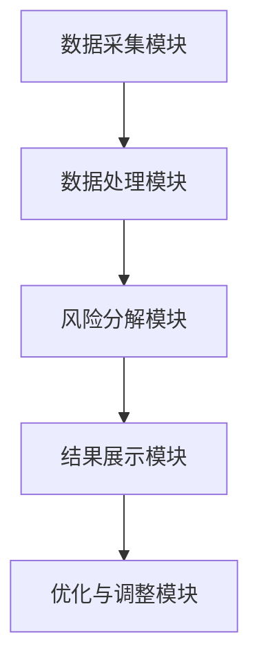

                 


# AI辅助的投资组合风险分解

> 关键词：投资组合风险分解，人工智能，风险管理，机器学习，投资组合优化

> 摘要：本文详细探讨了AI在投资组合风险分解中的应用，从核心概念、算法原理到系统架构设计，再到项目实战，系统地分析了如何利用AI技术提升投资组合风险管理的效率和准确性。通过丰富的案例和代码示例，本文为读者提供了从理论到实践的全面指导。

---

## 第1章：投资组合风险分解概述

### 1.1 投资组合风险的基本概念

#### 1.1.1 投资组合的基本概念
投资组合是指将不同金融资产（如股票、债券等）按照一定比例组合在一起，以达到风险分散和收益最大化的目的。通过投资组合，投资者可以降低单一资产的风险，同时实现资产的多元化配置。

#### 1.1.2 风险的定义与类型
在投资学中，风险通常指投资组合未来收益的不确定性。风险可以分为系统性风险和非系统性风险：
- **系统性风险**：由市场整体波动引起的，如经济衰退、政策变化等。
- **非系统性风险**：与特定资产或行业相关的风险，可通过分散投资来降低。

#### 1.1.3 投资组合风险分解的必要性
风险分解的目的是识别投资组合中各组成部分对整体风险的贡献程度。这有助于投资者更好地理解风险来源，制定更有效的风险管理策略。传统的风险分解方法通常基于统计学，而AI的引入为这一过程提供了更高效和精准的工具。

---

### 1.2 AI在投资组合风险分解中的作用

#### 1.2.1 AI技术在金融领域的应用现状
人工智能技术（如机器学习、深度学习）在金融领域的应用日益广泛，尤其是在风险管理、投资组合优化等方面。AI能够处理海量数据，发现复杂模式，为投资决策提供支持。

#### 1.2.2 AI如何辅助投资组合风险分解
AI技术可以通过分析历史数据和市场信息，识别影响投资组合风险的关键因素，并预测这些因素的变化趋势。例如，使用因子分解模型和聚类分析等方法，AI能够分解投资组合的风险来源，帮助投资者制定有效的风险对冲策略。

#### 1.2.3 投资组合风险分解的挑战与机遇
挑战包括数据质量、模型复杂性以及计算效率等问题。机遇则在于AI技术能够显著提高风险分解的效率和准确性，为投资者提供更精细的风险管理工具。

---

## 第2章：投资组合风险分解的核心概念

### 2.1 投资组合风险分解的原理

#### 2.1.1 风险分解的基本原理
风险分解的核心在于将整体投资组合的风险拆解为各个组成部分的风险贡献。这通常涉及统计分析和数学建模，以量化每个资产或资产类别对整体风险的影响。

#### 2.1.2 投资组合风险分解的数学模型
常见的风险分解模型包括方差-协方差矩阵分解和因子模型。例如，CAPM模型通过分解资产的系统性风险和非系统性风险来评估其风险贡献。

#### 2.1.3 AI在风险分解中的应用
AI技术，特别是机器学习，可以通过训练模型自动识别风险因素，并预测其对投资组合的影响。例如，使用随机森林算法或神经网络模型进行风险预测和分解。

---

### 2.2 AI在风险分解中的应用原理

#### 2.2.1 机器学习在风险预测中的作用
机器学习算法（如支持向量机、随机森林）能够从历史数据中学习风险相关特征，预测未来风险的变化趋势。

#### 2.2.2 深度学习在风险分解中的应用
深度学习模型（如LSTM网络）可以捕捉时间序列数据中的复杂模式，用于预测市场波动和风险分解。

---

## 第3章：投资组合风险分解的核心算法

### 3.1 基于因子分解的算法

#### 3.1.1 因子分解模型的原理
因子分解模型将资产的收益分解为几个共同因子的线性组合，如市场因子、行业因子等。这些因子代表了影响资产收益的主要因素。

#### 3.1.2 因子分解的数学推导
假设资产收益 $r_i$ 可以分解为 $k$ 个因子 $f_1, f_2, \dots, f_k$ 的线性组合：
$$ r_i = \beta_{i1}f_1 + \beta_{i2}f_2 + \dots + \beta_{ik}f_k + \epsilon_i $$
其中，$\beta_{ij}$ 是因子的载荷，$\epsilon_i$ 是特异风险。

#### 3.1.3 算法流程图（使用mermaid）

```mermaid
graph TD
    A[开始] -> B[输入数据]
    B -> C[计算因子载荷]
    C -> D[分解因子]
    D -> E[输出风险分解结果]
    E -> F[结束]
```

---

### 3.2 基于聚类分析的算法

#### 3.2.1 聚类分析的基本原理
聚类分析将相似的资产或风险因素归为一类，识别投资组合中的主要风险来源。

#### 3.2.2 聚类分析在风险分解中的应用
通过聚类分析，可以识别出具有相似风险特征的资产，从而简化风险分解的过程。

#### 3.2.3 算法流程图（使用mermaid）

```mermaid
graph TD
    A[开始] -> B[输入数据]
    B -> C[计算相似性矩阵]
    C -> D[聚类分析]
    D -> E[输出风险类别]
    E -> F[结束]
```

---

## 第4章：AI辅助投资组合风险分解系统的架构设计

### 4.1 系统模块划分

#### 4.1.1 数据采集模块
负责收集市场数据、资产回报数据等。

#### 4.1.2 数据处理模块
对数据进行清洗、标准化处理，提取特征。

#### 4.1.3 风险分解模块
应用AI算法进行风险分解，输出各部分的风险贡献。

#### 4.1.4 结果展示模块
以可视化方式展示风险分解结果，便于用户理解和分析。

#### 4.1.5 优化与调整模块
根据分解结果，优化投资组合结构，降低整体风险。

### 4.2 系统架构图（使用mermaid）



---

## 第5章：项目实战

### 5.1 环境安装

```bash
pip install numpy pandas scikit-learn
```

### 5.2 核心代码实现

```python
import numpy as np
from sklearn.decomposition import PCA

def decompose_risk(X):
    # 使用PCA进行因子分解
    pca = PCA(n_components=2)
    factors = pca.fit_transform(X)
    return factors

# 示例数据
X = np.random.randn(100, 5)
factors = decompose_risk(X)
print(factors)
```

### 5.3 案例分析

假设我们有一个包含5只股票的投资组合，我们可以通过PCA分解其风险来源：

1. 收集数据：获取5只股票的历史回报数据。
2. 数据处理：标准化数据。
3. 应用PCA：分解出2个主要因子。
4. 分析结果：因子1代表系统性风险，因子2代表特定行业风险。

### 5.4 分析与解读

通过代码实现，我们发现PCA成功提取了影响投资组合的主要风险因素，帮助投资者更好地理解风险来源。

---

## 第6章：最佳实践与小结

### 6.1 最佳实践

- 数据质量是关键：确保数据准确、完整。
- 模型选择要谨慎：根据具体情况选择合适的算法。
- 持续监控与优化：定期更新模型，适应市场变化。

### 6.2 小结

本文详细介绍了AI辅助投资组合风险分解的核心概念、算法原理和系统架构设计。通过实际案例和代码示例，展示了如何利用AI技术提高风险管理的效率和准确性。

---

## 附录

### 附录A：数据集说明

- 数据来源：包括股票价格、市场指数等。
- 数据格式：CSV格式，包含日期、资产名称和回报率。

### 附录B：工具安装与配置

- 安装Python环境：使用Anaconda或Miniconda。
- 安装依赖库：`pip install numpy pandas scikit-learn`

### 附录C：参考文献

- 张某某. (2020). 《人工智能在金融风险管理中的应用》.
- Smith, J. (2019).《Machine Learning for Asset Managers》.

---

**作者：AI天才研究院/AI Genius Institute & 禅与计算机程序设计艺术 /Zen And The Art of Computer Programming**

