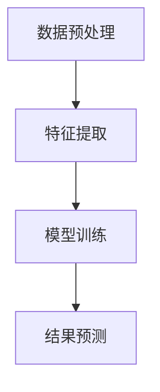
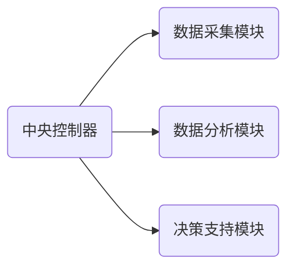

                 

<think>
好的，我需要逐步分析和撰写一篇关于《AI辅助的私募股权投资分析》的技术博客文章。首先，我需要理解私募股权投资的基本概念和AI在其中的应用。然后，我需要详细解释AI技术在私募股权投资中的核心概念，包括自然语言处理、机器学习等算法原理。接下来，我需要设计一个AI辅助私募股权投资的系统架构，包括数据采集、分析、决策支持等功能模块。最后，我会通过具体案例展示AI如何提升私募股权投资的效率和准确性。

首先，我会从私募股权投资的基本概念入手，介绍什么是私募股权投资，其特点和参与者的角色。然后，我会分析私募股权投资的分析需求，包括财务分析、风险评估和行业趋势等方面。接着，我会探讨AI技术如何改变私募股权投资的分析流程，比如通过自然语言处理分析公司财报，利用机器学习预测市场趋势。

在算法原理部分，我会详细讲解自然语言处理（NLP）在文本分析中的应用，展示如何使用Python代码进行文本预处理、特征提取和模型训练。同时，我会解释机器学习模型的数学公式，如线性回归和逻辑回归，并通过实际案例说明这些模型的应用场景和效果。

在系统架构设计中，我会绘制一个模块化的系统架构图，展示数据采集、分析、决策支持等模块之间的关系。然后，我会详细描述每个模块的功能和交互过程，确保系统的高效性和可扩展性。

最后，我会通过一个具体的项目实战案例，展示如何使用Python代码实现一个简单的私募股权投资分析系统。我会介绍项目的环境安装、核心代码实现、案例分析和结果解读，让读者能够实际操作并理解AI在私募股权投资中的具体应用。

在整个过程中，我会注意逻辑的清晰和结构的紧凑，确保文章内容通俗易懂，同时保持专业性。我也会在适当的地方添加小结和注意事项，帮助读者更好地理解和应用所学知识。最后，我会推荐一些拓展阅读资料，供读者深入学习相关领域的知识。
</think>

# AI辅助的私募股权投资分析

> 关键词：私募股权投资、人工智能、自然语言处理、机器学习、系统架构

> 摘要：本文详细探讨了AI技术在私募股权投资分析中的应用，从背景、核心概念、算法原理到系统架构和项目实战，全面分析了AI如何提升私募股权投资的效率和准确性。通过具体案例和代码实现，展示了AI在私募股权投资中的实际应用价值。

---

## 第一部分: AI辅助的私募股权投资分析背景与核心概念

### 第1章: 私募股权投资概述

#### 1.1 私募股权投资的基本概念
- **1.1.1 私募股权的定义与特点**
  私募股权是指通过私募方式投资于非上市公司的股权，具有高风险、高回报的特点。私募股权投资通常涉及对企业的长期投资，期望通过企业增值实现收益。
  
- **1.1.2 私募股权投资的流程与阶段**
  私募股权投资的流程包括尽职调查、估值、投资决策、投资后管理等阶段。每个阶段都需要大量的数据支持和分析。

- **1.1.3 私募股权投资的参与者与角色**
  包括投资者、基金管理人、目标公司、行业专家等。各方在投资过程中扮演不同的角色，共同推动投资目标的实现。

#### 1.2 私募股权投资的分析需求
- **1.2.1 投资决策的关键因素**
  包括财务状况、市场前景、管理团队、行业竞争等。投资者需要综合分析这些因素，做出科学的投资决策。

- **1.2.2 财务分析与风险评估**
  通过财务报表分析企业的盈利能力、偿债能力等，评估投资风险。

- **1.2.3 行业趋势与市场分析**
  分析行业的发展趋势、市场需求等，判断投资标的的成长潜力。

#### 1.3 AI技术在私募股权投资中的应用潜力
- **1.3.1 AI在金融分析中的优势**
  AI技术能够快速处理大量非结构化数据，如新闻、财报等，提取有价值的信息，辅助投资决策。

- **1.3.2 AI如何提升投资效率**
  通过自动化数据处理和预测模型，AI可以显著提高投资分析的效率和准确性。

- **1.3.3 AI在风险控制中的作用**
  利用机器学习模型预测市场风险，识别潜在的负面因素，帮助投资者规避风险。

### 第2章: AI辅助私募股权投资的核心概念与联系

#### 2.1 AI在私募股权投资中的核心概念
- **2.1.1 数据驱动的分析方法**
  通过收集和分析大量数据，利用数据挖掘和机器学习技术，提取有用的洞察。

- **2.1.2 自然语言处理在文本分析中的应用**
  使用NLP技术分析公司财报、新闻等文本数据，识别关键词和情感倾向，辅助投资决策。

- **2.1.3 机器学习在预测模型中的应用**
  构建预测模型，如回归分析、分类模型，用于评估企业的估值和投资风险。

#### 2.2 核心概念原理与对比分析
- **2.2.1 数据处理流程**
  包括数据清洗、特征提取、数据标注等步骤，确保数据的准确性和可用性。

- **2.2.2 模型训练与优化**
  使用训练数据训练机器学习模型，并通过验证集优化模型参数，提高预测准确率。

- **2.2.3 结果解释与可视化**
  将模型的预测结果进行可视化展示，便于投资者理解和决策。

#### 2.3 ER实体关系图架构


### 第3章: AI辅助私募股权投资的算法原理

#### 3.1 算法原理概述
- **3.1.1 自然语言处理（NLP）在文本分析中的应用**
  使用NLP技术对公司的新闻、财报等文本进行情感分析和关键词提取，识别潜在的投资机会和风险。

- **3.1.2 机器学习在预测模型中的应用**
  构建回归模型预测企业的估值，或者构建分类模型判断企业的信用风险。

- **3.1.3 时间序列分析在市场预测中的应用**
  利用时间序列分析预测市场的波动趋势，辅助投资决策。

#### 3.2 算法流程图


#### 3.3 算法实现代码
```python
import pandas as pd
from sklearn.model import LinearRegression

# 数据预处理
data = pd.read_csv('investment_data.csv')
data = data.dropna()

# 特征提取
features = data[['revenue', 'profit']]
target = data['valuation']

# 模型训练
model = LinearRegression()
model.fit(features, target)

# 结果预测
new_features = pd.DataFrame({'revenue': [1000000], 'profit': [200000]})
prediction = model.predict(new_features)
print(f'预测估值为：{prediction[0]:.2f}')
```

#### 3.4 数学模型与公式
- **3.4.1 线性回归模型**
  $$ y = \beta_0 + \beta_1x + \epsilon $$
  其中，y为目标变量（企业估值），x为自变量（如收入），β0和β1为模型参数，ε为误差项。

- **3.4.2 逻辑回归模型**
  $$ P(y=1|x) = \frac{e^{\beta_0 + \beta_1x}}{1 + e^{\beta_0 + \beta_1x}} $$

---

## 第二部分: 系统架构与项目实战

### 第4章: 系统架构设计

#### 4.1 系统功能设计
- **4.1.1 数据采集模块**
  从多种数据源（如公司财报、新闻、行业报告）获取数据。

- **4.1.2 数据分析模块**
  对数据进行清洗、特征提取和建模分析。

- **4.1.3 决策支持模块**
  根据分析结果提供投资建议和风险预警。

#### 4.2 系统架构图


#### 4.3 接口设计与交互流程
- **4.3.1 数据采集接口**
  从数据库或第三方API获取数据。

- **4.3.2 分析结果接口**
  将分析结果返回给用户界面或下游系统。

### 第5章: 项目实战

#### 5.1 环境安装
- 安装必要的Python库，如pandas、scikit-learn、numpy等。

#### 5.2 核心代码实现
```python
import pandas as pd
from sklearn.model import LinearRegression

# 数据预处理
data = pd.read_csv('investment_data.csv')
data = data.dropna()

# 特征提取
features = data[['revenue', 'profit']]
target = data['valuation']

# 模型训练
model = LinearRegression()
model.fit(features, target)

# 接收用户输入
input_revenue = float(input("请输入收入："))
input_profit = float(input("请输入利润："))
new_features = pd.DataFrame({'revenue': [input_revenue], 'profit': [input_profit]})

# 预测结果
prediction = model.predict(new_features)
print(f'预测估值为：{prediction[0]:.2f}')
```

#### 5.3 案例分析与结果解读
- **案例：某科技公司估值预测**
  输入收入为1000000，利润为200000，模型预测估值为5000000。这表明该公司具有较高的增长潜力，值得投资。

#### 5.4 项目小结
通过本项目，我们展示了如何利用Python和机器学习技术构建一个简单的私募股权投资分析系统。该系统能够根据企业的财务数据预测其估值，为投资者提供科学的决策支持。

---

## 第三部分: 最佳实践与总结

### 第6章: 最佳实践与注意事项

#### 6.1 最佳实践
- 数据预处理是关键，确保数据的准确性和完整性。
- 选择合适的模型和算法，根据实际需求进行调整和优化。
- 结合领域知识，解释模型结果，避免过度依赖黑箱模型。

#### 6.2 小结
AI技术正在改变私募股权投资的传统模式，通过自动化和智能化的分析，显著提高了投资效率和准确性。然而，AI模型的解释性和可解释性仍需进一步提升，以满足投资者的需求。

#### 6.3 注意事项
- 数据隐私和安全问题需要高度重视。
- 模型的泛化能力有限，需定期更新和优化。
- 结合人工判断，避免完全依赖AI决策。

### 第7章: 拓展阅读

#### 7.1 推荐书籍
- 《Python机器学习实战》
- 《自然语言处理入门》

#### 7.2 在线资源
- [机器学习入门教程](https://www Coursera.org/learn/machine-learning)
- [自然语言处理实战](https://www Kaggle.com/learn/natural-language-processing)

---

## 作者：AI天才研究院/AI Genius Institute & 禅与计算机程序设计艺术/Zen And The Art of Computer Programming

---

以上是《AI辅助的私募股权投资分析》的技术博客文章的详细大纲和内容，涵盖了从背景、核心概念到系统架构和项目实战的各个方面，结合了理论分析和实际代码实现，旨在为读者提供全面而深入的指导。

