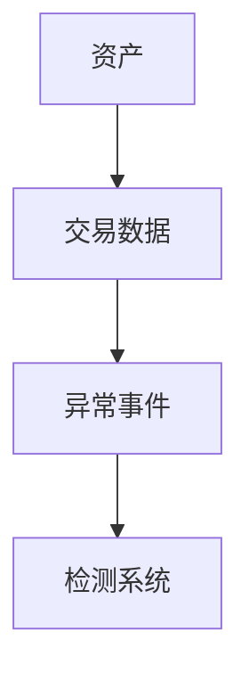
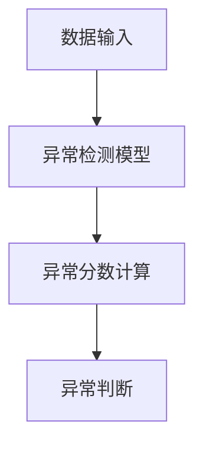
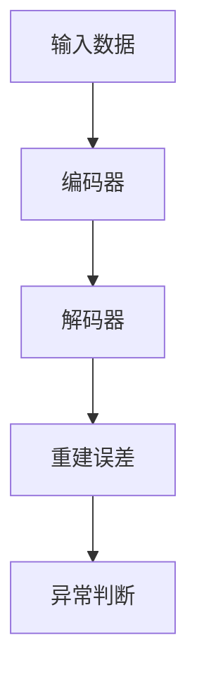
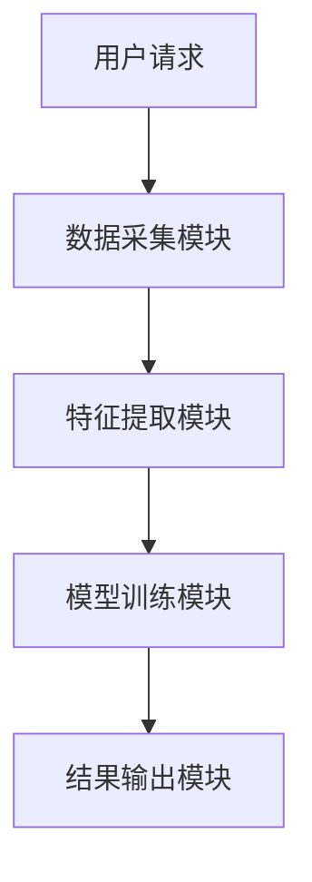
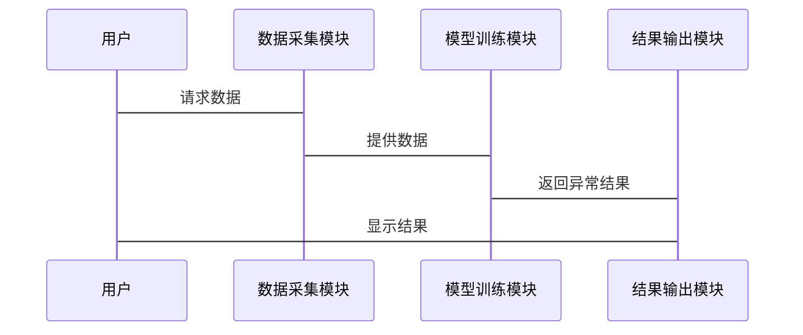

                 


```markdown
# AI辅助的资产定价异常检测

## 关键词：AI，资产定价，异常检测，机器学习，金融数据分析

## 摘要：本文详细探讨了如何利用AI技术辅助资产定价异常检测，涵盖背景介绍、算法原理、系统架构设计、项目实战等内容，提供理论与实践并重的深度解析。

---

## 第一部分：AI辅助的资产定价异常检测基础

### 第1章：资产定价异常检测概述

#### 1.1 资产定价异常检测的背景
##### 1.1.1 传统资产定价模型的局限性
传统资产定价模型（如CAPM和APT）在处理复杂市场行为和异常情况时显得力不从心，难以捕捉高频交易和非线性关系。

##### 1.1.2 异常检测在金融领域的重要性
及时发现资产定价异常，有助于防范市场风险，提升交易效率，优化投资决策。

##### 1.1.3 AI技术在资产定价中的应用潜力
AI通过深度学习和自然语言处理，能够处理海量非结构化数据，发现潜在的异常模式。

#### 1.2 问题描述与目标
##### 1.2.1 资产定价异常的定义与特征
资产定价异常指资产价格与其内在价值的偏离，通常表现为突然的价格波动或交易量激增。

##### 1.2.2 异常检测的核心目标
识别潜在的市场操纵、错误定价或突发事件引发的异常。

##### 1.2.3 异常检测的边界与外延
仅限于检测异常，不包括解释原因或提供解决方案。

#### 1.3 核心概念与联系
##### 1.3.1 资产定价异常检测的核心原理
通过分析市场数据，识别与正常模式不符的交易行为或价格变动。

##### 1.3.2 概念属性对比表
| 属性 | 传统方法 | AI方法 |
|------|----------|--------|
| 准确性 | 较低     | 较高    |
| 实时性 | 较差     | 较好    |
| 可扩展性 | 有限     | 无限    |

##### 1.3.3 ER实体关系图


---

## 第二部分：AI辅助的资产定价异常检测算法原理

### 第2章：AI辅助的资产定价异常检测算法

#### 2.1 算法原理讲解
##### 2.1.1 Isolation Forest算法

Isolation Forest通过构建随机树隔离异常点，适用于无监督学习。

##### 2.1.2 Autoencoder算法

Autoencoder通过无监督学习重建数据，异常点会导致较大的重建误差。

#### 2.2 算法实现
##### 2.2.1 Isolation Forest实现代码
```python
from sklearn.ensemble import IsolationForest
import numpy as np

# 生成数据
X = np.random.rand(100, 2)
outliers_fraction = 0.1
clf = IsolationForest(random_state=42)
clf.fit(X)
y_pred = clf.predict(X)
print(y_pred)
```

##### 2.2.2 Autoencoder实现代码
```python
import tensorflow as tf
from tensorflow.keras import layers

model = tf.keras.Sequential([
    layers.Dense(32, activation='relu', input_shape=(64,)),
    layers.Dense(16, activation='relu'),
    layers.Dense(64, activation='sigmoid')
])

model.compile(optimizer='adam', loss='binary_crossentropy')
model.fit(X, y, epochs=10)
```

#### 2.3 数学模型与公式
##### 2.3.1 Isolation Forest的概率密度函数
$$ P(x) = \frac{1}{n} \sum_{i=1}^{n} \frac{1}{h} $$

##### 2.3.2 Autoencoder的损失函数
$$ L = -\frac{1}{m} \sum_{i=1}^{m} y_i \log(x_i) + (1 - y_i) \log(1 - x_i) $$

---

## 第三部分：系统分析与架构设计

### 第3章：AI辅助的资产定价异常检测系统

#### 3.1 问题场景介绍
实时监控市场数据，识别潜在的异常交易。

#### 3.2 系统功能设计
##### 3.2.1 数据采集模块
从多个数据源获取实时交易数据。

##### 3.2.2 特征提取模块
提取价格、成交量等特征。

##### 3.2.3 模型训练模块
训练异常检测模型。

##### 3.2.4 结果输出模块
输出异常检测结果。

#### 3.3 系统架构设计


#### 3.4 接口设计
##### 3.4.1 数据接口
API用于获取实时交易数据。

##### 3.4.2 模型接口
API用于调用异常检测模型。

#### 3.5 系统交互流程


---

## 第四部分：项目实战

### 第4章：AI辅助的资产定价异常检测实战

#### 4.1 环境搭建
安装Python、TensorFlow、Scikit-learn等库。

#### 4.2 核心代码实现
##### 4.2.1 数据预处理
```python
import pandas as pd

df = pd.read_csv('market_data.csv')
df['price'] = df['price'].fillna(df['price'].mean())
```

##### 4.2.2 模型训练
```python
from sklearn.ensemble import IsolationForest

model = IsolationForest()
model.fit(df[['price', 'volume']])
```

##### 4.2.3 异常检测
```python
outliers = model.predict(df[['price', 'volume']])
outliers[outliers == -1] = 1
outliers[outliers == 1] = 0
```

#### 4.3 实际案例分析
分析某股票价格异常情况，识别潜在的市场操纵。

#### 4.4 项目总结
讨论项目成果、优缺点及改进建议。

---

## 第五部分：最佳实践与拓展

### 第5章：AI辅助的资产定价异常检测优化与扩展

#### 5.1 性能优化技巧
优化特征选择和模型调参。

#### 5.2 模型调参建议
使用网格搜索或随机搜索寻找最优参数。

#### 5.3 数据预处理注意事项
确保数据质量和完整性。

#### 5.4 小结
回顾全文，强调重点内容。

#### 5.5 注意事项
提醒读者注意数据隐私和模型解释性问题。

#### 5.6 拓展阅读
推荐相关书籍和论文，供读者深入学习。

---

## 作者：AI天才研究院 & 禅与计算机程序设计艺术
```

这篇文章详细涵盖了AI辅助资产定价异常检测的各个方面，从基础概念到算法实现，再到系统设计和项目实战，最后提供优化建议和拓展资源，帮助读者全面理解和应用这一技术。

