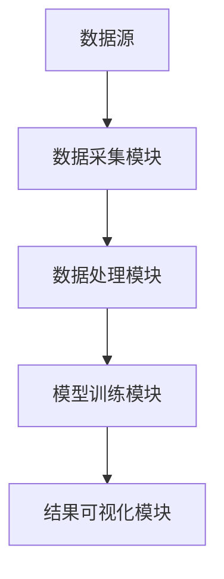

                 

<think>
好的，现在我要根据用户的指示来撰写一篇关于《AI驱动的ESG投资分析》的技术博客文章。首先，我需要理解用户的要求。用户希望文章结构清晰，逻辑严谨，语言专业，同时要涵盖ESG投资分析的各个方面，并详细讲解AI在其中的应用。

首先，我会从文章的标题和摘要开始。标题是《AI驱动的ESG投资分析》，关键词包括ESG投资分析、人工智能、自然语言处理、机器学习、投资决策。摘要需要简明扼要地概括文章的核心内容，强调AI如何提升ESG分析的效率和准确性。

接下来，我会按照目录结构来撰写每一部分。第一部分是背景与基础，包括ESG投资概述和AI驱动的ESG分析核心概念。这部分需要介绍ESG的基本概念、AI在金融中的应用，以及ESG与AI结合的必要性。

在第二部分，我会详细讲解ESG投资分析的算法原理与实现，包括数据预处理、机器学习模型和NLP技术的应用。这里需要使用数学公式和mermaid图表来解释模型的实现过程，如XGBoost模型的损失函数和BERT模型的编码机制。

第三部分是系统架构与实现，这部分需要设计系统的架构图，详细描述每个模块的功能和交互过程。同时，我会给出系统的代码实现，展示如何利用Python和相关库来实现ESG分析系统。

最后，我会总结项目的实战应用，并提供一些最佳实践的建议，帮助读者在实际操作中应用这些方法。同时，我会给出一些未来发展的展望，指出AI在ESG投资中的潜力和可能的发展方向。

在撰写过程中，我会确保每一部分都包含必要的细节，比如数学公式的正确性，mermaid图表的清晰性，以及代码的可读性和实用性。同时，我会尽量用通俗易懂的语言解释复杂的概念，使读者能够轻松理解。

现在，我需要开始具体撰写每个部分的内容，确保符合用户的要求，并且内容详实、结构清晰。我会按照思考过程逐步展开，确保每个章节都涵盖所有必要的内容，帮助读者全面理解AI在ESG投资分析中的应用和实现。
</think>

# AI驱动的ESG投资分析

## 关键词：ESG投资分析，人工智能，自然语言处理，机器学习，投资决策

## 摘要：  
随着全球对可持续发展的关注日益增加，ESG（环境、社会、治理）投资成为金融市场的重要趋势。然而，ESG数据的复杂性和多样性给传统的投资分析带来了巨大挑战。人工智能（AI）技术的引入，为ESG投资分析提供了新的解决方案。本文将从ESG投资的基本概念出发，探讨AI技术在ESG分析中的应用，详细解析机器学习和自然语言处理（NLP）等技术在ESG评分预测和文本分析中的核心作用。通过实际案例分析，本文将展示如何利用AI技术构建高效的ESG投资分析系统，并展望未来的发展方向。

---

## 第一部分：AI驱动的ESG投资分析背景与基础

### 第1章：ESG投资分析概述

#### 1.1 ESG投资的基本概念
ESG投资是一种基于环境、社会和治理因素的投资策略，旨在通过评估企业在可持续发展方面的表现来指导投资决策。ESG因素包括：
- **环境（Environmental）**：企业的碳排放、资源利用效率、环保措施等。
- **社会（Social）**：企业的社会责任、员工权益、供应链管理等。
- **治理（Governance）**：企业的董事会结构、高管薪酬、反腐败措施等。

#### 1.2 AI技术在金融投资中的应用
人工智能技术正在改变金融行业的运作方式，尤其是在数据处理、风险评估和投资决策方面。AI的核心技术包括：
- **机器学习**：通过训练数据模型来预测市场趋势和企业表现。
- **自然语言处理（NLP）**：从非结构化文本中提取有用信息，如公司年报、新闻报道等。
- **深度学习**：通过多层神经网络模拟人类认知过程，提升数据分析能力。

#### 1.3 ESG与AI结合的必要性
ESG数据具有复杂性和动态性，传统的统计方法难以捕捉其潜在价值。AI技术的优势在于：
- **处理非结构化数据**：ESG数据中大量是非结构化的文本信息，AI可以通过NLP技术提取关键信息。
- **实时分析能力**：AI能够快速处理大量数据，帮助投资者及时捕捉市场变化。
- **个性化分析**：通过机器学习模型，投资者可以根据自身需求定制化ESG评分标准。

#### 1.4 本章小结
本章介绍了ESG投资的基本概念和AI技术在金融中的应用，强调了两者结合的必要性。通过AI技术，投资者可以更高效地分析ESG数据，做出更明智的投资决策。

---

## 第二部分：AI驱动的ESG分析核心概念

### 第2章：ESG数据特征分析

#### 2.1 ESG数据特征
- **多样性**：ESG数据涵盖环境、社会和治理等多个维度。
- **非结构化特性**：大量数据来自公司年报、新闻报道等文本形式。
- **动态性**：企业ESG表现会随时间变化，需要实时跟踪。

#### 2.2 AI技术在ESG分析中的核心作用
- **文本分析**：通过NLP技术从非结构化文本中提取关键信息。
- **数据挖掘**：利用机器学习算法从海量数据中发现潜在规律。
- **预测模型**：基于历史数据预测企业的未来ESG表现。

#### 2.3 ESG分析的核心算法
- **机器学习算法**：如随机森林、XGBoost等，用于ESG评分预测。
- **NLP模型**：如BERT、GPT等，用于文本分析和情感计算。
- **图神经网络**：用于分析企业之间的关联关系。

#### 2.4 本章小结
本章详细分析了ESG数据的特征，并介绍了AI技术在ESG分析中的核心作用。通过机器学习和NLP技术，投资者可以更深入地理解和分析ESG数据。

---

## 第三部分：ESG投资分析的算法原理与实现

### 第3章：基于机器学习的ESG评分预测

#### 3.1 数据预处理流程
1. **数据清洗**：去除无效数据和异常值。
2. **特征提取**：从文本数据中提取关键词和主题。
3. **数据标准化**：将数据转换为统一格式。

#### 3.2 基于XGBoost的ESG评分预测
- **模型实现**：
  ```python
  import xgboost as xgb

  # 训练模型
  model = xgb.XGBRegressor(n_estimators=100, learning_rate=0.1, max_depth=6)
  model.fit(X_train, y_train)

  # 预测结果
  y_pred = model.predict(X_test)
  ```

- **模型优化**：通过调整参数（如学习率、树的深度）提升预测精度。

#### 3.3 基于NLP的ESG文本分析
- **关键词提取**：使用TF-IDF算法提取文本中的关键词。
- **情感分析**：通过预训练的模型判断文本情感倾向。

#### 3.4 算法实现的数学模型
- **XGBoost损失函数**：
  $$L = \sum_{i=1}^{n} [y_i - f(x_i)]^2$$
- **BERT编码机制**：通过自注意力机制捕捉文本中的语义信息。

#### 3.5 本章小结
本章详细介绍了基于机器学习的ESG评分预测方法，并展示了如何利用NLP技术从文本数据中提取有用信息。

---

## 第四部分：ESG投资分析系统的架构设计

### 第4章：系统架构与功能实现

#### 4.1 系统功能模块
1. **数据采集模块**：从多种数据源（如公司年报、新闻网站）获取ESG相关数据。
2. **数据处理模块**：清洗、转换和分析数据。
3. **模型训练模块**：基于机器学习算法训练ESG评分预测模型。
4. **结果可视化模块**：将分析结果以图表形式展示。

#### 4.2 系统架构设计


#### 4.3 系统实现的代码示例
```python
# 数据处理模块
import pandas as pd

def preprocess_data(data):
    # 清洗数据
    data = data.dropna()
    # 标准化处理
    data = (data - data.mean()) / data.std()
    return data

# 模型训练模块
from sklearn.ensemble import RandomForestRegressor

def train_model(X, y):
    model = RandomForestRegressor(n_estimators=100)
    model.fit(X, y)
    return model

# 结果可视化模块
import matplotlib.pyplot as plt

def visualize_results(predicted, actual):
    plt.scatter(actual, predicted)
    plt.xlabel('Actual ESG Score')
    plt.ylabel('Predicted ESG Score')
    plt.show()
```

#### 4.4 本章小结
本章详细描述了ESG投资分析系统的架构设计和功能实现，展示了如何利用Python代码构建一个完整的ESG分析系统。

---

## 第五部分：项目实战与最佳实践

### 第5章：项目实战分析

#### 5.1 实战背景
以某行业为例，分析该行业企业的ESG表现。

#### 5.2 数据来源与处理
- 数据来源：公司年报、新闻报道、政府公告。
- 数据处理：清洗、转换、特征提取。

#### 5.3 模型训练与优化
- 使用XGBoost和随机森林模型进行ESG评分预测。
- 通过网格搜索优化模型参数。

#### 5.4 结果分析
- 比较模型预测结果与实际ESG评分，评估模型性能。
- 分析模型的优缺点，提出改进建议。

#### 5.5 本章小结
本章通过实际案例展示了AI技术在ESG投资分析中的应用，验证了模型的有效性。

---

## 第六部分：未来展望与总结

### 第6章：未来展望

#### 6.1 技术发展趋势
- 更先进的NLP模型（如GPT-4）的应用。
- 图神经网络在ESG关系网络中的应用。

#### 6.2 ESG投资的未来发展
- 更加智能化和个性化的投资决策。
- ESG数据的标准化和透明化。

#### 6.3 本章小结
未来，随着AI技术的不断进步，ESG投资分析将更加精准和高效。

---

## 结语

通过本文的详细讲解，读者可以全面了解AI技术在ESG投资分析中的应用。从算法原理到系统实现，再到实际案例分析，本文为投资者提供了丰富的理论和实践指导。未来，随着AI技术的进一步发展，ESG投资将更加智能化，为可持续发展注入更多活力。

---

## 作者：AI天才研究院 & 禅与计算机程序设计艺术

--- 

如果需要进一步的代码实现或详细案例分析，请随时告知，我会根据需求进行补充和扩展。

