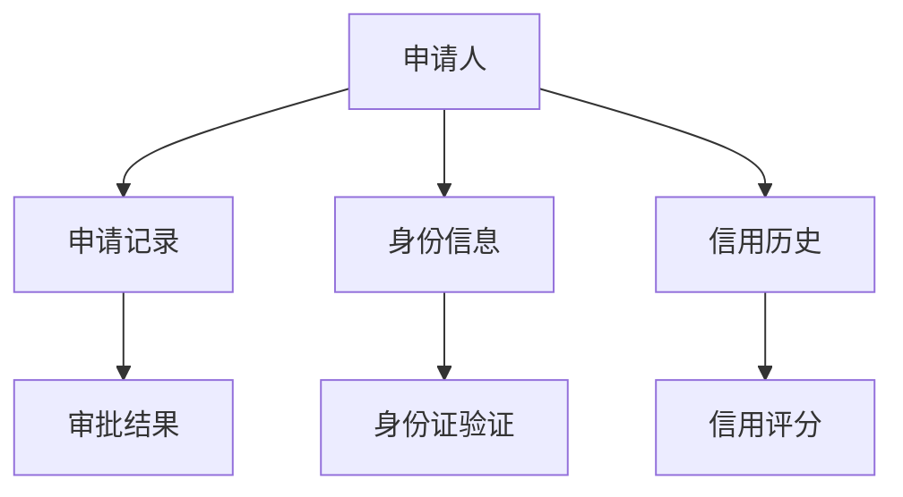
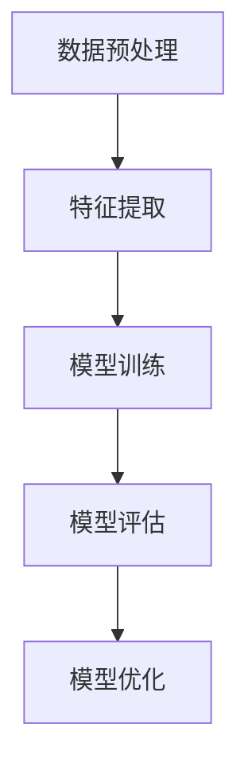
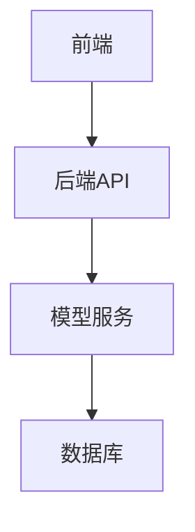

                 


# AI驱动的个人信贷审批系统设计

> 关键词：AI驱动，个人信贷，审批系统，机器学习，系统设计

> 摘要：本文详细探讨了AI驱动的个人信贷审批系统的设计与实现，从背景、核心概念、算法原理到系统架构，再到项目实战，系统地分析了AI技术在信贷审批中的应用，提出了优化方案，并通过实际案例展示了系统的应用价值。

---

## 第一部分：AI在金融领域的应用

### 1.1 AI在金融领域的应用现状

人工智能（AI）技术在金融领域的应用日益广泛，尤其是在信贷审批、风险评估、欺诈检测等方面，展现了强大的潜力。AI通过大数据分析和机器学习算法，能够快速处理大量数据，识别潜在风险，提高决策效率和准确性。

#### 1.1.1 人工智能在金融行业的应用领域

- **信用评估**：利用机器学习模型评估客户的信用风险。
- **欺诈检测**：通过AI识别异常交易行为，预防欺诈。
- **投资决策**：基于市场数据和模型预测，辅助投资决策。
- **客户画像**：通过数据挖掘技术构建客户画像，进行精准营销。

#### 1.1.2 AI在信贷审批中的优势

- **高效性**：AI能够快速处理大量数据，缩短审批时间。
- **准确性**：通过机器学习模型，提高风险评估的准确性。
- **可扩展性**：AI系统能够处理大量的信贷申请，扩展性强。

#### 1.1.3 当前信贷审批系统的主要痛点

- **效率低下**：传统信贷审批流程繁琐，耗时长。
- **人为误差**：人工审核可能存在主观判断错误。
- **风险控制不足**：难以及时发现潜在风险。

---

## 第二部分：个人信贷审批系统的背景与挑战

### 2.1 个人信贷审批的流程与关键环节

#### 2.1.1 传统信贷审批流程

1. **申请提交**：客户提交信贷申请。
2. **资料审核**：人工审核申请资料，包括身份验证、收入证明等。
3. **信用评估**：评估客户的信用状况，决定是否批准贷款。
4. **审批结果通知**：通知客户审批结果。

#### 2.1.2 AI驱动的信贷审批流程

1. **数据采集**：自动化采集客户的个人信息、信用历史等数据。
2. **数据预处理**：清洗和标准化数据。
3. **模型预测**：利用机器学习模型预测客户的信用风险。
4. **结果输出**：系统自动输出审批结果，减少人为干预。

#### 2.1.3 流程优化的必要性

通过AI技术优化信贷审批流程，减少人工干预，提高效率和准确性，降低成本。

---

## 第三部分：AI驱动的信贷审批系统的核心概念

### 3.1 系统核心概念与定义

#### 3.1.1 AI驱动的定义

AI驱动的信贷审批系统是指利用人工智能技术，包括机器学习、自然语言处理等，来自动化处理信贷申请、评估风险、做出审批决策的系统。

#### 3.1.2 信贷审批系统的定义

信贷审批系统是指用于评估客户信用风险，决定是否批准贷款的系统，传统系统依赖人工审核，而AI驱动的系统则利用AI技术进行自动化处理。

#### 3.1.3 关键要素的界定

- **数据来源**：包括客户的基本信息、信用历史、财务数据等。
- **AI算法**：包括逻辑回归、随机森林、神经网络等机器学习算法。
- **系统架构**：包括数据采集、数据处理、模型训练、结果输出等模块。

---

### 3.2 核心概念的属性对比

| **属性**       | **传统信贷审批系统**                          | **AI驱动的信贷审批系统**                     |
|-----------------|----------------------------------------------|-----------------------------------------------|
| **数据处理**   | 人工处理，效率低，易出错                     | 自动化处理，高效准确                        |
| **风险评估**   | 依赖人工经验，主观性强                      | 基于数据和模型，客观性高                   |
| **审批时间**   | 时间长，效率低                              | 时间短，效率高                              |
| **成本**       | 人工成本高                                  | 人工成本低，系统自动化                     |

---

### 3.3 ER实体关系图



---

## 第四部分：AI驱动的信贷审批系统的算法原理

### 4.1 机器学习算法在信贷审批中的应用

#### 4.1.1 逻辑回归模型

逻辑回归是一种常用的分类算法，适用于二分类问题。在信贷审批中，可以用来预测客户违约的概率。

公式：
$$ P(y=1|x) = \frac{1}{1 + e^{-\beta x}} $$

#### 4.1.2 随机森林模型

随机森林是一种基于决策树的集成学习算法，能够处理高维数据，适合信贷审批中的多特征分析。

#### 4.1.3 神经网络模型

神经网络是一种模拟人脑神经网络的深度学习算法，适用于复杂的非线性关系分析。

---

### 4.2 算法流程图



---

## 第五部分：系统架构与设计

### 5.1 系统架构设计

#### 5.1.1 分层架构

系统分为前端、后端、数据层，每一层独立运行，便于管理和维护。

#### 5.1.2 微服务架构

系统采用微服务架构，每个服务独立运行，通过API进行通信，提高系统的扩展性和灵活性。

#### 5.1.3 组件交互关系



---

### 5.2 系统功能设计

#### 5.2.1 用户界面

- **申请表单**：用户填写信贷申请信息。
- **结果显示**：系统输出审批结果，包括批准或拒绝。

#### 5.2.2 数据处理

- **数据采集**：通过API接口获取客户数据。
- **数据清洗**：处理缺失值、异常值等。

#### 5.2.3 AI模型服务

- **模型调用**：通过API调用机器学习模型进行预测。
- **结果返回**：将预测结果返回给前端。

---

## 第六部分：项目实战

### 6.1 环境安装

- **Python**：安装Python 3.8及以上版本。
- **库的安装**：安装pandas、numpy、scikit-learn等库。

### 6.2 核心实现代码

#### 数据预处理代码

```python
import pandas as pd

# 读取数据
data = pd.read_csv('credit_data.csv')

# 处理缺失值
data = data.dropna()

# 标准化数据
from sklearn.preprocessing import StandardScaler
scaler = StandardScaler()
data_scaled = scaler.fit_transform(data)
```

#### 模型训练代码

```python
from sklearn.model_selection import train_test_split
from sklearn.linear_model import LogisticRegression

# 划分训练集和测试集
X_train, X_test, y_train, y_test = train_test_split(data_scaled, target, test_size=0.2)

# 训练模型
model = LogisticRegression()
model.fit(X_train, y_train)

# 预测结果
y_pred = model.predict(X_test)
```

---

### 6.3 案例分析

通过实际案例分析，展示系统的应用效果。例如，一个客户提交信贷申请，系统通过逻辑回归模型预测其违约概率，最终输出审批结果。

---

## 第七部分：总结与展望

### 7.1 系统应用价值

- **提高效率**：AI驱动的信贷审批系统能够快速处理大量数据，提高审批效率。
- **降低风险**：通过机器学习模型，提高风险评估的准确性，降低违约率。

### 7.2 系统优缺点

- **优点**：高效、准确、可扩展。
- **缺点**：依赖数据质量，模型可能存在过拟合问题。

### 7.3 注意事项

- **数据隐私**：确保客户数据的安全性和隐私性。
- **模型解释性**：提高模型的可解释性，便于审核人员理解。

### 7.4 未来展望

随着AI技术的不断发展，信贷审批系统将更加智能化和自动化，未来可能会引入更复杂的模型和更先进的技术，进一步提升系统的性能和用户体验。

---

## 作者

作者：AI天才研究院/AI Genius Institute & 禅与计算机程序设计艺术 /Zen And The Art of Computer Programming

