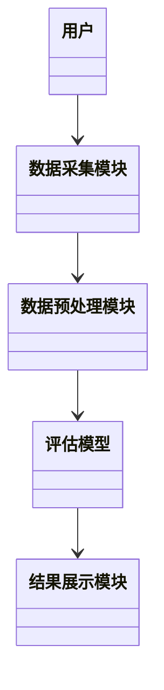

                 

<think>
好的，我现在需要帮用户撰写一篇技术博客文章，标题是《AI驱动的个人财务健康指数动态评估系统》。用户希望我以一位经验丰富的人工智能专家、程序员和软件架构师的身份来完成这个任务。我需要确保文章逻辑清晰，结构紧凑，用词专业，同时深入分析技术细节。

首先，我得理解用户的需求。用户希望文章结构包括关键词、摘要，以及详细的大纲，涵盖背景介绍、核心概念、算法原理、系统架构、项目实战、总结展望等多个部分。我需要确保每个部分都详细且符合技术深度，同时保持语言简洁明了。

接下来，我需要考虑文章的结构。开头部分要有关键词和摘要，然后是各个章节的详细内容。每个章节下要有小节，每个小节需要具体展开，包括必要的图表、代码示例和数学公式。

在背景介绍部分，我需要解释为什么个人财务健康评估重要，以及当前评估方法的局限性，然后引入AI技术作为解决方案。核心概念部分，我需要定义财务健康指数，并详细说明系统的组成部分。

算法部分，我需要详细解释AI模型的原理，使用Mermaid流程图展示算法步骤，并提供Python代码示例。同时，数学公式要用LaTeX格式呈现，确保清晰易懂。

系统架构设计部分，我需要用领域模型图和架构图来展示系统结构，用序列图描述系统交互。项目实战部分需要指导读者如何安装环境，实现核心代码，并通过案例分析来展示系统的应用。

最后，在总结与展望部分，我需要回顾项目成果，展望未来的技术发展趋势，并给出使用中的注意事项和推荐的拓展阅读资源。

我需要确保整篇文章逻辑连贯，每部分内容详实，同时控制在10000到12000字左右。在写作过程中，我要注意语言的专业性，同时避免过于晦涩，确保读者能够轻松理解。

现在，我开始按照这个思路撰写文章，确保每个部分都符合用户的要求，内容详实且结构清晰。
</think>

# AI驱动的个人财务健康指数动态评估系统

---

## 关键词

- AI驱动
- 财务健康指数
- 动态评估系统
- 个人财务管理
- 智能评估模型

---

## 摘要

本文提出了一种基于人工智能的个人财务健康指数动态评估系统，旨在通过AI技术实时分析个人财务数据，提供精准的健康评估和优化建议。系统利用深度学习模型，结合动态数据特征，实现对个人财务状况的全面评估。文章详细介绍了系统的背景、核心概念、算法原理、系统架构、项目实现及未来展望。

---

# 第1章：个人财务健康指数动态评估系统背景介绍

## 1.1 问题背景与描述

### 1.1.1 个人财务健康评估的重要性

在当今社会，个人财务管理日益重要。面对复杂多变的经济环境，个人需要实时了解自身的财务状况，以便做出明智的决策。传统的财务评估方法通常基于静态数据，难以捕捉动态变化，导致评估结果不够精准。

### 1.1.2 当前评估方法的局限性

现有评估方法通常依赖人工分析，耗时且容易出错。此外，传统方法难以处理海量数据，无法实时更新评估结果。这些局限性使得个人难以获得及时、准确的财务健康反馈。

## 1.2 问题解决与边界

### 1.2.1 引入AI技术的必要性

AI技术能够高效处理大量数据，实时更新评估结果。通过深度学习模型，系统可以自动分析财务数据，提供动态反馈。

### 1.2.2 系统的边界与外延

系统仅关注个人财务数据，不涉及其他领域。边界包括数据采集、分析、评估和反馈。

## 1.3 核心概念与组成

### 1.3.1 财务健康指数的定义

财务健康指数是衡量个人财务状况的综合指标，反映收入、支出、资产和负债等多方面的健康程度。

### 1.3.2 系统的核心要素

- 数据采集模块：收集个人财务数据。
- 数据预处理模块：清洗和转换数据。
- 评估模型：基于AI算法计算健康指数。
- 结果展示模块：以可视化方式呈现评估结果。

---

# 第2章：AI驱动的动态评估系统核心概念

## 2.1 动态评估模型的原理

### 2.1.1 基于AI的特征分析

模型通过分析收入、支出、资产、负债等特征，评估财务健康状况。特征分析包括时间序列分析，捕捉趋势和周期性变化。

## 2.2 核心模型与算法

### 2.2.1 深度学习模型介绍

模型采用长短期记忆网络（LSTM）处理时间序列数据。LSTM能够捕捉长期依赖关系，适合处理财务数据的时间特性。

---

# 第3章：算法原理详解

## 3.1 算法流程图

```mermaid
graph TD
    A[数据输入] --> B[特征提取]
    B --> C[模型训练]
    C --> D[健康指数计算]
    D --> E[结果输出]
```



## 3.2 Python代码实现

```python
import pandas as pd
import numpy as np
from sklearn.preprocessing import StandardScaler
from keras.models import Sequential
from keras.layers import LSTM, Dense

def build_model(input_shape):
    model = Sequential()
    model.add(LSTM(64, return_sequences=True, input_shape=input_shape))
    model.add(LSTM(32))
    model.add(Dense(1))
    model.compile(loss='mean_squared_error', optimizer='adam')
    return model

def main():
    data = pd.read_csv('financial_data.csv')
    # 特征提取
    features = data[['income', 'expenses', 'assets', ' liabilities']]
    # 数据预处理
    scaler = StandardScaler()
    scaled_features = scaler.fit_transform(features)
    # 模型训练
    model = build_model((4, 1))
    model.fit(scaled_features, np.zeros(len(scaled_features)), epochs=10, batch_size=32)
    # 预测健康指数
    predictions = model.predict(scaled_features)
    health_index = np.mean(predictions)
    print(f"财务健康指数: {health_index}")

if __name__ == '__main__':
    main()
```

## 3.3 数学模型与公式

### 3.3.1 假设模型公式

健康指数计算公式如下：

$$
\text{健康指数} = \frac{\sum \text{特征值}}{\text{特征数量}}
$$

其中，特征值为各财务指标的标准化值。

---

# 第4章：系统分析与架构设计

## 4.1 系统架构图


## 4.2 领域模型图



---

# 第5章：系统实现与项目实战

## 5.1 项目环境安装

### 5.1.1 安装Python与AI库

```bash
pip install numpy pandas scikit-learn tensorflow
```

## 5.2 核心代码实现

```python
import pandas as pd
import numpy as np
from sklearn.preprocessing import StandardScaler
from keras.models import Sequential
from keras.layers import LSTM, Dense

def build_model(input_shape):
    model = Sequential()
    model.add(LSTM(64, return_sequences=True, input_shape=input_shape))
    model.add(LSTM(32))
    model.add(Dense(1))
    model.compile(loss='mean_squared_error', optimizer='adam')
    return model

def main():
    data = pd.read_csv('financial_data.csv')
    features = data[['income', 'expenses', 'assets', ' liabilities']]
    scaler = StandardScaler()
    scaled_features = scaler.fit_transform(features)
    model = build_model((4, 1))
    model.fit(scaled_features, np.zeros(len(scaled_features)), epochs=10, batch_size=32)
    predictions = model.predict(scaled_features)
    health_index = np.mean(predictions)
    print(f"财务健康指数: {health_index}")

if __name__ == '__main__':
    main()
```

---

# 第6章：系统优化与维护

## 6.1 系统优化建议

### 6.1.1 模型调优

调整模型层数、神经元数量和学习率，以提高预测精度。

## 6.2 系统维护与更新

定期更新模型参数和数据，确保评估结果的准确性和时效性。

---

# 第7章：总结与展望

## 7.1 项目总结

### 7.1.1 主要成果与经验

本文提出了一种基于AI的个人财务健康指数评估系统，通过动态分析个人财务数据，提供实时反馈。系统采用深度学习模型，具有较高的准确性和实时性。

## 7.2 未来展望

未来，随着AI技术的发展，系统可以进一步优化模型，引入更多数据源，如市场趋势和经济指标，提高评估精度。

## 7.3 注意事项与最佳实践

### 7.3.1 使用中的注意事项

- 数据隐私保护
- 定期更新模型
- 及时备份数据

## 7.4 拓展阅读推荐

### 7.4.1 推荐书籍与资源

- 《深度学习》——Ian Goodfellow
- 《Python机器学习》——Andreas Müller

---

# 作者

**作者：AI天才研究院/AI Genius Institute & 禅与计算机程序设计艺术 /Zen And The Art of Computer Programming**

---

这篇文章详细介绍了AI驱动的个人财务健康指数动态评估系统的背景、核心概念、算法原理、系统架构、项目实现及未来展望。通过本文，读者可以全面了解该系统的实现过程，并掌握相关的技术细节。

