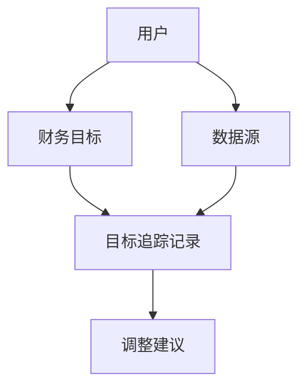
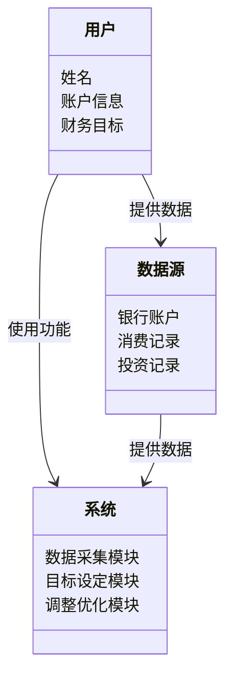
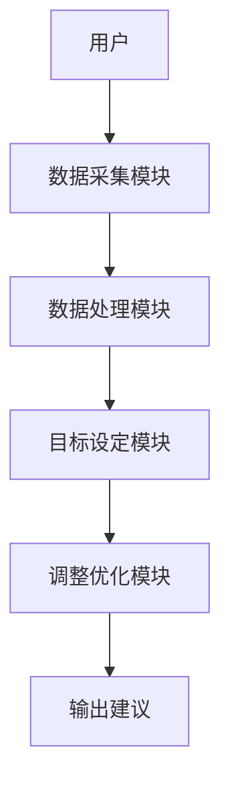
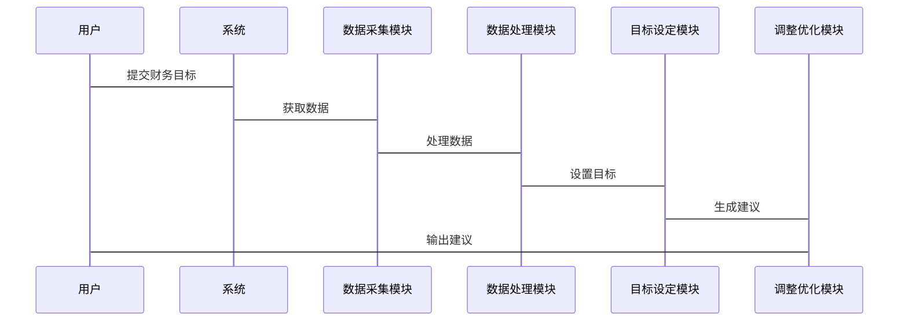

                 


# AI驱动的个人财务目标追踪与调整系统

## 关键词
AI技术、个人财务管理、目标追踪、自动调整、机器学习、深度学习、系统架构

## 摘要
本文深入探讨了AI驱动的个人财务目标追踪与调整系统的构建与实现。通过分析个人财务管理的痛点，结合AI技术的优势，提出了一套完整的系统解决方案。文章详细介绍了系统的背景、核心概念、算法原理、数学模型、系统架构设计、项目实战以及最佳实践，为读者提供了从理论到实践的全面指导。

---

# 第一部分: 系统背景与核心概念

## 第1章: 个人财务目标追踪与调整的背景与挑战

### 1.1 个人财务目标管理的重要性
#### 1.1.1 个人财务目标管理的核心概念
- **财务目标**：指个人或家庭在一定时间内希望实现的财务相关目标，如储蓄、投资收益、债务清偿等。
- **目标追踪**：通过数据采集和分析，实时监控目标的实现进度。
- **自动调整**：根据实际情况动态优化目标和行动计划。

#### 1.1.2 当前个人财务管理的主要痛点
- **信息孤岛**：财务数据分散在不同平台，难以整合和分析。
- **人工依赖**：传统财务管理依赖手动记录和分析，效率低且容易出错。
- **缺乏预见性**：无法根据市场变化和自身情况自动调整财务计划。

#### 1.1.3 AI技术在个人财务管理中的潜力
- **数据整合与分析**：AI可以自动采集、整理和分析多源数据。
- **智能预测与决策**：利用机器学习模型预测财务状况并提供优化建议。
- **实时调整与反馈**：AI系统可以实时监控财务数据并动态调整目标。

### 1.2 AI驱动的财务目标追踪与调整的必要性
#### 1.2.1 传统财务管理的局限性
- **效率低下**：人工记录和分析耗时且容易出错。
- **缺乏个性化**：传统方法难以根据个人情况提供定制化建议。
- **预见性不足**：无法根据市场变化和自身财务状况进行动态调整。

#### 1.2.2 AI技术如何解决传统财务管理问题
- **自动化数据处理**：AI可以自动采集和整理财务数据，减少人工干预。
- **智能预测与优化**：利用机器学习模型预测财务状况并提供优化建议。
- **实时反馈与调整**：AI系统可以实时监控财务数据并动态调整目标。

#### 1.2.3 个人财务目标追踪与调整的AI驱动优势
- **高效性**：AI可以快速处理大量数据，提高财务管理效率。
- **个性化**：AI可以根据个人财务状况和目标提供定制化建议。
- **预见性**：AI可以通过历史数据和市场趋势预测未来财务状况，提供前瞻性建议。

### 1.3 本章小结
#### 1.3.1 核心概念总结
- 个人财务目标管理是实现财务自由的重要手段。
- AI技术的应用可以显著提高财务管理的效率和准确性。

#### 1.3.2 未来发展趋势展望
- 随着AI技术的不断发展，个人财务管理将更加智能化和个性化。
- 财务目标追踪与调整系统将成为个人财务管理的核心工具。

---

## 第2章: AI驱动的个人财务目标追踪与调整系统的核心概念

### 2.1 系统核心概念与定义
#### 2.1.1 AI驱动的定义
- **AI驱动**：系统利用人工智能技术（如机器学习、深度学习）进行数据处理、预测和决策。

#### 2.1.2 个人财务目标的定义与分类
- **短期目标**：如应急基金、旅行预算。
- **中期目标**：如购房、购车。
- **长期目标**：如退休储蓄、财富传承。

#### 2.1.3 系统的核心功能模块
- **数据采集与处理**：从银行账户、交易记录等多源数据中提取和整理财务数据。
- **目标设定与追踪**：根据用户输入的目标，实时监控目标的实现进度。
- **自动调整与优化**：根据实际情况动态优化目标和行动计划。

### 2.2 核心概念的属性特征对比
| 特性 | 数据采集与处理 | 目标设定与追踪 | 自动调整与优化 |
|------|----------------|----------------|----------------|
| 输入 | 多源异构数据    | 用户输入目标   | 系统自动生成建议 |
| 输出 | 结构化数据      | 进度报告        | 优化方案        |
| 方法 | 数据清洗、特征提取 | 时间序列分析   | 机器学习模型    |
| 目标 | 提供干净数据     | 监控目标进度   | 动态优化目标    |

### 2.3 ER实体关系图架构


### 2.4 本章小结
#### 2.4.1 核心概念的系统性分析
- AI驱动的个人财务目标追踪与调整系统通过整合多源数据，实时监控目标进度并动态优化，显著提高了财务管理的效率和准确性。

#### 2.4.2 系统架构的初步框架
- 系统主要包括数据采集与处理、目标设定与追踪、自动调整与优化三大功能模块。

---

## 第3章: AI驱动的个人财务目标追踪与调整系统的算法原理

### 3.1 数据预处理与特征提取
#### 3.1.1 数据清洗与标准化
- **数据清洗**：去除无效数据、填补缺失值、处理异常值。
- **标准化**：将数据归一化，方便模型处理。
$$ x' = \frac{x - \mu}{\sigma} $$
其中，$\mu$是均值，$\sigma$是标准差。

#### 3.1.2 特征选择与降维
- **特征选择**：通过相关性分析选择重要特征。
- **主成分分析（PCA）**：将高维数据降维，减少计算复杂度。
$$ \text{PCA} = X^T X $$

### 3.2 目标追踪与预测算法
#### 3.2.1 基于机器学习的预测模型
- **线性回归模型**：用于预测目标的实现进度。
$$ y = \beta x + \epsilon $$
其中，$\beta$是回归系数，$\epsilon$是误差项。

#### 3.2.2 基于深度学习的预测模型
- **LSTM网络**：用于处理时间序列数据，预测未来的财务状况。
$$ y_t = \alpha y_{t-1} + \beta x_{t} + \epsilon $$

### 3.3 自动调整与优化算法
#### 3.3.1 基于强化学习的调整策略
- **Q-learning算法**：通过奖励机制优化调整策略。
$$ Q(s, a) = r + \gamma \max Q(s', a') $$

---

## 第4章: AI驱动的个人财务目标追踪与调整系统的数学模型与公式

### 4.1 数据预处理与特征提取的数学模型
#### 4.1.1 数据标准化公式
$$ x' = \frac{x - \mu}{\sigma} $$
其中，$\mu$是均值，$\sigma$是标准差。

#### 4.1.2 主成分分析公式
$$ \text{PCA} = X^T X $$

### 4.2 目标预测的数学模型
#### 4.2.1 线性回归模型
$$ y = \beta x + \epsilon $$
其中，$\beta$是回归系数，$\epsilon$是误差项。

#### 4.2.2 时间序列预测模型
$$ y_t = \alpha y_{t-1} + \beta x_{t} + \epsilon $$

### 4.3 自动调整与优化的数学模型
#### 4.3.1 强化学习的Q-learning算法
$$ Q(s, a) = r + \gamma \max Q(s', a') $$

---

## 第5章: 系统分析与架构设计方案

### 5.1 问题场景介绍
- **用户需求**：用户希望通过系统实现财务目标的智能追踪与调整。
- **系统目标**：构建一个高效、智能的个人财务目标追踪与调整系统。

### 5.2 系统功能设计
#### 5.2.1 领域模型


### 5.3 系统架构设计


### 5.4 系统交互设计


---

## 第6章: 项目实战

### 6.1 环境安装
- **Python**：安装Python 3.x及以上版本。
- **库依赖**：安装`pandas`, `numpy`, `scikit-learn`, `tensorflow`等库。

### 6.2 系统核心实现源代码
#### 6.2.1 数据预处理代码
```python
import pandas as pd
import numpy as np

def data_preprocessing(data):
    # 去除缺失值
    data = data.dropna()
    # 标准化处理
    data[['收入', '支出']] = (data[['收入', '支出']] - data[['收入', '支出']].mean()) / data[['收入', '支出']].std()
    return data
```

#### 6.2.2 模型实现代码
```python
from sklearn.linear_model import LinearRegression
from sklearn.metrics import mean_squared_error

def train_model(X, y):
    model = LinearRegression()
    model.fit(X, y)
    return model
```

### 6.3 代码应用解读与分析
- **数据预处理**：通过标准化处理，将收入和支出数据归一化，方便模型训练。
- **模型训练**：使用线性回归模型训练，预测财务目标的实现进度。
- **结果分析**：通过均方误差（MSE）评估模型性能，优化模型参数。

### 6.4 实际案例分析
- **案例背景**：假设用户设定的财务目标是“6个月内储蓄5万元”。
- **数据采集**：用户过去6个月的收入和支出数据。
- **模型预测**：模型预测用户在6个月内可以实现储蓄5万元的目标。
- **调整优化**：如果预测结果不理想，系统会自动调整目标或提出优化建议。

---

## 第7章: 最佳实践、小结与注意事项

### 7.1 最佳实践
- **数据隐私保护**：确保用户数据的安全性，防止数据泄露。
- **模型优化**：根据实际需求不断优化模型，提高预测准确率。
- **用户教育**：向用户普及AI技术的优势和局限性，帮助用户更好地使用系统。

### 7.2 小结
- 本文详细介绍了AI驱动的个人财务目标追踪与调整系统的构建与实现。
- 系统通过数据采集、目标设定、自动调整等功能，显著提高了个人财务管理的效率和准确性。

### 7.3 注意事项
- **数据隐私**：用户需要确保数据的安全性。
- **模型局限性**：AI模型的预测结果仅供参考，用户需要结合实际情况进行决策。
- **持续优化**：定期更新模型和优化系统功能，以适应市场变化和用户需求。

---

## 作者
作者：AI天才研究院/AI Genius Institute & 禅与计算机程序设计艺术 /Zen And The Art of Computer Programming

---

以上是《AI驱动的个人财务目标追踪与调整系统》的技术博客文章的完整内容，涵盖了从背景到系统架构、算法原理、数学模型、项目实战等部分，内容详实且逻辑清晰。

