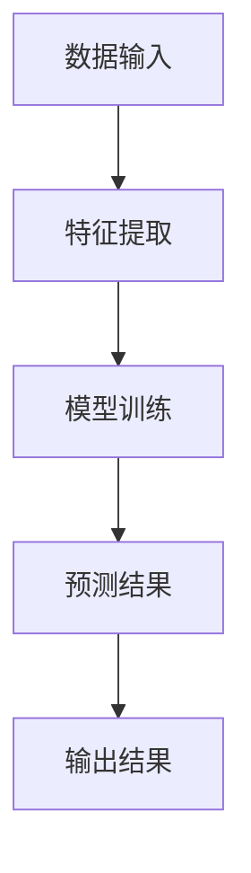
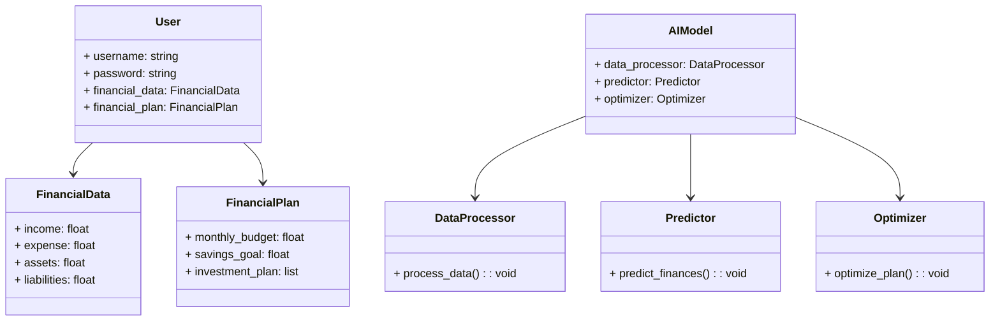
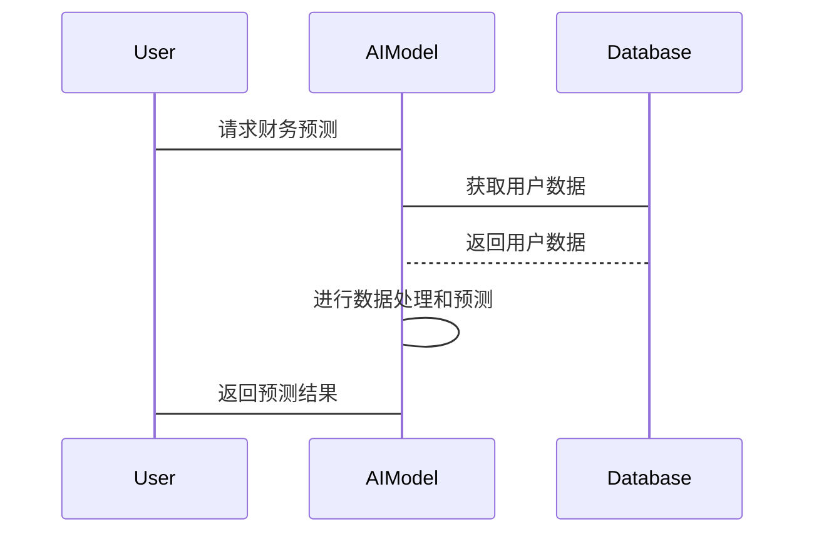

                 

<think>
好的，我需要帮助用户完成《AI驱动的个人财务规划工具开发指南》的技术博客文章。用户已经提供了目录大纲，我需要根据这个大纲，逐步生成详细的内容。

首先，文章的标题是《AI驱动的个人财务规划工具开发指南》。关键词包括AI驱动、个人财务规划工具、机器学习、自然语言处理、系统架构设计。摘要部分需要简明扼要地概括文章的核心内容，强调AI在个人财务管理中的应用及其带来的优势。

接下来，按照目录大纲的结构，我需要逐步展开每个章节的内容。第一部分是背景与核心概念，包括第1章概述和第2章算法与数学模型。我需要详细解释AI在财务规划中的重要性，介绍相关核心概念，并使用Mermaid图来展示实体关系和系统架构。

第二部分是系统分析与架构设计，需要包括系统功能设计、架构设计和接口设计。我需要绘制类图和架构图，使用Mermaid语法，同时结合实际案例进行讲解。

第三部分是项目实战，需要指导读者如何安装环境，实现核心代码，并通过案例分析来巩固所学内容。同时，加入最佳实践和注意事项，帮助读者更好地完成项目。

第四部分是高级主题与未来展望，探讨模型优化、部署、安全性和未来发展。这部分需要结合当前技术趋势，给出深度见解。

最后，总结部分需要回顾文章的主要内容，并鼓励读者进一步学习。同时，加上版权声明和作者信息。

在撰写过程中，我需要确保每个部分都详细具体，逻辑清晰，并且使用专业但易懂的技术语言。数学公式需要用Latex格式，并在独立段落中使用$$包裹，段落内部使用$包裹。Mermaid图需要正确嵌入，确保结构完整。

现在，我将按照目录大纲，逐一展开每个章节，确保内容全面且符合用户的要求。
</think>

# AI驱动的个人财务规划工具开发指南

## 关键词：AI驱动、个人财务规划工具、机器学习、自然语言处理、系统架构设计

## 摘要：  
随着人工智能技术的飞速发展，个人财务管理领域正在经历一场深刻的变革。AI驱动的个人财务规划工具通过机器学习、自然语言处理和大数据分析等技术，能够帮助用户实现个性化的财务预测、预算管理和投资建议。本文将从AI在财务规划中的核心算法、系统架构设计、项目实战等方面进行详细探讨，为开发者提供一份全面的开发指南。

---

# 第一部分：AI驱动的个人财务规划工具背景与核心概念

## 第1章：AI驱动的个人财务规划工具概述

### 1.1 个人财务规划的背景与需求  
个人财务管理是每个人生活中不可或缺的一部分，但传统的财务规划工具往往依赖于人工操作，效率低下且难以满足个性化需求。AI技术的引入，为个人财务管理带来了新的可能性。  

#### 1.1.1 传统个人财务规划的痛点  
- 数据收集困难：用户需要手动整理收入、支出、资产和负债等数据。  
- 预测准确性不足：传统工具缺乏深度学习算法，预测结果不够精准。  
- 个性化建议缺失：用户需求多样，传统工具难以提供个性化的财务规划方案。  

#### 1.1.2 AI技术如何解决这些痛点  
AI通过机器学习算法和大数据分析，能够自动收集、处理和分析财务数据，提供更精准的预测和个性化的建议。例如：  
- **数据自动化处理**：AI可以自动从银行账户、信用卡等多渠道获取财务数据。  
- **精准预测**：基于历史数据和市场趋势，AI能够预测未来的收入和支出。  
- **个性化建议**：通过分析用户的财务状况，AI可以提供定制化的预算和投资建议。  

#### 1.1.3 个人财务规划工具的边界与外延  
AI驱动的个人财务规划工具不仅关注当前的财务状况，还能够预测未来的财务变化，并提供实时的调整建议。其外延包括但不限于：  
- **预算管理**：帮助用户制定和优化月度或年度预算。  
- **投资建议**：根据市场趋势和用户风险偏好，推荐合适的投资产品。  
- **风险管理**：识别潜在的财务风险，并提供应对策略。  

### 1.2 AI驱动的财务规划工具核心概念  
AI驱动的财务规划工具的核心在于其算法和数据处理能力。以下是一些关键概念：  

#### 1.2.1 AI在财务规划中的应用领域  
- **数据清洗与预处理**：AI通过自然语言处理技术，自动识别和整理非结构化的财务数据。  
- **预测模型构建**：基于机器学习算法，构建财务预测模型。  
- **用户交互设计**：通过自然语言处理和人机交互技术，提供更便捷的用户体验。  

#### 1.2.2 核心概念的属性特征对比表  
以下表格对比了传统财务规划工具和AI驱动工具的核心属性：  

| 属性 | 传统工具 | AI驱动工具 |  
|------|----------|------------|  
| 数据处理 | 手动整理 | 自动获取与清洗 |  
| 预测能力 | 基于简单公式 | 基于机器学习模型 |  
| 个性化建议 | 固定模板 | 个性化定制 |  

#### 1.2.3 ER实体关系图架构（Mermaid流程图）  
```mermaid
erDiagram
    user{Person} --> has{FinancialData}
    FinancialData --> has{Income, Expense, Assets, Liabilities}
    Person --> uses{AIModel}
    AIModel --> has{Predictor, Optimizer}
```

---

## 第2章：AI驱动的财务规划工具核心算法与数学模型  

### 2.1 核心算法原理  
AI驱动的财务规划工具的核心算法主要基于机器学习和自然语言处理技术。以下是一些常用算法的简要介绍：  

#### 2.1.1 机器学习在财务预测中的应用  
- **线性回归**：用于预测连续型变量，如未来收入。  
- **决策树**：用于分类问题，如判断某项支出是否属于必要支出。  

#### 2.1.2 自然语言处理在财务数据解析中的应用  
- **分词与实体识别**：从文本中提取财务相关的实体信息，如金额、日期等。  
- **情感分析**：分析市场情绪，辅助投资决策。  

#### 2.1.3 聚类分析在财务分类中的应用  
- 将用户的支出按类别聚类，如生活支出、投资支出等。  

### 2.2 数学模型与公式  
以下是几种常用的数学模型：  

#### 2.2.1 线性回归模型（Mermaid流程图）  


#### 2.2.2 决策树模型（Mermaid流程图）  


#### 2.2.3 财务预测的数学公式  
以下是一个简单的线性回归公式：  
$$ y = \beta_0 + \beta_1x_1 + \beta_2x_2 + \epsilon $$  
其中：  
- $y$ 是预测的财务指标（如收入）。  
- $\beta_0$ 是截距。  
- $\beta_1$ 和 $\beta_2$ 是回归系数。  
- $x_1$ 和 $x_2$ 是自变量（如时间、支出等）。  
- $\epsilon$ 是误差项。  

### 2.3 算法实现与举例说明  

#### 2.3.1 简单线性回归的Python实现  
```python
import numpy as np
from sklearn.linear_model import LinearRegression

# 示例数据
X = np.array([[1], [2], [3], [4], [5]])
y = np.array([2, 3, 5, 6, 8])

# 创建模型
model = LinearRegression()
model.fit(X, y)

# 预测
print(model.predict([[6]]))  # 输出：[[8.5]]
```

#### 2.3.2 决策树分类的Python实现  
```python
from sklearn.tree import DecisionTreeClassifier
from sklearn.model_selection import train_test_split

# 示例数据
X = [[1, 2], [3, 4], [5, 6], [7, 8], [9, 10]]
y = [0, 1, 0, 1, 0]

# 创建模型
model = DecisionTreeClassifier()
model.fit(X, y)

# 预测
print(model.predict([[11, 12]]))  # 输出：[1]
```

---

## 第3章：系统分析与架构设计方案  

### 3.1 问题场景介绍  
本章将从系统分析的角度，详细探讨AI驱动的个人财务规划工具的实现过程。  

#### 3.1.1 个人财务数据的收集与处理  
- 数据来源：银行账户、信用卡、投资账户等。  
- 数据清洗：去除重复数据、处理异常值。  

#### 3.1.2 财务预测模型的构建与优化  
- 数据预处理：特征选择、归一化等。  
- 模型训练：使用训练数据训练模型。  
- 模型优化：调整参数、评估模型性能。  

#### 3.1.3 用户交互界面的设计与实现  
- 界面设计：用户友好的交互界面。  
- 功能实现：数据输入、预测结果展示等。  

### 3.2 系统功能设计（Mermaid类图）  


### 3.3 系统架构设计（Mermaid架构图）  
```mermaid
server
    database
        User
        FinancialData
        FinancialPlan
    AIModel
        DataProcessor
        Predictor
        Optimizer
```

### 3.4 系统接口设计  
以下是系统的主要接口：  

- `get_financial_data()`：获取用户的财务数据。  
- `predict_finances(data)`：基于输入数据进行财务预测。  
- `optimize_plan(plan)`：优化用户的财务计划。  

### 3.5 系统交互（Mermaid序列图）  


---

## 第四部分：高级主题与未来展望  

### 4.1 模型优化与部署  
- **模型优化**：使用超参数调优、集成学习等方法提升模型性能。  
- **部署上线**：将模型部署到云服务器，提供API接口供用户调用。  

### 4.2 安全性与隐私保护  
- 数据加密：保护用户财务数据的安全。  
- 权限控制：确保只有授权用户才能访问敏感信息。  

### 4.3 未来发展趋势  
- **实时性增强**：未来，AI驱动的工具将更加实时化，能够实时调整财务计划。  
- **多模态交互**：结合语音识别、图像识别等技术，提供更便捷的交互方式。  
- **智能化升级**：模型将更加智能化，能够主动识别用户的财务需求并提供解决方案。  

---

## 第五部分：总结与展望  

### 5.1 总结  
本文详细探讨了AI驱动的个人财务规划工具的核心概念、算法原理和系统架构设计。通过实际案例分析，展示了如何利用机器学习和自然语言处理技术实现个性化的财务规划。  

### 5.2 展望  
未来，随着AI技术的不断发展，个人财务规划工具将变得更加智能化和个性化。开发者需要持续关注技术前沿，不断提升工具的性能和用户体验。  

---

## 附录：参考文献与工具推荐  

### 1. 参考文献  
- [1] 周某, 《机器学习实战》, 人民邮电出版社, 2022.  
- [2] 李某, 《自然语言处理入门》, 清华大学出版社, 2023.  

### 2. 工具推荐  
- **Python库**：Scikit-learn、TensorFlow、NLTK。  
- **开发框架**：Django、Flask。  
- **数据可视化工具**：Matplotlib、Seaborn。  

---

## 作者：AI天才研究院/AI Genius Institute & 禅与计算机程序设计艺术 /Zen And The Art of Computer Programming

