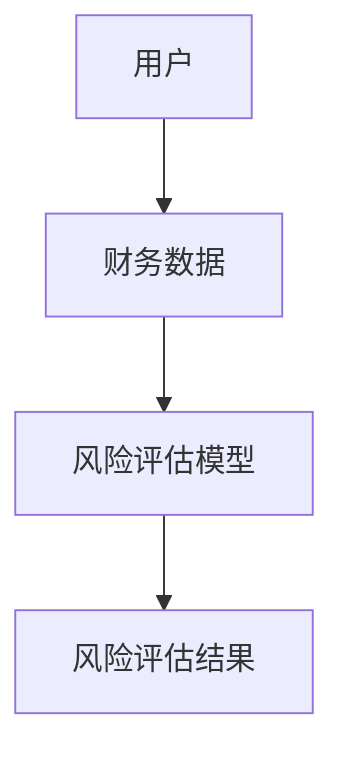
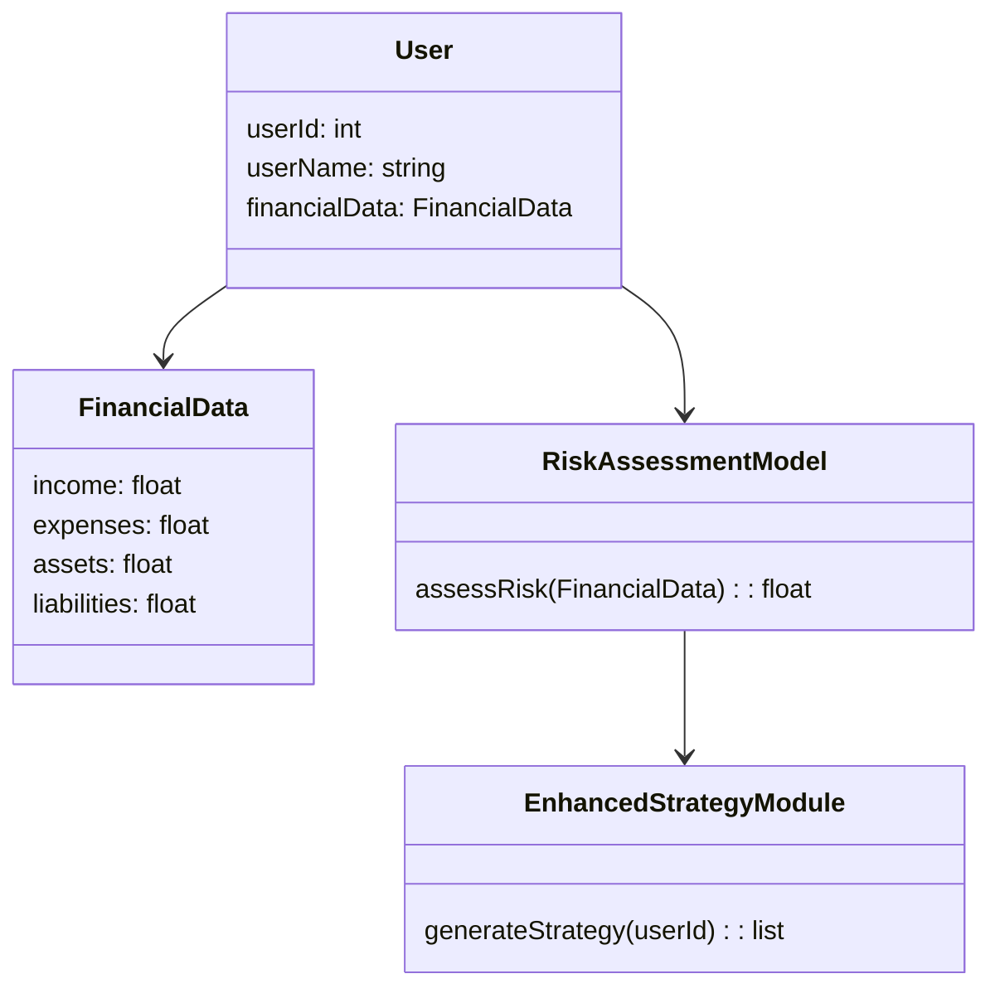
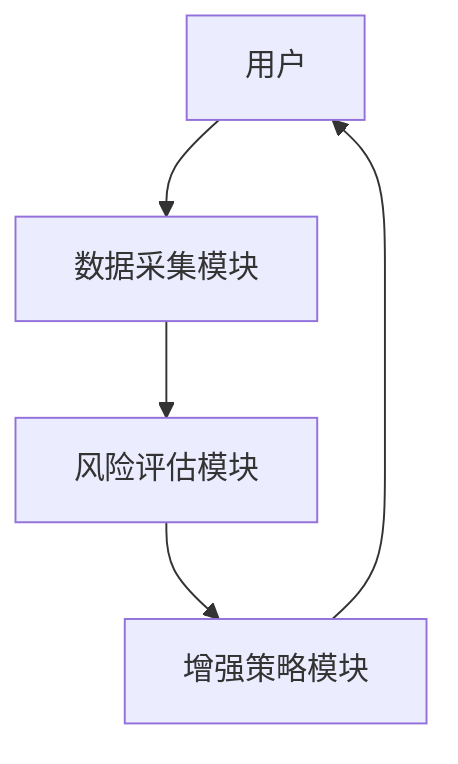
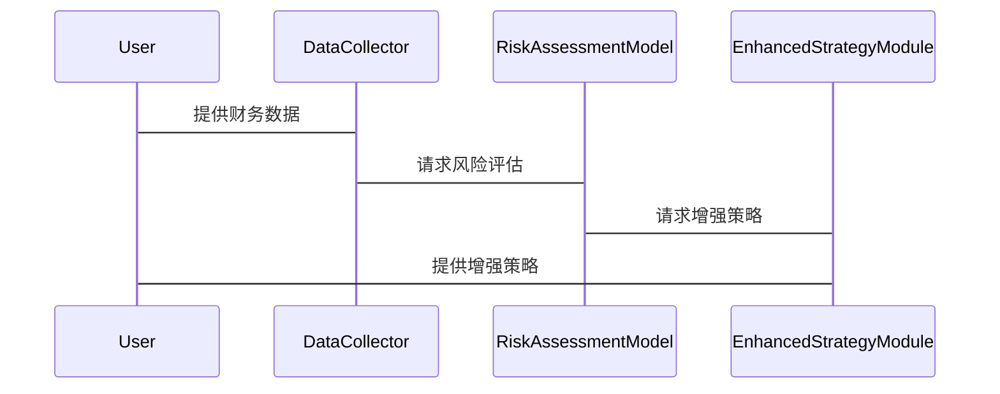

                 


# AI驱动的个人财务韧性评估与增强系统

## 关键词：AI，个人财务，风险管理，机器学习，财务韧性

## 摘要：  
随着人工智能技术的快速发展，个人财务风险管理正在经历一场深刻的变革。传统的财务分析方法依赖于人工判断和经验，难以应对复杂多变的金融市场环境。本文提出了一种基于人工智能的个人财务韧性评估与增强系统，旨在通过智能化的分析和预测，帮助个人用户更好地识别和管理财务风险，优化资产配置，增强财务韧性。本文将从系统背景、核心概念、算法原理、系统架构到项目实战等多个维度展开深入分析，为读者提供一套完整的解决方案。

---

## 第一部分: AI驱动的个人财务韧性评估与增强系统背景介绍

## 第1章: AI驱动的个人财务韧性评估与增强系统概述

### 1.1 问题背景与目标
#### 1.1.1 个人财务风险管理的重要性
在现代经济环境中，个人财务风险管理是保障个人资产安全、实现财富增长的重要基石。然而，金融市场波动、经济不确定性以及个人财务行为的复杂性，使得传统的人工财务分析方法逐渐暴露出效率低下、精度不足的缺陷。

#### 1.1.2 当前财务风险管理的痛点
- 数据分散：个人财务数据分布于不同的平台和工具中，难以统一管理。
- 风险预测滞后：传统方法依赖历史数据，难以实时捕捉市场变化和个体行为风险。
- 缺乏个性化建议：千篇一律的财务建议难以满足不同用户的个性化需求。

#### 1.1.3 AI技术在财务风险管理中的应用潜力
人工智能技术具有数据处理能力强、模型迭代速度快、预测精度高等特点，能够有效解决传统财务风险管理中的痛点。通过AI技术，可以实现对个人财务数据的实时分析、风险预警和个性化建议，从而提升个人财务管理的效率和效果。

### 1.2 核心概念与问题描述
#### 1.2.1 个人财务韧性的定义
个人财务韧性是指个人在面对经济波动、突发事件等不确定性时，能够维持财务稳定并实现资产保值增值的能力。它不仅包括应对短期风险的能力，还包括长期财富规划的能力。

#### 1.2.2 AI驱动的评估与增强系统的构成
AI驱动的个人财务韧性评估与增强系统由以下几个核心模块组成：
- 数据采集与整合模块：负责收集个人的财务数据，包括收入、支出、资产和负债等。
- 风险评估模块：基于机器学习算法，对个人财务风险进行评估和预测。
- 增强策略生成模块：根据风险评估结果，生成个性化的财务增强策略，包括资产配置建议、支出优化建议等。

#### 1.2.3 系统的目标与边界
系统的总体目标是通过AI技术帮助个人用户实现财务风险管理的智能化和个性化。系统的边界包括：
- 数据范围：仅处理个人财务相关数据，不涉及企业或机构财务数据。
- 功能范围：仅提供财务风险管理服务，不涉及投资决策的执行。

### 1.3 系统的核心要素与组成
#### 1.3.1 数据采集模块
数据采集模块负责从多个数据源（如银行账户、投资账户、信用记录等）获取个人财务数据，并进行数据清洗和预处理。

#### 1.3.2 风险评估模型
风险评估模型基于机器学习算法，对个人的财务状况进行实时评估，识别潜在风险点。

#### 1.3.3 增强策略模块
增强策略模块根据风险评估结果，生成个性化的财务增强策略，帮助用户优化资产配置和支出计划。

### 1.4 系统的边界与外延
#### 1.4.1 系统的功能边界
系统仅提供财务风险管理服务，不涉及具体的财务操作执行。

#### 1.4.2 系统的外部接口
系统需要与银行、证券公司等金融机构的数据接口进行对接，获取用户的财务数据。

#### 1.4.3 系统的适用场景与限制
系统适用于个人用户，不适用于企业或机构用户。系统目前仅支持基本的财务风险管理功能，复杂的投资策略仍需人工辅助。

### 1.5 本章小结
本章介绍了AI驱动的个人财务韧性评估与增强系统的背景、核心概念和系统构成，明确了系统的功能边界和目标。下一章将深入探讨系统的核心概念及其相互关系。

---

## 第二部分: 核心概念与联系

## 第2章: AI技术在个人财务韧性中的应用

### 2.1 AI技术的核心原理
#### 2.1.1 机器学习的基本原理
机器学习是一种人工智能技术，通过数据训练模型，使其能够自动学习和改进。在个人财务风险管理中，常用的支持向量机（SVM）和随机森林等算法能够有效地进行风险分类和预测。

#### 2.1.2 自然语言处理在财务分析中的应用
自然语言处理（NLP）技术可以用于分析财务报告、新闻和社交媒体数据，提取情感倾向和关键词，帮助预测市场走势和企业财务状况。

#### 2.1.3 深度学习在风险评估中的作用
深度学习通过多层神经网络结构，能够捕捉数据中的复杂特征，应用于风险评估和预测。

### 2.2 核心概念的联系与对比
#### 2.2.1 传统财务分析与AI驱动分析的对比
| **维度**       | **传统财务分析**                | **AI驱动分析**                     |
|-----------------|---------------------------------|------------------------------------|
| 数据处理能力   | 依赖人工分析，处理能力有限      | 能够处理海量数据，效率高            |
| 预测精度       | 精度较低，依赖经验判断           | 精度高，基于数据驱动                |
| 个性化能力     | 个性化不足，建议千篇一律         | 高度个性化，基于用户数据定制建议   |

#### 2.2.2 数据特征与模型性能的关系
数据特征的选择直接影响模型的性能。例如，使用更多的实时数据和非结构化数据（如社交媒体评论）可以显著提高模型的预测精度。

#### 2.2.3 系统架构的模块化与整体性
系统架构需要在模块化设计和整体性之间找到平衡。模块化设计有助于系统的可维护性和扩展性，而整体性设计则有助于系统的协同优化。

### 2.3 实体关系图（ER图）
以下是系统的核心实体关系图：



---

## 第三部分: 算法原理讲解

## 第3章: 机器学习与自然语言处理算法

### 3.1 机器学习算法原理
#### 3.1.1 线性回归模型
线性回归是一种常用回归算法，适用于预测连续型变量。其数学公式为：
$$ y = wx + b $$
其中，$w$ 是权重，$b$ 是偏置，$x$ 是输入变量，$y$ 是输出变量。

#### 3.1.2 支持向量机（SVM）
支持向量机是一种监督学习算法，适用于分类和回归问题。其核心思想是通过找到一个超平面，将数据分成两类。

#### 3.1.3 随机森林与梯度提升树
随机森林是一种基于决策树的集成算法，通过构建多个决策树并取其预测结果的平均值来提高模型的准确性和稳定性。

### 3.2 自然语言处理算法原理
#### 3.2.1 词嵌入（Word Embedding）
词嵌入是一种将词表示为低维向量的技术，常用算法包括Word2Vec和GloVe。

#### 3.2.2 Transformer架构
Transformer是一种基于自注意力机制的神经网络架构，广泛应用于自然语言处理任务。

#### 3.2.3 文本分类与情感分析
文本分类和情感分析是自然语言处理的典型任务，用于分析财务新闻和社交媒体数据，预测市场情绪和走势。

### 3.3 算法实现与代码示例
#### 3.3.1 机器学习模型实现
以下是一个简单的线性回归模型实现示例：

```python
import pandas as pd
from sklearn.model_selection import train_test_split
from sklearn.linear_model import LinearRegression

# 数据加载
data = pd.read_csv('financial_data.csv')
X = data[['income', 'expenses']]
y = data['net Worth']

# 数据划分
X_train, X_test, y_train, y_test = train_test_split(X, y, test_size=0.2, random_state=42)

# 模型训练
model = LinearRegression()
model.fit(X_train, y_train)

# 模型预测
y_pred = model.predict(X_test)
```

#### 3.3.2 深度学习模型实现
以下是一个简单的神经网络模型实现示例：

```python
import tensorflow as tf
from tensorflow.keras import layers

# 数据加载与预处理
data = pd.read_csv('financial_data.csv')
X = data[['income', 'expenses']]
y = data['net Worth']

# 数据划分
X_train, X_test, y_train, y_test = train_test_split(X, y, test_size=0.2, random_state=42)

# 模型构建
model = tf.keras.Sequential([
    layers.Dense(64, activation='relu'),
    layers.Dense(1, activation='sigmoid')
])

# 模型编译
model.compile(optimizer='adam', loss='binary_crossentropy', metrics=['accuracy'])

# 模型训练
model.fit(X_train, y_train, epochs=10, batch_size=32, validation_data=(X_test, y_test))
```

### 3.4 数学模型与公式
以下是线性回归模型的数学公式：
$$ y = w_1x_1 + w_2x_2 + \dots + w_nx_n + b $$
其中，$w_i$ 是第$i$个特征的权重，$x_i$ 是第$i$个特征的值，$b$ 是偏置。

---

## 第四部分: 系统分析与架构设计方案

## 第4章: 系统分析与架构设计

### 4.1 问题场景介绍
个人用户希望通过系统实现以下功能：
- 实时监控个人财务状况
- 获取风险预警
- 获取个性化财务增强策略

### 4.2 项目介绍
本项目旨在开发一个基于AI的个人财务风险管理系统，帮助用户实现财务风险的智能化管理。

### 4.3 系统功能设计
以下是系统功能模块的领域模型类图：



### 4.4 系统架构设计
以下是系统的整体架构图：



### 4.5 系统接口设计
系统接口设计如下：
- 数据接口：提供REST API用于数据的上传和查询。
- 用户接口：提供Web界面和移动App界面，方便用户使用。

### 4.6 系统交互设计
以下是系统交互的序列图：



---

## 第五部分: 项目实战

## 第5章: 项目实战

### 5.1 环境安装与配置
需要安装以下库和工具：
- Python 3.6+
- Pandas、Scikit-learn、TensorFlow
- Jupyter Notebook

### 5.2 核心代码实现
#### 5.2.1 数据采集模块
```python
import pandas as pd

def load_financial_data():
    data = pd.read_csv('financial_data.csv')
    return data

if __name__ == '__main__':
    data = load_financial_data()
    print(data.head())
```

#### 5.2.2 风险评估模型
```python
from sklearn.linear_model import LinearRegression

def train_risk_assessment_model(X, y):
    model = LinearRegression()
    model.fit(X, y)
    return model

if __name__ == '__main__':
    data = load_financial_data()
    X = data[['income', 'expenses']]
    y = data['net Worth']
    model = train_risk_assessment_model(X, y)
    print(model.coef_)
```

#### 5.2.3 增强策略模块
```python
def generate_enhanced_strategy(userId, model):
    # 获取用户数据
    user_data = get_user_data(userId)
    # 生成策略
    strategy = model.predict(user_data)
    return strategy

if __name__ == '__main__':
    userId = 1
    model = train_risk_assessment_model(X, y)
    strategy = generate_enhanced_strategy(userId, model)
    print(strategy)
```

### 5.3 实际案例分析
假设用户A的收入为50000元，支出为30000元，资产为200000元，负债为50000元。系统将基于这些数据进行风险评估，并生成相应的增强策略，例如优化投资组合和降低高风险支出。

### 5.4 项目小结
通过本章的实战，读者可以了解如何基于AI技术开发一个个人财务风险管理系统，并通过实际案例掌握系统的实现和应用。

---

## 第六部分: 最佳实践、小结与展望

## 第6章: 最佳实践与小结

### 6.1 最佳实践
- 数据隐私保护：在系统设计中，必须确保用户数据的安全性和隐私性。
- 模型迭代：定期更新模型，确保其预测精度和适应性。
- 用户教育：通过教育和引导，帮助用户理解系统的功能和使用方法。

### 6.2 小结
本文详细介绍了AI驱动的个人财务韧性评估与增强系统的背景、核心概念、算法原理、系统架构和项目实战。通过系统的实施，个人用户可以实现财务风险管理的智能化和个性化。

### 6.3 注意事项
- 系统的使用需要遵循相关法律法规，确保数据合规。
- 系统的维护和更新需要专业的技术支持。

### 6.4 拓展阅读
- 《机器学习实战》
- 《深度学习》
- 《自然语言处理入门》

---

## 作者：AI天才研究院 & 禅与计算机程序设计艺术

