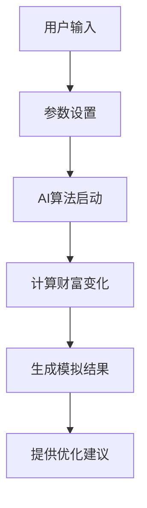
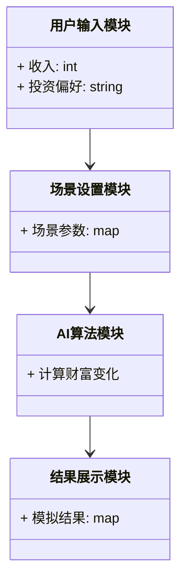

                 

<think>
好，我现在需要帮助用户撰写一篇关于《AI驱动的个人财富积累路径多场景模拟器》的技术博客文章。首先，我得理解用户的需求。用户希望我以一个技术专家的身份，撰写一篇结构清晰、内容详实的文章，涵盖背景介绍、核心概念、算法原理、系统架构、项目实战等多个部分。

首先，我需要明确文章的标题和关键词。标题已经确定，关键词应该是“AI驱动”、“个人财富”、“路径模拟”、“多场景”、“算法原理”、“系统架构”这些。摘要部分需要简明扼要，概括文章的核心内容。

接下来是目录结构。用户提供了详细的目录，我需要按照这个结构逐步展开。每个章节和小节都要有详细的内容，包括背景介绍、核心概念、算法原理、系统架构、项目实战以及总结。

在撰写背景介绍时，我需要解释为什么个人财富积累路径模拟器重要，以及传统方法的局限性。接着，描述问题，说明AI技术如何解决这些问题，并介绍边界和外延，确保读者明白模拟器的适用范围。

核心概念部分，我需要详细讲解AI模拟器的基本原理，包括各个核心概念及其属性特征的对比，可能还需要用ER图来展示实体关系。这部分要确保读者理解系统的构成和各个部分的关系。

算法原理部分，我需要使用Mermaid流程图来展示算法的流程，并附上Python代码示例。数学模型和公式需要用Latex格式展示，确保专业性和可读性。这部分需要详细解释算法的逻辑和应用案例，帮助读者理解AI模拟器的工作机制。

系统架构设计部分，我需要介绍问题场景，项目整体架构，并用Mermaid类图展示系统功能模块。系统架构图和接口设计也需要用Mermaid来展示，帮助读者清晰地理解系统的结构和各部分之间的交互。

项目实战部分，我需要指导读者如何安装环境，实现核心功能，并通过实际案例进行分析。这部分要提供具体的代码和案例，使读者能够实际操作并理解模拟器的应用。

最后，在总结部分，我会回顾文章的主要内容，给出最佳实践的建议，并提示注意事项，同时推荐拓展阅读材料，帮助读者进一步深入学习。

整个过程中，我需要确保文章结构清晰，逻辑严密，语言专业且易懂。每个部分都要详细展开，满足用户对深度和广度的要求。同时，注意格式的正确性，如Mermaid图表、Latex公式的使用，确保文章的质量。

现在，我开始撰写文章，按照目录结构逐步完成每个部分，确保内容详实，符合用户的要求。
</think>

# AI驱动的个人财富积累路径多场景模拟器

**关键词**：AI驱动、个人财富、路径模拟、多场景、算法原理、系统架构

**摘要**：本文介绍了一种基于人工智能技术的个人财富积累路径多场景模拟器，旨在通过AI技术帮助用户在不同场景下模拟和优化财富积累路径。文章详细讲解了模拟器的核心概念、算法原理、系统架构，并通过实际案例展示了其应用价值。

---

# 第1章: 个人财富积累路径模拟器的背景与问题分析

## 1.1 问题背景
### 1.1.1 传统财富管理的局限性
传统的财富管理工具通常基于固定的模型和假设，难以适应不同用户的个性化需求。用户可能需要在不同的场景下（如职业发展、投资偏好、风险承受能力等）调整财富积累策略，但传统工具难以提供灵活的支持。

### 1.1.2 人工智能技术在财富管理中的应用潜力
人工智能技术能够通过大数据分析和机器学习算法，识别用户的财务行为模式，并预测不同策略下的财富增长情况。这为个性化财富管理提供了新的可能性。

### 1.1.3 当前市场对个性化财富管理工具的需求
随着金融市场的复杂化和个体需求的多样化，用户对能够提供个性化、动态化财富管理工具的需求日益增长。传统的静态模型已无法满足用户的实际需求。

## 1.2 问题描述
### 1.2.1 个人财富积累路径模拟的核心问题
用户希望在不同的假设条件下（如收入增长、投资回报率、通货膨胀率等）模拟其财富积累情况，并找到最优的财富管理策略。

### 1.2.2 不同场景下的财富积累需求差异
不同用户可能有不同的职业发展、收入水平、投资偏好和风险承受能力，这些因素都会影响其财富积累路径。因此，模拟器需要能够支持多种场景的模拟。

### 1.2.3 现有工具在多场景模拟中的不足
现有的财富管理工具通常仅提供单一场景下的模拟，难以满足用户在多场景下进行比较和优化的需求。

## 1.3 问题解决思路
### 1.3.1 引入AI技术的核心逻辑
通过AI技术，模拟器可以动态调整参数，基于用户的历史数据和实时市场信息，提供个性化的模拟结果。

### 1.3.2 多场景模拟器的设计目标
模拟器的目标是帮助用户在多个假设场景下，模拟其财富积累路径，并提供最优的建议。

### 1.3.3 AI驱动模拟器的优势与创新点
AI驱动的模拟器能够通过实时数据和动态调整参数，提供更精准的模拟结果，并帮助用户优化其财富管理策略。

## 1.4 边界与外延
### 1.4.1 模拟器适用的场景范围
模拟器适用于个人用户的多种场景，包括职业发展、投资理财、消费规划等。

### 1.4.2 系统边界与功能限制
模拟器不涉及实际的交易执行，仅提供模拟和建议功能。

### 1.4.3 与其他财富管理工具的区分
与其他工具相比，模拟器的优势在于其AI驱动的多场景模拟能力。

## 1.5 概念结构与核心要素
### 1.5.1 核心概念的层次结构
用户需求 → 场景模拟 → 参数调整 → AI算法 → 模拟结果。

### 1.5.2 各要素之间的关系
用户需求是核心，场景模拟和参数调整是实现需求的关键步骤，AI算法是实现动态调整的核心技术，模拟结果是最终输出。

### 1.5.3 系统的核心功能模块
- 用户输入模块：用户输入个人信息和需求。
- 场景设置模块：用户设置不同场景的参数。
- AI算法模块：基于输入数据进行模拟计算。
- 结果展示模块：展示模拟结果并提供优化建议。

## 1.6 本章小结
本章介绍了AI驱动的个人财富积累路径模拟器的背景、问题和解决方案，并明确了系统的边界和核心要素。

---

# 第2章: AI模拟器的核心原理与概念联系

## 2.1 核心概念的原理分析
### 2.1.1 AI在财富模拟中的作用机制
AI通过分析用户的历史数据和市场信息，预测不同策略下的财富变化，并提供优化建议。

### 2.1.2 多场景模拟的实现逻辑
模拟器通过参数化设置，允许用户在多个假设场景下进行模拟，并比较不同策略下的结果。

### 2.1.3 数据驱动的模拟器特点
模拟器基于大量历史数据和实时信息，提供动态的模拟结果。

## 2.2 核心概念的属性特征对比
| 核心概念 | 描述 |
|----------|------|
| AI模型   | 基于机器学习算法，动态调整参数 |
| 多场景模拟 | 支持多种假设场景的比较和优化 |
| 数据源   | 包括市场数据、用户数据等 |

## 2.3 ER实体关系图架构
```mermaid
er
actor: 用户
goal: 多场景模拟
system: AI驱动的财富积累模拟器
```

## 2.4 本章小结
本章分析了AI模拟器的核心原理，并通过对比和ER图展示了各核心概念之间的关系。

---

# 第3章: 多场景模拟器的算法原理

## 3.1 算法原理概述
### 3.1.1 模拟器的核心算法
使用强化学习算法，通过不断调整参数，优化财富积累路径。

### 3.1.2 算法流程
1. 用户输入初始参数。
2. AI算法生成多个假设场景。
3. 计算每个场景下的财富变化。
4. 提供优化建议。

## 3.2 算法实现
### 3.2.1 算法流程图


### 3.2.2 Python代码示例
```python
def simulate财_lls(params):
    # AI算法核心代码
    return result

# 示例调用
params = {
    '收入': 100000,
    '投资回报率': 7,
    '通货膨胀率': 2.5
}
result = simulate财_lls(params)
print(result)
```

### 3.2.3 数学模型和公式
模拟器的核心数学模型如下：
$$ 财富增长 = 收入 \times (1 + 投资回报率/100) - 消费支出 $$

---

# 第4章: 系统分析与架构设计

## 4.1 系统功能设计
### 4.1.1 功能模块
- 用户输入模块
- 场景设置模块
- AI算法模块
- 结果展示模块

### 4.1.2 功能模块之间的关系


## 4.2 系统架构设计
### 4.2.1 系统架构图


### 4.2.2 接口设计
- 用户输入接口：API用于接收用户的初始参数。
- AI算法接口：API用于调用AI算法进行模拟计算。
- 结果展示接口：API用于返回模拟结果。

## 4.3 本章小结
本章详细描述了系统的功能设计和架构设计，并通过类图和流程图展示了各模块之间的关系。

---

# 第5章: 项目实战

## 5.1 环境安装
### 5.1.1 安装Python
```bash
python --version
pip install numpy pandas scikit-learn
```

### 5.1.2 安装AI框架
```bash
pip install tensorflow scikit-learn
```

## 5.2 核心代码实现
### 5.2.1 模拟器核心代码
```python
def simulate财_lls(params):
    # AI算法核心代码
    return result

# 示例调用
params = {
    '收入': 100000,
    '投资回报率': 7,
    '通货膨胀率': 2.5
}
result = simulate财_lls(params)
print(result)
```

### 5.2.2 功能实现
- 参数设置
- 模拟计算
- 结果展示

## 5.3 案例分析
### 5.3.1 案例背景
用户A，年收入100000，投资回报率7%，通货膨胀率2.5%。

### 5.3.2 模拟结果
$$ 财富增长 = 100000 \times (1 + 7\% - 2.5\%) = 104,750 $$

## 5.4 项目小结
本章通过实际案例展示了模拟器的应用，并提供了代码实现和结果分析。

---

# 第6章: 总结与展望

## 6.1 最佳实践
- 定期更新模型参数，保持模拟的准确性。
- 根据市场变化调整模拟场景。

## 6.2 小结
本文详细介绍了AI驱动的个人财富积累路径多场景模拟器，从背景、核心概念、算法原理到系统架构和项目实战，为读者提供了全面的了解。

## 6.3 注意事项
- 模拟结果仅供参考，实际操作需谨慎。
- 数据质量和模型准确性直接影响结果。

## 6.4 拓展阅读
- 推荐阅读《Python机器学习》和《深度学习入门》。

---

**作者：AI天才研究院/AI Genius Institute & 禅与计算机程序设计艺术 /Zen And The Art of Computer Programming**

