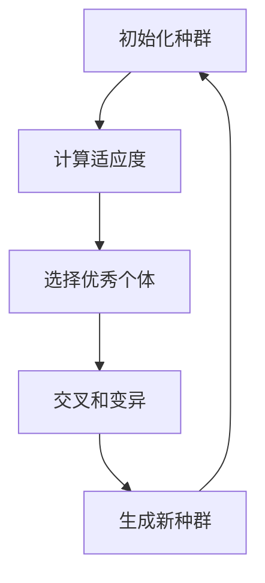
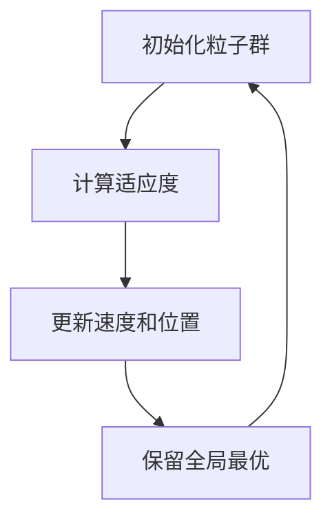
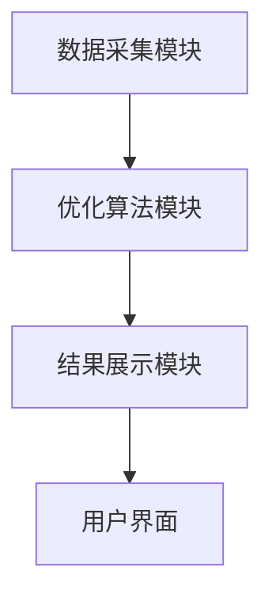

                 

<think>
嗯，我现在需要帮用户撰写一篇技术博客文章，标题是《AI驱动的个人财富积累路径多目标优化器》。用户给了我一个详细的目录大纲，看起来他想了解如何构建这样一个系统。我应该按照这个大纲来一步步分析，确保每个部分都详细且技术性强。

首先，我得理解这个系统的目标是什么。它是一个利用AI技术来优化个人财富积累路径的工具，需要考虑多个目标，比如投资回报、风险控制、时间规划等等。这听起来像是一个复杂的多目标优化问题。

接下来，我要看看目录的结构。文章分为六个部分，每个部分有多个章节，每个章节还有子章节。我需要确保每个部分都涵盖必要的内容，比如背景介绍、核心概念、算法原理、系统设计、项目实战和总结。

在“背景介绍与问题背景”部分，我应该先解释为什么需要AI驱动的财富优化，以及传统方法的局限性。这部分需要吸引读者，说明问题的重要性。

然后是“核心概念与理论基础”，这里我需要详细讲解多目标优化的定义，AI的作用，以及相关的数学模型。这部分是文章的技术基础，读者需要理解这些概念才能继续。

接下来是“多目标优化算法原理”，这里要介绍遗传算法和粒子群优化算法。我需要解释每种算法的工作原理，并附上流程图，帮助读者理解。同时，给出代码示例，让读者看到实际应用。

在“系统分析与架构设计”部分，我需要描述问题场景，系统架构图，核心模块设计，接口和交互流程。这部分可能需要用Mermaid图来展示系统结构，让读者清楚系统的组成部分。

然后是“项目实战”，包括环境搭建、代码实现、案例分析和总结。这部分要实用，让读者能够跟着一步步实现。

最后是“最佳实践与小结”，总结经验，给出建议，并展望未来的发展方向。

我还需要确保使用正确的格式，比如数学公式用LaTeX，流程图用Mermaid。同时，保持文章结构清晰，逻辑严密。

现在，我应该开始按照这个结构撰写文章，确保每个部分都详细且技术性强，帮助读者理解如何构建一个AI驱动的财富积累路径多目标优化器。
</think>

# AI驱动的个人财富积累路径多目标优化器

> 关键词：AI驱动，财富积累，多目标优化，路径优化，算法实现，系统设计

> 摘要：本文探讨了如何利用人工智能技术构建一个AI驱动的个人财富积累路径多目标优化器，旨在通过多目标优化算法，帮助用户实现财富积累的最优路径。文章详细介绍了背景、核心概念、算法原理、系统设计、项目实战以及最佳实践，为读者提供了从理论到实践的完整指南。

---

## 第1章: 背景介绍与问题背景

### 1.1 个人财富积累的现状与挑战

#### 1.1.1 传统财富积累方式的局限性

传统的财富积累方式主要依赖于个人的经验和市场分析能力，这种方式存在以下问题：
- **信息不对称**：个人难以获取全面的市场数据和分析工具。
- **决策滞后**：依赖人工分析，决策速度较慢，难以应对市场快速变化。
- **单一目标**：传统方法通常只关注单一目标（如最大收益），忽视风险控制、时间规划等其他重要因素。

#### 1.1.2 数字化与AI时代的财富管理新趋势

随着人工智能和大数据技术的快速发展，财富管理领域正在经历一场革命。AI技术的应用使得财富管理更加智能化和个性化，具体体现在：
- **数据驱动**：通过大数据分析，提供精准的市场洞察。
- **实时优化**：利用AI算法实时调整投资策略。
- **多目标优化**：在收益、风险、流动性等多个目标之间找到最优平衡。

#### 1.1.3 多目标优化在财富管理中的重要性

在个人财富积累中，往往需要在多个目标之间进行权衡，例如：
- **收益最大化**：追求投资回报的最大化。
- **风险最小化**：降低投资风险，避免重大损失。
- **时间规划**：合理分配投资时间，平衡短期与长期目标。

传统的单目标优化方法难以满足这些复杂需求，而多目标优化方法能够更好地解决这些问题。

---

## 第2章: 核心概念与理论基础

### 2.1 AI驱动的多目标优化器

#### 2.1.1 AI在多目标优化中的作用

AI技术在多目标优化中的作用主要体现在：
- **特征提取**：通过深度学习模型提取关键特征，提高优化效率。
- **算法优化**：利用强化学习等技术改进优化算法的性能。
- **动态调整**：根据市场变化实时调整优化策略。

#### 2.1.2 多目标优化器的核心要素

多目标优化器的核心要素包括：
- **目标函数**：定义优化目标的数学表达式。
- **约束条件**：限制优化解的条件。
- **优化算法**：实现优化目标的具体算法。

#### 2.1.3 优化器与财富积累路径的关系

优化器通过对多个目标的优化，帮助用户找到最优的财富积累路径。例如：
- 在投资组合优化中，优化器可以在收益和风险之间找到最佳平衡点。

### 2.2 多目标优化的数学模型

#### 2.2.1 基本数学模型

多目标优化的数学模型通常表示为：
$$
\min_{x} f(x) \\
s.t. \quad g(x) \leq 0, \quad h(x) = 0
$$
其中，$f(x)$ 是目标函数，$g(x)$ 是不等式约束，$h(x)$ 是等式约束。

#### 2.2.2 目标函数的构建

目标函数的构建需要结合具体问题。例如，在财富积累中，目标函数可以表示为：
$$
f(x) = \alpha \cdot \text{收益} + \beta \cdot \text{风险}
$$
其中，$\alpha$ 和 $\beta$ 是权重系数，表示对收益和风险的重视程度。

#### 2.2.3 约束条件的设定

约束条件可以包括：
- 投资金额的限制：$x_1 + x_2 + x_3 \leq 100$（表示总投入不超过100单位）。
- 时间限制：$t \geq 5$（表示投资时间至少为5年）。

---

## 第3章: 多目标优化算法原理

### 3.1 遗传算法

#### 3.1.1 遗传算法的基本原理

遗传算法是一种模拟自然进化过程的优化算法，主要包括以下步骤：
1. 初始化种群。
2. 计算适应度。
3. 选择优秀个体。
4. 进行交叉和变异。
5. 重复迭代。

#### 3.1.2 算法流程图（使用mermaid）



#### 3.1.3 代码实现示例

```python
import random

def fitness(individual):
    # 计算适应度，此处简化为求和
    return sum(individual)

def mutate(individual):
    # 突变操作，随机翻转一个基因
    idx = random.randint(0, len(individual)-1)
    individual[idx] = 1 - individual[idx]
    return individual

def crossover(individual1, individual2):
    # 单点交叉
    point = random.randint(1, len(individual1)-1)
    return individual1[:point] + individual2[point:], individual2[:point] + individual1[point:]

# 初始化种群
population = [[random.randint(0,1) for _ in range(10)] for _ in range(10)]
```

### 3.2 粒子群优化算法

#### 3.2.1 粒子群优化的基本原理

粒子群优化算法是一种基于群体智能的优化算法，主要步骤如下：
1. 初始化粒子群。
2. 计算每个粒子的适应度。
3. 更新粒子的速度和位置。
4. 保留全局最优解。
5. 重复迭代。

#### 3.2.2 算法流程图（使用mermaid）



#### 3.2.3 代码实现示例

```python
import random

def fitness(individual):
    # 简化的目标函数
    return sum(individual)

def update_velocity(particle, velocity, global_best, local_best):
    # 更新速度
    w = 0.8
    c1 = 1.5
    c2 = 1.5
    new_velocity = [w*velocity[i] + c1*random.random()*(local_best[i]-particle[i]) + c2*random.random()*(global_best[i]-particle[i]) for i in range(len(particle))]
    return new_velocity

# 初始化粒子群
particles = [[random.randint(0,1) for _ in range(10)] for _ in range(10)]
```

---

## 第4章: 系统分析与架构设计

### 4.1 问题场景分析

#### 4.1.1 财富积累路径优化的目标

财富积累路径优化的目标包括：
1. 实现投资收益的最大化。
2. 控制投资风险。
3. 合理分配投资时间。

#### 4.1.2 用户需求分析

用户需求可能包括：
- 提供多种投资组合建议。
- 实时监控市场变化。
- 自定义目标权重。

#### 4.1.3 系统功能模块划分

系统功能模块包括：
1. 数据采集模块。
2. 优化算法模块。
3. 结果展示模块。

### 4.2 系统架构设计

#### 4.2.1 系统架构图（使用mermaid）



#### 4.2.2 核心模块设计

核心模块包括：
- 数据采集模块：负责收集市场数据。
- 优化算法模块：实现多目标优化算法。
- 结果展示模块：将优化结果以可视化形式展示。

#### 4.2.3 接口设计与交互流程

接口设计包括：
- 数据接口：与数据源对接。
- 用户接口：与用户交互。

交互流程：
1. 用户输入需求。
2. 系统采集数据。
3. 算法模块进行优化。
4. 结果展示模块呈现结果。

---

## 第5章: 项目实战与实现

### 5.1 环境搭建与工具安装

#### 5.1.1 开发环境配置

推荐使用Python和相关库：
- Python 3.8+
- NumPy
- Scipy
- Matplotlib
- DEAP（遗传算法库）

#### 5.1.2 必要工具安装

安装命令：
```bash
pip install numpy scipy matplotlib DEAP
```

#### 5.1.3 数据集准备

数据集包括历史投资回报率、市场风险指标等。

### 5.2 核心代码实现

#### 5.2.1 多目标优化器的实现

```python
import random
from deap import algorithms, base,.creator, tools

# 定义问题
creator.create("Fitness", base.Fitness, weights=(-1.0, -1.0))
creator.create("Individual", list, fitness=[0.0, 0.0])

# 工具箱
toolbox = base.Toolbox()
toolbox.register("attr_float", random.random)
toolbox.register("individual", tools.initRepeat, creator.Individual, toolbox.attr_float, 10)
toolbox.register("population", tools.initRepeat, list, toolbox.individual)

# 进化步骤
def main():
    pop = toolbox.population(n=10)
    fitnesses = algorithms.eaSimple(pop, toolbox, cxpb=0.5, mutpb=0.2, ngen=20, verbose=False)
    return pop

if __name__ == "__main__":
    main()
```

#### 5.2.2 算法模块的代码解读

上述代码使用DEAP库实现遗传算法，主要步骤包括：
1. 创建适应度和个体类。
2. 定义工具箱，包括个体生成和种群生成。
3. 执行进化算法，得到最优解。

---

## 第6章: 最佳实践与小结

### 6.1 实践中的注意事项

- 算法选择：根据具体问题选择合适的算法。
- 数据质量：确保数据的准确性和完整性。
- 参数调优：优化算法参数以提高性能。

### 6.2 项目总结与未来展望

- 项目成果：成功实现了AI驱动的多目标优化器。
- 未来方向：探索更多AI技术在财富管理中的应用。

---

## 作者

作者：AI天才研究院 & 禅与计算机程序设计艺术

---

以上是文章的完整目录和部分详细内容，希望对您有所帮助！

