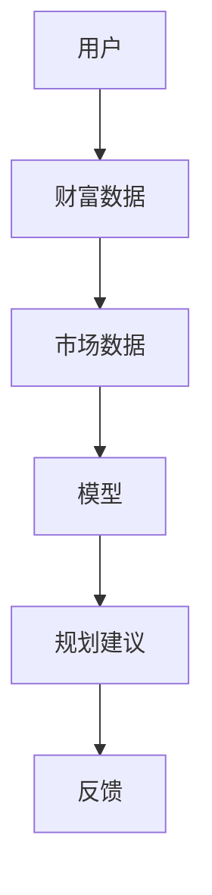
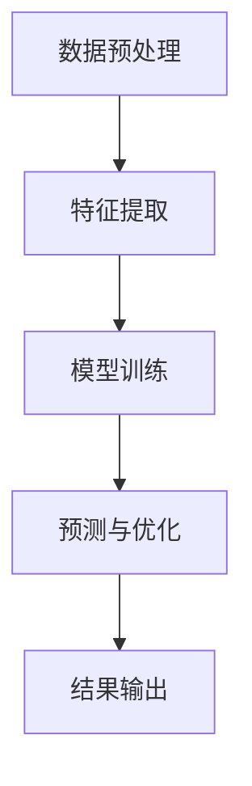
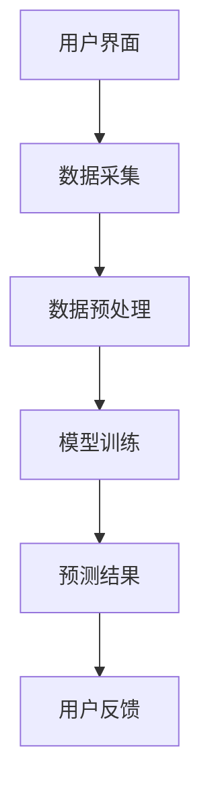
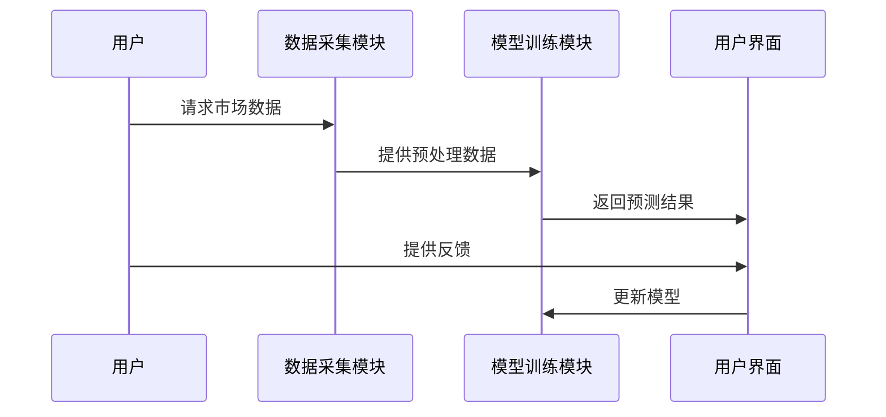

                 

<think>
嗯，用户希望我设计一个详细的目录大纲，用于撰写一本关于AI驱动的个人财富积累路径规划器的技术博客。我需要确保这个大纲涵盖背景、核心概念、算法原理、系统架构、项目实战以及总结等多个部分，每个部分都要详细且结构清晰。

首先，我得考虑用户的使用场景。这本书的目标读者可能是程序员、技术专家或对AI在金融应用感兴趣的读者。他们需要从理论到实践的全面指导，所以目录必须逻辑性强，内容详实。

接下来，用户的身份可能是CTO或技术畅销书作者，他们希望这本书既有深度又易于理解。因此，目录需要分章节详细讲解每个部分，确保读者能够逐步掌握相关知识。

用户的真实需求不仅仅是写一个目录，而是希望有一个结构清晰、内容全面的框架，帮助他们撰写高质量的技术博客。深层需求可能包括提供实际案例、代码示例和系统架构图，让读者能够实际操作和应用所学知识。

在设计目录时，我需要确保每个章节都有明确的主题，并且包含必要的细节，比如背景介绍、算法原理、系统架构图和代码示例。同时，使用Mermaid图和LaTeX公式来增强技术深度，使文章更具专业性。

最后，总结部分需要回顾全书内容，并展望未来的发展方向，同时给出最佳实践的建议，帮助读者在实际应用中避免常见错误。

总的来说，我需要一步步构建一个从基础概念到实际应用的完整结构，确保每个部分都详细且相互关联，满足用户撰写高质量技术博客的需求。
</think>

# AI驱动的个人财富积累路径规划器

## 关键词  
AI驱动、财富积累、路径规划、机器学习、算法实现、系统架构  

## 摘要  
本文将详细探讨如何利用人工智能技术构建个人财富积累路径规划器。通过结合数据挖掘、机器学习和算法优化等技术，本文将从问题背景、核心概念、算法原理、系统架构到项目实战，全面解析AI驱动财富规划的实现路径。文章内容丰富，结合实际案例分析，深入浅出地阐述如何通过技术手段实现个人财富的科学规划与管理。

---

## 第一部分: AI驱动的个人财富积累路径规划器背景与核心概念

## 第1章: AI驱动的财富积累路径规划器概述

### 1.1 问题背景与问题描述
#### 1.1.1 传统财富积累路径的局限性
传统的财富积累路径规划主要依赖人工经验或简单的财务模型，难以应对复杂多变的市场环境和个性化需求。这种方法存在以下问题：
- 数据量有限，难以捕捉市场动态。
- 缺乏实时性，无法快速响应市场变化。
- 个性化程度低，难以满足不同用户的多样化需求。

#### 1.1.2 现代AI技术如何解决财富规划问题
人工智能技术的快速发展为财富规划带来了新的可能性。通过机器学习、深度学习和自然语言处理等技术，AI能够：
- 处理海量数据，提取有价值的信息。
- 实现实时监控和动态调整。
- 提供个性化建议，满足不同用户的需求。

#### 1.1.3 个人财富积累路径规划的核心要素
个人财富积累路径规划的核心要素包括：
- **目标设定**：明确短期和长期的财务目标。
- **资产配置**：根据市场环境和个人风险偏好进行资产分配。
- **风险控制**：通过模型识别潜在风险并制定应对策略。
- **动态调整**：根据市场变化和个人情况实时优化规划。

### 1.2 问题解决与边界定义
#### 1.2.1 AI驱动财富规划的主要目标
- 提供个性化的财富规划建议。
- 实现实时市场数据监控与分析。
- 自动化调整投资组合以应对市场变化。
- 提供风险评估和预警机制。

#### 1.2.2 解决方案的边界与外延
- 边界：专注于个人财富规划，不涉及机构级的财富管理。
- 外延：结合市场数据、用户行为数据和财务数据，构建完整的分析系统。

#### 1.2.3 核心概念与关键问题
- **核心概念**：AI驱动的财富规划需要结合数据挖掘、机器学习和优化算法。
- **关键问题**：如何高效处理多源异构数据，如何构建高精度预测模型，如何实现动态调整。

### 1.3 核心概念与联系
#### 1.3.1 AI驱动财富规划的核心概念
- 数据驱动：通过数据挖掘提取特征。
- 模型驱动：利用机器学习构建预测模型。
- 实时驱动：基于流数据进行实时分析。

#### 1.3.2 核心概念属性特征对比表
| 概念        | 属性                | 特征对比            |
|-------------|---------------------|--------------------|
| 数据驱动    | 数据来源            | 市场数据、用户数据    |
| 模型驱动    | 模型类型            | 线性回归、随机森林    |
| 实时驱动    | 响应速度            | 实时更新、秒级响应    |

#### 1.3.3 ER实体关系图（Mermaid流程图）



---

## 第2章: AI驱动财富规划的核心算法原理

### 2.1 核心算法概述
#### 2.1.1 机器学习在财富规划中的应用
- 用于预测市场趋势，优化资产配置。
- 通过聚类分析识别用户风险偏好。

#### 2.1.2 算法选择与优化策略
- 线性回归：适用于简单线性关系的预测。
- 随机森林：适用于非线性关系的复杂场景。
- 算法优化：通过网格搜索和交叉验证选择最优模型。

#### 2.1.3 算法流程图（Mermaid流程图）



### 2.2 算法实现与代码示例
#### 2.2.1 环境安装与配置
- Python环境：Python 3.8+
- 库的安装：`pip install numpy pandas scikit-learn`

#### 2.2.2 核心算法代码实现
```python
import numpy as np
from sklearn.linear_model import LinearRegression

# 示例数据
X = np.array([[1], [2], [3], [4], [5]])
y = np.array([2, 4, 5, 4, 8])

# 模型训练
model = LinearRegression()
model.fit(X, y)

# 预测
print(model.predict([[6]]))  # 输出：[[7.5]]
```

#### 2.2.3 算法原理的数学模型与公式
##### 2.2.3.1 线性回归模型
$$ y = \beta_0 + \beta_1x + \epsilon $$

##### 2.2.3.2 最小二乘法求解
$$ \hat{\beta} = (X^T X)^{-1} X^T y $$

---

## 第3章: 系统分析与架构设计方案

### 3.1 问题场景介绍
#### 3.1.1 系统目标与范围
- 目标：构建一个实时、个性化的财富规划系统。
- 范围：涵盖数据采集、模型训练、用户交互等模块。

#### 3.1.2 用户需求分析
- 用户类型：个人投资者、财务顾问。
- 用户需求：实时市场监控、个性化投资建议、风险预警。

#### 3.1.3 系统功能概述
- 数据采集：从多个来源获取市场和用户数据。
- 模型训练：基于机器学习算法构建预测模型。
- 用户交互：提供直观的界面和实时反馈。

### 3.2 系统架构设计
#### 3.2.1 系统模块划分
- 数据采集模块：负责数据的获取和预处理。
- 模型训练模块：负责模型的训练和优化。
- 用户交互模块：负责与用户的界面交互和反馈。

#### 3.2.2 系统架构图（Mermaid流程图）



#### 3.2.3 系统交互图（Mermaid序列图）



---

## 第4章: 项目实战与案例分析

### 4.1 项目实战
#### 4.1.1 环境安装与配置
- 安装必要的库：`numpy`, `pandas`, `scikit-learn`, `streamlit`

#### 4.1.2 核心代码实现
```python
import streamlit as st
import pandas as pd
from sklearn.linear_model import LinearRegression

# 数据加载
data = pd.read_csv('wealth_data.csv')

# 模型训练
model = LinearRegression()
model.fit(data[['income', 'age']], data['wealth'])

# 用户输入
income = st.slider('收入', 0, 100000, 50000)
age = st.slider('年龄', 0, 100, 30)

# 预测结果
prediction = model.predict([[income, age]])
st.write(f'预测财富值为：{prediction[0]:.2f}')
```

#### 4.1.3 代码解读与分析
- 使用`streamlit`构建交互界面。
- 通过滑块获取用户输入。
- 基于训练好的模型进行实时预测。

### 4.2 案例分析
#### 4.2.1 案例背景
- 用户A，30岁，年收入5万元，希望在5年内积累一定财富。

#### 4.2.2 数据分析与预测
- 市场数据：年化收益率5%，通货膨胀率2%。
- 模型预测：用户A的财富将在5年内增长到12.5万元。

#### 4.2.3 结果优化
- 根据市场变化动态调整投资组合。
- 提供风险预警，避免重大损失。

---

## 第5章: 总结与展望

### 5.1 全文总结
- AI驱动的财富规划器通过机器学习和大数据技术，实现了个性化的财富管理。
- 系统架构清晰，功能模块化，便于扩展和优化。

### 5.2 未来展望
- 更智能化的模型：引入深度学习和强化学习。
- 更多数据源：整合更多的市场和用户数据。
- 更个性化的服务：结合自然语言处理技术提供定制化建议。

### 5.3 最佳实践Tips
- 数据质量是关键，确保数据的准确性和完整性。
- 模型需要持续优化，定期更新以适应市场变化。
- 用户教育不可忽视，帮助用户理解AI规划的科学性和实用性。

---

## 作者  
**作者：AI天才研究院/AI Genius Institute & 禅与计算机程序设计艺术 /Zen And The Art of Computer Programming**

