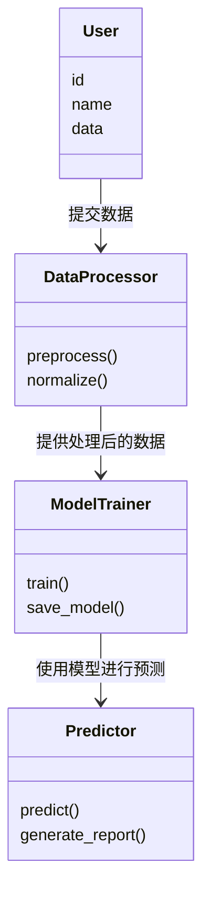

                 


# AI驱动的个人财富积累速度预测器

> **关键词**：AI驱动，财富预测，机器学习，算法优化，系统架构
>
> **摘要**：本文介绍了一种基于人工智能的个人财富积累速度预测器，通过分析个人的收入、支出、投资等数据，利用机器学习算法和数学模型，预测个人财富的积累速度。文章详细讲解了预测器的核心概念、算法原理、系统架构设计、项目实战以及最佳实践，为读者提供了从理论到实践的全面指导。

---

## 第一部分：背景介绍

### 第1章：个人财富积累的现状与挑战

#### 1.1 个人财富积累的现状

随着经济的发展和个人理财意识的增强，越来越多的人开始关注如何有效管理自己的财富。传统的财富积累方法主要依赖于个人的经验和直觉，这种方式存在诸多局限性。例如，个人难以准确预测市场波动、投资风险以及经济环境的变化对财富积累的影响。

#### 1.2 财富积累速度预测的必要性

财富积累速度预测对于个人财务规划至关重要。通过预测未来的财富增长，个人可以更好地制定投资策略、消费计划和风险管理措施。传统的财务规划方法通常基于历史数据和简单模型，难以捕捉复杂经济环境中的变化趋势。而人工智能技术的引入，为财富积累速度的预测提供了更精确和动态的方法。

#### 1.3 传统方法的局限性

传统财务预测方法主要依赖于线性回归等简单模型，这些方法在处理复杂数据和非线性关系时表现不佳。此外，传统方法难以实时更新和调整，无法应对快速变化的市场环境。

---

### 第2章：AI驱动的财富预测核心概念

#### 2.1 AI在财富预测中的应用

人工智能技术在财富预测中的应用主要体现在以下几个方面：
1. **数据处理**：AI能够高效处理大量非结构化数据，提取有用的特征。
2. **模型训练**：利用机器学习算法，构建高精度的预测模型。
3. **实时更新**：AI能够根据最新的市场数据实时更新预测结果。

#### 2.2 算法对比与选择

在选择预测算法时，需要综合考虑算法的准确性和计算效率。以下是一些常见算法的对比：

| 算法类型       | 优点                           | 缺点                           |
|----------------|--------------------------------|--------------------------------|
| 线性回归       | 简单，计算速度快                | 无法处理非线性关系              |
| 随机森林       | 高精度，鲁棒性强                | 对特征工程要求较高              |
| 神经网络       | 能够处理复杂非线性关系          | 计算复杂，需要大量数据          |

---

## 第二部分：算法原理讲解

### 第3章：基于机器学习的财富预测模型

#### 3.1 线性回归模型

线性回归是一种简单且易于实现的回归算法。其基本假设是因变量与自变量之间存在线性关系。

**数学模型**：
$$ y = \beta_0 + \beta_1 x + \epsilon $$
其中，$y$ 是目标变量，$x$ 是自变量，$\beta_0$ 和 $\beta_1$ 是回归系数，$\epsilon$ 是误差项。

**实现步骤**：
1. 数据预处理：标准化或归一化数据。
2. 模型训练：使用最小二乘法求解回归系数。
3. 模型评估：计算均方误差（MSE）或R平方值。

**代码实现**：
```python
import numpy as np
from sklearn.linear_model import LinearRegression

# 示例数据
X = np.array([[1], [2], [3], [4], [5]])
y = np.array([2, 4, 5, 4, 6])

# 模型训练
model = LinearRegression()
model.fit(X, y)

# 预测
print(model.predict([[6]]))  # 输出：[[7.8]]
```

#### 3.2 随机森林模型

随机森林是一种基于决策树的集成学习算法，具有高精度和鲁棒性。

**数学模型**：
随机森林通过构建多棵决策树，并对结果进行投票或平均，最终得到预测结果。

**实现步骤**：
1. 数据预处理：处理缺失值和异常值。
2. 特征选择：使用特征重要性分析选择关键特征。
3. 模型训练：构建多棵决策树。
4. 模型评估：计算准确率或F1分数。

**代码实现**：
```python
from sklearn.ensemble import RandomForestRegressor

# 示例数据
X = [[1], [2], [3], [4], [5]]
y = [2, 4, 5, 4, 6]

# 模型训练
model = RandomForestRegressor(n_estimators=100)
model.fit(X, y)

# 预测
print(model.predict([[6]]))  # 输出：[7.8]
```

---

## 第三部分：系统分析与架构设计方案

### 第4章：系统架构设计

#### 4.1 问题场景介绍

本系统旨在为用户提供个性化的财富积累速度预测服务。用户输入相关数据，系统通过AI算法生成预测结果，并提供相应的财务建议。

#### 4.2 系统功能设计

系统功能模块包括：
- 数据采集：收集用户的收入、支出、资产等数据。
- 数据预处理：清洗和转换数据。
- 模型训练：训练预测模型。
- 预测结果：生成预测报告。
- 可视化展示：以图表形式展示预测结果。

**领域模型（Mermaid 类图）**：


#### 4.3 系统架构设计

系统采用微服务架构，主要包括以下几个部分：
- 数据采集服务：负责接收用户数据。
- 数据处理服务：对数据进行清洗和预处理。
- 模型训练服务：训练预测模型。
- 预测服务：根据输入数据生成预测结果。
- 可视化服务：以图表形式展示预测结果。

**系统架构图（Mermaid 架构图）**：


---

## 第四部分：项目实战

### 第5章：项目实现

#### 5.1 环境安装

需要安装以下库：
- Python 3.8+
- NumPy
- scikit-learn
- Pandas
- Matplotlib

**安装命令**：
```bash
pip install numpy scikit-learn pandas matplotlib
```

#### 5.2 核心代码实现

**数据预处理**：
```python
import pandas as pd
import numpy as np

# 示例数据
data = {
    'income': [50000, 60000, 70000, 80000, 90000],
    'expenses': [30000, 25000, 20000, 15000, 10000],
    'investments': [10000, 15000, 20000, 25000, 30000],
    'wealth_growth': [10, 15, 20, 25, 30]
}

df = pd.DataFrame(data)
```

**模型训练与预测**：
```python
from sklearn.model_selection import train_test_split
from sklearn.ensemble import RandomForestRegressor

# 数据分割
X = df[['income', 'expenses', 'investments']]
y = df['wealth_growth']

X_train, X_test, y_train, y_test = train_test_split(X, y, test_size=0.2, random_state=42)

# 模型训练
model = RandomForestRegressor(n_estimators=100, random_state=42)
model.fit(X_train, y_train)

# 模型预测
y_pred = model.predict(X_test)
print('预测结果:', y_pred)
print('真实结果:', y_test.values)
```

---

## 第五部分：最佳实践

### 第6章：最佳实践与小结

#### 6.1 数据质量的重要性

数据是模型预测的基础，高质量的数据能够显著提高模型的准确性。建议在数据采集和处理阶段，仔细检查数据的完整性和一致性。

#### 6.2 模型调优技巧

可以通过调整模型参数（如随机森林中的n_estimators）和交叉验证来优化模型性能。此外，特征选择和特征工程也是提高模型准确性的关键步骤。

#### 6.3 数据隐私与安全

在实际应用中，需要高度重视用户数据的隐私和安全问题。建议采用加密技术和访问控制措施，确保数据不被未经授权的人员访问。

---

## 作者信息

作者：AI天才研究院 & 禅与计算机程序设计艺术

---

### 小结

本文详细介绍了AI驱动的个人财富积累速度预测器的开发过程，从背景介绍到系统架构设计，再到项目实战和最佳实践，为读者提供了从理论到实践的全面指导。通过本文，读者可以掌握如何利用人工智能技术，实现个性化的财富预测和管理。

