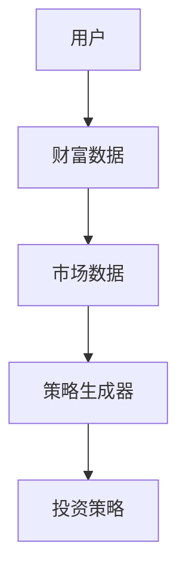
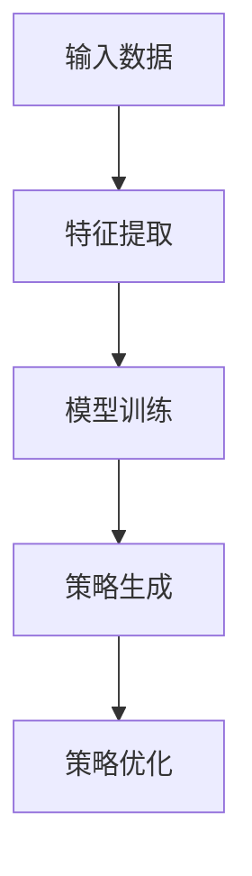
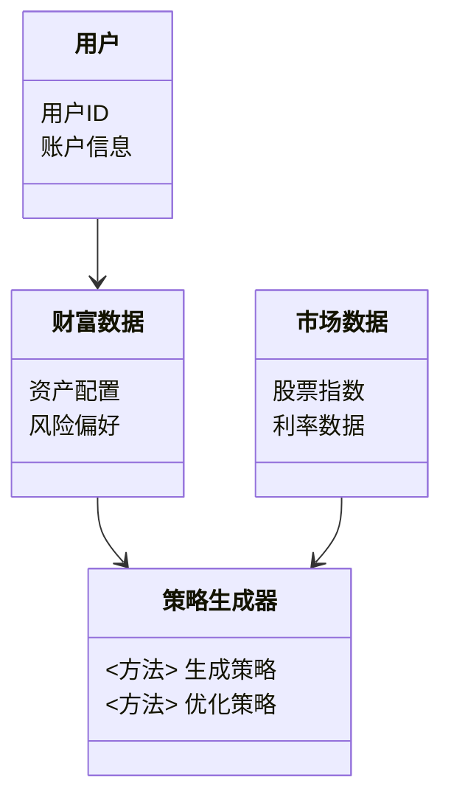
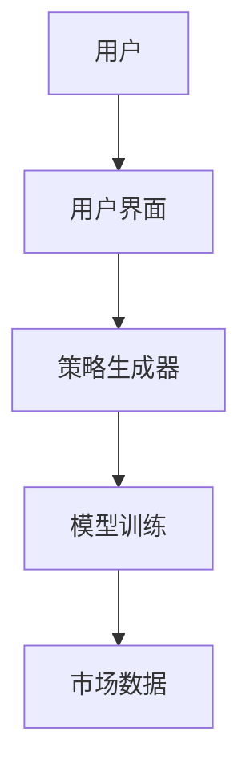

                 


# AI驱动的个人财富管理策略生成器

> 关键词：AI技术，财富管理，策略生成器，算法原理，系统架构，项目实战

> 摘要：本文深入探讨了AI技术在个人财富管理中的应用，详细介绍了AI驱动的财富管理策略生成器的背景、核心概念、算法原理、系统架构、项目实战以及最佳实践。通过结合理论与实践，本文旨在帮助读者理解如何利用AI技术优化个人财富管理策略，提升投资效率与收益。

---

## 第1章 AI驱动的财富管理策略生成器背景

### 1.1 问题背景与目标

#### 1.1.1 传统财富管理的局限性
传统财富管理依赖于人工分析和经验判断，存在以下问题：
- **信息处理能力有限**：人类难以处理海量的市场数据和复杂的投资组合。
- **决策滞后性**：人工分析速度较慢，难以及时捕捉市场变化。
- **主观性较高**：受个人经验影响，可能存在偏见和失误。

#### 1.1.2 AI技术在财富管理中的应用潜力
AI技术通过大数据分析、机器学习和深度学习等方法，能够显著提升财富管理的效率和准确性。具体优势包括：
- **快速处理数据**：AI可以实时分析海量市场数据，提供及时的投资建议。
- **优化决策**：通过算法优化，AI能够生成最优的投资策略。
- **个性化服务**：AI可以根据用户的财务状况和风险偏好，定制个性化投资方案。

#### 1.1.3 财富管理策略生成器的目标与价值
财富管理策略生成器的目标是利用AI技术，自动化地生成和优化投资策略，帮助个人用户实现财富的保值与增值。其价值体现在：
- **提高投资效率**：通过自动化分析，节省时间和成本。
- **降低投资风险**：利用AI的预测能力，提前识别潜在风险。
- **提升投资收益**：通过优化算法，实现更高的投资回报率。

### 1.2 核心概念与问题描述

#### 1.2.1 财富管理的核心要素
财富管理的核心要素包括：
- **资产配置**：如何将资金分配到不同的资产类别（股票、债券、基金等）中。
- **风险偏好**：用户对投资风险的承受能力。
- **市场环境**：包括市场波动、经济周期等外部因素。

#### 1.2.2 策略生成器的功能与边界
财富管理策略生成器的功能包括：
- **数据输入与处理**：接收用户的财务数据和市场数据。
- **策略生成**：基于输入数据，生成投资策略。
- **策略优化**：根据市场变化和用户反馈，优化投资策略。

策略生成器的边界包括：
- **数据范围**：仅处理与财富管理相关的数据。
- **功能范围**：不涉及实际交易执行，仅提供策略建议。

#### 1.2.3 AI驱动策略生成的实现路径
实现路径包括：
1. **数据收集与预处理**：收集用户财务数据和市场数据，进行清洗和特征提取。
2. **模型训练与优化**：基于历史数据，训练生成策略的模型。
3. **策略生成与输出**：根据当前市场情况，生成投资策略并输出给用户。
4. **反馈与优化**：根据用户反馈和市场变化，持续优化模型和策略。

---

## 第2章 AI驱动的财富管理策略生成器核心概念

### 2.1 财富管理策略生成器的原理

#### 2.1.1 数据输入与处理
数据输入包括用户的基本信息（收入、资产、负债等）和市场数据（股票价格、利率等）。数据处理包括数据清洗、特征提取和数据增强。

#### 2.1.2 策略生成算法
策略生成算法基于机器学习模型，包括监督学习、无监督学习和强化学习。例如，使用LSTM网络预测股票价格，生成买卖信号。

#### 2.1.3 输出与优化
输出包括投资组合配置、交易策略和风险提示。优化包括根据市场变化动态调整策略。

### 2.2 核心概念的属性对比

| 核心概念 | 数据类型 | 算法类型 | 输出类型 |
|----------|----------|----------|----------|
| 资产配置 | 数值型 | 分类算法 | 资产比例 |
| 风险偏好 | 分类型 | 聚类算法 | 风险等级 |
| 市场环境 | 数值型 | 回归算法 | 市场预测 |

### 2.3 实体关系图



---

## 第3章 算法原理与数学模型

### 3.1 策略生成算法

#### 3.1.1 基于生成模型的策略生成
生成模型包括GAN和VAE，用于生成新的投资组合配置。

#### 3.1.2 策略优化算法
优化算法包括遗传算法和粒子群优化，用于调整投资策略。

#### 3.1.3 算法流程图


### 3.2 数学模型与公式

#### 3.2.1 策略生成模型
$$ P = f(x) $$
其中，$x$ 是输入数据，$P$ 是生成的策略。

#### 3.2.2 策略优化模型
$$ O = \arg\max_{\theta} \sum_{i=1}^{n} (y_i - f(\theta))^2 $$
其中，$y_i$ 是目标值，$\theta$ 是优化参数。

---

## 第4章 系统分析与架构设计

### 4.1 系统功能设计

#### 4.1.1 用户需求分析
用户需求包括个性化策略生成、风险评估和实时监控。

#### 4.1.2 系统功能模块
功能模块包括数据输入、模型训练、策略生成和策略优化。

#### 4.1.3 领域模型


### 4.2 系统架构设计

#### 4.2.1 分层架构
系统架构分为数据层、业务逻辑层和用户界面层。

#### 4.2.2 模块划分
模块包括数据采集、模型训练、策略生成和用户界面。

#### 4.2.3 架构图


---

## 第5章 项目实战

### 5.1 环境安装
安装Python、TensorFlow和Pandas等依赖库。

### 5.2 系统核心实现源代码

```python
import pandas as pd
import numpy as np
import tensorflow as tf

# 数据预处理
def preprocess(data):
    # 数据清洗
    data = data.dropna()
    # 特征提取
    features = data[['资产', '负债', '收入']]
    return features

# 模型训练
def train_model(features, labels):
    model = tf.keras.Sequential([
        tf.keras.layers.Dense(64, activation='relu'),
        tf.keras.layers.Dense(1, activation='sigmoid')
    ])
    model.compile(optimizer='adam', loss='binary_crossentropy')
    model.fit(features, labels, epochs=100, batch_size=32)
    return model

# 策略生成
def generate_strategy(model, new_data):
    preprocessed_data = preprocess(new_data)
    prediction = model.predict(preprocessed_data)
    return prediction
```

### 5.3 案例分析
通过实际案例分析，展示如何利用生成的策略实现财富增值。

---

## 第6章 最佳实践

### 6.1 小结
本文详细介绍了AI驱动的财富管理策略生成器的背景、核心概念、算法原理、系统架构和项目实战。

### 6.2 注意事项
- 数据隐私保护
- 模型的可解释性
- 策略的动态调整

### 6.3 拓展阅读
推荐相关书籍和论文，供读者深入学习。

---

## 作者：AI天才研究院/AI Genius Institute & 禅与计算机程序设计艺术 /Zen And The Art of Computer Programming

---

**摘要**：本文深入探讨了AI技术在个人财富管理中的应用，详细介绍了AI驱动的财富管理策略生成器的背景、核心概念、算法原理、系统架构、项目实战以及最佳实践。通过结合理论与实践，本文旨在帮助读者理解如何利用AI技术优化个人财富管理策略，提升投资效率与收益。

