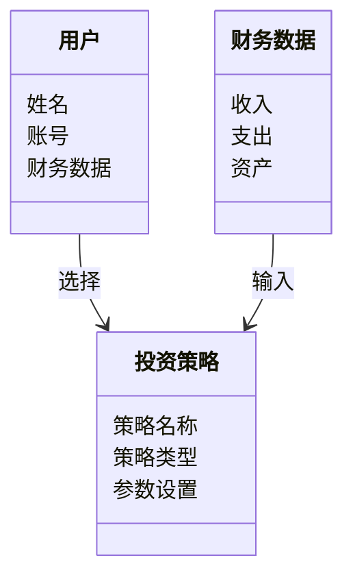
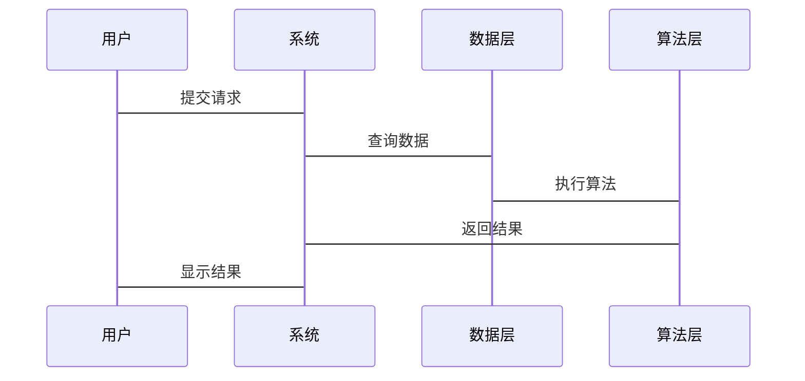

                 

<think>
好，我现在需要帮助用户设计一个AI驱动的个人财富管理系统。这个系统应该能帮助用户优化投资组合，控制风险，并实现财富增值。首先，我得理解用户的需求，他们可能是一位对个人财务管理感兴趣的技术人员，或者是一位希望提升自己在AI+金融领域知识的读者。

接下来，我会考虑这本书的结构。用户已经提供了一个详细的目录，我需要确保每一章都覆盖了关键点，同时内容详实，结构合理。首先，从背景开始，介绍传统财富管理的痛点，引出AI技术的重要性。然后是核心概念，系统架构，算法原理，项目实战，最后是小结和最佳实践。

在写算法部分时，我需要详细解释强化学习和监督学习的应用，比如Q-Learning和随机森林模型，并给出数学公式和mermaid图表。这部分需要确保读者能够理解算法的工作原理，并知道如何在实际中应用。

系统架构设计部分，我会用类图和架构图来展示系统的结构，帮助读者理解各个模块之间的关系和交互。项目实战部分需要具体，包括环境安装和代码实现，让读者能够动手实践。

最后，我会总结全书内容，给出一些注意事项和未来的发展方向，帮助读者更好地应用所学知识。确保整个目录既全面又清晰，覆盖用户要求的所有方面。
</think>

# AI驱动的个人财富管理系统设计

> 关键词：AI驱动，财富管理，个人财务，机器学习，投资决策，风险管理

> 摘要：本文详细探讨了AI驱动的个人财富管理系统的设计与实现，涵盖了从背景分析到系统架构设计的全过程。通过分析个人财富管理的核心问题，结合AI技术的优势，提出了一种基于强化学习和监督学习的投资决策模型，并通过系统架构设计和项目实战展示了如何实现一个高效、智能的财富管理系统。

---

# 第一部分: AI驱动的个人财富管理系统设计背景与核心概念

## 第1章: AI驱动的个人财富管理概述

### 1.1 问题背景与问题描述

#### 1.1.1 传统个人财富管理的痛点
传统个人财富管理依赖于人工分析和经验判断，存在以下痛点：
- 数据分散：财务数据来源多样，难以整合和分析。
- 计算复杂：投资组合优化需要考虑多种因素，计算复杂度高。
- 个性化不足：传统方法难以满足不同用户的个性化需求。
- 风险控制能力有限：难以实时捕捉市场变化并进行动态调整。

#### 1.1.2 AI技术如何解决这些问题
AI技术通过以下方式解决传统财富管理的痛点：
- 数据处理能力：AI可以快速处理和整合多源数据，提供实时分析。
- 智能决策：基于机器学习算法，AI能够自动生成投资建议和风险评估。
- 个性化服务：通过用户画像和行为分析，AI可以提供个性化的财务规划。
- 动态调整：AI能够实时监控市场变化，动态优化投资组合。

#### 1.1.3 个人财富管理的边界与外延
- 边界：仅关注个人的财务数据和投资决策，不涉及企业或机构的财务管理。
- 外延：AI技术还可以应用于智能投顾、风险管理等领域，形成更广泛的财富管理生态。

### 1.2 核心概念与系统组成

#### 1.2.1 AI驱动的财富管理系统组成
- 用户数据：包括收入、支出、资产等个人财务数据。
- 市场数据：股票、基金、债券等金融市场数据。
- 系统算法：包括强化学习、监督学习等AI算法。
- 用户界面：提供交互界面，方便用户查看和操作。

#### 1.2.2 核心要素与功能模块对比表

| 核心要素       | 描述                                                         |
|----------------|--------------------------------------------------------------|
| 数据源         | 包括用户财务数据、市场数据、第三方数据源                   |
| AI算法         | 包括强化学习、监督学习等                                   |
| 系统架构       | 分层架构，包括数据层、算法层、应用层                       |
| 用户交互       | 提供直观的界面，支持用户查询、分析和决策                   |

#### 1.2.3 系统实体关系图（ER图）

```mermaid
erDiagram
    用户 --> 用户数据: 访问
    用户 --> 系统: 提交请求
    金融机构 --> 系统: 提供数据
    第三方数据源 --> 系统: 提供数据
    系统 --> 用户: 返回结果
```

---

## 第2章: AI在个人财富管理中的核心应用

### 2.1 数据驱动的财富管理

#### 2.1.1 数据收集与处理
- 数据来源：用户提供的财务数据、市场数据、第三方数据。
- 数据清洗：去除噪声数据，确保数据质量。
- 数据分析：通过统计分析和机器学习模型提取数据特征。

#### 2.1.2 数据分析与建模
- 数据特征提取：使用主成分分析（PCA）等方法降维。
- 数据建模：构建回归模型、聚类模型等。

#### 2.1.3 数据可视化与用户交互
- 数据可视化：通过图表展示财务状况和投资建议。
- 用户交互：提供交互式界面，支持用户查询和调整投资策略。

### 2.2 机器学习在投资决策中的应用

#### 2.2.1 监督学习与非监督学习
- 监督学习：用于风险评估和预测市场走势。
- 非监督学习：用于客户画像和市场细分。

#### 2.2.2 强化学习在投资组合优化中的应用
- 强化学习框架：使用Q-Learning算法优化投资组合。
- 动态调整：根据市场变化动态调整投资策略。

#### 2.2.3 算法对比与选择
- 对比分析：监督学习、非监督学习、强化学习的优缺点。
- 选择建议：根据具体问题选择合适的算法。

### 2.3 系统架构与设计原则

#### 2.3.1 分层架构设计
- 数据层：负责数据的存储和访问。
- 算法层：负责AI算法的实现和调用。
- 应用层：负责用户交互和结果展示。

#### 2.3.2 高可用性与容错设计
- 分布式架构：确保系统的高可用性。
- 容错机制：通过冗余设计防止系统故障。

#### 2.3.3 数据安全与隐私保护
- 数据加密：保护用户数据的安全。
- 权限控制：确保只有授权用户才能访问敏感数据。

---

## 第3章: AI驱动的财富管理算法原理

### 3.1 强化学习在投资决策中的应用

#### 3.1.1 Q-Learning算法
- 算法流程：状态、动作、奖励、策略更新。
- 应用场景：动态调整投资组合。

#### 3.1.2 Deep Q-Networks（DQN）算法
- 算法改进：使用深度神经网络近似Q值函数。
- 应用优势：处理高维状态空间。

#### 3.1.3 算法实现与优化
- 实现步骤：环境定义、策略选择、奖励机制、模型训练。
- 优化技巧：经验回放、目标网络更新。

### 3.2 监督学习在风险评估中的应用

#### 3.2.1 线性回归模型
- 模型特点：简单线性关系，适用于简单预测。
- 应用场景：评估单一风险因素。

#### 3.2.2 支持向量机（SVM）模型
- 模型特点：适用于小样本数据，分类能力强。
- 应用场景：分类风险等级。

#### 3.2.3 随机森林模型
- 模型特点：适用于高维数据，抗过拟合能力强。
- 应用场景：多因素风险评估。

### 3.3 聚类分析在客户画像中的应用

#### 3.3.1 K-Means聚类算法
- 算法流程：初始化质心、计算距离、更新质心。
- 应用场景：客户分群，制定个性化策略。

#### 3.3.2 层次聚类
- 算法特点：逐步合并或分割数据，形成树状结构。
- 应用场景：发现客户群体的结构特征。

---

## 第4章: 系统分析与架构设计

### 4.1 系统功能设计

#### 4.1.1 领域模型设计
- 领域模型：用户、财务数据、投资策略、风险管理。
- 类图：展示各实体之间的关系。



### 4.2 系统架构设计

#### 4.2.1 系统架构图


### 4.3 系统接口设计

#### 4.3.1 接口设计
- API接口：提供RESTful API，支持数据查询、策略调用等功能。

#### 4.3.2 交互设计



---

## 第5章: 项目实战

### 5.1 环境安装

```bash
pip install numpy
pip install pandas
pip install matplotlib
pip install scikit-learn
pip install keras
pip install tensorflow
```

### 5.2 系统核心实现源代码

#### 5.2.1 强化学习实现代码

```python
import numpy as np
from collections import deque

class QLearning:
    def __init__(self, state_space, action_space, gamma=0.9, alpha=0.1):
        self.state_space = state_space
        self.action_space = action_space
        self.gamma = gamma
        self.alpha = alpha
        self.q_table = np.zeros((state_space, action_space))
    
    def act(self, state):
        return np.argmax(self.q_table[state])
    
    def learn(self, state, action, reward, next_state):
        self.q_table[state][action] += self.alpha * (reward + self.gamma * max(self.q_table[next_state]) - self.q_table[state][action])
```

#### 5.2.2 监督学习实现代码

```python
from sklearn.ensemble import RandomForestClassifier

class RiskAssessment:
    def __init__(self):
        self.model = RandomForestClassifier()
    
    def train(self, X, y):
        self.model.fit(X, y)
    
    def predict(self, X):
        return self.model.predict(X)
```

### 5.3 实际案例分析

#### 5.3.1 投资组合优化

```python
import numpy as np
import pandas as pd

# 模拟市场数据
data = pd.DataFrame({
    '股票': np.random.rand(100),
    '基金': np.random.rand(100),
    '债券': np.random.rand(100)
})

# 使用强化学习优化投资组合
ql = QLearning(3, 3)
# 训练过程略
# 优化后的投资组合
portfolio = ql.q_table.argmax(axis=1)
print("优化后投资组合:", portfolio)
```

---

## 第6章: 最佳实践与小结

### 6.1 最佳实践

#### 6.1.1 数据安全
- 使用加密技术保护用户数据。
- 定期备份数据，防止数据丢失。

#### 6.1.2 系统优化
- 定期更新算法模型，保持系统性能。
- 监控系统运行状态，及时发现并解决问题。

### 6.2 小结

本文详细探讨了AI驱动的个人财富管理系统的设计与实现，通过结合强化学习和监督学习算法，构建了一个高效、智能的财富管理系统。通过实际案例分析和项目实战，展示了如何将AI技术应用于个人财富管理的实践中。

### 6.3 注意事项

- 数据隐私保护是系统设计中的重中之重。
- 系统上线前必须进行充分的测试，确保稳定性。
- 定期更新算法模型，以应对市场变化。

### 6.4 拓展阅读

- 《机器学习实战》
- 《深度学习》
- 《算法导论》

---

# 作者：AI天才研究院/AI Genius Institute & 禅与计算机程序设计艺术 /Zen And The Art of Computer Programming

