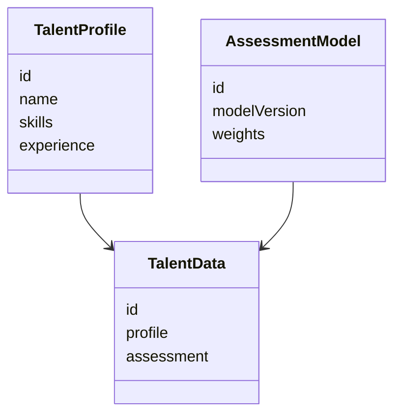
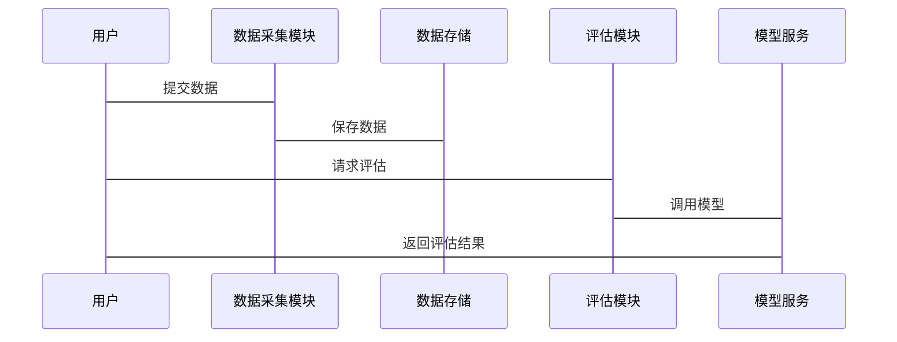

                 

<think>
好的，我现在需要帮用户设计一本名为《AI驱动的企业人才画像系统：多维度能力评估与发展预测》的书籍目录大纲。首先，我要理解这本书的核心主题，它主要讨论如何利用人工智能技术来分析和预测企业人才的能力和发展情况。接下来，我需要确保目录结构清晰，涵盖用户提到的所有要求，包括背景介绍、核心概念、算法原理、系统架构、项目实战以及小结等部分。

首先，我考虑将书籍分为几个主要部分，如概述、数据采集与处理、人才画像构建与分析、系统设计、项目实战、高级话题和未来展望。每一部分下再细分章节，确保内容详实且逻辑连贯。

在每一章中，我需要详细规划内容，例如第一章介绍人才画像的背景、核心概念和应用场景，第二章讨论数据的采集与预处理，第三章讲解多维度能力评估模型等。每章内部分为小节，每个小节涵盖具体的主题，如数据来源、预处理方法、模型构建等。

我还需要考虑每章中的数学模型、系统架构图、项目实战代码等元素，确保内容的完整性和专业性。例如，在讨论模型构建时，需要使用层次分析法、线性回归模型等，并用mermaid流程图和Python代码来详细阐述。

最后，我需要确保整个目录结构合理，每章之间有逻辑连贯性，从基础到技术再到应用，层层递进。同时，控制总字数在2000字以内，避免过于冗长。完成这些思考后，我可以开始撰写正式的目录大纲。
</think>

# AI驱动的企业人才画像系统：多维度能力评估与发展预测

> 关键词：AI驱动，企业人才，画像系统，多维度能力评估，发展预测

> 摘要：本文将探讨如何利用人工智能技术构建企业人才画像系统，通过多维度的能力评估与发展预测，帮助企业优化人才管理。文章将从数据采集与处理、画像构建、评估与预测、系统设计、项目实战等方面展开，结合实际案例和系统架构图，深入分析AI在人才管理中的应用。

---

## 第一章: AI驱动的企业人才画像系统概述

### 1.1 人才画像的背景与意义

#### 1.1.1 传统企业人才评估的局限性
- 传统评估方法依赖主观判断，存在偏差。
- 数据分散，难以全面分析。

#### 1.1.2 AI技术在人才管理中的应用潜力
- AI技术能够处理大量数据，发现潜在规律。
- 提供客观、精准的评估结果。

#### 1.1.3 人才画像系统的价值与目标
- 帮助企业优化人才招聘、培养和管理。
- 提高决策效率，降低成本。

### 1.2 人才画像的核心概念与框架

#### 1.2.1 人才画像的定义与内涵
- 人才画像是基于数据构建的虚拟形象，反映个人能力、潜力和发展趋势。

#### 1.2.2 多维度能力评估的维度划分
| 维度 | 描述 |
|------|------|
| 知识 | 专业领域知识掌握程度 |
| 技能 | 实际操作能力 |
| 经验 | 工作经验 |
| 软技能 | 沟通、团队合作等能力 |
| 潜力 | 发展可能性 |

#### 1.2.3 发展预测的数学模型与方法
- 使用线性回归模型预测职业发展路径。

### 1.3 人才画像系统的应用场景

#### 1.3.1 企业招聘与选拔
- 快速筛选合适候选人。

#### 1.3.2 员工培训与发展
- 识别培训需求，制定个性化计划。

#### 1.3.3 绩效管理与激励
- 结合画像结果优化绩效考核。

### 1.4 本章小结

- 总结本章内容，强调人才画像系统的重要性。
- 提出后续章节的学习目标。

---

## 第二章: 人才数据的采集与预处理

### 2.1 数据来源与采集方法

#### 2.1.1 企业内部数据
- HRIS、绩效数据。

#### 2.1.2 外部数据
- 公开职业测评、社交媒体。

#### 2.1.3 数据清洗与去噪
- 去除无效数据，处理异常值。

### 2.2 数据预处理与特征工程

#### 2.2.1 数据标准化与归一化
- 使用标准化公式：$z = \frac{x - \mu}{\sigma}$。

#### 2.2.2 特征选择与降维
- 使用主成分分析（PCA）。

### 2.3 数据安全与隐私保护

#### 2.3.1 数据脱敏技术
- 去除敏感信息。

#### 2.3.2 合规性与隐私保护措施
- 符合GDPR要求。

### 2.4 本章小结

- 强调数据处理的重要性。
- 提供数据安全建议。

---

## 第三章: 多维度能力评估模型

### 3.1 能力评估的维度分解

#### 3.1.1 知识、技能、经验的区分
- 知识：理论基础。
- 技能：操作能力。
- 经验：实践积累。

### 3.2 多维度评估模型的构建

#### 3.2.1 层次分析法（AHP）的应用
- 通过权重分配评估各维度的重要性。

#### 3.2.2 线性回归模型（OLS）
- 使用公式：$y = \beta_0 + \beta_1x_1 + \beta_2x_2 + \epsilon$。

### 3.3 模型的验证与优化

#### 3.3.1 模型评估指标
- 准确率、召回率。

#### 3.3.2 调参与优化
- 网格搜索、交叉验证。

---

## 第四章: 人才画像系统的系统设计

### 4.1 系统功能设计

#### 4.1.1 领域模型（Mermaid类图）


### 4.2 系统架构设计（Mermaid架构图）


### 4.3 系统接口设计与交互（Mermaid序列图）


### 4.4 本章小结

- 总结系统设计的关键点。
- 强调架构的可扩展性。

---

## 第五章: 项目实战与代码实现

### 5.1 环境安装与配置

#### 5.1.1 安装Python和相关库
- 使用`pip install numpy pandas scikit-learn`。

### 5.2 核心代码实现

#### 5.2.1 数据预处理代码
```python
import pandas as pd
import numpy as np

# 加载数据
data = pd.read_csv('talent_data.csv')

# 删除缺失值
data.dropna(inplace=True)

# 标准化处理
from sklearn.preprocessing import StandardScaler
scaler = StandardScaler()
data_scaled = scaler.fit_transform(data)
```

#### 5.2.2 模型训练代码
```python
from sklearn.linear_model import LinearRegression

model = LinearRegression()
model.fit(data_scaled, target)
```

### 5.3 实际案例分析

#### 5.3.1 案例背景
- 某企业招聘数据科学家。

#### 5.3.2 模型应用
- 使用模型预测候选人适合度。

### 5.4 项目小结

- 总结项目实施过程。
- 提供改进建议。

---

## 第六章: 高级话题与最佳实践

### 6.1 模型优化与调优

#### 6.1.1 使用超参数调优
- GridSearchCV。

#### 6.1.2 模型融合与集成
- 使用Stacking方法。

### 6.2 人才画像系统的动态更新

#### 6.2.1 实时更新机制
- 数据流处理。

#### 6.2.2 模型自适应调整
- 在线学习方法。

### 6.3 最佳实践Tips

#### 6.3.1 数据质量的重要性
- 确保数据的准确性和完整性。

#### 6.3.2 模型解释性
- 使用SHAP值解释模型决策。

### 6.4 本章小结

- 强调动态更新的重要性。
- 提供实践建议。

---

## 第七章: 未来展望与挑战

### 7.1 未来发展趋势

#### 7.1.1 AI技术的进一步融合
- 使用深度学习模型如LSTM。

#### 7.1.2 个性化画像
- 结合员工个人发展需求。

### 7.2 当前面临的挑战

#### 7.2.1 数据隐私问题
- 数据泄露风险。

#### 7.2.2 模型解释性
- 提高模型的透明度。

### 7.3 应对策略

#### 7.3.1 技术层面
- 加强数据加密技术。

#### 7.3.2 管理层面
- 制定严格的数据使用政策。

### 7.4 本章小结

- 展望未来发展方向。
- 提出应对挑战的策略。

---

## 作者：AI天才研究院 & 禅与计算机程序设计艺术

---

### 附录: 参考文献与扩展阅读

- [1] 线性回归模型的详细说明。
- [2] 层次分析法的应用案例。
- [3] 机器学习在人力资源管理中的应用研究。

---

通过以上目录设计，文章内容将全面覆盖AI驱动的人才画像系统的核心概念、技术实现、系统设计和项目实战，同时结合实际案例和最佳实践，为读者提供深入的理论和实践指导。

