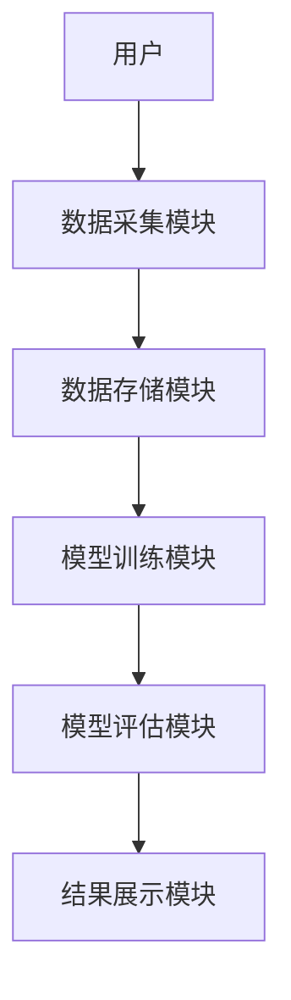
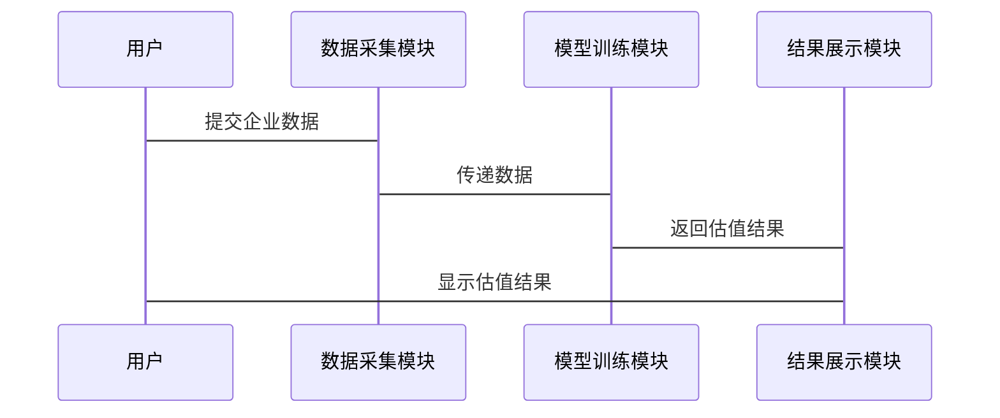

                 


# AI驱动的企业估值模型设计与实现

## 关键词
AI技术、企业估值、机器学习、金融分析、数据科学、模型设计、金融创新

## 摘要
本文详细探讨了如何利用人工智能技术构建企业估值模型，从传统估值方法的局限性出发，分析了AI技术在企业估值中的独特优势，详细讲解了AI驱动模型的核心概念、算法原理、系统架构设计以及实际项目实现。通过对比传统方法与AI驱动方法的优劣，本文为读者展示了如何通过大数据和机器学习技术实现高效、精准的企业估值，并提供了丰富的实战案例和优化建议。

---

# 第1章: AI驱动企业估值模型的背景与现状

## 1.1 企业估值的传统方法与局限性

### 1.1.1 传统企业估值方法概述
传统的企业估值方法主要包括：
- **DCF模型（Discounted Cash Flow）**：基于未来现金流的折现值计算企业价值。
- **相对估值法**：基于可比公司或行业平均值进行估值。
- **资产重置法**：基于企业资产的重置成本进行估值。

### 1.1.2 传统方法的局限性与挑战
- **数据依赖性**：传统方法依赖于财务报表数据，忽视了非财务因素（如市场情绪、行业趋势）的影响。
- **主观性**：模型参数的选择（如折现率）具有较强的主观性，可能导致估值偏差。
- **效率低下**：传统方法通常需要大量人工计算和分析，难以快速响应市场变化。

### 1.1.3 AI技术如何弥补传统方法的不足
AI技术通过引入大数据分析和机器学习算法，可以：
- **整合多维度数据**：将财务数据与市场数据、行业趋势、社交媒体情绪等非结构化数据相结合。
- **自动化特征提取**：通过特征工程提取关键指标，提升模型的预测能力。
- **动态调整模型**：实时更新模型参数，适应市场变化。

## 1.2 AI技术在企业估值中的应用现状

### 1.2.1 AI在金融领域的应用趋势
- AI技术在金融领域的应用日益广泛，特别是在风险管理、投资决策和估值分析方面。
- 金融机构开始尝试将AI技术整合到企业估值模型中，以提高估值的准确性和效率。

### 1.2.2 企业估值领域的AI技术应用案例
- 某些金融科技公司已经成功将AI技术应用于企业估值，例如利用自然语言处理（NLP）分析企业新闻和社交媒体数据，结合财务数据进行综合估值。
- AI模型可以通过时间序列分析预测企业的未来现金流，从而优化DCF模型的计算。

### 1.2.3 当前AI驱动企业估值的主要挑战
- **数据质量**：非结构化数据的处理难度较大，且数据来源多样，可能导致数据清洗和预处理的复杂性。
- **模型解释性**：复杂的AI模型（如深度学习模型）通常缺乏可解释性，可能难以被传统金融行业接受。
- **监管合规性**：AI驱动的估值模型需要符合金融行业的监管要求，这对模型的设计和部署提出了更高的要求。

## 1.3 本章小结
本章介绍了传统企业估值方法的局限性，并探讨了AI技术如何弥补这些不足。通过分析当前AI在企业估值中的应用现状，我们看到AI技术在提升估值效率和准确性方面具有巨大潜力，但也面临数据、模型解释性和合规性等挑战。

---

# 第2章: 企业估值模型的核心要素与AI结合的原理

## 2.1 企业估值模型的核心要素

### 2.1.1 企业基本面分析
- **财务指标**：如净利润、营业收入、资产负债率等。
- **市场指标**：如市盈率、市净率等。
- **行业趋势**：如行业增长率、竞争格局等。

### 2.1.2 市场环境分析
- **宏观经济指标**：如GDP增长率、利率、通货膨胀率等。
- **市场情绪**：如投资者情绪指数、社交媒体 sentiment 分析。

### 2.1.3 财务指标与非财务指标
- **财务指标**：收入、利润、现金流等。
- **非财务指标**：品牌价值、创新能力、管理团队稳定性等。

## 2.2 AI技术在企业估值中的核心作用

### 2.2.1 数据处理与特征提取
- **数据清洗**：处理缺失值、异常值。
- **特征工程**：通过PCA（主成分分析）等方法提取关键特征。
- **文本数据处理**：利用NLP技术从新闻、社交媒体中提取情感指标。

### 2.2.2 模型训练与预测
- **监督学习**：如回归、分类模型。
- **无监督学习**：如聚类分析，发现潜在的市场细分。
- **深度学习**：如LSTM用于时间序列预测。

### 2.2.3 结果解释与优化
- **模型解释性分析**：如SHAP值、LIME解释。
- **模型优化**：如超参数调优、交叉验证。

## 2.3 企业估值模型与AI技术的结合方式

### 2.3.1 数据驱动的特征工程
- **数据融合**：将财务数据与市场数据、文本数据等进行融合。
- **特征选择**：利用AI技术自动选择重要特征。

### 2.3.2 算法驱动的预测模型
- **回归模型**：用于预测企业价值。
- **分类模型**：用于企业风险评级。

### 2.3.3 结果驱动的优化策略
- **动态调整模型**：根据市场变化实时更新模型。
- **多模型集成**：通过集成学习提升预测精度。

## 2.4 本章小结
本章详细介绍了企业估值模型的核心要素，并探讨了AI技术如何在数据处理、模型训练和结果解释等方面发挥核心作用。通过数据驱动、算法驱动和结果驱动的结合，AI技术能够显著提升企业估值的准确性和效率。

---

# 第3章: 常见AI算法在企业估值中的应用

## 3.1 线性回归模型

### 3.1.1 线性回归的基本原理
线性回归是一种统计学方法，用于建立因变量与自变量之间的线性关系。其数学公式为：
$$ y = \beta_0 + \beta_1 x_1 + \beta_2 x_2 + \ldots + \beta_n x_n + \epsilon $$
其中，$\beta_0$是截距，$\beta_i$是回归系数，$\epsilon$是误差项。

### 3.1.2 线性回归在企业估值中的应用
线性回归可以用于预测企业的市盈率（P/E ratio）或市净率（P/B ratio）。

### 3.1.3 线性回归的优缺点
- **优点**：简单易懂，计算速度快。
- **缺点**：假设变量间存在线性关系，可能无法捕捉复杂的非线性关系。

## 3.2 支持向量机（SVM）

### 3.2.1 SVM的基本原理
SVM通过构建超平面将数据点分为两类，适用于分类和回归任务。数学公式如下：
$$ y = \text{sign}(w \cdot x + b) $$
其中，$w$是权重向量，$b$是截距。

### 3.2.2 SVM在企业估值中的应用
SVM可以用于企业信用评级分类，预测企业违约风险。

### 3.2.3 SVM的参数调整与优化
- **核函数选择**：如线性核、RBF核。
- **参数调优**：如C和gamma的设置。

## 3.3 神经网络与深度学习

### 3.3.1 神经网络的基本原理
神经网络由多个层组成，通过多层感知机（MLP）进行非线性特征提取。

### 3.3.2 深度学习在企业估值中的应用
深度学习可以用于处理时间序列数据，如预测企业的未来现金流。

### 3.3.3 深度学习模型的训练与优化
- **模型结构**：如LSTM用于时间序列预测。
- **优化算法**：如Adam优化器。

## 3.4 集成学习方法

### 3.4.1 集成学习的基本原理
集成学习通过组合多个模型的结果来提升预测精度，常用方法包括Bagging和Boosting。

### 3.4.2 集成学习在企业估值中的应用
集成学习可以用于企业价值预测的最终结果调整。

## 3.5 本章小结
本章详细介绍了几种常见AI算法在企业估值中的应用，包括线性回归、SVM、神经网络和集成学习。每种算法都有其独特的优势和适用场景，合理选择和组合这些算法可以显著提升企业的估值精度。

---

# 第4章: 企业估值模型的系统架构设计

## 4.1 系统功能模块设计

### 4.1.1 数据采集模块
- **数据来源**：如财务报表、市场数据、新闻数据。
- **数据预处理**：清洗和转换数据。

### 4.1.2 模型训练模块
- **特征工程**：提取关键特征。
- **模型训练**：选择合适的算法训练模型。

### 4.1.3 评估与优化模块
- **模型评估**：如准确率、召回率。
- **模型优化**：如超参数调优。

## 4.2 系统架构设计

### 4.2.1 系统架构图（Mermaid）



### 4.2.2 模块交互图（Mermaid）



## 4.3 本章小结
本章详细设计了企业估值模型的系统架构，包括数据采集、模型训练、评估与优化等模块，并通过Mermaid图展示了系统的交互流程。

---

# 第5章: 项目实战——基于Python的企业估值模型实现

## 5.1 环境安装与配置

### 5.1.1 安装必要的库
- Python：3.8+
- NumPy、Pandas、Scikit-learn、XGBoost、TensorFlow、Keras。

## 5.2 数据采集与预处理

### 5.2.1 数据获取
- 从公开数据源获取企业的财务数据和市场数据。

### 5.2.2 数据清洗
- 处理缺失值、异常值。
- 标准化或归一化数据。

## 5.3 模型实现

### 5.3.1 特征工程
```python
import pandas as pd
from sklearn.decomposition import PCA

# 假设df是数据框，包含财务数据和市场数据
features = df[['revenue', 'profit', 'market_cap', 'pe_ratio']]
features = pd.get_dummies(features)
features = features.fillna(0)
```

### 5.3.2 模型训练
```python
from sklearn.ensemble import RandomForestRegressor
from sklearn.model_selection import train_test_split
from sklearn.metrics import mean_squared_error

# 划分训练集和测试集
X_train, X_test, y_train, y_test = train_test_split(features, df['target'], test_size=0.2)

# 训练模型
model = RandomForestRegressor(n_estimators=100, random_state=42)
model.fit(X_train, y_train)

# 预测
y_pred = model.predict(X_test)
print(mean_squared_error(y_test, y_pred))
```

### 5.3.3 模型优化
```python
from sklearn.model_selection import GridSearchCV

# 调参
param_grid = {'n_estimators': [100, 200], 'max_depth': [None, 10, 20]}
grid_search = GridSearchCV(RandomForestRegressor(), param_grid, cv=5)
grid_search.fit(X_train, y_train)
best_model = grid_search.best_estimator_
```

## 5.4 案例分析与结果解读

### 5.4.1 案例分析
- 选取某行业内的几家企业进行估值预测。

### 5.4.2 结果解读
- 对比模型预测值与实际值，评估模型的准确性和可靠性。

## 5.5 本章小结
本章通过具体的Python代码实现了一个企业估值模型，从数据预处理到模型训练，再到结果解读，详细展示了AI技术在企业估值中的实际应用。

---

# 第6章: 模型优化与部署

## 6.1 模型优化策略

### 6.1.1 超参数调优
- 使用GridSearchCV或RandomizedSearchCV进行参数优化。

### 6.1.2 模型集成
- 使用集成学习方法（如投票法、加权法）提升模型性能。

## 6.2 模型部署

### 6.2.1 线上部署
- 使用Flask或Django构建API。
- 部署到云平台（如AWS、阿里云）。

### 6.2.2 模型监控
- 实时监控模型性能。
- 定期更新模型参数。

## 6.3 本章小结
本章讨论了如何优化和部署企业估值模型，通过超参数调优和模型集成提升预测精度，并通过云平台实现线上部署。

---

# 第7章: 总结与展望

## 7.1 本论文的总结
本文详细探讨了AI驱动的企业估值模型的设计与实现，从理论到实践，全面分析了AI技术在企业估值中的应用。

## 7.2 最佳实践 tips
- 数据质量是模型性能的关键。
- 模型的可解释性是金融行业的重要考量。
- 持续优化和更新模型是保持模型性能的核心。

## 7.3 未来展望
- 更多AI技术（如强化学习）在企业估值中的应用。
- 多模态数据（如图像、视频）的整合。
- 模型的可解释性进一步提升，以满足监管要求。

## 7.4 本章小结
本章总结了全文的主要内容，并对未来的发展方向进行了展望，为读者提供了进一步的研究方向和实践建议。

---

# 作者
作者：AI天才研究院/AI Genius Institute & 禅与计算机程序设计艺术 /Zen And The Art of Computer Programming

