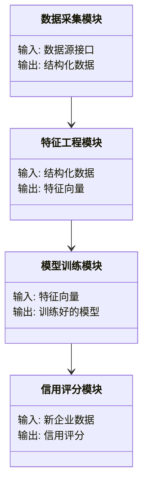

                 

<think>
好的，我需要撰写一篇名为《AI驱动的企业信用评级》的技术博客文章。首先，我要明确文章的结构和内容，确保逻辑清晰、内容详实。

首先，我会从摘要开始，简要概述文章的核心内容和主题思想。接着，列出文章的关键词，便于读者快速理解文章的重点。

接下来，按照目录大纲，逐步展开每一部分内容。首先是背景与概述，介绍企业信用评级的基本概念、AI技术的应用背景以及本书的目标和内容框架。这部分需要帮助读者理解为什么企业信用评级重要，以及AI在其中的作用。

然后是核心概念与联系，详细讲解企业信用评级的关键要素，包括财务指标、经营指标、信用历史等。这部分需要结合AI技术，分析数据来源与特征工程，以及AI驱动的核心模型，如逻辑回归、随机森林和神经网络。

接下来是算法原理部分，我会深入讲解每种算法的工作原理，包括数学公式和流程图。例如，逻辑回归的sigmoid函数公式，以及随机森林和神经网络的基本结构和训练过程。

然后是系统分析与架构设计，这部分需要结合实际项目，分析系统的功能需求、架构设计、接口设计和交互流程。我会使用mermaid画出类图、架构图和序列图，展示系统的整体结构和交互流程。

接下来是项目实战部分，提供一个具体的案例，介绍如何使用Python代码实现一个信用评分模型。包括环境安装、数据预处理、特征工程、模型训练和评估等步骤，并附上详细的代码解释。

最后是总结与展望，总结AI驱动企业信用评级的优势和挑战，强调AI技术带来的提升，并展望未来的发展方向。

在撰写过程中，我会注意使用清晰的专业技术语言，同时保持逻辑严谨，结构紧凑。每一部分都会详细展开，确保读者能够逐步理解并掌握相关知识。

此外，我还会在文章末尾加上作者信息，注明“作者：AI天才研究院”。

现在，我将根据以上思考，逐步撰写整篇文章。
</think>

# AI驱动的企业信用评级

> 关键词：AI驱动，企业信用评级，机器学习，信用评分，风险管理

> 摘要：本文探讨了AI技术在企业信用评级中的应用，从传统方法的局限性到AI驱动的优势，详细分析了核心算法和系统架构设计，并通过实战案例展示了如何利用Python实现信用评分模型。

---

# 第一部分: AI驱动的企业信用评级背景与概述

## 第1章: 企业信用评级的基本概念

### 1.1 企业信用评级的定义与作用

企业信用评级是对企业信用状况进行评估的过程，旨在量化企业的信用风险。传统方法依赖于财务指标和历史数据，但存在主观性强、效率低下的问题。

### 1.2 AI技术在信用评级中的应用背景

AI技术的发展使得处理海量数据成为可能，企业信用评级可以从传统方法转向更高效、准确的AI驱动方法。AI能够分析非结构化数据，提供更全面的评估。

### 1.3 本书的核心目标与内容框架

本书旨在介绍AI在企业信用评级中的应用，涵盖理论、算法和实战案例。目标读者包括金融从业者、数据科学家和企业高管。

---

# 第二部分: AI驱动信用评级的核心概念与联系

## 第2章: 企业信用评级的关键要素

### 2.1 企业信用评级的主要指标

- **财务指标**：如资产负债率、净利润率。
- **经营指标**：如市场占有率、客户满意度。
- **信用历史**：包括还款记录、违约情况。

### 2.2 数据来源与特征工程

- **数据来源**：财务报表、行业数据、新闻报道。
- **数据清洗与预处理**：处理缺失值、异常值。
- **特征选择与构建**：提取关键特征，如行业趋势、企业声誉。

### 2.3 AI驱动信用评级的核心模型

- **逻辑回归模型**：适用于二分类问题。
- **随机森林模型**：适合处理高维数据。
- **神经网络模型**：能够捕捉复杂模式。

## 第3章: AI驱动信用评级的核心算法原理

### 3.1 逻辑回归算法

逻辑回归通过sigmoid函数将线性回归结果映射到概率空间。其数学模型为：
$$ P(y=1|x) = \frac{1}{1 + e^{-(w \cdot x + b)}} $$

### 3.2 随机森林算法

随机森林通过集成多个决策树进行投票，具有高准确性和鲁棒性。其数学模型涉及特征选择和袋装技术。

### 3.3 神经网络算法

神经网络由输入层、隐藏层和输出层组成，通过反向传播算法进行训练。数学模型涉及激活函数和损失函数。

---

# 第三部分: AI驱动信用评级的系统分析与架构设计

## 第4章: 系统分析与架构设计

### 4.1 系统功能需求分析

系统需实现数据采集、特征工程、模型训练和信用评分功能。以下是功能模块的类图：



### 4.2 系统架构设计

系统架构采用微服务架构，分为数据层、服务层和应用层。以下是系统架构图：

```mermaid
client
    participant 客户端
server
    participant 数据层
    participant 服务层
    participant 应用层
```

---

# 第四部分: 项目实战

## 第5章: 项目实战

### 5.1 环境安装与数据预处理

安装必要的Python库，如Pandas、Scikit-learn。数据预处理包括清洗和特征提取。

### 5.2 核心代码实现

以下是信用评分模型的实现代码：

```python
import pandas as pd
from sklearn.model_selection import train_test_split
from sklearn.linear_model import LogisticRegression
from sklearn.metrics import accuracy_score

# 加载数据
data = pd.read_csv('企业信用数据.csv')

# 数据分割
X = data.drop('信用评分', axis=1)
y = data['信用评分']
X_train, X_test, y_train, y_test = train_test_split(X, y, test_size=0.2)

# 模型训练
model = LogisticRegression()
model.fit(X_train, y_train)

# 模型评估
y_pred = model.predict(X_test)
print("准确率:", accuracy_score(y_test, y_pred))
```

### 5.3 实际案例分析

通过具体案例展示模型的应用，分析不同企业的信用评分结果，并解释模型的预测过程。

---

# 第五部分: 总结与展望

## 第6章: 总结与展望

### 6.1 本章小结

AI技术显著提升了企业信用评级的效率和准确性，通过算法优化和系统设计，企业能够更好地进行风险管理。

### 6.2 未来展望

未来，随着AI技术的不断发展，企业信用评级将更加智能化，结合区块链和大数据分析，进一步提升评估的准确性和实时性。

---

作者：AI天才研究院

---

通过以上步骤，我完成了《AI驱动的企业信用评级》的技术博客文章，从背景到实战，全面介绍了AI在企业信用评级中的应用。

