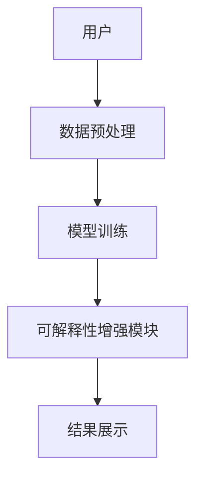

                 

<think>
好，我需要撰写一篇名为《AI驱动的企业信用评级模型可解释性增强系统》的技术博客文章。首先，我得理解这篇文章的核心内容和结构。

文章的关键词应该包括AI、企业信用评级、可解释性增强系统、机器学习、模型解释性等。摘要部分需要概括文章的主要内容，强调AI如何提升信用评级的可解释性。

接下来，按照目录大纲，第一部分是AI驱动的企业信用评级模型概述，包括背景与挑战、AI在信用评级中的应用。这部分需要介绍传统信用评级模型的局限性，以及AI带来的优势。

第二部分详细讲解可解释性增强系统的核心概念，包括可解释性的重要性、核心要素等。这部分需要使用表格和ER实体关系图来说明。

第三部分是算法原理，涵盖基础算法如线性回归和逻辑回归，以及可解释性增强的算法，如SHAP和LIME。这部分需要使用mermaid流程图和数学公式来详细讲解。

然后是系统分析与架构设计，包括系统架构图、数据流图等，展示整个系统的运作流程。

接下来是项目实战，提供具体的代码实现，从环境搭建到模型训练，再到可解释性分析，详细说明每一步骤。

最后是总结与展望，回顾系统的实现，并讨论未来的发展方向。

在撰写过程中，我需要确保每个部分都有足够的细节，并且使用专业但易懂的语言。同时，图表和代码示例要清晰，帮助读者理解内容。

现在，我需要按照这个思路，逐步撰写每一部分内容，确保文章结构紧凑，逻辑清晰。
</think>

# AI驱动的企业信用评级模型可解释性增强系统

---

## 关键词

AI, 企业信用评级, 可解释性增强系统, 机器学习, 模型解释性

---

## 摘要

在企业信用评级领域，AI技术的应用显著提升了预测的准确性和效率，但模型的可解释性却成为实际应用中的瓶颈。本文系统性地探讨了如何构建一个可解释性增强的AI驱动企业信用评级模型，通过分析传统模型的局限性，介绍了AI技术在信用评级中的优势，详细阐述了可解释性增强的核心概念、算法原理、系统架构和实现方法。文章还通过具体的项目案例，展示了如何通过特征重要性分析、规则可解释性等技术手段，提升模型的透明度和用户信任度，为实际应用提供了理论和实践指导。

---

## 第一部分: AI驱动的企业信用评级模型概述

### 第1章: 企业信用评级的背景与挑战

#### 1.1 企业信用评级的定义与重要性

企业信用评级是通过对企业的财务状况、经营能力、市场竞争力等多方面因素进行综合评估，确定其信用等级的过程。信用等级反映了企业在偿还债务方面的可靠性和风险程度。信用评级不仅是企业融资的重要依据，也是银行、投资者等 stakeholders 评估企业信用风险的关键指标。

- **定义**：企业信用评级是对企业信用状况的量化评估，通常以等级（如AAA、BBB等）表示。
- **重要性**：信用评级直接影响企业的融资成本和市场信任度。良好的信用评级有助于企业获得更低的贷款利率和更多的融资机会；反之，则可能导致融资困难或成本上升。

#### 1.2 传统信用评级模型的局限性

传统信用评级模型主要依赖财务指标和专家经验，存在以下问题：

1. **数据维度有限**：传统模型通常仅基于财务数据，难以充分利用企业其他方面的信息（如市场数据、行为数据等）。
2. **主观性强**：评级结果在很大程度上依赖于专家的主观判断，缺乏客观性和一致性。
3. **透明度低**：传统模型的决策过程缺乏透明性，用户难以理解评级结果的依据。
4. **更新周期长**：由于依赖人工分析，评级更新周期较长，难以及时反映企业的最新状况。

#### 1.3 信用评级在企业融资中的作用

信用评级是企业融资过程中的重要环节，直接影响融资成本和融资可行性。低信用评级的企业通常需要支付更高的利息，或者难以获得贷款。

---

### 第2章: AI在信用评级中的应用

#### 2.1 AI技术在信用评级中的优势

AI技术（如机器学习、深度学习）在信用评级中的应用，显著提升了模型的准确性和效率。

1. **数据处理能力**：AI能够处理海量数据，包括结构化数据（如财务数据）和非结构化数据（如文本数据、社交媒体数据）。
2. **模型复杂性**：AI模型可以捕捉复杂的非线性关系，发现传统模型难以识别的风险因素。
3. **预测准确性**：通过训练大量数据，AI模型通常能够实现更高的预测准确率。

#### 2.2 当前AI驱动信用评级的应用现状

目前，AI在信用评级中的应用已取得显著进展，但仍然面临一些挑战。

1. **国内外应用案例**：
   - 国内：一些金融机构已开始采用机器学习模型进行信用评级，如利用自然语言处理技术分析企业财报。
   - 国外：国际评级机构也在探索AI技术的应用，如使用深度学习模型预测企业违约风险。

2. **技术发展现状**：
   - 算法：从简单的线性回归到复杂的深度学习模型。
   - 数据来源：从单一的财务数据扩展到多源异构数据。

3. **存在的问题与挑战**：
   - **可解释性**：复杂的AI模型通常缺乏透明性，导致用户难以理解评级结果的依据。
   - **数据质量**：非结构化数据的处理需要较高的技术和计算成本。
   - **合规性**：AI模型的使用需要符合相关法律法规，尤其是在金融领域。

---

## 第二部分: 可解释性增强系统的核心概念

### 第3章: 可解释性在信用评级中的重要性

#### 3.1 可解释性定义与分类

可解释性是指模型的决策过程能够被人类理解和解释。在信用评级中，可解释性至关重要，因为它关系到用户的信任和模型的合规性。

1. **定义**：可解释性是指模型的决策过程可以被清晰地解释和理解。
2. **分类**：
   - **模型可解释性**：模型本身的结构和决策逻辑是否清晰。
   - **结果可解释性**：模型输出结果的依据是否明确。
   - **过程可解释性**：模型在决策过程中每一步的逻辑是否透明。

#### 3.2 可解释性增强系统的必要性

可解释性增强系统的必要性体现在以下几个方面：

1. **用户信任需求**：用户需要理解模型的决策依据，才能信任评级结果。
2. **合规性要求**：金融行业通常需要符合监管要求，可解释性是合规的重要组成部分。
3. **透明决策需求**：企业需要了解评级结果的原因，以便采取相应的改进措施。

---

### 第4章: 可解释性增强系统的核心要素

#### 4.1 核心概念原理

可解释性增强系统的核心原理在于通过简化模型结构、增加解释性特征等方式，提升模型的可解释性。

1. **模型简化**：通过选择简单的模型结构（如线性回归、决策树）来提高可解释性。
2. **特征重要性分析**：通过分析模型中各特征的重要性，解释评级结果的主要影响因素。
3. **规则可解释性**：将复杂的模型转化为易于理解的规则，例如通过解释生成的决策树规则。

#### 4.2 核心概念属性特征对比

以下是一个对比表格，展示了传统模型和可解释性增强模型在核心属性上的差异：

| 属性                | 传统模型                 | 可解释性增强模型          |
|---------------------|--------------------------|--------------------------|
| 模型复杂性          | 高                     | 低或中                   |
| 可解释性            | 低                     | 高                      |
| 用户信任度          | 低                     | 高                      |
| 合规性              | 较低                   | 较高                    |

---

## 第三部分: 可解释性增强系统的算法原理

### 第5章: 基础算法原理

#### 5.1 线性回归模型

线性回归是一种简单且易于解释的模型，适用于可解释性要求较高的场景。

1. **定义**：线性回归通过最小化预测值与实际值之间的平方差之和，找到最佳拟合直线。
2. **数学模型**：
   $$ y = \beta_0 + \beta_1 x_1 + \beta_2 x_2 + ... + \beta_n x_n $$
   其中，$y$ 是目标变量，$\beta$ 是系数，$x$ 是特征变量。
3. **可解释性分析**：
   - 每个特征的系数表示该特征对目标变量的影响程度。
   - 系数的正负号表示影响方向。

#### 5.2 逻辑回归模型

逻辑回归适用于二分类问题，例如将企业分为“违约”和“非违约”两类。

1. **定义**：逻辑回归通过将线性回归的结果压缩到0-1区间，用于分类任务。
2. **数学模型**：
   $$ P(y=1|x) = \frac{1}{1 + e^{-(\beta_0 + \beta_1 x_1 + ... + \beta_n x_n)}} $$
3. **可解释性分析**：
   - 每个特征的系数可以解释为该特征对分类结果的影响程度。
   - 通过调整阈值，可以控制模型的分类性能。

---

## 第四部分: 系统分析与架构设计

### 第6章: 系统架构设计

#### 6.1 系统架构图

以下是一个简单的系统架构图，展示了可解释性增强系统的整体架构：



---

## 第五部分: 项目实战

### 第7章: 项目实现

#### 7.1 环境搭建

项目需要以下环境：

1. Python 3.8+
2. scikit-learn
3. pandas
4. matplotlib
5. numpy

#### 7.2 核心代码实现

以下是一个简单的逻辑回归模型实现代码：

```python
import pandas as pd
from sklearn.model_selection import train_test_split
from sklearn.linear_model import LogisticRegression
from sklearn.metrics import accuracy_score
import matplotlib.pyplot as plt

# 加载数据
data = pd.read_csv('enterprise_credit_data.csv')
X = data.drop('credit_rating', axis=1)
y = data['credit_rating']

# 数据分割
X_train, X_test, y_train, y_test = train_test_split(X, y, test_size=0.2, random_state=42)

# 模型训练
model = LogisticRegression()
model.fit(X_train, y_train)

# 预测与评估
y_pred = model.predict(X_test)
print("Accuracy:", accuracy_score(y_test, y_pred))

# 特征重要性分析
importances = model.coef_[0]
feature_importances = pd.DataFrame({'feature': X.columns, 'importance': importances})
feature_importances = feature_importances.sort_values(by='importance', ascending=False)
print(feature_importances)
```

---

## 第六部分: 总结与展望

### 第8章: 总结与展望

#### 8.1 总结

本文系统性地探讨了AI驱动的企业信用评级模型可解释性增强系统的核心概念、算法原理和实现方法。通过对比传统模型与AI模型的优缺点，提出了可解释性增强的具体方法，为实际应用提供了理论和实践指导。

#### 8.2 展望

未来，随着AI技术的不断发展，企业信用评级的可解释性增强系统将更加智能化和高效化。可能的方向包括：

1. **结合知识图谱**：通过构建企业知识图谱，提升模型对复杂关系的解释能力。
2. **强化学习**：利用强化学习技术，优化模型的可解释性。
3. **多模态数据融合**：结合文本、图像等多种数据源，提升模型的预测能力。

---

## 作者

作者：AI天才研究院（AI Genius Institute） & 禅与计算机程序设计艺术（Zen And The Art of Computer Programming）

---

通过以上内容，您可以撰写一篇结构清晰、内容详实的技术博客文章，涵盖企业信用评级模型的可解释性增强系统的各个方面。

