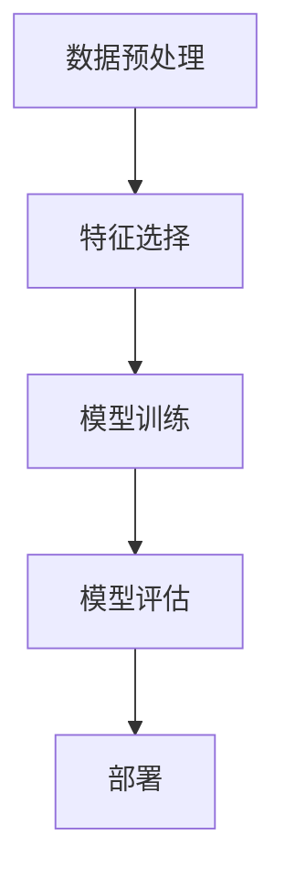
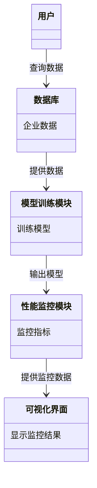
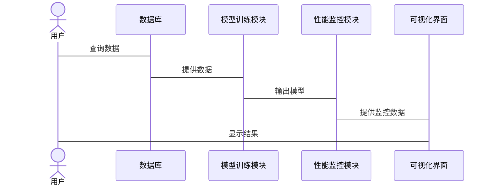

                 


# AI驱动的企业信用评级模型性能监控系统

> 关键词：AI驱动，企业信用评级，模型性能监控，机器学习，深度学习

> 摘要：本文介绍了一种基于人工智能的企业信用评级模型性能监控系统。首先，分析了传统信用评级方法的局限性，探讨了AI技术在信用评级中的应用优势，以及性能监控的重要性。接着，详细阐述了系统的核心概念、算法原理、系统架构设计和项目实现过程。最后，总结了系统的实际应用价值和未来的发展方向。

---

# 第一部分: 背景与概述

# 第1章: AI驱动的企业信用评级模型性能监控系统概述

## 1.1 问题背景与重要性

### 1.1.1 传统信用评级的局限性
传统的信用评级方法依赖于财务报表分析和经验判断，存在主观性强、效率低、覆盖面窄等问题。企业财务数据可能滞后，无法及时反映市场变化，且难以处理非结构化数据，如社交媒体信息。

### 1.1.2 AI在信用评级中的优势
AI技术，尤其是机器学习和深度学习，能够处理大量结构化和非结构化数据，发现传统方法难以察觉的模式和趋势。通过实时数据分析，AI可以提高信用评级的准确性和效率，降低人为错误。

### 1.1.3 性能监控的必要性
AI模型在实际应用中可能面临数据漂移、模型衰退等问题。实时监控模型性能，及时发现并修复问题，是确保系统长期稳定运行的关键。

## 1.2 系统目标与功能

### 1.2.1 系统目标
- 提供实时信用评级服务。
- 监控模型性能，确保评级准确性。
- 支持模型优化和迭代。

### 1.2.2 核心功能模块
- 数据采集与处理。
- 模型训练与部署。
- 性能监控与告警。
- 可视化分析。

### 1.2.3 边界与外延
系统仅关注信用评级模型的性能监控，不涉及具体业务决策，边界清晰。

## 1.3 核心概念与组成

### 1.3.1 AI模型
基于机器学习的模型，如逻辑回归、随机森林等，用于预测企业信用评级。

### 1.3.2 信用评级
对企业的信用状况进行评估，分为多个等级，如AAA、AA、A等。

### 1.3.3 性能监控
通过指标和实时数据，评估模型的准确性、稳定性，及时发现问题。

## 1.4 本章小结
本章介绍了AI驱动信用评级系统的重要性和目标，详细阐述了核心概念和组成部分，为后续章节奠定了基础。

---

# 第二部分: 核心概念与联系

# 第2章: AI模型与信用评级的关系

## 2.1 AI模型的基本原理

### 2.1.1 机器学习基础
机器学习通过数据训练模型，使其能够识别模式和趋势。常用算法包括监督学习、无监督学习等。

### 2.1.2 深度学习简介
深度学习通过多层神经网络处理复杂数据，如文本和图像，提升模型表达能力。

### 2.1.3 AI模型在信用评级中的应用
AI模型可以处理多种数据类型，发现潜在风险因素，提高评级准确性和效率。

## 2.2 信用评级的核心要素

### 2.2.1 企业财务指标
如资产负债率、利润率等，是传统评级的重要依据。

### 2.2.2 市场表现
包括股价波动、行业趋势等，反映企业的市场地位和风险。

### 2.2.3 其他影响因素
如社交媒体 sentiment、专利数量等，提供更多维度的信息。

## 2.3 性能监控的关键指标

### 2.3.1 模型准确性
通过准确率、召回率等指标评估模型预测能力。

### 2.3.2 鲁棒性
模型在不同数据集上的表现，确保稳定可靠。

### 2.3.3 可解释性
模型决策过程的透明度，帮助理解评级结果。

## 2.4 ER实体关系图

```mermaid
er
  actor: 系统用户
  model: 信用评级模型
  data: 企业数据
  monitor: 性能监控模块
  actor --> model: 训练模型
  model --> data: 数据输入
  model --> monitor: 输出性能指标
  monitor --> actor: 提供监控结果
```

本章通过ER图展示了系统各实体之间的关系，强调了数据流和模块交互的重要性。

---

# 第三部分: 算法原理讲解

# 第3章: 信用评级模型的算法实现

## 3.1 机器学习模型选择

### 3.1.1 逻辑回归
适用于二分类问题，通过logistic函数将线性回归输出转化为概率。

公式：
$$ P(y=1|x) = \frac{e^{\beta x}}{1 + e^{\beta x}} $$

### 3.1.2 支持向量机
通过找到最优超平面，最大化类别间隔，适用于高维数据。

### 3.1.3 随机森林
集成学习方法，通过多个决策树投票决定结果，提升准确性和鲁棒性。

## 3.2 算法流程



流程图展示了从数据预处理到模型部署的完整流程。

## 3.3 核心算法实现

### 3.3.1 逻辑回归实现

```python
import numpy as np
from sklearn.linear_model import LogisticRegression

# 数据预处理
X = ...
y = ...

# 模型训练
model = LogisticRegression()
model.fit(X, y)

# 预测
y_pred = model.predict(X)
```

### 3.3.2 模型评估

$$准确率 = \frac{\text{正确预测数}}{\text{总预测数}} $$

## 3.4 本章小结
本章详细讲解了常用机器学习算法，并通过代码示例展示了实现过程，为后续系统设计提供了理论基础。

---

# 第四部分: 系统分析与架构设计

# 第4章: 系统架构设计

## 4.1 系统功能模块

### 4.1.1 数据采集模块
从数据库和API获取企业数据。

### 4.1.2 模型训练模块
负责训练和部署AI模型。

### 4.1.3 性能监控模块
实时监控模型表现，发送告警。

### 4.1.4 可视化模块
提供直观的监控界面，便于用户分析。

## 4.2 系统架构设计



## 4.3 系统交互流程



## 4.4 本章小结
本章详细设计了系统的架构和交互流程，为项目的实施提供了指导。

---

# 第五部分: 项目实战

# 第5章: 项目实现与案例分析

## 5.1 环境搭建

### 5.1.1 安装Python
安装Python 3.x，推荐使用Anaconda。

### 5.1.2 安装依赖库
安装numpy、pandas、scikit-learn、flask等库。

```bash
pip install numpy pandas scikit-learn flask
```

## 5.2 系统核心代码实现

### 5.2.1 数据预处理

```python
import pandas as pd

data = pd.read_csv('企业数据.csv')
data = data.dropna()
```

### 5.2.2 模型训练

```python
from sklearn.linear_model import LogisticRegression

X = data.drop('信用评级', axis=1)
y = data['信用评级']

model = LogisticRegression()
model.fit(X, y)
```

### 5.2.3 性能监控

```python
from sklearn.metrics import accuracy_score

y_pred = model.predict(X)
print(f'准确率: {accuracy_score(y, y_pred)}')
```

## 5.3 案例分析

### 5.3.1 数据分析
分析企业财务指标和市场表现，发现某些行业风险较高。

### 5.3.2 模型表现
通过准确率和召回率评估模型性能，识别模型的局限性。

## 5.4 本章小结
本章通过实际案例展示了系统的实现过程，验证了算法的有效性和系统的可行性。

---

# 第六部分: 最佳实践与总结

# 第6章: 最佳实践与系统优化

## 6.1 最佳实践

### 6.1.1 数据预处理
确保数据质量，处理缺失值和异常值。

### 6.1.2 模型调优
使用交叉验证和网格搜索优化模型参数。

### 6.1.3 系统维护
定期更新模型，监控数据源的变化。

## 6.2 项目总结

### 6.2.1 成果总结
成功构建了AI驱动的信用评级模型，并实现了性能监控系统。

### 6.2.2 经验总结
AI技术显著提升了信用评级的效率和准确性，性能监控确保了系统的稳定运行。

## 6.3 未来展望

### 6.3.1 技术发展
探索更先进的AI算法，如强化学习和图神经网络。

### 6.3.2 应用扩展
将系统应用于更多领域，如供应链金融和风险投资。

## 6.4 注意事项

### 6.4.1 数据隐私
确保数据处理符合隐私保护法规。

### 6.4.2 模型解释性
提高模型的可解释性，便于业务理解和使用。

## 6.5 拓展阅读

### 6.5.1 推荐书籍
《机器学习实战》、《深度学习》。

### 6.5.2 在线资源
推荐访问Kaggle、GitHub上的相关项目。

---

# 作者

作者：AI天才研究院/AI Genius Institute & 禅与计算机程序设计艺术 /Zen And The Art of Computer Programming

---

# 结语

通过本文的详细讲解，读者可以全面了解AI驱动的企业信用评级模型性能监控系统的构建过程。从理论到实践，从算法到系统设计，每一步都进行了深入探讨。希望本文能为相关领域的研究和实践提供有价值的参考。

