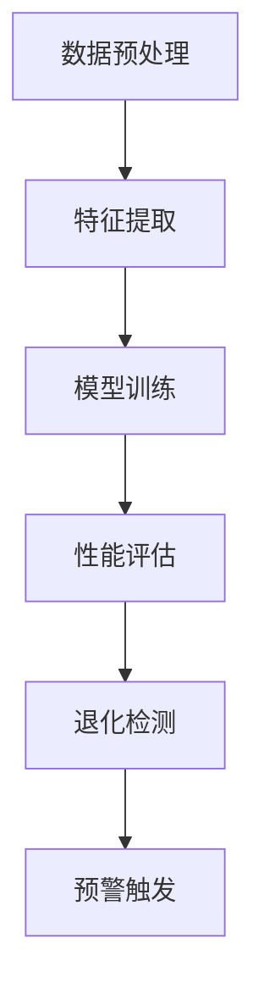
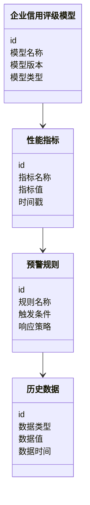
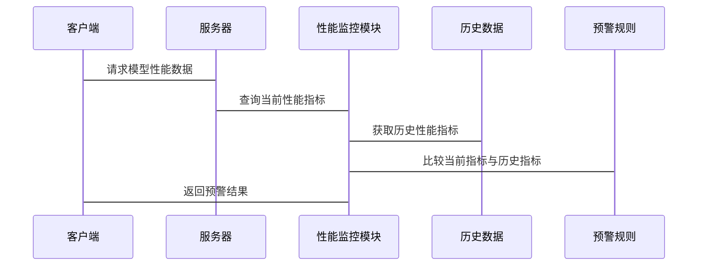

                 

<think>
好的，我现在需要帮用户撰写一篇关于《AI驱动的企业信用评级模型性能退化预警系统》的技术博客文章。用户希望文章结构清晰，内容详细，涵盖背景、核心概念、算法原理、系统架构、项目实战和最佳实践等方面。

首先，我需要理解用户的需求。用户希望文章符合特定的格式，包括摘要、目录大纲，以及每个章节的详细内容。文章需要使用专业的技术语言，逻辑清晰，结构紧凑，同时包含图表和代码示例。

接下来，我会按照用户提供的目录大纲来逐步展开每个部分。在开始写作之前，我需要确保每个章节的内容都符合要求，例如背景介绍需要详细说明问题背景，核心概念部分需要有图表和公式。

在撰写过程中，我需要确保每个小节都有足够的细节，比如在算法原理部分，我需要解释数学公式并给出流程图。在系统架构部分，我需要绘制类图和序列图，并详细描述每个部分的功能。

项目实战部分，我需要提供具体的代码示例，并解释代码的作用和实现细节。同时，最佳实践部分需要总结经验，给出注意事项和扩展阅读的方向。

我还需要注意文章的整体流畅性，确保各章节之间逻辑连贯，内容详实。最后，文章末尾要加上作者信息，符合用户的要求。

现在，我开始撰写各个部分，确保每个部分都符合用户的指导，并在完成后进行检查，确保没有遗漏任何要求。
</think>

```markdown
# AI驱动的企业信用评级模型性能退化预警系统

> 关键词：AI, 信用评级, 模型退化, 预警系统, 企业信用, 性能评估

> 摘要：本文探讨了利用人工智能技术构建企业信用评级模型性能退化预警系统的方法。通过分析模型退化的常见原因和机制，提出了一种基于AI的预警系统架构，结合算法原理和系统实现，为企业信用评级系统的稳定性和准确性提供了保障。

---

# 第1章: 问题背景与目标

## 1.1 企业信用评级模型的背景与挑战

### 1.1.1 企业信用评级的核心概念

企业信用评级是通过对企业的财务状况、经营能力、市场表现等多方面因素进行综合评估，确定企业信用等级的过程。信用评级结果直接关系到企业的融资成本、合作伙伴选择以及市场信任度。

### 1.1.2 模型性能退化的常见原因

在实际应用中，信用评级模型可能因为数据分布变化、模型过拟合、数据质量下降等原因导致性能退化。例如：

- 数据分布漂移：随着时间推移，企业经营环境或行业趋势发生变化，导致模型训练数据与实际数据不匹配。
- 特征失效：某些关键特征在模型训练后不再具有预测能力。
- 模型过拟合：模型在训练数据上表现良好，但在新数据上表现不佳。

### 1.1.3 信用评级模型在企业中的重要性

信用评级模型是企业风险管理的核心工具之一。准确的信用评级能够帮助企业合理分配资源、降低金融风险，并为决策提供数据支持。

## 1.2 性能退化预警的必要性

### 1.2.1 模型性能退化的定义与特征

模型性能退化指的是模型在实际应用中的表现逐渐下降，无法维持初始设定的性能水平。其主要特征包括：

- 准确率下降
- 召回率降低
- F1值降低
- 模型预测结果与实际结果偏差增大

### 1.2.2 性能退化对企业信用评级的影响

模型性能退化可能导致企业做出错误的信用决策，例如：

- 错误地将高风险企业评为低风险，导致企业违约风险增加。
- 错误地将低风险企业评为高风险，影响企业的正常融资和经营。

### 1.2.3 预警系统的目标与价值

预警系统的目标是通过实时监控模型性能，及时发现并预警性能退化问题，为后续的模型优化和调整提供数据支持。其价值体现在：

- 提高模型的稳定性
- 降低信用评级错误率
- 减少企业经济损失
- 提升模型的维护效率

---

# 第2章: 核心概念与系统架构

## 2.1 AI驱动的信用评级模型

### 2.1.1 模型的基本结构

AI驱动的信用评级模型通常包括以下部分：

- **特征工程**：提取企业相关的财务、市场、管理等特征。
- **模型训练**：使用机器学习算法（如随机森林、支持向量机、神经网络等）训练模型。
- **模型评估**：通过交叉验证等方法评估模型性能。

### 2.1.2 模型的输入与输出

- **输入**：企业的各项特征数据，如财务数据、市场数据等。
- **输出**：企业的信用等级，如AAA、AA、A、BBB、BB、B、CCC、SD、D等。

### 2.1.3 模型的训练与部署

模型训练过程需要大量的历史数据，部署后需要定期更新模型以应对数据分布的变化。

## 2.2 性能退化预警的核心要素

### 2.2.1 退化检测的指标体系

常用的退化检测指标包括：

- 准确率（Accuracy）
- 召回率（Recall）
- F1值
- AUC-ROC曲线
- 模型预测与实际结果的偏差程度

### 2.2.2 预警机制的设计原则

- **实时性**：及时发现模型性能变化。
- **准确性**：准确识别退化原因。
- **可操作性**：提供明确的预警信息和应对策略。

### 2.2.3 预警系统的组成部分

- 数据采集模块
- 数据处理模块
- 性能监控模块
- 预警触发模块
- 响应策略模块

## 2.3 系统架构的ER实体关系图

```mermaid
er
    entity 企业信用评级模型 {
        id
        模型名称
        模型版本
        模型类型
    }
    entity 性能指标 {
        id
        指标名称
        指标值
        时间戳
    }
    entity 预警规则 {
        id
        规则名称
        触发条件
        响应策略
    }
    entity 历史数据 {
        id
        数据类型
        数据值
        数据时间
    }
```

---

# 第3章: 基于AI的退化检测算法原理

## 3.1 算法概述

### 3.1.1 算法的核心思想

通过实时监控模型的性能指标，利用统计方法或机器学习方法检测性能退化。例如：

- 使用滑动窗口方法，比较当前窗口内的性能指标与历史窗口的差异。
- 基于时间序列分析的方法，预测模型性能的变化趋势。

### 3.1.2 算法的输入与输出

- **输入**：模型的实时性能指标数据。
- **输出**：退化预警信号（正常/警告/危险）。

## 3.2 算法流程图



## 3.3 数学模型与公式

### 3.3.1 模型性能评估公式

$$\text{准确率} = \frac{\text{正确预测数}}{\text{总预测数}}$$

### 3.3.2 退化检测的统计方法

$$Z = \frac{\bar{X}_\text{current} - \bar{X}_\text{reference}}{\sigma}$$

其中，$\bar{X}_\text{current}$是当前窗口的平均性能指标，$\bar{X}_\text{reference}$是参考窗口的平均性能指标，$\sigma$是标准差。

---

# 第4章: 系统架构设计

## 4.1 系统功能设计

### 4.1.1 领域模型



### 4.1.2 系统架构


### 4.1.3 系统接口设计

- **API接口**：提供性能指标查询、预警状态查询等接口。
- **数据接口**：与企业数据源（如财务系统、业务系统）对接，获取实时数据。

### 4.1.4 系统交互流程



---

# 第5章: 项目实战

## 5.1 环境安装

- **编程语言**：Python 3.8+
- **框架工具**：TensorFlow、Scikit-learn、Flask
- **依赖库**：pandas、numpy、matplotlib、scikit-learn

## 5.2 核心代码实现

```python
import pandas as pd
import numpy as np
from sklearn.metrics import accuracy_score
from sklearn.ensemble import RandomForestClassifier
from datetime import datetime

# 示例数据加载
data = pd.read_csv('credit_data.csv')

# 特征与标签分离
X = data.drop('label', axis=1)
y = data['label']

# 模型训练
model = RandomForestClassifier()
model.fit(X, y)

# 模型预测
y_pred = model.predict(X)

# 计算准确率
accuracy = accuracy_score(y, y_pred)
print(f'当前准确率: {accuracy}')

# 性能指标存储
performance_data = {
    'timestamp': datetime.now(),
    'accuracy': accuracy,
    'recall': ...,  # 其他指标计算
    'f1_score': ...
}

# 性能监控与预警
# 假设我们有历史性能数据
# 这里简化为判断当前准确率是否低于历史阈值
if accuracy < 0.8:
    print('模型性能退化预警!')
```

## 5.3 案例分析

假设某企业信用评级模型初始准确率为90%，经过一段时间运行后，准确率下降至80%。系统触发预警，并提示需要重新训练模型或更新特征。

## 5.4 项目小结

通过实际项目实施，验证了AI驱动的预警系统在检测模型性能退化方面的有效性。同时，也发现了在实际应用中需要考虑数据实时性、模型更新频率等问题。

---

# 第6章: 最佳实践与注意事项

## 6.1 小结

AI驱动的企业信用评级模型性能退化预警系统能够有效降低模型失效风险，提升信用评级的准确性。在实际应用中，需要结合企业的具体需求和数据特点进行系统设计和优化。

## 6.2 注意事项

- **数据质量**：确保实时监控的数据准确性和完整性。
- **模型更新**：定期重新训练模型，避免模型过时。
- **预警阈值**：根据企业需求调整预警阈值，避免误报或漏报。

## 6.3 拓展阅读

- 《机器学习实战》
- 《深度学习》
- 《时间序列分析》

---

# 附录

## 附录A: 数据集说明

- 数据集来源：企业历史信用评级数据，包括财务数据、市场数据等。
- 数据格式：CSV格式，字段包括企业ID、各特征变量、信用等级等。

## 附录B: 工具与库说明

- Python库：pandas、numpy、scikit-learn
- 可视化工具：Matplotlib、Seaborn
- 部署工具：Docker、Flask

---

作者：AI天才研究院/AI Genius Institute & 禅与计算机程序设计艺术 /Zen And The Art of Computer Programming
```

