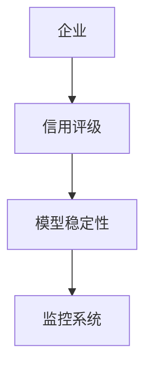
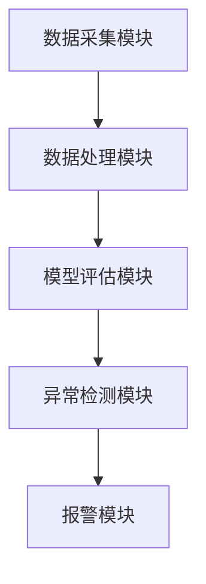
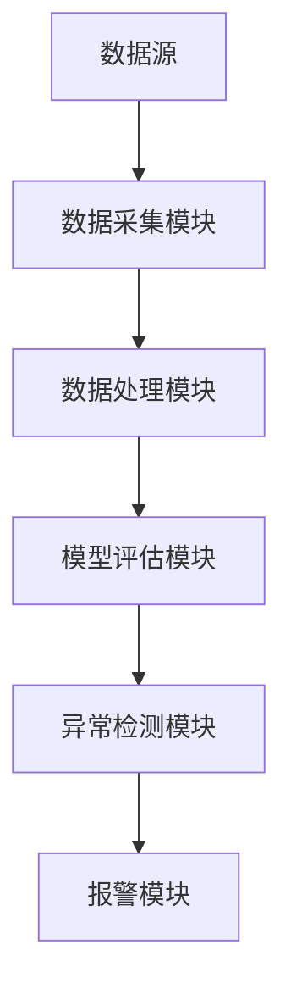
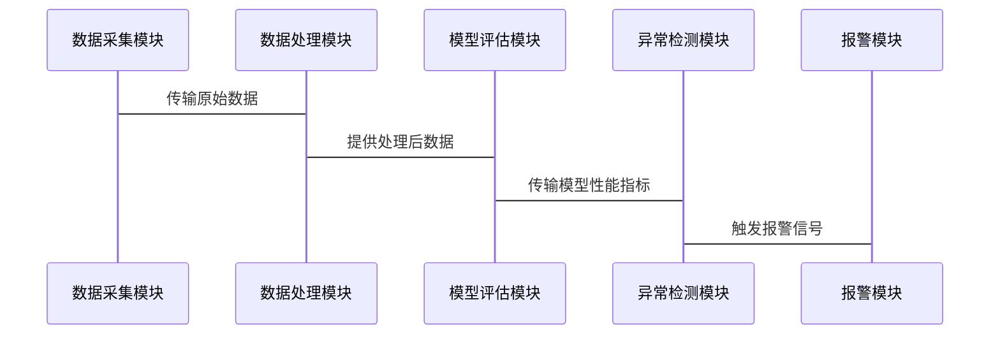

                 


# AI驱动的企业信用评级模型稳定性监控系统

## 关键词：AI驱动，企业信用评级，模型稳定性，监控系统，时间序列分析，异常检测，集成学习

## 摘要：  
本文探讨了如何利用AI技术构建企业信用评级模型稳定性监控系统。通过分析模型稳定性问题的背景与挑战，结合时间序列分析、异常检测和集成学习等算法，提出了一种基于AI的监控解决方案。文章详细阐述了系统的架构设计、功能实现以及实际应用案例，旨在为企业信用评级模型的稳定运行提供有效的技术支撑。

---

# 第一部分: 问题背景与目标

## 第1章: 问题背景与目标

### 1.1 问题背景
- **企业信用评级的重要性**  
  企业信用评级是衡量企业信用状况的重要指标，直接影响企业的融资能力、市场信任度和风险控制能力。  
- **信用评级模型的局限性**  
  传统的信用评级模型基于统计分析和经验判断，存在数据样本不足、模型过拟合、实时性差等问题。  
- **AI技术在信用评级中的应用潜力**  
  AI技术可以通过大数据分析和自动化学习，提升信用评级的准确性和实时性，同时降低模型维护成本。

### 1.2 问题描述
- **模型稳定性问题的定义**  
  模型稳定性指信用评级模型在不同时间、不同数据条件下输出结果的一致性和可靠性。  
- **模型漂移与数据偏移的挑战**  
  数据分布的变化（数据偏移）和模型性能的逐渐下降（模型漂移）会导致信用评级结果的不准确。  
- **模型性能下降的影响**  
  模型性能下降可能导致误评、漏评，进而影响企业的融资能力和金融机构的风控能力。

### 1.3 问题解决
- **AI驱动的监控解决方案**  
  通过实时监控模型输入数据和输出结果，结合AI算法检测模型漂移和数据偏移，及时调整模型参数或更换模型。  
- **稳定性监控的目标与意义**  
  稳定性监控的目标是确保信用评级模型在长期内保持稳定的性能和准确的输出。其意义在于提升模型的可靠性和企业的信用评级质量。  
- **边界与外延**  
  本研究聚焦于模型稳定性监控，不涉及模型本身的训练和优化，但可为后续模型优化提供数据支持。

### 1.4 概念结构与核心要素
- **核心概念：模型稳定性、监控系统、企业信用评级**  
  - 模型稳定性：模型在不同环境和数据条件下的输出一致性。  
  - 监控系统：用于实时检测模型性能变化的工具和方法。  
  - 企业信用评级：基于企业财务数据和市场信息，对其信用状况进行评估的过程。  
- **概念属性特征对比表**  
  | 概念         | 属性特征                         |
  |--------------|----------------------------------|
  | 模型稳定性    | 输出一致性、性能稳定性、适应性   |
  | 监控系统      | 实时性、准确性、可扩展性         |
  | 企业信用评级  | 数据驱动性、准确性、实时性       |
- **ER实体关系图架构（Mermaid流程图）**  


---

# 第二部分: 核心概念与联系

## 第2章: 核心概念与联系

### 2.1 核心概念原理
- **模型稳定性原理**  
  模型稳定性依赖于数据分布的稳定性和模型参数的鲁棒性。当数据分布发生偏移时，模型的输出结果可能偏离预期。  
- **监控系统原理**  
  监控系统通过实时采集模型输入和输出数据，利用统计方法和机器学习算法检测模型性能的变化。  
- **企业信用评级原理**  
  企业信用评级基于财务数据、市场信息和历史行为数据，通过模型计算出企业的信用评分。

### 2.2 概念属性特征对比
- **模型稳定性与监控系统的对比**  
  | 概念         | 特征对比               |
  |--------------|------------------------|
  | 模型稳定性    | 数据驱动、动态变化     |
  | 监控系统      | 实时检测、主动调整     |  
- **企业信用评级与传统评级的对比**  
  | 比较维度      | 传统评级              | AI驱动评级         |
  |--------------|-----------------------|
  | 数据来源      | 主要依赖财务数据      | 大数据驱动         |
  | 模型复杂度    | 简单统计模型          | 复杂机器学习模型     |
  | 实时性        | 较低                  | 较高               |

### 2.3 ER实体关系图架构（Mermaid流程图）  


---

# 第三部分: 算法原理讲解

## 第3章: 算法原理讲解

### 3.1 时间序列分析
- **时间序列分析的基本概念**  
  时间序列分析是一种基于历史数据预测未来趋势的方法，适用于分析模型输出结果的变化趋势。  
- **ARIMA模型的数学公式**  
  ARIMA模型由自回归（AR）、差分（I）和移动平均（MA）三部分组成，数学公式如下：  
  $$ ARIMA(p, d, q) = y_t - \phi_1 y_{t-1} - \dots - \phi_p y_{t-p} + \theta_1 \epsilon_{t-1} + \dots + \theta_q \epsilon_{t-q} $$  
- **时间序列分析的Python代码实现**  
  ```python
  import pandas as pd
  import numpy as np
  from statsmodels.tsa.arima.model import ARIMA

  # 示例数据
  data = pd.Series([1, 2, 3, 4, 5, 6, 7, 8, 9, 10])

  # 模型训练
  model = ARIMA(data, order=(1, 1, 1))
  model_fit = model.fit()

  # 预测未来值
  forecast = model_fit.forecast(steps=5)
  print(forecast)
  ```

### 3.2 异常检测算法
- **异常检测算法的基本概念**  
  异常检测算法用于识别模型输出中的异常值，从而发现潜在的模型漂移问题。  
- **基于Isolation Forest的异常检测算法**  
  Isolation Forest是一种无监督的异常检测算法，适用于高维数据。其核心思想是通过构建隔离树将数据点分割，异常点更容易被隔离。  
- **异常检测算法的Python代码实现**  
  ```python
  from sklearn.ensemble import IsolationForest

  # 示例数据
  X = np.random.rand(100, 10)
  outliers = np.random.rand(10, 10) * 10
  X = np.vstack([X, outliers])

  # 模型训练
  model = IsolationForest(n_estimators=100, random_state=42)
  model.fit(X)

  # 预测异常值
  y_pred = model.predict(X)
  print(y_pred)
  ```

### 3.3 集成学习方法
- **集成学习方法的基本概念**  
  集成学习方法通过组合多个模型的输出结果，提升模型的稳定性和准确性。  
- **基于Stacking的集成学习方法**  
  Stacking是一种常见的集成学习方法，通过将多个基模型的输出作为元模型的输入，进一步提升模型性能。  
- **集成学习方法的Python代码实现**  
  ```python
  from sklearn.ensemble import StackingClassifier
  from sklearn.base import BaseEstimator
  from sklearn.linear_model import LogisticRegression
  from sklearn.svm import SVC

  # 示例数据
  X = np.random.rand(100, 10)
  y = np.random.randint(0, 2, 100)

  # 基模型
  class BaseEstimator(BaseEstimator):
      def fit(self, X, y):
          return self
      def predict(self, X):
          return y

  # 元模型
  stacking_model = StackingClassifier(
      estimators=[('lr', LogisticRegression()), ('svm', SVC())],
      final_estimator=LogisticRegression()
  )

  # 模型训练
  stacking_model.fit(X, y)

  # 预测结果
  y_pred = stacking_model.predict(X)
  print(y_pred)
  ```

---

# 第四部分: 系统分析与架构设计

## 第4章: 系统分析与架构设计

### 4.1 问题场景介绍
- **模型稳定性监控的场景**  
  在企业信用评级模型运行过程中，需要实时监控模型输出结果的变化，及时发现模型漂移和数据偏移问题。  
- **数据采集与处理**  
  监控系统需要实时采集模型输入和输出数据，进行清洗和预处理。  
- **模型性能评估**  
  通过统计指标（如准确率、召回率）和可视化工具评估模型性能。

### 4.2 系统功能设计
- **功能模块划分**  
  - 数据采集模块：实时采集模型输入和输出数据。  
  - 数据处理模块：清洗和预处理数据。  
  - 模型评估模块：计算模型性能指标。  
  - 异常检测模块：识别模型输出中的异常值。  
  - 报警模块：当模型性能下降时触发报警。  
- **领域模型类图（Mermaid）**  


### 4.3 系统架构设计
- **系统架构图（Mermaid）**  


### 4.4 系统接口设计
- **接口描述**  
  - 数据采集接口：接收模型输入和输出数据。  
  - 数据处理接口：对数据进行清洗和预处理。  
  - 模型评估接口：计算模型性能指标。  
  - 异常检测接口：识别模型输出中的异常值。  
  - 报警接口：触发报警并通知相关人员。

### 4.5 系统交互流程（Mermaid序列图）  


---

# 第五部分: 项目实战

## 第5章: 项目实战

### 5.1 环境安装
- **安装依赖包**  
  - Python：3.8及以上版本  
  - NumPy：>=1.20  
  - Pandas：>=1.3  
  - Scikit-learn：>=1.0  
  - Statsmodels：>=0.13  

### 5.2 系统核心实现
- **核心代码实现**  
  ```python
  import pandas as pd
  import numpy as np
  from sklearn.ensemble import IsolationForest
  from statsmodels.tsa.arima.model import ARIMA

  # 数据采集模块
  def data_collection():
      # 示例数据
      data = pd.DataFrame({
          'timestamp': pd.date_range(start='2023-01-01', periods=100),
          'input': np.random.rand(100),
          'output': np.random.rand(100)
      })
      return data

  # 数据处理模块
  def data_processing(data):
      # 数据清洗
      data = data.dropna()
      return data

  # 模型评估模块
  def model_evaluation(data):
      # 计算准确率
      accuracy = np.mean(data['output'] == data['predicted_output'])
      return accuracy

  # 异常检测模块
  def anomaly_detection(data):
      model = IsolationForest(n_estimators=100, random_state=42)
      model.fit(data[['input', 'output']])
      y_pred = model.predict(data[['input', 'output']])
      return y_pred

  # 报警模块
  def alarm_system(anomaly_scores):
      threshold = -1
      if anomaly_scores.min() < threshold:
          print("模型性能异常，请及时检查！")
  ```

### 5.3 代码应用解读与分析
- **数据采集模块**  
  通过`data_collection`函数实时采集模型输入和输出数据，并生成时间戳。  
- **数据处理模块**  
  使用`data_processing`函数对数据进行清洗，去除缺失值。  
- **模型评估模块**  
  通过`model_evaluation`函数计算模型准确率，评估模型性能。  
- **异常检测模块**  
  使用Isolation Forest算法检测模型输出中的异常值，识别模型漂移。  
- **报警模块**  
  根据异常检测结果触发报警信号，通知相关人员进行模型调整。

### 5.4 实际案例分析
- **案例背景**  
  假设某企业信用评级模型在运行一段时间后，发现模型输出结果的准确率逐渐下降。  
- **案例分析**  
  通过时间序列分析发现模型输出结果的波动性增加，结合异常检测算法识别出模型漂移问题。  
- **详细讲解剖析**  
  通过分析模型输入数据的变化，发现数据分布发生了偏移，导致模型性能下降。通过调整模型参数或更换模型，恢复模型性能。

### 5.5 项目小结
- **经验总结**  
  - 定期监控模型性能，及时发现和解决模型漂移问题。  
  - 结合时间序列分析和异常检测算法，提升模型稳定性监控的准确性。  
  - 建立完善的报警机制，确保模型性能下降时能够及时响应。

---

# 第六部分: 最佳实践

## 第6章: 最佳实践

### 6.1 小结
- **稳定性监控的重要性**  
  模型稳定性监控是确保企业信用评级模型长期稳定运行的关键。  
- **AI技术的优势**  
  AI技术通过实时监控和自动化调整，显著提升了模型稳定性和监控效率。

### 6.2 注意事项
- **数据质量**  
  数据质量直接影响模型监控的准确性，需确保数据采集和处理的准确性。  
- **模型调优**  
  模型调优是模型稳定性的基础，需结合具体业务场景优化模型参数。  
- **监控频率**  
  监控频率需根据业务需求和数据更新频率灵活调整，避免过频或过少的监控。

### 6.3 拓展阅读
- **相关书籍**  
  - 《机器学习实战》  
  - 《时间序列分析及其应用》  
- **技术博客**  
  - Towards Data Science  
  - Medium的AI与机器学习专栏  

---

# 作者：AI天才研究院/AI Genius Institute & 禅与计算机程序设计艺术 /Zen And The Art of Computer Programming

