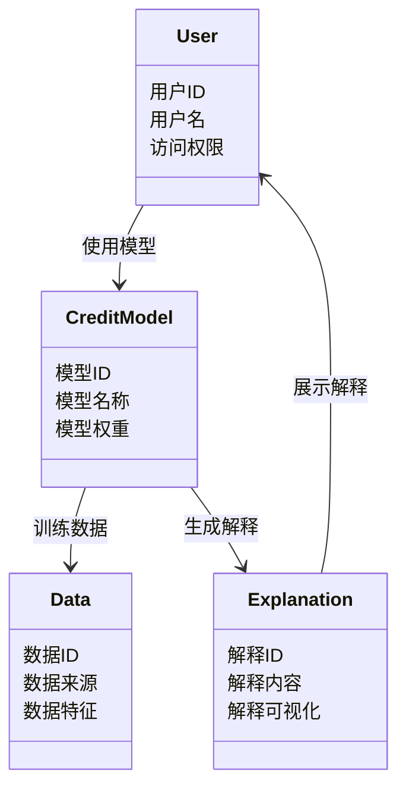

                 

<think>
好，我现在要撰写一篇关于《AI驱动的企业信用评级模型解释系统》的技术博客文章。首先，我需要理解用户的需求和要求，确保内容符合他们的期望。

用户希望文章结构清晰，逻辑严密，内容专业且易懂。他们特别提到了目录大纲，并希望我按照这个结构来撰写。我需要确保每个章节都有足够的细节，包括背景介绍、核心概念、算法原理、系统分析与架构设计、项目实战以及最佳实践等部分。

首先，我会从背景介绍开始。企业信用评级是金融领域的重要部分，传统方法存在局限性，而AI的应用带来了新的可能性。我需要详细解释AI在信用评级中的作用，以及模型解释系统的重要性。

接下来，核心概念部分需要定义模型解释系统，讨论其组成部分和解释方法的分类。这部分可能需要使用ER图和Mermaid流程图来展示系统的结构。

然后是算法原理。我选择SHAP值作为解释方法，详细解释其数学模型，包括公式推导和代码实现。这部分需要确保数学公式准确，代码清晰。

系统分析与架构设计部分需要描述应用场景，设计功能模块，并使用Mermaid图展示系统架构和接口设计。这有助于读者理解系统的整体结构。

项目实战部分提供一个完整的案例，从环境配置到代码实现，再到结果分析。代码示例应详细说明每一步，并解释结果的意义。

最后，最佳实践部分总结经验和小结，提醒读者注意的事项，并提供进一步阅读的资源。

在写作过程中，我需要确保每个部分都有足够的细节，使用专业的技术语言，同时保持内容的逻辑性和连贯性。同时，插入图表和代码示例可以增强文章的可读性和实用性。

总的来说，我需要按照用户的要求，逐步展开每个部分的内容，确保文章结构完整，内容详实，满足专业读者的需求。
</think>

# AI驱动的企业信用评级模型解释系统

> 关键词：AI, 企业信用评级, 模型解释系统, SHAP值, 机器学习, 可解释性

> 摘要：随着人工智能技术的快速发展，企业信用评级领域的智能化需求日益增长。传统的信用评级方法存在效率低下、准确性不足等问题，而基于AI的信用评级模型能够显著提升评级的准确性和效率。然而，AI模型的“黑箱”特性使得其解释性和透明性成为应用中的主要障碍。本文将深入探讨如何构建一个AI驱动的企业信用评级模型解释系统，涵盖系统的背景、核心概念、算法原理、系统架构设计以及项目实战，最后给出最佳实践和总结。

---

## 第一部分: 企业信用评级与AI驱动的模型概述

### 第1章: 企业信用评级与AI驱动的模型概述

#### 1.1 企业信用评级的基本概念

企业信用评级是指通过对企业财务状况、经营状况、管理水平等多方面因素的综合评估，给出一个反映企业信用风险的等级。信用评级的结果通常用于银行贷款审批、投资决策、供应链管理等领域。传统的企业信用评级主要依赖于经验丰富的专家对财务报表和企业运营状况进行人工分析，这种方式效率较低、成本较高，且容易受到主观因素的影响。

---

#### 1.2 AI在信用评级中的应用背景

随着大数据和人工智能技术的快速发展，企业信用评级领域也逐渐引入了智能化的方法。AI驱动的信用评级模型通过机器学习算法，能够快速处理海量数据，挖掘传统方法难以发现的潜在规律。与传统方法相比，AI模型具有以下优势：

- **高效性**：AI模型可以快速处理大量数据，显著提高评级效率。
- **准确性**：通过学习历史数据，AI模型能够发现更多影响信用评级的因素。
- **可扩展性**：AI模型能够轻松扩展到更多的企业数据，适应业务增长的需求。

---

#### 1.3 模型解释系统的重要性

尽管AI模型在信用评级中表现出色，但其“黑箱”特性使得结果难以解释。企业用户通常需要了解模型的决策依据，以便信任和使用模型的输出。因此，模型解释系统的开发至关重要：

- **增强用户信任**：通过解释模型的输出，用户可以理解评级结果的合理性。
- **合规性需求**：在金融领域，模型的可解释性是合规性要求的重要组成部分。
- **优化模型**：解释系统能够帮助发现模型中的偏差或错误，从而优化模型性能。

---

## 第二部分: 企业信用评级模型的核心概念与联系

### 第2章: 模型解释系统的核心概念

#### 2.1 模型解释系统的定义与组成

模型解释系统是一个用于揭示AI模型决策过程和结果背后原因的工具或系统。其主要组成部分包括：

- **数据处理模块**：对输入数据进行清洗、特征提取和标准化处理。
- **模型训练模块**：基于训练数据训练AI模型。
- **解释生成模块**：通过算法生成模型的解释信息。
- **可视化展示模块**：将解释信息以用户友好的形式展示出来。

---

#### 2.2 模型解释方法的分类与对比

目前，模型解释方法主要分为两类：局部解释和全局解释。

- **局部解释**：专注于单个预测结果的解释，例如LIME（Local Interpretable Model-agnostic Explanations）方法。
- **全局解释**：揭示整个模型的决策逻辑，例如SHAP（SHapley Additive exPlanations）值。

| 解释方法 | 局部解释 | 全局解释 | 优点 | 缺点 |
|----------|----------|----------|------|------|
| SHAP值   | 否       | 是       | 解释全面，可加性好 | 计算复杂度较高 |
| LIME     | 是       | 否       | 计算简单，适合单点解释 | 无法反映全局规律 |

---

#### 2.3 模型解释系统的ER实体关系图

以下是模型解释系统的ER实体关系图：

```mermaid
erDiagram
    actor User {
        +string 用户ID
        +string 用户名
    }
    model CreditModel {
        +string 模型ID
        +string 模型名称
    }
    data Data {
        +string 数据ID
        +string 数据来源
    }
    explanation Explanation {
        +string 解释ID
        +string 解释内容
    }
    User --|> CreditModel : 使用模型
    CreditModel --|> Data : 训练数据
    CreditModel --|> Explanation : 生成解释
```

---

## 第三部分: 模型解释系统的算法原理

### 第3章: 基于SHAP值的解释方法

#### 3.1 SHAP值的基本原理

SHAP值是一种基于博弈论的特征重要性度量方法。其基本思想是，每个特征对模型预测结果的贡献度可以用其对预测概率的提升或降低来衡量。公式如下：

$$ SHAP\_i = \sum_{S \subseteq features} \phi(S, i) $$

其中，$\phi(S, i)$ 表示特征子集 $S$ 对预测结果的贡献度。

---

#### 3.2 SHAP值的数学模型

SHAP值的计算过程可以分为以下步骤：

1. 对模型进行预测，并计算每个样本的预测概率。
2. 使用SHAP算法对每个特征的重要性进行排序。
3. 将特征的重要性值表示为SHAP值。
4. 可视化SHAP值，展示每个特征对预测结果的具体贡献。

以下是SHAP值计算的伪代码示例：

```python
import shap

# 加载数据和模型
model = ...
X_train = ...
X_test = ...

# 计算SHAP值
explainer = shap.TreeExplainer(model)
shap_values = explainer.shap_values(X_test)

# 可视化
shap.summary_plot(shap_values, X_test, feature_names=feature_names)
```

---

## 第四部分: 模型解释系统的系统分析与架构设计

### 第4章: 系统分析与架构设计方案

#### 4.1 问题场景介绍

企业在使用AI模型进行信用评级时，需要解释模型的输出结果。例如，银行在审批贷款时，需要了解模型为何将某企业的信用评级定为“BBB”。

---

#### 4.2 系统功能设计

以下是系统的功能模块设计：



---

## 第五部分: 项目实战

### 第5章: 项目实战

#### 5.1 环境配置与数据准备

```python
import pandas as pd
import numpy as np
import xgboost as xgb
from sklearn.model_selection import train_test_split
import shap

# 加载数据
data = pd.read_csv('credit_data.csv')
X = data.drop(columns=['target'])
y = data['target']

# 数据划分
X_train, X_test, y_train, y_test = train_test_split(X, y, test_size=0.2, random_state=42)
```

---

#### 5.2 SHAP值的计算与可视化

```python
# 训练模型
model = xgb.XGBClassifier()
model.fit(X_train, y_train)

# 计算SHAP值
explainer = shap.TreeExplainer(model)
shap_values = explainer.shap_values(X_test)

# 可视化
shap.summary_plot(shap_values, X_test, feature_names=X.columns)
```

---

## 第六部分: 最佳实践与总结

### 第6章: 最佳实践与总结

#### 6.1 最佳实践

- **选择合适的解释方法**：根据具体需求选择局部解释或全局解释方法。
- **数据预处理**：确保数据的完整性和一致性。
- **模型优化**：通过解释系统发现模型的偏差，并进行优化。

#### 6.2 小结

本文详细介绍了AI驱动的企业信用评级模型解释系统的开发过程，包括系统背景、核心概念、算法原理、系统设计以及项目实战。通过SHAP值的计算与可视化，展示了如何实现模型的可解释性，为企业的信用评级提供了有力支持。

---

**作者：AI天才研究院/AI Genius Institute & 禅与计算机程序设计艺术 /Zen And The Art of Computer Programming**

