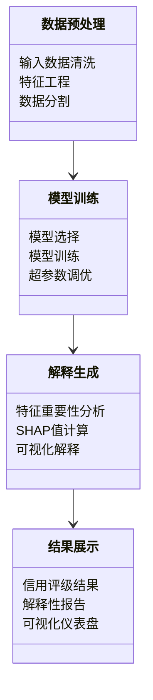
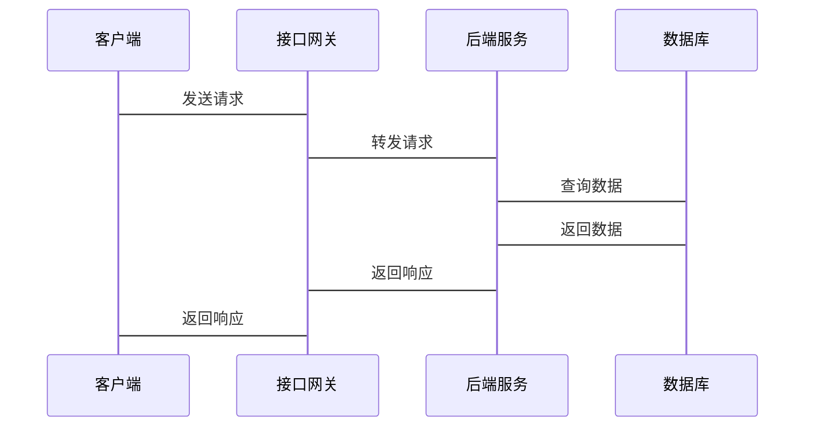

                 

<think>
嗯，我需要帮助用户完成他们关于《AI驱动的企业信用评级模型解释系统》的目录大纲。用户已经提供了一个详细的章节结构，现在我需要根据这些章节进一步细化每一章的内容，确保符合他们的要求。

首先，用户希望文章有大约10000到12000字，结构清晰，每个部分都要详细讲解，包括背景介绍、核心概念、算法原理、系统架构、项目实战和最佳实践。每个章节都需要有具体的内容，如数学公式、算法流程图、ER图等，并使用Markdown格式。

我需要确保每个章节都涵盖必要的部分，比如：

1. **背景介绍**：从传统方法的局限性到AI的必要性，详细说明AI在信用评级中的应用。
2. **核心概念**：解释模型解释性、XAI原理以及特征工程，使用表格和图表来辅助说明。
3. **算法原理**：详细讲解梯度提升树、深度学习模型，包括流程图和数学公式。
4. **系统架构**：介绍系统的各个模块，使用类图和架构图展示。
5. **项目实战**：提供代码实现和案例分析，帮助读者理解理论。
6. **最佳实践**：总结经验，提供实际建议和未来方向。

在编写过程中，我需要确保语言专业但易懂，逻辑严密，同时满足格式要求，如使用Mermaid绘制图表，正确嵌入数学公式。

可能遇到的挑战包括如何平衡理论和实践，如何详细解释复杂的算法，以及如何将系统架构设计得清晰易懂。为了应对这些挑战，我会在每章中结合实际案例，使用图表辅助，并提供足够的代码示例来支持理论。

总之，我需要系统地规划每一章的内容，确保全书结构合理，内容全面，同时保持逻辑连贯，帮助读者从基础到实践逐步掌握AI驱动的企业信用评级模型解释系统的开发和应用。
</think>

# AI驱动的企业信用评级模型解释系统

## 关键词：
AI驱动，企业信用评级，模型解释系统，可解释性AI（XAI），特征工程，信用评分，机器学习

## 摘要：
随着人工智能技术的快速发展，企业信用评级领域正面临前所未有的变革。传统的信用评级方法依赖于繁琐的人工分析和经验判断，效率低下且容易受到主观因素的影响。而AI驱动的信用评级模型通过机器学习和自然语言处理等技术，能够高效地处理大量非结构化数据，显著提升评级的准确性和效率。然而，AI模型的“黑箱”特性也带来了可解释性差的问题，这使得模型的可信度和实用性受到限制。本文将详细探讨如何构建一个基于AI的企业信用评级模型解释系统，从核心概念、算法原理到系统架构，再到项目实战和最佳实践，全面解析如何在提升模型性能的同时，确保其可解释性，从而推动信用评级领域的智能化和透明化。

---

## 第一章：企业信用评级概述

### 1.1 信用评级的定义与意义

信用评级是通过对企业的财务状况、经营能力和市场风险等多方面因素的综合评估，确定其信用等级的过程。信用评级结果直接关系到企业的融资成本、贷款额度以及投资者的决策。在金融领域，信用评级是风险管理的重要工具，能够帮助银行、投资者等利益相关方降低风险，优化资源配置。

### 1.2 传统信用评级方法的局限性

传统信用评级方法主要依赖于财务报表分析和专家经验判断。这种方法虽然有一定的科学性，但存在以下问题：
1. **数据局限性**：传统方法主要依赖结构化数据（如财务数据），忽略了企业非结构化数据（如新闻、公告、社交媒体信息）的价值。
2. **主观性**：专家的经验判断容易受到主观因素的影响，可能导致评级结果的不一致性。
3. **效率低下**：人工分析耗时长，难以满足现代金融业务对高效决策的需求。
4. **模型缺乏可解释性**：传统统计模型（如logistic回归）虽然在一定程度上具有解释性，但其能力有限，难以处理复杂的非线性关系。

### 1.3 AI驱动信用评级的背景与趋势

随着大数据和人工智能技术的快速发展，AI在信用评级领域的应用逐渐成为可能。机器学习算法能够从海量数据中提取有价值的信息，显著提升信用评级的准确性和效率。特别是在处理非结构化数据方面，自然语言处理（NLP）技术能够从企业公告、新闻报道中提取关键词和情感信息，为信用评级提供更全面的依据。AI驱动的信用评级不仅提高了效率，还能够通过可解释性AI（XAI）技术，增强模型的透明性和可信度，推动信用评级领域的智能化和规范化。

---

## 第二章：AI驱动信用评级的核心概念

### 2.1 模型解释性的定义与重要性

模型解释性是指模型对输出结果的内在逻辑和决策依据的可解释程度。在信用评级中，模型解释性能够帮助用户理解评级结果的依据，增强模型的可信度。例如，如果一个企业被评级为“高风险”，解释性模型可以指出具体是哪些财务指标或新闻事件导致了这一评级结果。模型解释性的重要性体现在以下几个方面：
1. **增强可信度**：用户需要了解模型的决策依据，才能信任评级结果。
2. **满足监管要求**：金融行业通常需要符合严格的监管要求，可解释性是合规的重要条件。
3. **优化业务流程**：通过解释性模型，企业可以识别影响信用评级的关键因素，优化自身的经营策略。

### 2.2 可解释性AI（XAI）的基本原理

可解释性AI（XAI）是人工智能领域的一个研究方向，旨在开发能够解释其决策过程的模型。XAI的核心思想是通过简化模型、生成中间解释或模拟人类思维方式，使模型的决策过程变得透明。常用的XAI技术包括：
1. **特征重要性分析**：通过特征重要性排序，确定哪些特征对模型输出的影响最大。
2. **SHAP（Shapley Additive exPlanations）值**：一种基于博弈论的解释方法，用于衡量每个特征对模型预测结果的贡献。
3. **局部可解释性模型**：通过训练一个简单的模型来近似原模型在某个区域的决策行为，从而提供直观的解释。

### 2.3 文本与结构化数据的特征工程

特征工程是信用评级模型的重要组成部分，其目的是将原始数据转化为对模型友好的特征表示。在AI驱动的信用评级中，特征工程需要同时处理结构化数据和非结构化数据。

#### 2.3.1 文本数据的特征提取
1. **关键词提取**：通过TF-IDF（Term Frequency-Inverse Document Frequency）或BERT等模型提取文本中的关键词。
2. **情感分析**：分析企业公告或新闻的情感倾向，判断市场对企业的看法。
3. **实体识别**：识别文本中的实体（如公司名称、人名、日期等），提取有用的信息。

#### 2.3.2 结构化数据的处理方法
1. **数据清洗**：处理缺失值、异常值和重复数据。
2. **数据变换**：对数据进行标准化、归一化处理，使其适合模型输入。
3. **特征组合**：将多个相关特征组合成新的特征，例如将收入增长率和利润率的乘积作为新的特征。

#### 2.3.3 综合特征的构建与优化
通过将文本特征和结构化特征进行融合，构建综合特征向量。例如，可以将文本特征（如关键词）与财务指标（如收入增长率）进行加权组合，形成一个更加全面的特征集。

---

## 第三章：主流信用评级算法及其解释性

### 3.1 梯度提升树（如XGBoost、LightGBM）

#### 3.1.1 梯度提升树的基本原理
梯度提升树是一种集成学习算法，通过多次训练弱分类器（决策树）并将其组合，形成一个强分类器。其基本步骤如下：
1. **初始化**：从一个基模型（如单棵决策树）开始。
2. **计算损失函数**：使用目标函数衡量模型预测值与真实值之间的差异。
3. **计算梯度**：计算损失函数的梯度，作为下一棵决策树的输入。
4. **迭代训练**：重复上述步骤，直到达到预设的迭代次数或模型收敛。

#### 3.1.2 模型解释方法（如SHAP值）
SHAP（Shapley Additive exPlanations）值是一种用于解释模型输出的工具。它基于博弈论的思想，将每个特征对模型预测结果的贡献度量化。SHAP值的计算过程如下：
1. **特征重要性排序**：根据SHAP值的绝对值大小，确定特征的重要程度。
2. **解释结果展示**：通过可视化工具（如SHAP dashboard）展示每个特征对具体样本的贡献。

#### 3.1.3 在信用评级中的应用实例
假设我们有一个企业信用评级数据集，包含企业的财务数据和新闻文本。我们可以使用XGBoost模型进行训练，并通过SHAP值分析哪些财务指标（如收入增长率、资产负债率）对信用评级的影响最大。

---

### 3.2 深度学习模型（如LSTM、BERT）

#### 3.2.1 深度学习模型的结构与原理
深度学习模型，如LSTM（长短期记忆网络）和BERT（Bidirectional Encoder Representations from Transformers），在处理非结构化数据方面表现出色。LSTM适用于时间序列数据，能够捕捉数据的时序依赖性；BERT则擅长处理文本数据，通过自注意力机制捕捉文本中的语义信息。

#### 3.2.2 模型解释技术（如注意力机制）
注意力机制是一种用于解释模型决策过程的技术，它能够突出模型在处理输入数据时关注的部分。例如，在BERT模型中，注意力权重反映了每个词对最终预测结果的贡献程度。

#### 3.2.3 在信用评级中的创新应用
例如，我们可以使用BERT模型分析企业的公告文本，提取其中的关键词和情感倾向，从而辅助信用评级决策。

---

## 第四章：AI驱动信用评级系统的架构设计

### 4.1 系统功能设计（领域模型）



### 4.2 系统架构设计（架构图）


### 4.3 系统接口设计（接口图）



---

## 第五章：项目实战

### 5.1 环境搭建

#### 5.1.1 安装必要的库
```bash
pip install xgboost lightgbm transformers shap
```

#### 5.1.2 数据集准备
使用公开的信用评级数据集，如Kaggle上的“Corporate Credit Risk”数据集。

### 5.2 核心实现代码

#### 5.2.1 数据预处理
```python
import pandas as pd
from sklearn.model_selection import train_test_split

# 加载数据
df = pd.read_csv('credit_risk.csv')

# 数据清洗
df.dropna(inplace=True)
df = pd.get_dummies(df)

# 数据分割
X, y = df.drop(columns='credit_risk'), df['credit_risk']
X_train, X_val, y_train, y_val = train_test_split(X, y, test_size=0.2, random_state=42)
```

#### 5.2.2 模型训练
```python
import xgboost as xgb

# 训练XGBoost模型
model = xgb.XGBClassifier(n_estimators=100, learning_rate=0.1, max_depth=6)
model.fit(X_train, y_train)

# 预测
y_pred = model.predict(X_val)
```

#### 5.2.3 解释性分析
```python
import shap

# SHAP值计算
explainer = shap.TreeExplainer(model)
shap_values = explainer.shap_values(X_val)

# 可视化
shap.summary_plot(shap_values, X_val, plot_type='bar')
```

### 5.3 案例分析
通过具体案例分析模型的预测结果和解释性报告，验证模型的有效性和可解释性。

---

## 第六章：最佳实践与小结

### 6.1 最佳实践

1. **数据质量的重要性**：确保数据的完整性和准确性，避免因数据问题导致模型性能下降。
2. **模型可解释性的局限性**：在实际应用中，需要权衡模型的性能和可解释性，选择适合业务需求的模型。
3. **持续优化**：定期更新模型，适应市场变化和新的数据。

### 6.2 小结

本文详细探讨了AI驱动的企业信用评级模型解释系统的核心概念、算法原理、系统架构和项目实战。通过结合传统信用评级方法和现代AI技术，我们能够构建一个高效、透明的信用评级系统。未来，随着XAI技术的不断发展，信用评级的智能化和透明化将得到进一步提升，为金融行业带来更大的价值。

---

## 作者：
作者：AI天才研究院/AI Genius Institute  
作者：禅与计算机程序设计艺术 /Zen And The Art of Computer Programming

