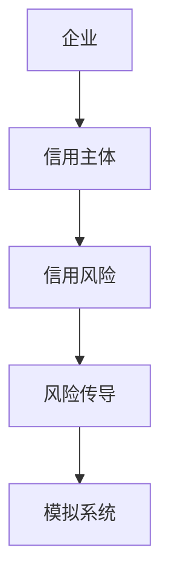
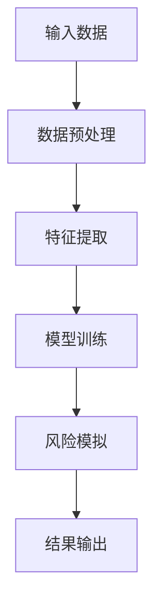
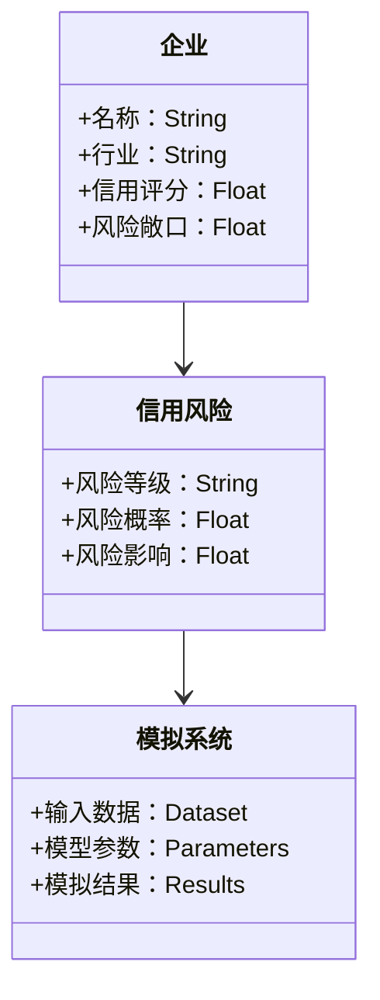
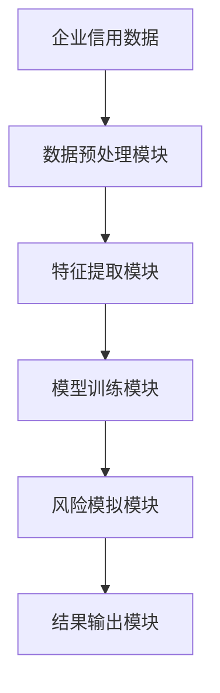
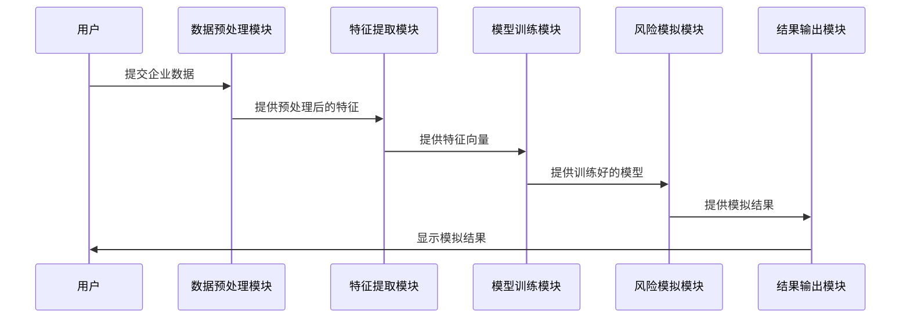

                 

<think>
好的，我现在需要帮用户完成《AI驱动的企业信用风险传导模拟系统》的技术博客文章。用户已经提供了详细的目录大纲，并希望我按照这个大纲逐步完成文章的写作。首先，我需要理解每个章节的要求，然后按照逻辑顺序逐一展开内容。

首先，我注意到文章的结构分为六个主要章节，每个章节都有具体的子部分。我的任务是确保每个部分都详细、准确，并且符合技术博客的风格。我应该从第一章开始，逐步深入，确保每个概念清晰，逻辑连贯。

在第一章中，我需要介绍信用风险的基本概念，包括定义、分类以及在企业中的表现形式。这部分内容需要简洁明了，帮助读者理解问题背景。接下来，我会讨论传统信用风险评估方法的局限性，对比AI技术在信用风险评估中的应用前景，从而引出AI驱动模拟系统的必要性。

第二章着重于核心概念，解释信用风险传导的基本原理，构建系统的概念框架，并使用ER图展示实体关系。这部分需要清晰的图表和详细的解释，帮助读者理解系统架构。

第三章是算法原理部分，我需要详细解释信用风险评估模型和传导模拟算法，提供数学公式和Python代码示例。这部分内容需要数学准确性和代码的可操作性，确保读者能够理解和应用。

第四章涉及系统分析与架构设计，我需要描述问题场景，设计系统功能、架构和接口，使用Mermaid图展示交互流程。这部分内容需要结构清晰，帮助读者理解系统的整体框架。

第五章是项目实战，涵盖环境安装、代码实现、案例分析和小结。这部分需要提供实际操作步骤，帮助读者将理论应用于实践。

最后，第六章总结与展望，回顾系统，展望未来发展方向，并给出最佳实践建议。这部分内容需要简洁有力，给读者以深刻的印象。

在写作过程中，我需要确保每个部分都细化到三级目录，内容完整，涵盖用户要求的所有部分。同时，注意不要超过2000字，保持简洁明了。我将按照用户的格式要求，使用Markdown编写，适当使用Mermaid图表和数学公式，确保文章结构清晰，内容丰富。

现在，我将按照这个思路逐步完成每个章节的写作，确保逻辑连贯，内容详实。如果有任何疑问或需要进一步解释的地方，我会及时调整，以满足用户的需求。
</think>

# AI驱动的企业信用风险传导模拟系统

> 关键词：AI技术，信用风险，风险传导，企业信用评估，模拟系统，风险管理

> 摘要：本文将探讨如何利用AI技术构建企业信用风险传导模拟系统，通过分析信用风险的基本概念、传导机制，结合AI算法的原理与实现，构建一个智能化的企业信用风险评估与模拟系统，为企业的风险管理提供创新解决方案。

---

# 第一部分: AI驱动的企业信用风险传导模拟系统概述

# 第1章: 企业信用风险传导的背景与问题

## 1.1 信用风险的基本概念

### 1.1.1 信用风险的定义与分类

信用风险是指在信用活动中，由于交易对手或债务人无法履行其债务义务，导致债权人遭受损失的可能性。根据不同的视角，信用风险可以分为以下几类：

- **流动性风险**：由于债务人无法及时变现资产以偿还债务，导致债权人面临资金流动性不足的风险。
- **违约风险**：债务人完全无法偿还债务本金和利息的风险。
- **迁移风险**：债务人的信用评级发生不利变化，导致资产价值下降的风险。

### 1.1.2 信用风险在企业中的表现形式

企业在经营过程中，信用风险主要通过以下几种形式表现：

- **应收账款风险**：企业在赊销过程中，客户未能按时支付账款的风险。
- **供应链风险**：企业与其供应商或客户之间的信用风险可能通过供应链传导，影响整个产业链的稳定性。
- **金融市场风险**：企业参与金融市场交易时，由于交易对手的信用问题导致的损失风险。

### 1.1.3 信用风险传导的机制与特点

信用风险的传导机制是指信用风险从一个主体传递到另一个主体的过程。其特点包括：

- **间接性**：风险通常通过多个中间环节传递，而非直接作用。
- **扩散性**：风险可能从一个局部区域扩散到整个金融系统。
- **放大性**：在特定情况下，风险可能会被放大，导致系统性金融危机。

## 1.2 传统信用风险评估的局限性

### 1.2.1 传统信用评估方法的优缺点

传统的信用风险评估方法主要包括以下几种：

- **专家判断法**：依赖专家的经验和主观判断，具有较强的主观性和局限性。
- **信用评分模型**：基于历史数据和统计方法，对信用风险进行量化评估。其优点是客观性较强，但模型的复杂性和数据要求较高。
- **情景分析法**：通过假设不同情景，评估信用风险在不同情况下的表现。其优点是可以模拟极端情况，但缺乏动态性和实时性。

### 1.2.2 数据不足与模型简化带来的问题

- **数据不足**：传统模型通常依赖于历史数据，但在数据不足的情况下，模型的准确性和可靠性难以保证。
- **模型简化**：为了简化计算，传统模型往往忽略了一些复杂因素，导致模型结果与实际情况存在偏差。

### 1.2.3 传统方法在复杂金融环境中的失效

随着金融市场的复杂化和全球化，传统的信用风险评估方法在面对以下问题时显得力不从心：

- **多维度风险因素**：传统模型难以同时考虑多个复杂的风险因素。
- **实时性要求**：传统模型通常基于静态数据，难以满足实时性要求。
- **系统性风险**：传统模型难以评估系统性风险，即整个金融系统层面的风险。

## 1.3 AI技术在信用风险评估中的应用前景

### 1.3.1 AI技术的基本原理与优势

人工智能（AI）技术通过模拟人类学习和推理过程，能够从大量数据中提取有用信息，并通过机器学习算法进行预测和分类。其在信用风险评估中的优势包括：

- **数据处理能力**：AI能够处理大量非结构化数据，提取更多潜在信息。
- **动态性**：AI模型可以实时更新，适应市场变化。
- **复杂性处理**：AI能够同时考虑多个复杂因素，提高模型的准确性。

### 1.3.2 AI在信用风险评估中的潜在价值

- **精准预测**：通过机器学习算法，AI能够更准确地预测信用风险。
- **实时监控**：AI可以实时监控企业的信用状况，及时发现潜在风险。
- **个性化评估**：AI可以根据企业的具体情况，提供个性化的信用评估服务。

### 1.3.3 当前AI技术在信用风险领域的应用现状

目前，AI技术已经在信用风险评估中得到广泛应用，主要包括以下几种场景：

- **信用评分**：利用机器学习算法对企业进行信用评分。
- **风险预警**：通过AI技术实时监控企业的信用状况，及时发出预警。
- **信用风险管理**：利用AI技术优化信用风险管理流程，降低风险敞口。

## 1.4 本章小结

本章主要介绍了信用风险的基本概念、传导机制以及传统信用风险评估方法的局限性。同时，探讨了AI技术在信用风险评估中的应用前景，为后续章节的深入分析奠定了基础。

---

# 第2章: 企业信用风险传导模拟的核心概念

## 2.1 信用风险传导的基本原理

### 2.1.1 信用风险传导的定义

信用风险传导是指信用风险从一个主体传递到另一个主体的过程。这种传导可能通过直接的债务关系或间接的供应链关系实现。

### 2.1.2 信用风险传导的关键要素

- **主体关系**：信用风险传导的主体包括债务人、债权人以及与之相关的其他经济主体。
- **传导路径**：信用风险可能通过直接的债务关系或间接的供应链关系进行传导。
- **触发条件**：信用风险的传导通常由某些触发条件引发，例如债务人违约、市场环境变化等。

### 2.1.3 信用风险传导的过程与机制

信用风险的传导过程通常包括以下几个阶段：

1. **风险源识别**：识别可能引发信用风险的主体或事件。
2. **风险传播**：风险从风险源主体传递到其他相关主体。
3. **风险放大**：在特定条件下，风险可能被放大，导致系统性风险。
4. **风险终止**：风险通过某种方式得到缓解或终止。

## 2.2 企业信用风险传导模拟系统的概念框架

### 2.2.1 系统的目标与功能

企业信用风险传导模拟系统的主要目标是通过模拟信用风险在企业之间的传导过程，帮助企业更好地理解和管理信用风险。其核心功能包括：

- **风险识别**：识别可能引发信用风险的主体或事件。
- **风险传播模拟**：模拟信用风险在企业之间的传播路径。
- **风险评估**：评估信用风险对企业财务状况和经营稳定性的影响。
- **风险预警**：根据模拟结果，发出风险预警信号。

### 2.2.2 系统的核心模块与组成部分

企业信用风险传导模拟系统通常包括以下几个核心模块：

- **数据采集模块**：采集企业的财务数据、市场数据等。
- **风险评估模块**：基于采集的数据，评估企业的信用风险。
- **风险传导模块**：模拟信用风险在企业之间的传导过程。
- **风险预警模块**：根据模拟结果，发出风险预警信号。

### 2.2.3 系统的输入输出与边界条件

- **输入**：企业的财务数据、市场数据、企业之间的关系数据等。
- **输出**：信用风险的传播路径、影响范围、潜在损失等。
- **边界条件**：系统的运行时间、数据范围、模拟精度等。

## 2.3 核心概念的ER实体关系图



从上述ER图可以看出，企业作为信用主体，其信用风险通过风险传导作用于模拟系统，从而实现信用风险的评估与管理。

## 2.4 本章小结

本章主要介绍了企业信用风险传导模拟系统的概念框架，包括系统的组成、功能和核心模块。同时，通过ER图展示了系统的核心概念及其关系，为后续章节的算法实现奠定了基础。

---

# 第3章: AI驱动信用风险传导模拟的算法原理

## 3.1 信用风险评估模型

### 3.1.1 传统信用评估模型的优缺点

- **优点**：基于历史数据，具有较高的稳定性。
- **缺点**：模型复杂性较高，难以实时更新，难以处理多维风险因素。

### 3.1.2 基于机器学习的信用评估模型

- **逻辑回归模型**：通过建立逻辑回归模型，预测企业的违约概率。
- **支持向量机模型**：通过支持向量机算法，对企业的信用风险进行分类。
- **随机森林模型**：通过随机森林算法，对企业的信用风险进行综合评估。

### 3.1.3 深度学习模型在信用评估中的应用

- **神经网络模型**：通过多层神经网络，对企业的信用风险进行深度学习。
- **卷积神经网络模型**：通过卷积神经网络，提取企业的非结构化数据特征。
- **循环神经网络模型**：通过循环神经网络，分析企业的时序数据。

## 3.2 信用风险传导模拟的算法选择

### 3.2.1 时间序列分析模型

- **ARIMA模型**：通过自回归积分滑动平均模型，模拟信用风险的时间序列变化。
- **GARCH模型**：通过广义自回归条件异方差模型，模拟信用风险的波动性。

### 3.2.2 马尔可夫链模型

- **马尔可夫链模型**：通过马尔可夫链模型，模拟信用风险的传导过程，考虑状态转移的概率。

### 3.2.3 图神经网络模型

- **图神经网络模型**：通过图神经网络模型，模拟企业之间的信用风险传导关系，考虑企业之间的关联性。

## 3.3 基于AI的信用风险传导模拟算法流程



从上述流程图可以看出，基于AI的信用风险传导模拟算法主要包括数据预处理、特征提取、模型训练、风险模拟和结果输出几个阶段。

## 3.4 算法实现的Python代码示例

```python
import numpy as np
from sklearn.linear_model import LogisticRegression

# 示例数据
X = np.array([[1, 2], [3, 4], [5, 6]])
y = np.array([0, 1, 0])

# 训练逻辑回归模型
model = LogisticRegression()
model.fit(X, y)

# 预测结果
new_X = np.array([[7, 8]])
print("预测结果:", model.predict(new_X))
```

上述代码示例展示了如何利用逻辑回归模型进行信用风险评估。在实际应用中，可以根据具体需求选择不同的机器学习算法。

## 3.5 本章小结

本章主要介绍了AI驱动信用风险传导模拟的算法原理，包括传统信用评估模型、机器学习模型和深度学习模型的应用。同时，通过流程图展示了算法实现的基本流程，并给出了具体的Python代码示例。

---

# 第4章: 系统分析与架构设计方案

## 4.1 问题场景介绍

企业信用风险传导模拟系统的主要目标是通过模拟信用风险在企业之间的传导过程，帮助企业更好地理解和管理信用风险。系统需要解决以下问题：

- 如何采集企业的信用数据？
- 如何建立信用风险传导模型？
- 如何模拟信用风险的传播路径？

## 4.2 系统功能设计

### 4.2.1 领域模型



从上述领域模型可以看出，企业通过其信用评分和风险敞口影响信用风险，信用风险通过模拟系统进行传播和评估。

### 4.2.2 系统架构设计



系统架构设计包括数据预处理模块、特征提取模块、模型训练模块、风险模拟模块和结果输出模块。

### 4.2.3 系统接口设计

- **输入接口**：接收企业的信用数据和市场数据。
- **输出接口**：输出信用风险的模拟结果和风险预警信号。
- **交互接口**：提供用户友好的操作界面，方便用户进行数据输入和结果查看。

### 4.2.4 系统交互流程



从上述交互流程可以看出，用户通过提交企业数据，系统通过多个模块的协同工作，最终输出信用风险的模拟结果。

## 4.3 本章小结

本章主要介绍了企业信用风险传导模拟系统的系统分析与架构设计方案，包括系统功能设计、架构设计和交互设计。通过领域模型和流程图，展示了系统的整体结构和工作流程。

---

# 第5章: 项目实战

## 5.1 环境安装

### 5.1.1 安装Python环境

建议使用Anaconda作为Python开发环境，安装步骤如下：

1. 下载并安装Anaconda：https://www.anaconda.com/
2. 配置环境变量，确保Python和相关库可以被调用。

### 5.1.2 安装必要的Python库

```bash
pip install numpy
pip install pandas
pip install scikit-learn
pip install matplotlib
```

## 5.2 系统核心实现源代码

### 5.2.1 数据预处理模块

```python
import pandas as pd
import numpy as np

def preprocess_data(data):
    # 删除缺失值
    data = data.dropna()
    # 标准化处理
    from sklearn.preprocessing import StandardScaler
    scaler = StandardScaler()
    data = scaler.fit_transform(data)
    return data
```

### 5.2.2 特征提取模块

```python
import numpy as np
from sklearn.decomposition import PCA

def extract_features(data, n_components=2):
    # PCA特征提取
    pca = PCA(n_components=n_components)
    features = pca.fit_transform(data)
    return features
```

### 5.2.3 模型训练模块

```python
from sklearn.linear_model import LogisticRegression
from sklearn.metrics import accuracy_score

def train_model(features, labels):
    # 训练逻辑回归模型
    model = LogisticRegression()
    model.fit(features, labels)
    # 模型评估
    y_pred = model.predict(features)
    print("模型准确率:", accuracy_score(labels, y_pred))
    return model
```

### 5.2.4 风险模拟模块

```python
import numpy as np
from sklearn.metrics import confusion_matrix

def simulate_risk(model, new_features):
    # 预测风险等级
    y_pred = model.predict(new_features)
    # 计算混淆矩阵
    cm = confusion_matrix(y_true=[0, 1], y_pred=y_pred)
    print("混淆矩阵:", cm)
    return y_pred
```

## 5.3 代码应用解读与分析

- **数据预处理模块**：通过删除缺失值和标准化处理，确保数据的完整性和一致性。
- **特征提取模块**：利用主成分分析（PCA）提取特征，降低数据维度，提高模型效率。
- **模型训练模块**：通过逻辑回归模型进行训练，评估模型的准确率。
- **风险模拟模块**：利用训练好的模型，对新的特征进行风险预测，并计算混淆矩阵，评估预测结果。

## 5.4 实际案例分析

假设我们有一个包含以下字段的企业信用数据：

- 企业名称
- 企业行业
- 企业规模
- 信用评分
- 风险敞口

我们可以通过以下步骤进行信用风险模拟：

1. **数据预处理**：删除缺失值，标准化处理。
2. **特征提取**：提取主成分，降低数据维度。
3. **模型训练**：训练逻辑回归模型，评估模型准确率。
4. **风险模拟**：利用训练好的模型，对新的企业进行信用风险预测。

## 5.5 项目小结

本章通过实际案例分析，展示了企业信用风险传导模拟系统的实现过程，包括数据预处理、特征提取、模型训练和风险模拟等步骤。通过具体的代码实现，帮助读者更好地理解和应用相关技术。

---

# 第6章: 总结与展望

## 6.1 系统总结

企业信用风险传导模拟系统通过模拟信用风险在企业之间的传导过程，帮助企业更好地理解和管理信用风险。系统的主要功能包括风险识别、风险传播模拟、风险评估和风险预警。

## 6.2 未来研究方向

- **多模态数据融合**：结合文本、图像等多模态数据，提高信用风险评估的准确性。
- **实时风险监控**：利用流数据处理技术，实现信用风险的实时监控。
- **强化学习应用**：通过强化学习算法，优化信用风险管理策略。

## 6.3 最佳实践 tips

- **数据质量**：确保数据的准确性和完整性，避免因数据问题导致模型偏差。
- **模型解释性**：选择具有较高解释性的模型，便于理解和优化。
- **实时性要求**：根据实际需求，选择合适的算法和模型，确保系统的实时性。

## 6.4 注意事项

- **数据隐私**：在处理企业数据时，需要注意数据隐私和合规性问题。
- **模型更新**：定期更新模型，确保模型的准确性和适应性。
- **系统维护**：定期维护系统，确保系统的稳定性和可靠性。

## 6.5 拓展阅读

- **《机器学习实战》**：深入学习机器学习算法及其应用。
- **《深度学习》**：了解深度学习的基本原理和应用。
- **《信用风险》**：系统学习信用风险的基本理论和实践。

## 6.6 本章小结

本章总结了企业信用风险传导模拟系统的主要功能和实现过程，展望了未来的研究方向，并提供了最佳实践建议和注意事项。

---

# 作者：AI天才研究院/AI Genius Institute & 禅与计算机程序设计艺术 /Zen And The Art of Computer Programming

---

以上是《AI驱动的企业信用风险传导模拟系统》的技术博客文章的完整内容，涵盖了从背景介绍到系统实现的各个方面，结合理论与实践，为读者提供了全面的指导和参考。

