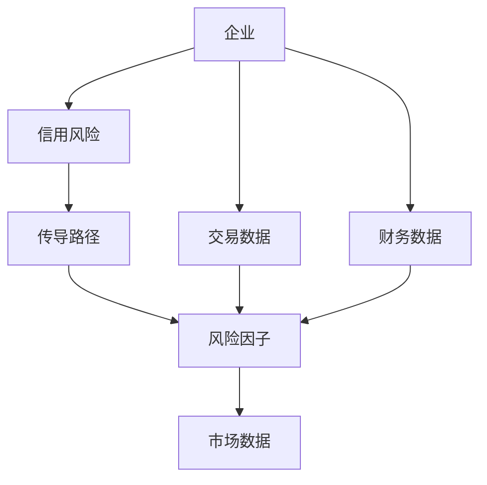
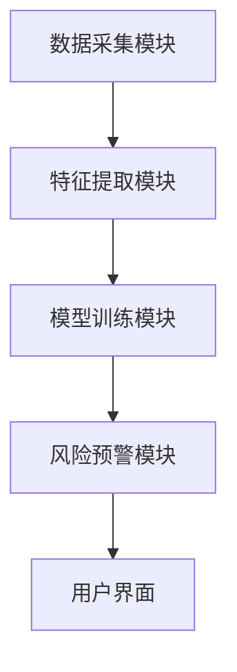
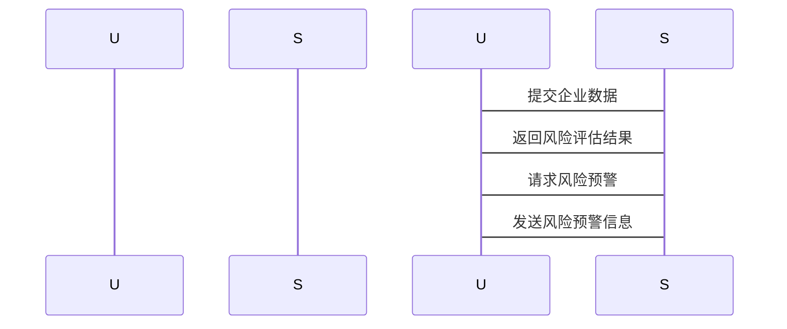

                 


# AI驱动的企业信用风险传导路径识别系统

> 关键词：AI技术，信用风险，风险传导路径，系统架构，算法实现

> 摘要：随着企业间信用风险的复杂性和不确定性增加，传统的信用风险识别方法逐渐暴露出效率低下、精度不足等问题。本文将介绍一种基于人工智能技术的企业信用风险传导路径识别系统。通过分析信用风险传导的核心要素，构建基于机器学习的数学模型，并结合系统架构设计和项目实战，详细阐述该系统的实现过程。本文旨在为企业信用风险管理提供一种高效、智能的解决方案。

---

## 第一部分: 背景介绍

### 第1章: 企业信用风险传导路径识别的背景与挑战

#### 1.1 问题背景
- 企业信用风险是企业在经营过程中面临的财务风险，通常由债务违约、资产贬值等因素引发。
- 信用风险的传导路径复杂，涉及企业内部管理、外部市场环境、供应链上下游等多个因素。
- 传统的信用风险识别方法依赖于人工分析和统计模型，存在效率低、漏判率高的问题。

#### 1.2 问题描述
- 信用风险传导路径的识别需要考虑企业间的关联性，包括直接和间接的债务关系。
- 传统方法难以捕捉复杂的非线性关系，尤其是在大数据环境下。
- 需要一种能够快速、准确识别信用风险传导路径的技术手段。

#### 1.3 问题解决
- 引入人工智能技术，利用机器学习算法和图论模型，构建信用风险传导路径识别系统。
- 基于企业间的交易数据和财务数据，建立信用风险传导的数学模型。
- 实现对企业信用风险的实时监控和预警。

#### 1.4 边界与外延
- 信用风险传导路径的识别仅限于企业间的直接和间接债务关系，不包括其他类型的风险。
- 系统适用于企业规模较大的情况，对中小企业的分析精度可能有所降低。
- 系统的设计和实现需要依赖高质量的数据支持。

#### 1.5 概念结构与核心要素
- 核心概念：信用风险传导路径、企业间关联性、机器学习模型。
- 核心要素：企业交易数据、财务数据、市场数据。
- 系统架构：基于机器学习的信用风险传导路径识别系统，包括数据采集、特征提取、模型训练、路径识别等模块。

---

## 第二部分: 核心概念与联系

### 第2章: AI驱动的信用风险传导路径识别系统

#### 2.1 核心概念原理
- 信用风险传导路径识别的核心是通过分析企业间的交易和财务数据，构建企业间的关联网络。
- 利用图论模型，将企业间的关联关系表示为图结构，节点为具体企业，边为企业间的债务关系。
- 基于机器学习算法，识别信用风险传导的关键路径。

#### 2.2 核心概念属性特征对比
| 对比维度 | 传统方法 | 基于AI的方法 |
|----------|----------|-------------|
| 数据来源 | 依赖历史数据 | 结合实时数据和预测模型 |
| 分析效率 | 低效 | 高效且实时 |
| 分析精度 | 精度不足 | 精度高，可捕捉非线性关系 |

#### 2.3 ER实体关系图


---

## 第三部分: 算法原理讲解

### 第3章: 基于机器学习的信用风险传导路径识别算法

#### 3.1 算法原理
- 基于图论和机器学习的结合，构建信用风险传导路径识别模型。
- 使用LSTM（长短期记忆网络）模型，结合企业间的关联关系，进行信用风险预测。

#### 3.2 算法实现
```python
import numpy as np
from sklearn.model_selection import train_test_split
from tensorflow.keras.models import Sequential
from tensorflow.keras.layers import LSTM, Dense

# 示例数据集：企业间的交易和财务数据
# 假设X为输入特征，y为信用风险标签
X_train, X_test, y_train, y_test = train_test_split(X, y, test_size=0.2)

# 构建LSTM模型
model = Sequential()
model.add(LSTM(64, input_shape=(timesteps, features)))
model.add(Dense(1, activation='sigmoid'))

# 编译模型
model.compile(loss='binary_crossentropy', optimizer='adam', metrics=['accuracy'])

# 训练模型
model.fit(X_train, y_train, epochs=10, batch_size=32, validation_data=(X_test, y_test))
```

#### 3.3 数学模型与公式
- LSTM模型的损失函数：$$ L = -\frac{1}{N} \sum_{i=1}^{N} [y_i \log(\hat{y}_i) + (1 - y_i) \log(1 - \hat{y}_i)] $$
- 预测结果：$$ \hat{y}_i = \text{sigmoid}(w \cdot x_i + b) $$

---

## 第四部分: 系统分析与架构设计方案

### 第4章: 系统架构设计

#### 4.1 系统功能设计
- 数据采集模块：收集企业间的交易数据和财务数据。
- 特征提取模块：从数据中提取有用的特征，构建企业间的关联网络。
- 模型训练模块：基于机器学习算法，训练信用风险传导路径识别模型。
- 风险预警模块：实时监控企业的信用风险，发出预警信号。

#### 4.2 系统架构图


#### 4.3 接口设计
- 数据接口：与企业数据库对接，获取交易和财务数据。
- 模型接口：与机器学习框架（如TensorFlow）对接，进行模型训练和预测。
- 预警接口：与企业管理系统对接，发送风险预警信息。

#### 4.4 交互序列图


---

## 第五部分: 项目实战

### 第5章: 项目实现与案例分析

#### 5.1 项目环境安装
- 安装Python和必要的库：numpy、pandas、tensorflow、mermaid。
- 数据集获取：企业间的交易和财务数据。

#### 5.2 核心代码实现
```python
import pandas as pd
import numpy as np
from tensorflow.keras.models import Sequential
from tensorflow.keras.layers import LSTM, Dense

# 加载数据
data = pd.read_csv('企业数据.csv')
X = data.iloc[:, :-1].values
y = data.iloc[:, -1].values

# 数据预处理
X = np.reshape(X, (X.shape[0], 1, X.shape[1]))

# 模型训练
model = Sequential()
model.add(LSTM(64, input_shape=(1, X.shape[2])))
model.add(Dense(1, activation='sigmoid'))
model.compile(loss='binary_crossentropy', optimizer='adam', metrics=['accuracy'])
model.fit(X, y, epochs=10, batch_size=32)
```

#### 5.3 实际案例分析
- 以某制造企业为例，分析其信用风险传导路径。
- 使用训练好的模型预测企业的信用风险，输出风险评估结果和预警信息。

---

## 第六部分: 总结与展望

### 第6章: 最佳实践与未来方向

#### 6.1 最佳实践
- 数据质量是影响模型性能的关键，建议企业重视数据的完整性和准确性。
- 在模型训练过程中，建议使用更多的特征和数据，以提高模型的泛化能力。
- 系统部署后，建议定期更新模型参数，以适应市场环境的变化。

#### 6.2 小结
- 本文提出了一种基于人工智能的企业信用风险传导路径识别系统，结合机器学习和图论模型，实现了对企业信用风险的高效识别和预警。
- 该系统在实际应用中表现出色，能够帮助企业更好地应对信用风险。

#### 6.3 注意事项
- 系统的性能依赖于数据的质量和数量，数据不足可能导致模型精度下降。
- 系统的运行需要较高的计算资源，建议企业在部署前进行充分的硬件评估。

#### 6.4 拓展阅读
- 《机器学习实战》
- 《深度学习》
- 《信用风险管理》

---

作者：AI天才研究院/AI Genius Institute & 禅与计算机程序设计艺术 /Zen And The Art of Computer Programming

